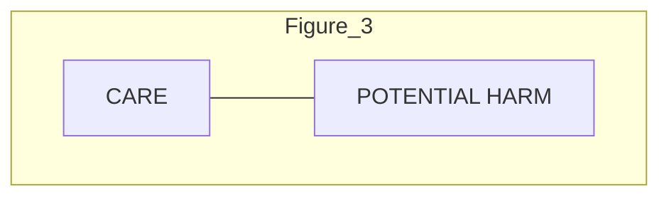

A Model of the Optimal Use of Liability and Safety Regulation

**Author(s):** Steven Shavell

**Source:** *The RAND Journal of Economics*, Summer, 1984, Vol. 15, No. 2 (Summer, 1984), pp. 271-280

**Published by:** Wiley on behalf of RAND Corporation

**Stable URL:** https://www.jstor.org/stable/2555680

JSTOR is a not-for-profit service that helps scholars, researchers, and students discover, use, and build upon a wide range of content in a trusted digital archive. We use information technology and tools to increase productivity and facilitate new forms of scholarship. For more information about JSTOR, please contact support@jstor.org.

Your use of the JSTOR archive indicates your acceptance of the Terms & Conditions of Use, available at https://about.jstor.org/terms

 RAND Corporation and Wiley are collaborating with JSTOR to digitize, preserve and extend access to *The RAND Journal of Economics*

This content downloaded from
128.32.10.230 on Wed, 25 Jun 2025 23:47:25 UTC
All use subject to https://about.jstor.org/terms

Rand Journal of Economics
Vol. 15, No. 2, Summer 1984

# A model of the optimal use of liability and safety regulation

Steven Shavell*

*A model of the occurrence of accidents is used to examine liability and safety regulation as means of controlling risks. According to the model, regulation does not result in the appropriate reduction of risk—because the regulator lacks perfect information—nor does liability result in that outcome—because the incentives it creates are diluted by the chance that parties would not be sued for harm done or would not be able to pay fully for it. Thus, neither liability nor regulation is necessarily better than the other, and as is stressed, their joint use is generally socially advantageous.*

## 1. Introduction

* This article considers the use of liability and safety regulation as means of controlling accident risks.1 In the model that is studied, parties may reduce these risks by taking care; and because the risks vary among parties, the socially desirable levels of care that they should exercise vary as well.

Neither regulation nor liability, however, leads all parties to exercise the socially desirable levels of care. Regulation does not result in this outcome because the regulatory authority's information about risk is imperfect, while liability does not create sufficient incentives to take appropriate care because of the possibility that parties would not be able to pay fully for harm done or would not be sued for it.2 Depending on the importance of these factors, either regulation or liability could turn out to be preferred when considered as an alternative to the other.

But as is stressed, it is often socially advantageous for the two means of controlling risk to be jointly employed—for parties to be required to satisfy a regulatory standard and also to face possible liability.3 Moreover, in this case, parties causing other than relatively

\* Harvard Law School.

I wish to thank L. Bebchuk and A.M. Polinsky for comments and the National Science Foundation (grant no. SES-8014208) for financial support.

1 A more general but informal discussion of liability and regulation is presented in Shavell (1984); two other articles of relevance (see footnote 4) are Wittman (1977) and Weitzman (1974). See also Calabresi (1970) for an early discussion of closely connected issues.

2 These two causes of dilution of incentives under liability are not unimportant. It is frequently the case that a party's potential for doing harm is great in relation to its assets, even if the party is a large firm (consider the risk of fires and explosions and environmental and health-related risks such as oil spills, accidents at nuclear power plants, and mass exposure to carcinogens). It is also often true that a party would not be sued, for the harm might be difficult to trace to its source or it might be highly dispersed (consider again many environmental and health-related risks).

3 This is the situation in fact: satisfaction of regulatory requirements usually does not insulate parties from liability; see Prosser (1971, pp. 203-204).

271

This content downloaded from
128.32.10.230 on Wed, 25 Jun 2025 23:47:25 UTC
All use subject to https://about.jstor.org/terms

272 / THE RAND JOURNAL OF ECONOMICS

low risks are led to do more than to satisfy the regulatory standard, for their potential liability makes that worth their while. At the same time, just because these parties take more care than is required, it is socially desirable for the regulatory standard to be lower than if regulation were used alone. In effect, a reduction of the regulatory standard can be afforded because liability is present to take up some of the "slack" associated with the lower standard.4

## 2. The model

■ Risk-neutral parties may reduce the probability of causing an accident by making expenditures on care. Define

$x$ = level of care; $x \geqq 0$;
$p(x)$ = probability of causing an accident; $0 < p(x) < 1$; $p'(x) < 0$; $p''(x) > 0$; and
$h$ = magnitude of harm if an accident occurs,

where $h$ differs among parties, each of whom knows his own $h$. The regulator is aware only of the distribution of $h$.5 Let

$f(h)$ = probability density of $h$; $f(h) > 0$ on and only on $[a, b]$, $0 < a < b$.

Assume that the social welfare criterion is the minimization of the expected sum of the costs of care and of harm done. Thus, the welfare-maximizing or first-best level of care as a function of a party's $h$ is determined by minimizing over $x$

$$x + p(x)h. \tag{1}$$

The first-order condition is therefore6

$$1 = -p'(x)h, \tag{2}$$

which, of course, means that the marginal cost of care, 1, equals the expected marginal benefits, $-p'(x)h$. Denote by $x^*(h)$ the first-best level of care and observe that it is increasing in $h$.7

\*4 Wittman (1977), the only previous article of which I am aware on the subject of liability and safety regulation, analyzes the probabilistic use of fines to enforce regulation and liability law. Thus what is of concern is quite different from the issues of interest here.
In Weitzman (1974), regulation is compared to use of a price or tax. Thus, for instance, in the context of pollution, regulation of the quantity of an effluent is compared to use of a tax per unit of the effluent; and what is stressed is the possibility that the social authority might err not only in regulating the quantity of the effluent—owing to lack of information about the costs and benefits of preventing pollution—but also in setting a pollution tax—for the authority would not be expected to know ahead of time the amount of damage that would be done by the effluent.
In this article, on the other hand, it is not use of a pollution tax that is compared to regulation; it is liability for harm done. The significance of this difference is that whereas the pollution tax is imposed before harm occurs and therefore naturally involves uncertainty as to its amount, liability is imposed by its nature only after harm has occurred, and therefore presumably involves little (and in the model, no) uncertainty over its amount. In other words, the problem here with liability does not involve lack of information on the part of the social authority; instead, as explained, it has to do with dilution of incentives.

\*5 Shavell (1983) also considers the assumption that $h$ is the sum of a random component $h_1$ known only by parties and of another component $h_2$ known only by the regulator. Thus, it was possible to study the use of regulation to correct for a systematically low level of care that would otherwise result if parties underestimated the component $h_2$ of risk.

\*6 We assume that the condition (2) holds for the first-best $x$ for all $h$ in $[a, b]$, that is, that $1 < -p'(0)a$.

\*7 Differentiate (2) with respect to $h$ to get $0 = -p''(x)x'(h)h - p'(x)$, so that $x'(h) = -p'(x)/(p''(x)h) > 0$ (since $p'(x) < 0$ and $p''(x) > 0$).

This content downloaded from
128.32.10.230 on Wed, 25 Jun 2025 23:47:25 UTC
All use subject to https://about.jstor.org/terms

SHAVELL / 273

$\square$ **Liability as the sole means of controlling risk.** Assume that the harm some parties might do exceeds their assets; and assume also that parties might escape suit. Thus, define

$y = \text{level of assets; } 0 \leqq y < b; \text{ and}$

$q = \text{probability of suit, given that harm has been done; } 0 \leqq q < 1,$

where $y$ and $q$ are the same for each party. Now if a party causes harm $h$ and is sued, he will be liable for $h,^8$ but will pay that amount only if $h \leqq y$. Hence, his problem is to choose his level of care $x$ to minimize

$$x + p(x)q\min\{h, y\}, \tag{3}$$

and let the solution to this be denoted

$x_l(h) = \text{care selected by a party, given } h.$

Then we have

Proposition 1. Under liability, the care taken by parties as a function of the harm they might do is

$$x_l(h) = x^*(q\min\{h, y\}) < x^*(h). \tag{4}$$

Hence, as shown in Figure 1, the level of care is less than first-best, but it increases with the magnitude of the potential harm so long as this is less than the level of assets.$^9$

*Proof:* The equality in (4) is obvious, since (3) is of the form of (1). The inequality and shape of the graph of $x_l$ follow, since (as was observed) $x^*$ is increasing in its argument, while $q\min\{h, y\} < h$ and is increasing for $h < y$ and then constant for $h \geqq y$.

$\square$ **Regulation as the sole means of controlling risk.** Because the regulator cannot observe $h$, the standard it sets—which each party satisfies to engage in his activity—must be the same for all parties. Hence, if

$s = \text{regulatory standard,}$

the regulator's problem is to minimize over $s$

$$s + p(s) \int_a^b hf(h)dh = s + p(s)E(h), \tag{5}$$

where $E$ is the expectation operator. Let

$s^* = \text{optimal regulatory standard,}$

the solution to (5). Hence, we have the following proposition.

Proposition 2. The optimal regulatory standard equals the level of care that would be first-best for a party posing the average risk of harm,

$$s^* = x^*(E(h)). \tag{6}$$

\*$^8$ In saying here that a party is liable for harm done, we are implicitly assuming that the form of liability is strict. Were we to consider instead the negligence rule—under which a party would be liable only if his level of care was inadequate, that is, less than $x^*(h)$—the qualitative character of the results to be obtained would be essentially unaltered. For instance, referring to the next proposition, the incentive to take care would still generally be diluted. The only difference is that $x_l(h)$ would be determined by a slightly different equation. (Actually, $x_l(h)$ would equal $x^*(q\min\{h, y\})$ unless $q$ and $y$ were sufficiently high, in which case it would equal $x^*(h)$.)

\*$^9$ We ignore the possibility of increasing liability from the harm $h$ to $h/q$. Were this done, expected liability would be $h$ despite the fact that $q < 1$. Thus, care would be optimal where $h/q \leqq y$, but it would still be suboptimal where $h/q > y$, so that the essential nature of our results would be the same.

This content downloaded from
128.32.10.230 on Wed, 25 Jun 2025 23:47:25 UTC
All use subject to https://about.jstor.org/terms

274 / THE RAND JOURNAL OF ECONOMICS

FIGURE 1
FIRST-BEST LEVEL OF CARE VS. CARE TAKEN UNDER LIABILITY

<table>
  <thead>
    <tr>
        <th>POTENTIAL HARM</th>
        <th>x* FIRST-BEST CARE</th>
        <th>x_l CARE UNDER LIABILITY</th>
    </tr>
  </thead>
  <tbody>
    <tr>
        <td>a</td>
        <td>[value at a]</td>
        <td>[value at a]</td>
    </tr>
    <tr>
        <td>b (ASSETS)</td>
        <td>[value at b]</td>
        <td>[value at b]</td>
    </tr>
    <tr>
        <td>y</td>
        <td>[value at y]</td>
        <td>[value at y]</td>
    </tr>
  </tbody>
</table>

In particular, parties presenting a risk of harm less than $E(h)$ take more care than is first-best, and those presenting a risk higher than $E(h)$ take less care than is first-best.

*Proof.* Since the right-hand side of (5) is of the form of (1), (6) is correct.

$\square$ **Regulation vs. liability.** The difference in expected social costs between the situation where liability alone is employed and that where only the optimal regulatory standard is used is

$$ \int_{a}^{b} \{[x_l(h) + p(x_l(h))h] - [s^* + p(s^*)h]\}f(h)dh. \eqno(7) $$

From this, we obtain the following proposition.

Proposition 3. Use of regulation is superior to use of liability if the factors that dilute the incentive to take care under liability are sufficiently important ($q$ or $y$ sufficiently low) or if the variability among parties is sufficiently small ($h$ sufficiently concentrated about $E(h)$); otherwise liability is superior to regulation.

*Note.* The statement about the desirability of regulation and the dilution of incentives is obviously true. The other statement is also clearly valid: Figure 2 shows that regulation is superior to liability in a region $R$ about $E(h)$; and hence regulation is superior if $h$ is sufficiently likely to be close to $E(h)$.

*Proof.* We first want to show that, given $y$, there is a $q(y)$ where $0 < q(y) \le 1$ such that regulation is superior to liability for $q \le q(y)$, but not otherwise. Now if $q$ or $y$ equals 0, then (4) implies that $x_l(h)$ is identically equal to 0, and thus the situation is as if $s = 0$. But since $s^*$ is the (unique) optimal $s$ and is positive, social costs must be lower under regulation than when $q$ or $y$ equals 0. This fact and the continuity of social costs in $q$ imply that for any $y$, regulation is superior to liability for all $q$ sufficiently small. Moreover, if liability is superior to regulation for some $q_1$, then the same must be true for any $q_2 > q_1$, for social costs are easily shown to be decreasing in $q$ under liability, but are unaffected by $q$ under regulation.

This content downloaded from
128.32.10.230 on Wed, 25 Jun 2025 23:47:25 UTC
All use subject to https://about.jstor.org/terms

SHAVELL / 275

FIGURE 2
COMPARISON OF REGULATION AND LIABILITY

<table>
  <tbody>
    <tr>
        <td>POTENTIAL HARM</td>
        <td>x* FIRST-BEST CARE</td>
        <td>x_l CARE UNDER LIABILITY</td>
        <td>s* OPTIMAL REGULATORY STANDARD</td>
    </tr>
    <tr>
        <td>a</td>
        <td>[value at a]</td>
        <td>[value at a]</td>
        <td>s*</td>
    </tr>
    <tr>
        <td>E(h)</td>
        <td>[value at E(h)]</td>
        <td>[value at E(h)]</td>
        <td>s*</td>
    </tr>
    <tr>
        <td>y</td>
        <td>[value at y]</td>
        <td>[value at y]</td>
        <td>s*</td>
    </tr>
    <tr>
        <td>b</td>
        <td>[value at b]</td>
        <td>[value at b]</td>
        <td>s*</td>
    </tr>
  </tbody>
</table>

We similarly establish the analogous claim that, given $q$, there is a $y(q)$, where $0 < y(q) \leqq b$, with regulation being superior when $y \leqq y(q)$.

To prove the claim about variability in $h$, note from (4) that

$$x_l(E(h)) < x^*(E(h)) = s^*.$$

Hence, by continuity, there must exist a nondegenerate interval including $E(h)$ in which $s^* + p(s^*)h < x_l(h) + p(x_l(h))h$. Thus, if enough probability mass is within this interval, (7) will be positive, and regulation will be superior to liability.

$\square$ **Joint use of regulation and liability.** Assume now that parties must satisfy a regulatory standard and are also subject to liability. Then their levels of care will be given by $\max\{s, x_l(h)\}$, and the situation will be as shown in Figure 3. For an $s$ such as $s_1$, all parties with $h \leqq h(s_1)$ will take care of $s_1$, and others will take care of $x_l(h)$.10 On the other hand, for an $s$ such as $s_2$ that exceeds $x_l(b)$, all parties will take care of $s_2$. With this in mind, it is evident that the problem of the regulatory authority is to minimize over $s$

$$\int_b^a [\max\{s, x_l(h)\} + p(\max\{s, x_l(h)\})h]f(h)dh, \tag{8}$$

or, equivalently,

$$\min \left\{ \min_{0 \leqq s < x_l(b)} \int_a^{h(s)} [s + p(s)h]f(h)dh + \int_{h(s)}^b [x_l(h) + p(x_l(h))h]f(h)dh, \right.$$

$$\left. \min_{s \geqq x_l(b)} s + p(s) \int_a^b hf(h)dh \right\}. \tag{8a}$$

\*10 Here $h(\ )$ denotes the inverse of $x_l(\ )$, where the latter is rising.

This content downloaded from
128.32.10.230 on Wed, 25 Jun 2025 23:47:25 UTC
All use subject to https://about.jstor.org/terms

276 / THE RAND JOURNAL OF ECONOMICS

FIGURE 3
JOINT USE OF REGULATION AND LIABILITY

*(Note: The visual information in Figure 3 is a conceptual line chart showing the relationship between potential harm and care under different regulatory and liability regimes. It depicts how a regulatory standard s₁ interacts with a liability-induced care level xₗ(h).)*

Let $s^{**}$ denote the solution to this.$^{11}$ Then we have the following proposition.

Proposition 4. Under optimal joint use of regulation and liability, there are two possible types of outcome:

(a) The optimal regulatory standard is less than the optimal standard were regulation used alone, but it exceeds the first-best level of care for those parties posing the least risk of harm; that is,

$$x^*(a) < s^{**} < s^*.$$ (9)

Furthermore, in this case some parties are induced by liability to take more care than the required standard $s^{**}$. A sufficient condition for (9) to hold is

$$x_l(b) > s^*,$$ (10)

or, equivalently, that the incentive to take care is not excessively diluted ($q$ sufficiently close to 1, $y$ sufficiently close to $b$).

(b) The optimal regulatory standard equals the optimal standard where regulation alone was employed; that is,

$$s^{**} = s^*.$$ (11)

In this case no party is induced by liability to take more care than $s^{**}$. This will obtain if $x_l(b)$ is sufficiently low, or, equivalently, if the incentive to take care is sufficiently diluted ($q$ or $y$ sufficiently low).

Note. (a) To explain this result and the reason that $s^{**}$ may be less than $s^*$ (perhaps the typical case), consider Figure 4 and condition (10), which means that some parties are induced by liability to take more care than $s^*$. The reason that this condition implies $s^{**} < s^*$ is essentially that when regulation alone was used, reducing the standard below

\*$^{11}$ A solution exists since (8) is continuous in $s$ and it is clear (and will be shown in step (i) of the proof) that $s$ may be taken to lie in a closed and bounded interval.

This content downloaded from
128.32.10.230 on Wed, 25 Jun 2025 23:47:25 UTC
All use subject to https://about.jstor.org/terms

SHAVELL / 277

# FIGURE 4
OPTIMAL JOINT USE OF REGULATION AND LIABILITY: CASE WHERE SOME PARTIES TAKE MORE CARE THAN IS REQUIRED BY REGULATION

<table>
  <thead>
    <tr>
        <th>Potential Harm</th>
        <th>x* First-Best Care</th>
        <th>x_l Care Under Liability</th>
        <th>s* Optimal Standard (Reg Alone)</th>
        <th>s** Optimal Standard (Joint)</th>
    </tr>
  </thead>
  <tbody>
    <tr>
        <td>a</td>
        <td>[value]</td>
        <td>[value]</td>
        <td>s*</td>
        <td>s**</td>
    </tr>
    <tr>
        <td>h(s*)</td>
        <td>[value]</td>
        <td>[value]</td>
        <td>s*</td>
        <td>s**</td>
    </tr>
    <tr>
        <td>y</td>
        <td>[value]</td>
        <td>[value]</td>
        <td>s*</td>
        <td>s**</td>
    </tr>
    <tr>
        <td>b</td>
        <td>[value]</td>
        <td>[value]</td>
        <td>s*</td>
        <td>s**</td>
    </tr>
  </tbody>
</table>

$s^*$ was not worthwhile because it resulted in *all* parties' taking less care than $s^*$; but here it results *only* in those parties' with $h < h(s^*)$ taking less care: parties with higher $h$ are induced by liability to take more care than $s^*$. Thus, we said in the Introduction that liability could take up some of the slack resulting from lowering the regulatory standard below $s^*$.

On the other hand, to understand why $s^{**} > x^*(a)$, observe that raising the standard from the level $x^*(a)$ does not lead to any first-order change in expected social costs with respect to parties with $h = a$; but it does result in a first-order reduction in expected social costs with respect to all other parties with higher $h$ who would not have been induced by liability to take so much care as $x^*(a)$.

In addition, we shall show in the proof that $s^{**}$ is determined by the condition

$$ 1 = -p'(s) \left[ \int_a^{h(s)} hf(h)dh \middle/ \int_a^{h(s)} f(h)dh \right], \tag{12} $$

the interpretation of which is that the marginal cost of care equals the expected reduction in harm, where the expectation is over only those parties who are not affected by liability and thus are affected by the regulatory standard.12

(b) It is evident from Figure 5 why this case arises when $x_l(b)$ is sufficiently low: then the incentive to take care created by liability is too weak to take up any of the slack due to lowering the standard below $s^*$. It is therefore best to leave the standard at $s^*$. Also, it should be noted that in this case, the use of liability is superfluous, since the outcome is the same as if regulation alone is employed.

*Proof.* See the Appendix.

\*12 Condition (12) is the analogue of (6), as is apparent when the latter is rewritten as $1 = -p'(s)E(h)$.

This content downloaded from
128.32.10.230 on Wed, 25 Jun 2025 23:47:25 UTC
All use subject to https://about.jstor.org/terms

278 / THE RAND JOURNAL OF ECONOMICS

# FIGURE 5

OPTIMAL JOINT USE OF REGULATION AND LIABILITY: CASE WHERE ALL PARTIES TAKE ONLY THE REQUIRED LEVEL OF CARE

<table>
  <thead>
    <tr>
        <th>POTENTIAL HARM</th>
        <th>x* FIRST-BEST CARE</th>
        <th>s** = s* OPTIMAL STANDARD</th>
        <th>x_l CARE UNDER LIABILITY</th>
        <th>CARE UNDER REGULATION AND LIABILITY</th>
    </tr>
  </thead>
  <tbody>
    <tr>
        <td>a</td>
        <td>[value]</td>
        <td>[value]</td>
        <td>[value]</td>
        <td>[value]</td>
    </tr>
    <tr>
        <td>y</td>
        <td>[value]</td>
        <td>[value]</td>
        <td>[value]</td>
        <td>[value]</td>
    </tr>
    <tr>
        <td>b</td>
        <td>[value]</td>
        <td>[value]</td>
        <td>[value]</td>
        <td>[value]</td>
    </tr>
  </tbody>
</table>

# Appendix

\* **Proof of Proposition 4.** The argument consists of a series of steps, the first four of which establish (a) and the last two of which show (b).

(i) $s^{**}$ must lie in $[x^*(a), s^*]$: It is easy to verify that for every $h$, expected social costs are lower at $s = x^*(a)$ than at smaller $s$, so that $s^{**} \ge x^*(a)$.

To show that $s^{**} \le s^*$, let $C(s; r)$ be expected social costs, given $s$, when regulation alone is employed, and let $C(s; rl)$ be expected social costs when regulation and liability are jointly employed. Then for any $s_1 < s_2$, we claim that

$$C(s_1; r) - C(s_2; r) \ge C(s_1; rl) - C(s_2; rl).$$ (A1)

This will follow from demonstrating the corresponding weak inequality for each $h$:

$[s_1 + p(s_1)h] - [s_2 + p(s_2)h]$
$$\ge [\max\{s_1, x_l(h)\} + p(\max\{s_1, x_l(h)\})h] - [\max\{s_2, x_l(h)\} + p(\max\{s_2, x_l(h)\})h].$$ (A2)

To verify (A2), consider Figure A1, which shows in the regions $A$, $B$, and $C$ the different relations that may hold among $s_1$, $s_2$, and $x_l(h)$. It is easy to check that for $h$ in $A$, equality obtains in (A2), and that for $h$ in $B$ or in $C$, (A2) holds strictly.

As $s^{**}$ minimizes $C(s; rl)$ over $s$, $C(s^*; rl) - C(s^{**}; rl) \ge 0$. But then if $s^{**} > s^*$, (A1) would imply $C(s^*; r) - C(s^{**}; r) \ge 0$, which would contradict the fact that $s^*$ is the unique optimum under regulation alone. Hence $s^{**} \le s^*$.

(ii) $s^{**} < s^*$ implies that some parties choose care exceeding $s^{**}$, that is, $x_l(b) > s^{**}$: If $x_l(b) \le s^{**}$, then for $s \ge s^{**}$, the second term in braces in (8a) is relevant. Since this term has a unique minimum over all $s$ at $s^*$, and $s^* > s^{**}$, the term must have a unique minimum over $s \ge s^{**}$ at $s^*$. But this means that the term cannot have had a minimum at $s^{**}$, which is a contradiction.

(iii) $s^{**} < s^*$ implies that $s^{**}$ is determined by the first-order condition (12) and that $s^{**} > x^*(a)$: From (ii) we know that if $s^{**} < s^*$, then the first term in braces in (8a) is relevant for all $s$ in an interval properly including $x^*(a)$ and $s^{**}$. In particular, then, at $s^{**}$ the derivative of the term with respect to $s$ must be zero. But the derivative is

$$\int_a^{h(s)} f(h) dh + p'(s) \int_a^{h(s)} hf(h) dh.$$ (A3)

This content downloaded from
128.32.10.230 on Wed, 25 Jun 2025 23:47:25 UTC
All use subject to https://about.jstor.org/terms

SHAVELL / 279

FIGURE A1
CARE TAKEN UNDER LIABILITY AND UNDER TWO DIFFERENT STANDARDS

<table>
  <thead>
    <tr>
        <th>POTENTIAL HARM</th>
        <th>CARE (x_l)</th>
        <th>Standard (s_1)</th>
        <th>Standard (s_2)</th>
    </tr>
  </thead>
  <tbody>
    <tr>
        <td>a</td>
        <td>x_l(a)</td>
        <td>s_1</td>
        <td>s_2</td>
    </tr>
    <tr>
        <td>b</td>
        <td>x_l(b)</td>
        <td>s_1</td>
        <td>s_2</td>
    </tr>
  </tbody>
</table>

The first term of (A3) is positive since, from (i), $s^{**} \geqq x^*(a)$, since $h(x^*(a)) > a$,13 and since $h(\ )$ is increasing in its argument. Hence (A3) is equivalent to

$$ \left\{ \int_a^{h(s)} f(h)dh \right\} \left\{ 1 + p'(s) \left[ \int_a^{h(s)} hf(h)dh \middle/ \int_a^{h(s)} f(h)dh \right] \right\}. \eqno(A3a) $$

Since (A3a) equals zero at $s^{**}$, (12) follows.

To prove that $s^{**} > x^*(a)$, we need only show that $s^{**} \neq x^*(a)$ (for by (i), $s^{**} \geqq x^*(a)$) which in turn will follow if we show that (A3a) is unequal to zero when evaluated at $s = x^*(a)$. To do this, note that since $h(x^*(a)) > a$, the first term in (A3a) is positive; and observe that

$$ \int_a^{h(s)} hf(h)dh \middle/ \int_a^{h(s)} f(h)dh \eqno(A4) $$

is the mean of $h$ conditional on its being in the interval $[a, h(s)]$. This tends to $a$ as $h(s)$ tends to $a$ and is strictly increasing in $h(s)$. Thus, since $h(x^*(a)) > a$, (A4) must exceed $a$ at $s = x^*(a)$. From this and the fact that $1 + p'(x^*(a))a = 0$ it follows that the second term in braces in (A3a) is negative when evaluated at $x^*(a)$.

(iv) If (10) holds, then $s^{**} < s^*$: Suppose otherwise. Then, by (i), $s^{**} = s^*$. But suppose (10) implies that the first expression in braces in (8a) is relevant at $s^*$; we need only show that (A3a) is positive at $s^*$ to contradict the presumed optimality of $s^{**} = s^*$. To do this, note from (6) and (2) that $1 + p'(s^*) \int_a^b hf(h)dh = 0$. Since (A4) is strictly less than $\int_a^b hf(h)dh$ when evaluated at $s^*$, however, it follows that the second term in braces in (A3a) is positive at $s^*$. Since the first term in (A3a) is clearly positive at $s^*$, (A3a) must be positive.

We remark also that it is obvious that (10) will hold if $q$ and $y$ are sufficiently high, for as $q$ approaches 1 and $y$ approaches $b$, $x_l(b)$ approaches $x^*(b) > s^*$.

(v) If $s^{**} = s^*$: then no party chooses care exceeding $s^*$: Otherwise, $x_l(b) > s^*$, which by (iv) implies $s^{**} < s^*$, a contradiction.

(vi) If $x_l(b)$ is sufficiently low, then $s^{**} = s^*$: Assume the contrary. Then in particular it must be possible that $s^{**} < s^*$ for an $x_l(b) \leqq x^*(a)$. But by (ii) we know that if $s^{**} < s^*$, then $x_l(b) > s^{**}$. Hence, $x^*(a) > s^{**}$. This, however, contradicts (i), so that certainly for all $x_l(b)$ as low as $x^*(a)$, $s^{**} = s^*$.

\*13 For any $h$ such that $x^*(h)$ lies in the domain of the function $h(\ )$, we have $h(x^*(h)) > h$; this is obvious from Figure 1.

This content downloaded from
128.32.10.230 on Wed, 25 Jun 2025 23:47:25 UTC
All use subject to https://about.jstor.org/terms

280 / THE RAND JOURNAL OF ECONOMICS

We remark also that it is clear that as $q$ decreases, so does $x_1(b)$, and it approaches 0 as $q$ approaches 0; and similarly, as $y$ decreases and approaches $a$. Hence, if $q$ or $y$ is sufficiently small, $s^{**} = s^*$.

## References

CALABRESI, G. *The Costs of Accidents*. New Haven: Yale University Press, 1970.
PROSSER, W. *Handbook of the Law of Torts*, 4th ed. St. Paul: West Publishing Co., 1971.
SHAVELL, S. "A Model of the Socially Optimal Use of Liability and Regulation." Working Paper No. 1220, National Bureau of Economic Research, 1983.
———. "Liability for Harm versus Regulation of Safety." *Journal of Legal Studies*, Vol. 13 (1984), pp. 357–374.
WEITZMAN, M. "Prices vs. Quantities." *Review of Economic Studies*, Vol. 41 (1974), pp. 447–491.
WITTMAN, D. "Prior Regulation versus Post Liability: The Choice between Input and Output Monitoring." *Journal of Legal Studies*, Vol. 6 (1977), pp. 193–212.

This content downloaded from
128.32.10.230 on Wed, 25 Jun 2025 23:47:25 UTC
All use subject to https://about.jstor.org/terms