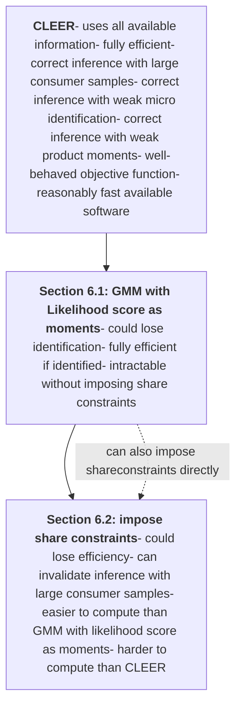
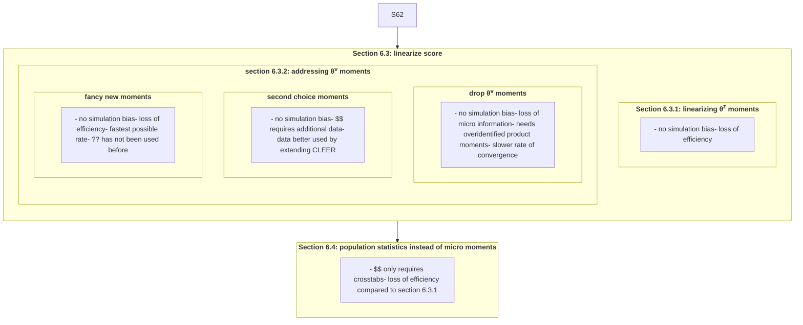

# Optimal Estimation of Discrete Choice Demand Models with Consumer and Product Data

Paul L. E. Grieco    Charles Murry    Joris Pinkse    Stephan Sagl
Penn State      Michigan     Penn State     Indiana

this version: January 17, 2025

We propose a conformant likelihood estimator with exogeneity restrictions (CLEER) for random coefficients discrete choice demand models that is applicable in a broad range of data settings. It combines the likelihoods of two mixed logit estimators—one for consumer level data, and one for product level data—with product level exogeneity restrictions. Our estimator is both efficient and conformant: its rates of convergence will be the fastest possible given the variation available in the data. The researcher does not need to pre-test or adjust the estimator and the inference procedure is valid across a wide variety of scenarios. Moreover, it can be tractably applied to large datasets. We illustrate the features of our estimator by comparing it to alternatives in the literature.

# 1 Motivation

Demand models with endogenous prices using the discrete choice random utility framework provide a tractable framework to flexibly estimate substitution patterns between differentiated products (see e.g., Berry et al., 1995, BLP95). This model has been estimated using a wide array of datasets featuring consumer level data, product level data, or a mixture of both. We propose a likelihood-based estimator for BLP-style models that applies to all the above data settings, which we term the <u>C</u>onformant <u>L</u>ikelihood <u>E</u>stimator with <u>E</u>xogeneity <u>R</u>estrictions (CLEER). Intuitively, it combines the likelihoods of two mixed logit estimators, one for consumer level data (assuming it is available), and one for product level data, along with product level exogeneity restrictions. It moreover recovers product quality terms as parameters of the model. We impose no additional assumptions over those posited on demand in BLP95, which are also used in other estimators extended with consumer level data (e.g., Petrin 2002; Berry et al. 2004a (BLP04); Goolsbee and Petrin 2004; Chintagunta and Dube 2005). We show CLEER converges at the fastest possible rate, which depends on underlying data and identification strength, and always produces asymptotically valid inference using standard techniques, regardless of the data and identification strength. We term this property *conformance*, which is a novel property in this literature. We further establish that CLEER is fully efficient under the assumptions stated within.

To fix ideas, consider first the case in which a large sample of consumer purchase data is available. The basic structure of the demand model proposed in BLP is mixed (or random coefficients) multinomial logit (Hausman and Wise, 1978). The standard multinomial logit MLE has nice computational

\*We thank Nikhil Agarwal, Steve Berry, Chris Conlon, Amit Gandhi, Jeff Gortmaker, Phil Haile, Jessie Handbury, Jean-François Houde, Sung Jae Jun, Nail Kashaev, Mathieu Marcoux, Karl Schurter, Andrew Sweeting, and many seminar and conference participants for helpful discussions and comments on previous drafts. We thank Junpeng Hu and Eric San Miguel Flores for excellent research assistance. A companion Julia package Grumps is available with accompanying documentation. Previous versions of this paper were circulated with the titles “Efficient Estimation of Random Coefficients Demand Models using Product and Consumer Datasets” and “Conformant and Efficient Estimation of Discrete Choice Demand Models.” Correspondence: Grieco: paul.grieco@psu.edu, Murry: ctmurry@umich.edu, Pinkse: joris@psu.edu, Sagl: ssagl@iu.edu.

1

properties (McFadden, 1974). For example, it is globally concave in the parameters, and the gradient and Hessian have simple expressions. Therefore, with consumer level data in hand, it is natural to consider estimating a random coefficients demand model via MLE using the individual likelihood of purchase. However, in order to accommodate price endogeneity, the basic structure of BLP requires the estimation of product (by market) quality parameters.1 It can be demanding of consumer level data alone to estimate such a specification due to the presence of potentially many (hundreds, or even hundreds of thousands, depending on the application) product quality parameters.

To address this issue, CLEER incorporates product level data on market shares.2 Product data can be augmented with a consumer level sample which is a—perhaps small, perhaps large—subset of the market population. From this perspective, the loglikelihood of both individual consumer data (‘micro’ data) and market shares (‘macro’ data) consists of two terms: a micro term following the mixed logit and a macro term that integrates over the distribution of consumer characteristics in the population. With the macro term, it is possible to identify product quality parameters. However, these two terms do not exploit product level exogeneity restrictions which may have power to identify preference heterogeneity. Moreover, typically researchers are interested in (potentially endogenous) explanatory factors of product quality, which are not identified by these terms alone.

The third term in the CLEER objective function directly incorporates information contained in the product level exogeneity restrictions of BLP95. These exogeneity restrictions are additional assumptions on the data-generating process. Indeed, as BLP95 show, with sufficient exogeneity restrictions it is possible to identify all model parameters even if there is no consumer sample. The primary contribution of this paper is to provide an estimator that fully exploits these two sources of identifying variation to achieve the fastest possible rate of convergence, efficiency, and valid inference without relying on any pre-test of the data or tuning parameters.

CLEER is compatible with the bulk of datasets in the applied literature.3 In particular, it is well-behaved with consumer samples of any size. The objective function comprises three terms that can diverge at different rates: the micro loglikelihood with the consumer sample size, the macro loglikelihood with the market size, and a GMM objective function based on the product exogeneity restrictions with the number of products. These differing rates in the objective function are what make our estimator *conformant*: the estimator’s rates of convergence adjust according to the relative sample sizes and strength of information from the objective functions’ composite terms.4

As we illustrate in app. C, observed variation in demographics identifies both observed and unobserved taste heterogeneity as long as that variation shifts consumers’ utility across products.5 As emphasized by Gandhi and Houde (2020, GH20), overidentifying product level exclusion restrictions can also identify taste heterogeneity. If the number of sampled consumers grows faster than the number of markets, then exploiting the identifying information (if present) in the micro sample will produce a faster convergence rate than relying on product level exclusion restrictions. Adding the product

\*1BLP95 and Nevo (2000) have noted that product quality parameters could be used to separate the estimation of ‘nonlinear’ parameters that govern substitution patterns from the ‘linear’ parameters of the model such as the mean price effects.

\*2CLEER also covers intermediate cases when different data (micro versus macro) is available in different markets.

\*3For expositional purposes, we assume that the researcher has direct access to consumer level first choice data and/or product level market share data. Although CLEER could accommodate both ranked choice data (e.g., Berry et al., 2004a; Grieco et al., 2023a) and aggregated statistics of micro data (Sweeting, 2013), we do not explore those extensions here.

\*4The use of the plural ‘rates’ is because different elements of our estimator vector converge at different rates.

\*5Berry and Haile (2024) make a similar point in a nonparametric context.

2

level exclusions to the estimator is useful when the consumer sample is small (or not present) or its identfying demographic variation is weak (or nonexistent). Note that when this variation is nonexistent, the information used by the likelihood alone is insufficient for identification. Conversely, when product level instruments are few or weak, product level restrictions are insufficient for identification. In either case, CLEER converges at the optimal rate and is efficient because it exploits all available sources of identifying information. However, weak identification of either component may result in a slower (though still optimal) rate of convergence.

We formally establish consistency and asymptotic normality of CLEER in section 4. The proofs are nonstandard to accommodate CLEER’s conformance features. We show that conducting inference using formulas familiar from the standard extremum estimation framework is asymptotically valid. Validity obtains regardless of the relative divergence rates and even though the vector of product quality parameters increases in dimension. More generally, the inference procedure is robust to the source of identification, i.e. the inference procedure is valid both when the micro data provide sufficient information to recover the taste heterogeneity parameters and when such information must come from the product level exclusion restrictions: one does not have to specify or know. Finally, we describe the conditions under which CLEER obtains the semiparametric efficiency bound in section 5.2.

Section 6 provides a comparison of CLEER to other approaches. We note several features of CLEER which facilitate the optimality, conformance, and robustness to weak identification. These include: (1) utilizing the macro likelihood to avoid enforcing share constraints to achieve efficiency and simplify inference; (2) fully utilizing the score of the likelihood with respect to observed and unobserved consumer heterogeneity parameters; and (3) allowing overidentification of product level exclusion restrictions to provide an additional source of identification. While previous estimators have utilized subsets of these elements, ours is the first to deploy all to achieve full efficiency and conformance.

Our approach has broad applicability and is appropriate for many demand estimation applications when (either or) both product level data on shares and consumer level data on purchases is available.6 Although BLP04 and Petrin (2002) are canonical examples of applications, there are many more. An incomplete list of examples includes Goeree (2008), Ciliberto and Kuminoff (2010), Crawford and Yurukoglu (2012), Starc (2014), Wollmann (2018), Crawford et al. (2018), Hackmann (2019), Neilson (2019), Backus et al. (2021), Grieco et al. (2023a), Montag (2023), and Jiménez-Hernández and Seira (2021). A common example in economics and marketing is combining grocery store scanner data with household level data, for example the datasets maintained by IRI or Nielsen. Examples include Chintagunta and Dube (2005) (IRI) and Tuchman (2019) and Backus et al. (2021) (Nielsen).

Berry and Haile (2014) showed identification of objects in a nonparametric class of discrete choice demand models using product level data and sufficient instruments; Berry and Haile (2024) shows how observing consumer level data reduces the number of instruments in these models. CLEER is applied to the most common parametric version of these models used in applied work. It is most directly comparable to GMM approaches based on micro-moments (e.g. Petrin 2002 and BLP04). In related work, Conlon and Gortmaker (2023, CG23) provide a comprehensive discussion of best practices for incorporating moments based on a variety of types of auxiliary consumer level data into this canonical GMM-based estimation of BLP-style models. Other researchers have proposed using the likelihood of

\*6In app. G, we provide two algorithms to efficiently compute CLEER. These are both implemented in this paper’s companion Julia package, Grumps.

3

consumer data in estimating BLP-style models (e.g., Goolsbee and Petrin, 2004; Chintagunta and Dube, 2005; Train and Winston, 2007; Bachmann et al., 2019).7Allen et al. (2019) combine the likelihood of an equilibrium search model with a penalty term of moment equalities.

Our problem and approach share features with several strands of the econometrics literature. For instance, Imbens and Lancaster (1994) consider the problem of combining different sources of data albeit that there the micro data are assumed to provide identification and the different data sources are either independent with sample sizes growing at the same rate or the macro data can be considered to be of infinite size. Ridder and Moffitt (2007) provide a survey of methods to combine different data sets and van den Berg and van der Klaauw (2001) combine data sets to estimate a duration model. It is common in the panel data literature to have the dataset grow in different dimensions at different rates (e.g. Hahn and Newey, 2004). Our paper does not assume a panel structure for either products or consumers. Moreover, we know of no examples in which there are as many growth dimensions to consider as here. Having different elements of the estimator vector converge at different rates is a common feature of the semiparametric estimation literature (e.g. Robinson, 1988). Abadie et al. (2020) consider the case of sample size approaching population size; their problem is different from that studied here. Finally, several papers cover asymptotics in random coefficient discrete choice models with only product-level data: The first such paper is Berry et al. (2004b, BLiP04). Freyberger (2015) and Hong et al. (2021) are closer in spirit to ours in that the number of markets increases, whereas in BLiP04 the number of products increases but the number of markets is fixed. Moon et al. (2018) consider a BLP type model placing panel data assumptions on the product quality terms, whereas we do not impose a panel structure. Myojo and Kanazawa (2012) show how additional moments can be constructed on the basis of consumer level data and discuss supply side restrictions.

The following section reviews the random coefficients demand model. Section 3 introduces CLEER. We state our formal consistency and asymptotic normality results in section 4. Conformance and efficiency properties are described in section 5. Section 6 illustrates the trade-offs in going from CLEER to GMM estimators that are commonly used in applied work. Section 7 compares the finite sample performance of CLEER relative to alternative estimators in a Monte Carlo study. Section 8 concludes.

# 2 Random Coefficients Demand Model

This section reviews the random coefficients discrete choice demand model and describes the data used by our estimator. The model matches that of BLP95 with slightly adjusted notation for clarity. We assume the researcher has access to both product level shares and a sample of consumer level choices, although we will allow this sample to be empty. Our estimator assumes that consumer level choices are drawn from a subset of consumers on which the market level shares are based. In contrast, the previous literature has treated micro and macro data as different samples (e.g., Imbens and Lancaster, 1994).

## 2.1 Model

The econometrician observes $M$ markets. In each market $m$, $J_m$ products are available for purchase. A product $j$ in market $m$ is described by the tuple $(x_{jm}, \xi_{jm})$, where $x_{jm}$ is a $d_x$-dimensional vector of observed characteristics of the product and $\xi_{jm}$ is a scalar unobserved product attribute. We often refer to $\xi_{jm}$ as unobserved product quality, but it is important to keep in mind that it reflects the (common component of) unobserved preference for product $j$ in market $m$ which may vary across markets. To

\*7MLE is a popular choice for estimating discrete choice models that do not have endogenous product characteristics; see e.g. hospital choice as in Ho (2006) and urban/location models such as Bayer et al. (2007).

4

allow for endogeneity in product characteristics, we specify $x_{jm} = (\tilde{x}_{jm}, p_{jm})$. The only distinction between $\tilde{x}_{jm}$ and $p_{jm}$ (typically price) is that $\tilde{x}_{jm}$ is uncorrelated with $\xi_{jm}$.

There are $N_m$ consumers in market $m$ drawn from a market-specific distribution described below. Consumer $i$ is characterized by $(z_{im}, \nu_{im}, \varepsilon_{im})$ where $z_{im}$ is a $d_z$-vector of potentially observable consumer characteristics (such as income), and $\nu_{im}$ is a $d_\nu \leq d_x$-vector of unobservable consumer taste shocks to preferences for product characteristics. Finally $\varepsilon_{im}$ is a $J_m + 1$-vector of idiosyncratic product specific taste shocks for each product and an outside good (e.g., no purchase) that is distributed according to the standard Type-I extreme value (Gumbel) distribution. In the population, $z_{im}$ and $\nu_{im}$ are mutually independent and distributed according to known distributions $G_m$ and $F_m$, respectively. In practice, the distribution of $z_{im}$ is typically taken from external data (such as the population census) while the distribution of $\nu_{im}$ is typically assumed to be a standard normal and independent across components of $\nu_{im}$. In section 4.3 we discuss the implications of using an estimate of $G_m$.

A consumer in market $m$ maximizes (indirect) utility by choosing from the $J_m$ available products and the outside good, indexed by zero. Let $y_{ijm} = 1$ if consumer $i$ in market $m$ chooses product $j$ and zero otherwise. Utility of consumer $i$ when purchasing product $j$ in market $m$ is

$$u_{ijm} = \delta_{jm}^* + \mu_{ijm}^{z_{im}} + \mu_{ijm}^{\nu_{im}} + \varepsilon_{ijm}, \tag{1}$$

where $\delta_{jm}^* = x_{jm}^\nabla \beta^* + \xi_{jm}$ represents the mean utility for product $j$ for consumers in market $m$, $\mu_{ijm}^{z_{im}} = x_{jm}^\nabla \Theta^{*z} z_{im} = \sum_{k,k'} \Theta_{kk'}^{*z} x_{jm}^k z_{im}^{k'}$ represents deviations from mean utility due to observed demographic variables $z_{im}$, and $\mu_{ijm}^{\nu_{im}} = x_{jm}^\nabla \Theta^{*\nu} \nu_{im} = \sum_{k,k'} \Theta_{kk'}^{*\nu} x_{jm}^k \nu_{im}^{k'}$ are deviations due to taste shocks $\nu_{im}$. In most applications, several elements of $\Theta^{*z}$ and $\Theta^{*\nu}$ are restricted (e.g., $\Theta^{*\nu}$ is often assumed to be diagonal), so we will refer to $\theta^{*z}$ and $\theta^{*\nu}$ as the vectors of free parameters of $\Theta^{*z}, \Theta^{*\nu}$ to estimate. Although there is no need to assume $\delta, \mu^z$ and $\mu^\nu$ have a linear form, we consider the linear form since it is the most common specification and simplifies notation.8 As we shall see below, some of our results depend on whether $\theta^{*z} = 0$ which implies $\partial_z u_{im} = \partial_z \mu_{im}^{z_{im}} = 0$, i.e., when changes in observed demographics do not affect utility. Utility of the outside good is normalized to $u_{i0m} = \varepsilon_{i0m}$. When convenient, we collect the consumer heterogeneity parameters into the vector $\theta^* = [\theta^{z\nabla}, \theta^{\nu\nabla}]^\nabla$.

The model yields choice probabilities for consumer $i$ of selecting product $j$ conditional on demographics $z_{im}$ and product characteristics $X_m, \xi_m$ as a function of parameters,

$$\pi_{ijm}^{z_{im}}(\theta, \delta) = \mathbb{P}(y_{ijm} = 1 \mid z_{im}, X_m, \xi_m; \theta, \delta) = \int \underbrace{\frac{\exp(\delta_{jm} + \mu_{ijm}^z + \mu_{ijm}^\nu)}{\sum_{k=0}^{J_m} \exp(\delta_{km} + \mu_{ikm}^z + \mu_{ikm}^\nu)}}_{s_{jm}(z_{im}, \nu; \theta, \delta) =: s_{ijm}(\nu; \theta, \delta)} \mathrm{d}F_m(\nu), \tag{2}$$

where $\delta_{0m} = \mu_{i0m}^{z_{im}} = \mu_{i0m}^{\nu_{im}} = 0$ for all $i, m$.

Similarly, unconditional choice probabilities, which correspond to expected market shares, are obtained by integrating $\pi_{ijm}^z$ with respect to the distribution of consumer demographics,

$$\sigma_{jm}(\theta, \delta) = \mathbb{P}(y_{ijm} = 1 \mid X_m, \xi_m) = \int \pi_{ijm}^z(\theta, \delta) \mathrm{d}G_m(z). \tag{3}$$

As noted by Berry (1994), when we fix $\theta$, (3) defines a one-to-one mapping from $\delta_m$ to unconditional choice probabilities in a market. We denote the inversion of this mapping as $\delta_m(\theta, \pi_m)$ and let $\delta(\theta, \pi)$ represent its concatenation across markets.

The model also imposes product level exogeneity restrictions of the form,

\*8Additive separability of $\delta$ in $\xi i$ is essential to our approach.

5

$$ \mathbb{E}(\xi_{jm} \mid b_{jm}) = 0, \tag{4} $$

where $b_{jm}$ is a vector of instruments including $\tilde{x}_{jm}$. Further, $b_{jm}$ may contain additional instruments. The literature has used various approaches such as cost shifters, BLP instruments (in various forms, including the "differentiation instruments" proposed by GH20), Hausman instruments, and Waldfogel instruments. These moment restrictions will serve two purposes. First, they are needed to identify mean product utility parameters, $\beta^*$. Second, if $d_b > d_\beta$ they may provide additional information that is potentially useful in estimating other model parameters. For example BLP95 uses restrictions of this form to recover consumer heterogeneity parameters $\theta^*$ in the absence of consumer level data.

## 2.2 Data

The researcher has access to two types of data on consumer choices. First, she observes market level data on the quantity of purchases, the vector of characteristics $x_{jm}$ of each product, and the total market size, $N_m$.9 Each consumer has unit demand and purchases either one of the "inside" products or the outside good. That is, the researcher can construct market shares $s_{jm} = N_m^{-1} \sum_{i=1}^{N_m} y_{ijm}$. Note that the observed market shares $s_m$ need not equal choice probabilities $\pi_m^*$ due to the finite population size, however $s_m \xrightarrow{p} \pi_m^*$ as $N_m \to \infty$.

Second, for a subset of $I_m$ consumers, the researcher observes both the consumers' choices and their demographics. That is, the researcher observes $\{(y_{im}, z_{im})\}$ for these consumers. We use $D_{im}$ as a dummy variable to denote whether consumer $i$ is in this micro-sample. As we will describe below, our methodology combines the micro-sample with the product shares by integrating out $z_{im}$ in the choice probabilities when individual $i$ is outside the micro-sample. We can accommodate several forms of selection. In app. A.2 we show that for random sampling and deterministic selection on choices $y_{im}$ (e.g., administrative data when outside good purchases are not reported) no adjustments are needed. We further show how to accommodate selection on demographics $z_{im}$.

# 3 Estimator

This section proposes CLEER, which combines the mixed data likelihood, $\hat{L}(\theta, \delta)$, of the micro and macro choice data and a GMM objective function $\hat{\chi}$ based on (4),

$$ (\hat{\theta}, \hat{\delta}, \hat{\beta}) = \arg \min_{\theta, \delta, \beta} (-\log \hat{L}(\theta, \delta) + \hat{\chi}(\beta, \delta)). \tag{5} $$

Notice that the likelihood is a function of $(\theta, \delta)$ but not $\beta$, whereas the product level moments (PLMs) are functions of $(\beta, \delta)$ but not $\theta$. This separability has been noted previously in the literature, but will play an important role in making our estimator computationally feasible. The following two subsections describe the two terms of the objective function in detail.

## 3.1 Likelihood components of the objective function

The mixed data likelihood contains two parts relating to the micro and macro data. To understand its elements, first *suppose* that we observed $y_{im}$ for all $N_m$ individuals in market $m$. Recall that if $D_{im} = 1$, $(y_{im}, z_{im})$ are jointly observed. Then the loglikelihood would be,10

$$ \log \hat{L}(\theta, \delta) = \sum_{m=1}^M \sum_{j=0}^{J_m} \sum_{i=1}^{N_m} y_{ijm} (D_{im} \log \sigma_{jm}^{z_{im}}(\theta, \delta) + (1 - D_{im}) \log \sigma_{jm}(\theta, \delta)), \tag{6} $$

This is an extension of the standard mixed logit estimator for $N_m$ observations where $z_{im}$ is missing when $D_{im} = 0$. The loglikelihood sums over all $N_m$ consumers in the market. If an observation $i$ is

\*9As in the previous literature, researchers need to observe or $N_m$ in order to compute market shares from quantity data.

\*10For expositional simplicity, we consider the cases of random selection or deterministic selection on $y_{im}$ into the micro sample. As discussed in app. A.2, selection on demographics requires an adjustment to account for sampling.

6

in the micro data then we see $z_{im}$ and can condition on it, whereas otherwise we integrate over the distribution of $z_{im}$ conditional on this consumer not being in the consumer sample.

Of course, we do not directly observe the choices of consumers who are not in the micro sample. However, the loglikelihood can be equivalently written in terms of the consumer level observations and the market level share data,

$$ \log \hat{L}(\theta, \delta) = \underbrace{\sum_{m=1}^{M} \sum_{j=0}^{J_m} \sum_{i=1}^{N_m} D_{im} Y_{ijm} \log \frac{\sigma_{jm}^{z_{im}}(\theta, \delta)}{\sigma_{jm}(\theta, \delta)}}_{\text{micro}} + \underbrace{\sum_{m=1}^{M} N_m \sum_{j=0}^{J_m} s_{jm} \log \sigma_{jm}(\theta, \delta)}_{\text{macro}}, \quad (7) $$

where the first term is the contribution of the consumer level data and the second term is the contribution of the market level data. In order to express the second term using observed market shares, we add and subtract $\log \sigma_{jm}$ to control for the fact that the consumer level data represent a subset of the consumers who make up the market. It is convenient to refer to the two terms of the likelihood separately, so we define $\log \hat{L}^{\diamond}$ and $\log \hat{L}^{\blacksquare}$ as the micro and macro terms of (7), respectively. Alternatively, the estimator can be written by adjusting the macro term to avoid double counting the consumers in the micro-sample:

$$ \log \hat{L}(\theta, \delta) = \underbrace{\sum_{m=1}^{M} \sum_{j=0}^{J_m} \sum_{i=1}^{N_m} D_{im} Y_{ijm} \log \sigma_{jm}^{z_{im}}(\theta, \delta)}_{\text{micro}} + \underbrace{\sum_{m=1}^{M} \sum_{j=0}^{J_m} \left( N_m s_{jm} - \sum_{i=1}^{N_m} D_{im} Y_{ijm} \right) \log \sigma_{jm}(\theta, \delta)}_{\text{macro}}. \quad (8) $$

These two formulations, while equivalent, emphasize different features of the estimator so we will refer to the one that is most convenient at the time.

The mixed data likelihood can be optimized in isolation to yield an estimator for $(\theta^*, \delta^*)$. Since the first stage does not separate $x$ from $\xi$, endogeneity concerns do not arise. This estimator can be paired with a plug-in estimator for $\beta^*$—utilizing the instruments $b$—to yield a two-step estimator. As it is a useful basis for comparison, we refer to this as the mixed data likelihood two-step estimator (MDLE). Under stronger assumptions than are necessary for CLEER, the two-step estimator is consistent and asymptotically normal. However, it is neither conformant nor generally efficient. The reason is straightforward: the MDLE does not incorporate information contained in the PLMs (4) when estimating $\theta^*$.

To summarize, the mixed data likelihood makes full use of the micro and macro choice data.

## 3.2 Product Level Moments (PLM)

The CLEER objective function combines the mixed data likelihood with an additional term that penalizes violations of the product level exogeneity restrictions,

$$ \hat{\chi}(\beta, \delta) = \frac{1}{2} \hat{m}^\nabla(\beta, \delta) \hat{W} \hat{m}(\beta, \delta) \quad (9) $$

where $\hat{W}$ is a positive definite weight matrix and

$$ \hat{m}(\delta, \beta) = \sum_{m=1}^{M} \sum_{j=1}^{J_m} b_{jm} (\delta_{jm} - \beta^\nabla x_{jm}). \quad (10) $$

In practice, an initial choice of $\hat{W}$ would be $(B^\nabla B)^{-1}$, where $B$ is the $J \times d_b$ matrix with $J = \sum_m J_m$ rows $b_{jm}^\nabla$. Note that, unlike in standalone GMM estimation, the scaling factor 1/2 in front of the 'J statistic' in (9) matters since it affects the relative weight placed on $\log \hat{L}$ versus $\hat{\chi}$ in the objective function.

If the dimension of $b_{jm}$, $d_b$, is the same as that of $\beta^*$, $d_\beta$, a situation we shall refer to as *exact identification of* $\beta$ then $\theta^*, \delta^*$ are estimated off the likelihood portion and $\beta^*$ off the GMM portion. In this special case, CLEER is equivalent to the MDLE. Additional restrictions result in overidentification of $\beta^*$ which can be used to aid the estimation of $\theta^*$. Indeed, then $\hat{\chi}$ will generally be positive (i.e.

7

nonzero) so that both log $\hat{L}$ and $\hat{\chi}$ contribute to the estimation of $\theta^*, \delta^*$. However, because the micro log likelihood sums over $I = \sum_{m=1}^M I_m$ terms whereas $\hat{\chi}$ involves sums over $J$ terms these additional product level restrictions can be asymptotically negligible for $\theta^*, \delta^*$ as we discuss in section 5.2.

To achieve efficiency, $b_{jm}$ should be chosen via a two-step procedure to be the optimal instruments for $\theta^*, \beta^*$ in the sense of Chamberlain (1987). In this case $d_b = d_\theta + d_\beta$, and generally (10) will not be zero at the optimum, so the choice $\hat{W}$ matters.

# 4 Consistency and Asymptotic Normality

This section formally establishes the consistency and asymptotic normality of CLEER as the number of markets $M$ grows. This is contrast to the proof of consistency Berry et al. (2004b) where $M$ is fixed but the number of products within a market grows. The proof is complicated by several features of the estimator. In particular, [i] the dimension of $\delta$, the number of observed products across all markets, is growing with $M$ by construction; [ii] the rate of convergence of the estimator depends on the relative rates of divergence of the micro sample $I$, the number of markets $M$, and the population of each market $N_m$; [iii] the rate of convergence may be effected by weak identification arising from the the micro-sample, the product level exclusion restrictions, or both.

While we have presented CLEER in its most natural form for applied work in section 3, the proof of consistency is more straightforward if we write the estimator in a reparameterized and recentered, but equivalent form, as we describe in the following subsection.

## 4.1 Objective function

Section 3 defines CLEER as an estimator of $(\theta^*, \delta^*, \beta^*)$. Since there is a one-to-one mapping between mean product qualities, $\delta$, and unconditional choice probabilities, $\pi$, for fixed consumer heterogeneity parameters $\theta$ (Berry, 1994) and moreover since $\beta$ can be profiled out of the objective function, it is equivalent to write the estimator in terms of $(\theta, \pi)$ where $\pi = [\pi_1^\nabla, \dots, \pi_M^\nabla]^\nabla$ with $\pi_m = [\pi_{1m}, \dots, \pi_{J_m m}]^\nabla$. So the parameter vector $\pi$ excludes the outside good probabilities, $\pi_{0m} = 1 - \sum_{j=1}^{J_m} \pi_{jm}$ and the dimensions of $\delta$ and $\pi$ are both $J$.11 This is convenient because $s_m \xrightarrow{p} \pi_m^*$ independent of $\theta$ while $\delta_m^* = \delta_m(\theta^*, \pi_m^*)$ depends on the unknown $\theta^*$.

Following this formulation, consider the sample objective function, which consists of three terms,

$$ \hat{\Omega}(\theta, \pi) = \hat{\mathcal{L}}(\theta, \pi) + \hat{\Phi}(\theta, \pi) = \hat{\mathcal{L}}^\blacklozenge(\theta, \pi) + \hat{\mathcal{L}}^\blacksquare(\pi) + \hat{\Phi}(\theta, \pi). \eqno(11) $$

The first term, $\hat{\mathcal{L}}^\blacklozenge$, is the (negative) log likelihood of the micro data net of the contribution to market shares (to avoid double counting with the second term, as above),

$$ \hat{\mathcal{L}}^\blacklozenge(\theta, \pi) = \log \frac{\hat{L}^\bullet(\theta^*, \delta^*)}{\hat{L}^\bullet[\theta, \delta(\theta, \pi)]} = \sum_m \hat{\mathcal{L}}_m^\blacklozenge(\theta, \pi_m) = \sum_{mij} D_{im} y_{ijm} \Big[ \log \frac{\varsigma_{ijm}(\theta^*, \pi_m^*)}{\varsigma_{ijm}(\theta, \pi_m)} - \log \frac{\pi_{jm}^*}{\pi_{jm}} \Big], $$

where $\varsigma_{ijm}(\theta, \pi_m) = \sigma_{jm}^{im}[\theta, \delta_m(\theta, \pi_m)]$. The only distinction between $-\log \hat{L}^\bullet$ and $\hat{\mathcal{L}}^\blacklozenge$ is that the latter is recentered by a constant such that it is zero at the truth $(\theta^*, \pi^*)$, as shown in the first equality. The second line reorganizes $\hat{\mathcal{L}}^\blacklozenge$ to introduce notation that will be useful in the proofs.

The second term is the (negative) log likelihood of the market share data recentered such that it is zero at the observed market shares and positive otherwise:

$$ \hat{\mathcal{L}}^\blacksquare(\pi) = \log \frac{\hat{L}^\blacksquare[\theta, \delta(\theta, s)]}{\hat{L}^\blacksquare[\theta, \delta(\theta, \pi)]} = \sum_m \hat{\mathcal{L}}_m^\blacksquare(\pi_m) = \sum_m N_m \sum_j s_{jm} \log \frac{s_{jm}}{\pi_{jm}}, \eqno(12) $$

which is true for all $\theta \in \Theta$. Again, the final equalities present convenient reorganization for the proofs.

11The same will be true for other such vectors, e.g., $\hat{\pi}, s$.

8

The third term $\hat{\Phi}$ is the PLM objective function $\hat{\chi}$ evaluated at $\delta = \delta(\theta, \pi)$, profiling out $\beta$:

$$\hat{\Phi}(\theta, \pi) = \min_{\beta} \hat{\chi}\{\beta, \delta(\theta, \pi)\} = \frac{1}{2} \min_{\beta} \|\mathcal{P}_B[\delta(\theta, \pi) - X\beta]\|^2 = \frac{1}{2} \|\mathcal{P}\delta(\theta, \pi)\|^2,$$

To simplify the presentation of the proof, we take $\hat{\mathcal{W}} = (B^\nabla B)^{-1}$ in the second inequality. This is not restrictive in view of the discussion in section 4.6, which considers alternatives choices of $\hat{\mathcal{W}}$, including those needed to use an optimal weight matrix or optimal instruments as described in section 5.2. Hence $\mathcal{P}_B = B(B^\nabla B)^{-1}B^\nabla$ is the projection matrix onto the instruments $B$ and $\mathcal{P} = \mathcal{P}_B - \mathcal{P}_{\mathcal{P}_B X} = \mathcal{P}_B - \mathcal{P}_B X(X^\nabla \mathcal{P}_B X)^{-1} X^\nabla \mathcal{P}_B$.12

To see that this formulation is equivalent to CLEER presented in section 3: For any $(\theta', \pi')$ that optimize $\hat{\Omega}$, CLEER $(\hat{\theta}, \hat{\delta}, \hat{\beta})$ is then $[\theta', \delta(\theta', \pi'), (X^\nabla \mathcal{P}_B X)^{-1} X^\nabla \mathcal{P}_B \delta(\theta', \pi')]$ because $\hat{\Phi}(\theta, \pi) = \min_{\beta} \hat{\chi}[\delta(\theta, \pi), \beta]$ and $\hat{\mathcal{L}}(\theta, \pi) = -\{\log \hat{L}[\theta, \delta(\theta, \pi)] + \log \hat{L}^\bullet[\theta^*, \delta(\theta^*, \pi^*)] + \log \hat{L}^\blacksquare(s)\}$, where the final two terms are constant with respect to the model parameters. Given this, for the remainder of the paper we will refer to the maximizer of (11) as $(\hat{\theta}, \hat{\pi})$ and refer to $\hat{\pi}$ as the CLEER of market-level choice probabilities.

To prove consistency of CLEER, we will show that $(\hat{\theta}, \hat{\pi})$ converges to the minimizer of the population analog, $\Omega(\theta, \pi) = \mathcal{L}^\blacksquare(\pi) + \mathcal{L}^\bullet(\theta, \pi) + \Phi(\theta, \pi)$, where $\mathcal{L}^\blacksquare(\pi) = \sum_m N_m \sum_j \pi_{jm}^* \log(\pi_{jm}^* / \pi_{jm})$, $\mathcal{L}^\bullet(\theta, \pi) = \mathbb{E}[\hat{\mathcal{L}}^\bullet(\theta, \pi) \mid \mathbb{A}]$ with $\mathbb{A}$ the sigma algebra generated by product characteristics and the $D_{im}$'s, and $\Phi(\theta, \pi) = \|\mathcal{P}[\delta(\theta, \pi) - \delta(\theta^*, \pi^*)]\|^2 / 2$. Note that $\mathcal{L}^\blacksquare, \mathcal{L}^\bullet, \Phi$ are chosen to ensure all are zero at the truth.

## 4.2 Identification of Demographic and Random Coefficients

Consistency of CLEER requires that the model is identified. While identification of $\pi^*$ is straightforward, we define identification of $\theta^*$ in terms of $\Omega$ evaluated at the true unconditional choice probabilities $\pi^*$, i.e.

$$\Omega(\theta, \pi^*) = \mathcal{L}^\bullet(\theta, \pi^*) + \Phi(\theta, \pi^*), \tag{13}$$

since $\mathcal{L}^\blacksquare(\pi^*) = 0$. Clearly, $\Omega(\theta^*, \pi^*) = 0$. While (13) uses $\pi^*$, note that $\mathcal{L}^\blacksquare(\pi)$ diverges for all $\pi \neq \pi^*$ and so $\Omega(\theta, \pi)$ will as well. There are two possible sources of identification for our estimator, both may be weak. Let $\rho^\bullet(\theta)$ be the rate of $\mathcal{L}^\bullet(\theta, \pi^*)$ and $\rho^\Phi(\theta)$ be the rate of $\Phi(\theta, \pi^*)$. Hence, $\rho_{id}(\theta) := \rho^\bullet(\theta) + \rho^\Phi(\theta)$ is the rate of $\Omega(\theta, \pi^*)$. In the absence of weak identification, for all fixed $\theta \neq \theta^*$, $\rho^\bullet(\theta) \sim I$ and $\rho^\Phi(\theta) \sim M$, we do not assume that one of these rates is faster than the other.13 We will allow for weak identification, which slows the rate of either or both $\rho^\bullet(\theta)$ and $\rho^\Phi(\theta)$ as described below. To obtain consistency $\rho_{id}(\theta)$ must diverge (fast enough) for all $\theta$ outside a neighborhood $\Theta_\epsilon = \{\theta \in \Theta : \|\theta - \theta^*\| < \epsilon\}$ of $\theta^*$ (for any fixed $\epsilon > 0$). However, the terms of $\rho_{id}(\theta)$ need not satisfy our identification condition individually, which is what gives rise to the conformance property.

Identification from PLMs occurs when $\Phi(\theta, \pi^*) > 0$ away from $\theta^*$. Weak product identification can slow $\rho^\Phi(\theta)$ in a manner similar to traditional moment condition models (e.g., weak instruments). Identification from the micro sample occurs when $\mathcal{L}^\bullet(\theta, \pi^*) > 0$ away from $\theta^*$. This will fail, e.g., at $\theta^{*z} = 0$ because $\varsigma_{ijm}(0, \theta^v, \pi^*) = \pi^*$ for all $z_{im}$ and so $\mathcal{L}^\bullet(0, \theta^v, \pi^*) = 0$ for all $\theta^v$.14 Weak micro identification will occur for $\theta^{*z}$ drifting towards zero.

\*12The second equality requires $X^\nabla \mathcal{P}_B X$ be invertible, which would fail if the number of instruments were less than the number of regressors or the instruments had no explanatory power. In these cases it may still be possible to identify $\theta^*$, but not $\beta^*$. To cover this, write $\mathcal{P}$ more generally as $\mathcal{P} = \mathcal{P}_B - \mathcal{P}_B X(\mathcal{P}_B X)^+$ with $\cdot^+$ denoting a Moore Penrose inverse.

\*13Indeed, in the absence of micro data, our estimator will still be consistent even though $I$ does not diverge.

\*14App. C provides an example and elaborates on the intuition for the identifying power of microdata within our model.

9

# 4.3 Assumptions

We are now ready to turn to our formal assumptions, which begin with those regarding micro and product level identification.

As discussed above, micro identification will always fail if $\theta^{*z} = 0$. When $\theta^{*z} \neq 0$, micro identification will fail if there exists a $\theta^v \neq \theta^{*v}$ such that $\mathcal{L}^\bullet(\theta^{*z}, \theta^v, \pi^*) = 0$, which implies $\varsigma_{ijm}(\theta^{*z}, \theta^v, \pi^*) = \varsigma_{ijm}(\theta^{*z}, \theta^{*v}, \pi^*)$ for all $i$.15 However, this is unlikely to arise in applications as this imposes $J \times |\mathcal{Z}|$ restrictions—which is infinite if $z$ is continuous—and $\theta^v$ is low dimensional. We rule out these cases, which we interpret as model misspecification on the part of the researcher, with the following assumption.

**Assumption A** (Micro identification strength). Let $\lambda = \|\theta^{*z}\|$ and let $\rho^\bullet(\theta) = I\|\theta - \theta^*\|_\lambda^2$ with $\|\theta - \theta^*\|_\lambda^2 = \|\theta^z - \theta^{*z}\|^2 + \lambda^2\|\theta^v - \theta^{*v}\|^2$. We have,

$$ \inf_{\theta \in \Theta: \rho^\bullet(\theta) > 0} \frac{\mathcal{L}^\bullet(\theta, \pi^*)}{\rho^\bullet(\theta)} \succeq 1, $$

where $\succeq$ means that the left hand side is (element-wise) of greater or equal order compared to the right-hand side.16

Following the weak identification literature, this assumption allows $\theta^{*z}$ to drift towards zero. The parameter $I\lambda^2$ plays a role analogous to the concentration parameter in the weak IV setting. If $\lambda > 0$, the norm $\|\cdot\|_\lambda$ is zero only at $\theta^*$. If $\lambda = 0$, the norm is zero whenever $\theta^z = \theta^{*z} = 0$ (regardless of $\theta^v$).

Our next assumption essentially defines the identifying power in the PLMs.

**Assumption B** (Product level identification strength). Define $\mathbb{D}_\theta = \partial_{\theta^\nabla} \delta$ and $\mathbb{D}_\pi = \partial_{\pi^\nabla} \delta$ as the derivatives of the Berry (1994) inversion $\delta(\theta, \pi)$ with respect to its arguments. Let $\rho^\Phi(\theta) = \|\mathcal{P}\mathbb{D}_\theta(\theta^*, \pi^*)(\theta - \theta^*)\|^2$ and assume that

$$ \inf_{\theta \in \Theta: \rho^\Phi(\theta) > 0} \inf_{t \neq 0} \frac{\Phi(\theta^* + t(\theta - \theta^*), \pi^*)}{t^2 \rho^\Phi(\theta)} \geq 1. \hfill \square $$

The rate $\rho^\Phi$ is analogous to the concentration parameter in the weak identification literature.17

For identification, $\rho_{id}(\theta) = \rho^\bullet(\theta) + \rho^\Phi(\theta)$ must diverge for all $\theta$ outside a neighborhood $\Theta_\epsilon = \{\theta \in \Theta: \|\theta - \theta^*\| < \epsilon\}$ of $\theta^*$ (for any fixed $\epsilon > 0$). Observe that we allow the component responsible for $\rho_{id}(\theta)$ diverging at a particular value of $\theta$ to depend on the value of $\theta$. While identification *per se* only requires divergence, our consistency proof requires it do so at a minimum rate for all $\theta \in \Theta_\epsilon^c$. The following assumption makes this explicit.

**Assumption C** (Identification). Let $\kappa = \exp(-4\kappa_\delta^\dagger)$ with $\kappa_\delta^\dagger = 2\sqrt{2c_\xi^* \log M}$ for $c_\xi^*$ defined in G. Then, $\forall \epsilon > 0: \bar{\rho}_{id}(\epsilon) := \inf_{\theta \in \Theta_\epsilon^c} \rho_{id}(\theta) > \kappa^{-12} \log^2(I + M) > 1. \hfill \square$

This rate should be compared to the rate that would arise under standard assumptions, i.e. $\max(M, I)$. C relaxes this significantly to accommodate a wide variety of relative rates of divergence, accounting for the size and identifying power of the micro sample, market population, and PLMs. The rate used here diverges slower than any power of $M$ (times $\log^2 I$) but faster than any power of $\log M$; $\kappa$ is slowly

\*15In this statement we can evaluate $\mathcal{L}^\bullet(\theta^{*z}, \theta^v, \pi^*)$ at $\theta^{*z}$ since the variation in features is observed. If $z_{im}$ has zero variance then identification also fails because there is then collinearity between $z$ times $x$ and $x$. This possibility is also ruled out by A.

\*16$\succ, \preceq, \prec, \simeq$ are analogously defined.

\*17There are four minor differences: (1) the model is nonlinear so now the Jacobian depends on parameters; (2) $\pi$ is fixed at the truth $\pi^*$ (there is no analog to our $\pi$ in the context of a standard concentration parameter); (3) $\beta$ has been concentrated out; (4) the standard concentration parameter omits the $(B^\nabla B)^{-1}$ in our identity matrix and would include $\sigma_\xi^2$ in the denominator.

10

varying.\*18 So our rate condition is not restrictive.

The next three assumptions deal with sampling of markets, consumers and products. It is possible to relax these in many directions, but we focus on the standard case.

**Assumption D** (Markets). Product characteristics, product instruments, consumer demographics and preferences ($x_m, \xi_m, b_m, z_m, \nu_m, \varepsilon_m$) are independent across markets. $\square$

Independence across markets could be relaxed. This would be relevant if e.g. some products are offered in multiple markets. The bulk of the demand literature assumes independent markets while incorporating similarities in products across markets by including "brand", "model" or "SKU" dummies in $x_{jm}$.\*19

**Assumption E** (Consumers). <mark>[i]</mark> Consumer demographics and preferences ($z_{im}, \nu_{im}, \varepsilon_{i \cdot m}$) in a given market are $N_m$ i.i.d. draws from a superpopulation with known distribution $G \times F \times \text{Gumbel}^{J_m+1}$; <mark>[ii]</mark> Consumers in the micro sample are $I_m$ independent draws without replacement from the consumer population. $\square$

While we assume the distribution of consumer demographics is known and constant across markets, it is likely to be estimated in practice and could be allowed to vary by market. As a result, <mark>E</mark> implies that the micro sample is compatible with the population in the sense of <mark>CG23</mark>. In app. A, we discuss ways to relax this assumption to allow for estimation of $G$ and some forms of selection. In many cases—e.g., when the sample is selected based on consumer choices $y$ or demographics $z$—these can be accommodated without adjusting our inference procedure beyond utilizing sampling weights in the latter case. In other cases—e.g., when sample selection depends on unobserved tastes $\nu_{im}$—a model of selection would be required, as it would be to incorporate selection on unobservables utilizing a GMM micro moments estimator (Petrin, 2002; Berry et al., 2004a).

**Assumption F** (Products). <mark>[i]</mark> The number of products in a market $J_m$ satisfies: $1 \leq J_m \leq \bar{J} < \infty$ for $\bar{J}$ independent of $M$; <mark>[ii]</mark> Product characteristics and instruments in a market ($x_{jm}, \xi_{jm}, b_{jm}$) are independent across $j$ and satisfy $\mathbb{E}(\xi_{jm} \mid b_{jm}) = 0$ and $0 < \inf_b \mathbb{V}(\xi_{jm} \mid b_{jm} = b) \leq \sup_b \mathbb{V}(\xi_{jm} \mid b_{jm} = b) < \infty$; <mark>[iii]</mark> Product instruments have full rank, $\mathbb{E}(b_{jm} b_{jm}^\top) > 0$; <mark>[iv]</mark> The rank of $\mathbb{E}(b_{jm} x_{jm}^\top)$ is at least $d_x$. $\square$

The condition on the instruments $b_{jm}$ is standard, although we do not place conditions on the dimension or strength of $b_{jm}$ beyond what is assumed in <mark>C</mark>. If <mark>$d_b = d_x$</mark>, then $\rho^\Phi(\theta) = 0$ and PLMs do not contribute to the identification of $\theta^*, \pi^*$. When $d_b < d_x$ (contra <mark>F[iv]</mark>), $\beta^*$ is not identified.

The next two assumptions are technical although (some version thereof) is implicit in much of the literature.

**Assumption G** (Tails). <mark>[i]</mark> The $x_{jm}$'s are drawn from a distribution whose support $\mathcal{X}_m$ is bounded; <mark>[ii]</mark> the $\xi_{jm}$'s are i.i.d. subgaussian with optimal variance proxy (OVP) $c_\xi^* < \infty$;\*20 <mark>[iii]</mark> the $z_{im}$'s are i.i.d. subgaussian with OVP $c_z^* < \infty$ (conditional on $\mathbb{A}$); <mark>[iv]</mark> the $b_{jm}$'s are drawn such that $\exists C_b < \infty$: $\mathbb{P}[\max_m \mathbb{E}(\|b_{jm}\|^2 \mid N_m) > C_b] = 0$. $\square$

**Assumption H** (Parameter Space). <mark>[i]</mark> $\Theta$ is compact and $\theta^*$ is an interior point; <mark>[ii]</mark> $\mathcal{B}$, the parameter space of $\beta^*$, is compact; <mark>[iii]</mark> $\Pi$, the parameter space of $\pi^*$ is $\prod_{m=1}^M \Pi_m$ with $\Pi_m = \{\pi_m : \forall j =$

\*18If $M$ were fixed, <mark>C</mark> is satisfied if $\check{\rho}_{id}(\epsilon)$ diverges at least square-logarithmically in $I$.

\*19Such an approach is innocuous provided the number of brands, models, or SKUs is small relative to the number of products, which grows with $M$ under our assumptions. A notable alternative approach is Moon et al. (2018), which assumes a factor structure on $\xi$.

\*20i.e. $\forall t: \log \mathbb{E} \exp[t(\xi_{jm} - \mathbb{E}\xi_{jm})] \leq c_\xi^* t^2/2$, which implies that $\forall t \geq 0: \mathbb{P}(|\xi_{jm} - \mathbb{E}\xi_{jm}| > t) \leq 2 \exp[-t^2/(2c_\xi^*)]$.

11

Representation of the parameter space for $\pi_m^*$

Figure 1: Representation of the parameter space for $\pi_m^*$.

$1, \dots, J_m : 0 \leq \pi_{jm} \text{ and } \sum_{j=1}^{J_m} \pi_{jm} \leq 1 \}$. $\square$

Assumptions **G** and **H** imply (among many other things) that $\min_{m,j} \pi_{jm}^* > \kappa^{3/4}$, as we show in L9(b), which will be helpful for showing that $\pi_m$ for which $\min_{m,j} \pi_{jm}$ decreases too fast cannot minimize $\hat{\Omega}$ (with probability approaching one). However, this does not imply that observed market shares $s_{jm} > 0$ for all $j, m$.

Finally, in order to estimate market shares accurately, we must assume that the population of markets grows with the data. Note that this is a significant relaxation over the standard assumption in the literature since BLP95 that unconditional choice probabilities $\pi^*$ are observed and equal to $s$, or equivalently that $N_m = \infty$.

**Assumption I** (Population and sample growth). [i] As $M$ grows, the market populations increase such that $\rho_N = \sum_m N_m^{-1}$ converges and $\rho_u = 1 / \min_m \sqrt{N_m} < M^{-p}$ for some (real valued) $p > 0$. Specifically, $\rho_N < \kappa^{12} / \log^2 \max_m (I_m + M)$. [ii] $\max_m I_m \sup_{\theta \in \Theta, \|\theta - \theta^*\|_\lambda > 0} [\|\theta - \theta^*\|_\lambda^2 / \rho_{id}(\theta)] < 1$. $\square$

While we do not assume that observed market shares are equal to unconditional choice probabilities, I[i] is sufficient to guarantee that $\|s - \pi^*\|$ converges to zero in the limit. It is weaker than assuming that a specific market population $N_m$ grows faster than $M$.

There are several ways in which I[ii] can be satisfied. One is that the PLMs contain the dominant share of identification. Another is $\max_m I_m / I < 1$, i.e. an asymptotically negligible share of the micro sample is concentrated in any one market.

## 4.4 Consistency

We can now formally establish the asymptotic properties of the CLEER, starting with consistency.

**Theorem 1.** Under A to I, CLEER is consistent, i.e., (a) $\hat{\theta} - \theta^* \prec 1$; (b) $\max_m \|\hat{\pi}_m - \pi_m^*\| \prec 1$, (c) $\forall m: \|\hat{\delta}_m - \delta_m^*\| < 1$; and (d) $\hat{\beta} - \beta^* \prec 1$. $\square$

We present the basic steps of the proof below with supporting lemmas relegated to app. B.1.

*Proof*. We first show consistency of $\hat{\theta}$, with the remaining parameters following straightforwardly below. For $\hat{\theta}$, it is sufficient to show $\forall \epsilon > 0: \lim_{M \to \infty} \mathbb{P}[\inf_{\theta \in \Theta \times \Pi} \hat{\Omega}(\theta, \pi) - \hat{\Omega}(\theta^*, s) \leq 0] = 0$, since $\inf_\Pi \hat{\Omega}(\theta^*, \pi) \leq \hat{\Omega}(\theta^*, s)$. To do so, steps 1 to 5 show that $\lim_{M \to \infty} \mathbb{P}[\inf_{\theta \in \Theta \times \Pi^\kappa} \hat{\Omega}(\theta, \pi) - \hat{\Omega}(\theta^*, s) \leq 0] = 0$ for $\Pi^\kappa = \prod_m \Pi_m^\kappa$ where $\Pi_m^\kappa = \{ \pi_m : \min_j \pi_{jm} \geq \kappa \}$ with $\kappa$ as defined in C. Step 6 extends this result from $\Pi^\kappa$ to $\Pi$.

*Step 1*. Decompose $\hat{\Omega}(\theta, \pi) - \hat{\Omega}(\theta^*, s)$ by adding and subtracting to yield four terms,

$$ \hat{\Omega}(\theta, \pi) - \hat{\Omega}(\theta^*, s) = \overbrace{\Omega^*(\theta, \pi^*)}^{\textcircled{A}} + \overbrace{\Omega^*(\theta, \pi) - \Omega^*(\theta, \pi^*)}^{\textcircled{B}} + \overbrace{\hat{\mathcal{L}}^\blacksquare(\pi) - \hat{\mathcal{L}}^\blacksquare(s)}^{\textcircled{C}} + \overbrace{\Delta \hat{\Omega}^*(\theta, \pi) - \hat{\Omega}^*(\theta^*, s)}^{\textcircled{D}}, $$
$$ (14) $$

12

where $\Delta \hat{\Omega}^\bullet = \Delta \hat{\mathcal{L}}^\bullet + \Delta \hat{\Phi}$ with $\Delta \hat{\mathcal{L}} = \hat{\mathcal{L}}^\bullet - \mathcal{L}^\bullet$ and $\Delta \hat{\Phi} = \hat{\Phi} - \Phi$.

*Step 2.* The first two terms on the right-hand side in (14) consist exclusively of population objects. We note the following properties of these terms at all $\theta \in \Theta_\varepsilon^c$ and all $\pi \in \Pi^\kappa$: [i] because $\Omega^\bullet = \mathcal{L}^\bullet + \Phi$ is nonnegative, Ⓐ $\ge 0$; [ii] moreover, by definition, Ⓐ $\sim \rho_{id}(\theta)$; [iii] Ⓐ + Ⓑ = $\Omega^\bullet(\theta, \pi) \ge 0$.

*Step 3.* Term Ⓒ is the difference between the macro likelihood term at the candidate parameter $\pi$ and observed market shares $s$. We show that this diverges rapidly for $\pi$ far from $s$. Let $\rho^\blacksquare(\pi) = \sum_m \rho_m^\blacksquare(\pi_m) = \sum_m N_m \|s_m - \pi_m\|^2$. By the mean value theorem (MVT), Ⓒ = $\hat{\mathcal{L}}^\blacksquare(\pi) \ge \rho^\blacksquare(\pi) / 2 \ge 0$. This follows from expanding $\hat{\mathcal{L}}_m^\blacksquare(\pi_m) / N_m = \sum_j s_{jm} \log(s_{jm} / \pi_{jm})$ as a function of $s_m$ around $\pi_m$:

$$ \sum_j s_{jm} \log \frac{s_{jm}}{\pi_{jm}} = \sum_j 1 \cdot (s_{jm} - \pi_{jm}) + \frac{1}{2} \sum_j \frac{(s_{jm} - \pi_{jm})^2}{\dot{\pi}_{jm}} \ge \frac{\|\pi_m - s_m\|^2}{2}. \eqno(15) $$

*Step 4.* We will need to show that the nuisance term Ⓓ diverges sufficiently slowly relative to Ⓐ + Ⓑ + Ⓒ. This is accomplished by showing sufficiently slow divergence relative to Ⓐ + Ⓑ or Ⓒ. Divergence rate of Ⓓ relative to Ⓐ + Ⓑ is controlled by $\mathcal{C}$, while divergence relative to Ⓒ is controlled by $I$. It will be sufficient that $\sup_{\theta, \xi \times \Pi^\kappa} |\text{Ⓓ} / \rho_D| < 1$, where $\rho_D(\theta, \pi) = \eta \max\{\eta \rho_{id}(\theta), \rho^\blacksquare(\pi)\}$ with $\eta = \kappa^3$, as we show here. Split the nuisance term Ⓓ by likelihood and product level moment terms and deal with them separately:

$$ \text{Ⓓ} = \Delta \hat{\Omega}^\bullet(\theta, \pi) - \hat{\Omega}^\bullet(\theta^*, s) = \Delta \hat{\mathcal{L}}^\bullet(\theta, \pi) - \hat{\mathcal{L}}^\bullet(\theta^*, s) + \Delta \hat{\Phi}(\theta, \pi) - \hat{\Phi}(\theta^*, s). $$

We show convergence results for each term of Ⓓ in supporting lemmas: • L2(b) shows $\sup_{\theta, \xi \times \Pi^\kappa} |\Delta \hat{\Phi}(\theta, \pi) / \rho_D(\theta, \pi)| < 1$; • L2(c) shows $\hat{\Phi}(\theta^*, s) \le 1$. • L3(b) shows $\sup_{\theta, \xi \times \Pi^\kappa} |\Delta \hat{\mathcal{L}}^\bullet(\theta, \pi) / \rho_D(\theta, \pi)| < 1$. • L3(c) shows $\sup_{\theta, \xi \times \Pi^\kappa} |\hat{\mathcal{L}}^\bullet(\theta^*, s) / \rho_D(\theta, \pi)| < 1$. Taken together,

$$ \sup_{\theta, \xi \times \Pi^\kappa} \frac{\text{Ⓓ}}{\eta \max\{\eta \rho_{id}(\theta), \rho^\blacksquare(\pi)\}} = \sup_{\theta, \xi \times \Pi^\kappa} \frac{\text{Ⓓ}}{\rho_D(\theta, \pi)} < 1. $$

*Step 5.* We now consider two cases, which correspond to whether $\pi$ is close to $s$ or not. In the first case we consider, $\pi$ far from $s$, and the macro likelihood—$\hat{\mathcal{L}}^\blacksquare(\pi)$ in term Ⓒ—will diverge fast and dominate the nuisance term Ⓓ for all values of $\theta$, thus guaranteeing that $\hat{\Omega}(\theta, \pi)$ diverges for this case. We then consider the case where $\pi$ is near $s$. Here, Ⓐ will dominate Ⓓ Moreover, $\Omega^\bullet(\theta, \pi^*)$ is well approximated by $\Omega^\bullet(\theta, \pi)$ and so Ⓑ is negligible compared to Ⓐ. Again, $\hat{\Omega}(\theta, \pi)$ diverges under this case. These cases are now presented formally:

1. For all $\theta, \pi$ such that $\rho^\blacksquare(\pi) > \rho_{id}(\theta)\eta$: $\rho_D(\theta, \pi) = \eta \rho^\blacksquare(\pi) < \rho^\blacksquare(\pi)$. Hence Ⓒ dominates Ⓓ or more formally,

$$ \sup_{\theta, \xi \times \Pi^\kappa} \left\{ \mathbb{1}[\rho^\blacksquare(\pi) > \rho_{id}(\theta)\eta] \frac{|\text{Ⓓ}|}{\text{Ⓒ}} \right\} < 1. $$

Therefore, since Ⓐ + Ⓑ and Ⓒ are non-negative from steps 2 and 3,

$$ \mathbb{P} \left\{ \sup_{\theta, \xi \times \Pi^\kappa} \mathbb{1}[\rho^\blacksquare(\pi) > \rho_{id}(\theta)\eta] [\hat{\Omega}(\theta, \pi) - \hat{\Omega}(\theta^*, s)] < 0 \right\} < 1. $$

2. For all $\theta, \pi$ such that $\rho^\blacksquare(\pi) \le \rho_{id}(\theta)\eta$: $\rho_D(\theta, \pi) = \eta^2 \rho_{id}(\theta) < \rho_{id}(\theta)$. Hence Ⓐ dominates Ⓓ or more formally,

$$ \sup_{\theta, \xi \times \Pi^\kappa} \left\{ \mathbb{1}[\rho^\blacksquare(\pi) \le \rho_{id}(\theta)\eta] \frac{|\text{Ⓓ}|}{\text{Ⓐ}} \right\} < 1. $$

13

Moreover, writing <mark>B</mark> = $[\Phi(\theta, \pi) - \Phi(\theta, \pi^*)] + [\mathcal{L}^\bullet(\theta, \pi) - \mathcal{L}^\bullet(\theta, \pi^*)]$, L2(a) and L3(a) respectively show that the terms of <mark>B</mark> are dominated by <mark>A</mark> for $\pi \in \Pi^\kappa$. As before, <mark>C</mark> is non-negative. Combining these,

$$ \mathbb{P} \left\{ \sup_{\Theta_\xi \times \Pi^\kappa} \mathbb{1} [\rho^\blacksquare(\pi) \leq \rho_{id}(\theta) \eta] [\hat{\Omega}(\theta, \pi) - \hat{\Omega}(\theta^*, s)] < 0 \right\} < 1. $$

Combining cases establishes $\mathbb{P} \{ \sup_{\Theta_\xi \times \Pi^\kappa} [\hat{\Omega}(\theta, \pi) - \hat{\Omega}(\theta^*, s)] < 0 \} < 1$.

*Step 6.* Finally, L4 extends the above results from $\Pi^\kappa$ to $\Pi$. The intuition for this step focusing on a single market is illustrated in fig. 1. Fig. 1 depicts the parameter space for choice probabilities in market $m$, $\Pi_m$; the subset $\Pi_m^\kappa$ for which we have already shown consistency above, and a further subset $\Pi_m^{\kappa\pi}$. L9(b) (using G and H) shows that $\Pi_m^{\kappa\pi}$ contains $\pi_m^*$ with probability approaching one. As the arrows indicate, $\Pi_m^\kappa$ and $\Pi_m^{\kappa\pi}$ both increase to $\Pi_m$ as $M \to \infty$. To complete this step, we must show that candidate $\pi_m \notin \Pi_m^\kappa$ (the blue band) are sufficiently far from $\pi_m^*$ (which is inside the green circle). L4 establishes that this distance (bounded by the maize band) shrinks sufficiently slowly such that the macro likelihood $\hat{\mathcal{L}}^\blacksquare$ dominates the other terms in $\hat{\Omega}$ and diverges faster than $\hat{\Omega}(\theta^*, \pi^*)$. The proof establishes this for the entire parameter vector $\pi$, which ensures uniformity across markets. Thus, (with probability approaching one) no $\pi \notin \Pi^\kappa$ can optimize $\Omega(\theta, \pi)$ over $\Theta_\xi \times \Pi$.

This completes the proof of consistency of $\hat{\theta}$. L5 uses consistency of $\hat{\theta}$ to establish consistency of the remaining parameters $\hat{\pi}, \hat{\delta}, \hat{\beta}$. $\square$

## 4.5 Asymptotic normality

Having established consistency, the following theorem establishes that the CLEER of consumer heterogeneity $\hat{\theta}$ is asymptotically normal. Once this is established, normality of the remaining parameters are straightforward and we address them immediately following the proof.

**Theorem 2.** Under A to I, for $\hat{\Gamma}_\theta := \hat{\Omega}_{\theta\theta}^{-1/2} := (\hat{\Omega}_{\theta\theta} - \hat{\Omega}_{\theta\pi} \hat{\Omega}_{\pi\pi}^{-1} \hat{\Omega}_{\pi\theta})^{-1/2}, \hat{\Gamma}_\theta^{-1}(\hat{\theta} - \theta^*) \xrightarrow{d} \mathcal{N}(0, \mathcal{V}_\theta)$, for $\mathcal{V}_\theta$ given in L8. $\square$

The formula for $\mathcal{V}_\theta$ simplifies to the identity matrix if the likelihood portion of the objective function dominates asymptotics for $\hat{\theta}$. If $(B^\triangledown B)^{-1}$ is the optimal weight matrix then $\mathcal{V}_\theta = \mathbb{I}$, also. As suggested in section 4.6, instruments can always be chosen to make $(B^\triangledown B)^{-1}$ the optimal weight matrix. The formula for $\hat{\Omega}_{\theta\theta}$ is the familiar Hessian with respect to $\theta$ with $\pi$ concentrated out.

Theorem 2 uses a self-normalizing matrix $\hat{\Gamma}_\theta$, akin to dividing by the standard error to arrive at a pivotal T-statistic in linear regression (e.g., Student, 1908), because different elements of $\hat{\theta}$ can converge at different rates and those rates depend on the data generating process. This is a feature of the conformance property. We discuss this issue in greater detail and provide rates for individual parameters across all cases in section 5.

*Proof (theorem 2).* The proof proceeds over five steps with supporting lemmas in app. B.2.

*Step 1.* Let $\hat{\Omega}^\bullet = \hat{\mathcal{L}}^\bullet + \hat{\Phi}$, so that $\hat{\Omega}(\theta, \pi) = \hat{\Omega}^\bullet(\theta, \pi) + \hat{\mathcal{L}}^\blacksquare(\pi)$. Consider a quadratic expansion of $\hat{\mathbb{f}}(\theta, \pi, \gamma) = \hat{\Omega}^\bullet(\theta, \pi) + \hat{\mathcal{L}}^\blacksquare(\gamma)$. For generic $v_\theta, v_\pi$, let $t \in [0, 1]$ index a convex combination between $(\theta^*, \pi^*, s)$ and $(\theta^* + v_\theta, \pi^* + v_\pi, \pi^* + v_\pi)$ and define,

$\hat{\mathbb{f}}(t) = \hat{\mathbb{f}}[\theta(t), \pi(t), \gamma(t)] = \hat{\Omega}^\bullet(\theta^* + t v_\theta, \pi^* + t v_\pi) - \hat{\Omega}^\bullet(\theta^*, \pi^*) + \hat{\mathcal{L}}^\blacksquare[\pi^* + t v_\pi + (1 - t)(s - \pi^*)]$.
Thus, $\hat{\mathbb{f}}(1) = \hat{\Omega}^\bullet(\theta^* + v_\theta, \pi^* + v_\pi) - \hat{\Omega}^\bullet(\theta^*, \pi^*) + \hat{\mathcal{L}}^\blacksquare(\pi^* + v_\pi)$ and $\hat{\mathbb{f}}(0) = \hat{\mathcal{L}}^\blacksquare(s) = 0, \hat{\mathcal{L}}_\pi^\blacksquare(s) = 0$, $\hat{\mathbb{f}}'(0) = (v_\theta^\triangledown \hat{\Omega}_\theta^\bullet + v_\pi^\triangledown \hat{\Omega}_\pi^\bullet)(\theta^*, \pi^*)$, and

14

$$ \hat{\mathbb{f}}''(t) = (v_{\theta}^{\triangledown} \hat{\Omega}_{\theta\theta} v_{\theta} + 2v_{\pi}^{\triangledown} \hat{\Omega}_{\pi\theta} v_{\theta} + v_{\pi}^{\triangledown} \hat{\Omega}_{\pi\pi}^{\bullet} v_{\pi})(\theta^* + tv_{\theta}, \pi^* + tv_{\pi}) $$
$$ + [v_{\pi} - (s - \pi^*)]^{\triangledown} \hat{\mathcal{L}}_{\pi\pi}^{\blacksquare} [\pi^* + tv_{\pi} + (1 - t)(s - \pi^*)][v_{\pi} - (s - \pi^*)]. $$

Applying the MVT to $\mathbb{f}$, for some $\mathring{t} \in [0, 1]$, $\hat{\mathbb{f}}(1) = \hat{\mathbb{f}}(0) + \hat{\mathbb{f}}'(0) + \hat{\mathbb{f}}''(\mathring{t}) / 2 = \hat{\mathbb{f}}'(0) + \hat{\mathbb{f}}''(\mathring{t}) / 2$. Now substitute in $v_{\theta} = \Gamma_{\theta} h_{\theta}$ and $v_{\pi} = \Gamma_{\pi} h_{\pi}$ for symmetric matrices $\Gamma_{\theta}, \Gamma_{\pi}$ and vectors $h_{\theta}, h_{\pi}$ to obtain

$$ \hat{\Omega}^{\bullet}(\theta^* + \Gamma_{\theta} h_{\theta}, \pi^* + \Gamma_{\pi} h_{\pi}) + \hat{\mathcal{L}}^{\blacksquare}(\pi^* + \Gamma_{\pi} h_{\pi}) = (h_{\theta}^{\triangledown} \Gamma_{\theta} \hat{\Omega}_{\theta} + h_{\pi}^{\triangledown} \Gamma_{\pi} \hat{\Omega}_{\pi}^{\bullet})(\theta^*, \pi^*) $$
$$ + \frac{1}{2} \big( (h_{\theta}^{\triangledown} \Gamma_{\theta} \hat{\Omega}_{\theta\theta} \Gamma_{\theta} h_{\theta} + 2h_{\pi}^{\triangledown} \Gamma_{\pi} \hat{\Omega}_{\pi\theta} \Gamma_{\theta} h_{\theta} + h_{\pi}^{\triangledown} \Gamma_{\pi} \hat{\Omega}_{\pi\pi}^{\bullet} \Gamma_{\pi} h_{\pi})[\theta(\mathring{t}), \pi(\mathring{t})] $$
$$ + [\Gamma_{\pi} h_{\pi} - (s - \pi^*)]^{\triangledown} \hat{\mathcal{L}}_{\pi\pi}^{\blacksquare}[\gamma(\mathring{t})][\Gamma_{\pi} h_{\pi} - (s - \pi^*)] \big). \quad (16) $$

Based on this expansion the proof proceeds in the remaining three steps. Step 2 shows that the final term of (16) is well approximated when we replace sample objects evaluated at $(\theta, \pi, \gamma)(\mathring{t})$ with population objects evaluated at $(\theta^*, \pi^*, \pi^*)$, yielding (18). Step 3, minimizes (18) with respect to $h$ to arrive at an asymptotic approximation of $\Gamma_{\theta}^{-1}(\hat{\theta} - \theta^*)$. Finally, step 4 applies a central limit theorem to establish normality.

**Step 2.** Defining everything at the truth, let $\mathcal{A} := \text{plim}_{M \to \infty} (B^{\triangledown} B / M)$,

$$ \Xi_{\theta} = \text{plim}_{M \to \infty} [D_{\theta}^{\triangledown} P B (B^{\triangledown} B)^{-1}] = \text{plim}_{M \to \infty} \Big[ \frac{D_{\theta}^{\triangledown} B}{M} \mathcal{A}^{-1} \Big( \frac{B^{\triangledown} P B}{M} \Big) \mathcal{A}^{-1} \Big], $$

$$ \Xi_{\pi} = \text{plim}_{M \to \infty} (\mathcal{L}_{\theta\pi} \mathcal{L}_{\pi\pi}^{-1} D_{\pi}^{\triangledown} P B (B^{\triangledown} B)^{-1}) = \text{plim}_{M \to \infty} \Big[ \frac{\mathcal{L}_{\theta\pi} \mathcal{L}_{\pi\pi}^{-1} D_{\pi}^{\triangledown} B}{M} \mathcal{A}^{-1} \Big( \frac{B^{\triangledown} P B}{M} \Big) \mathcal{A}^{-1} \Big], $$

and $\Xi = \Xi_{\theta} - \Xi_{\pi}$. L6 shows that for $\Gamma_{\theta} = [\mathbb{E}(\mathcal{L}_{\theta\theta} - \mathcal{L}_{\theta\pi} \mathcal{L}_{\pi\pi}^{-1} \mathcal{L}_{\pi\theta}) + M \Xi \mathcal{A} \Xi^{\triangledown}]^{-1/2}$ and $\Gamma_{\pi} = \{\mathbb{E}[\mathcal{L}_{\pi\pi} - \mathcal{L}_{\pi\theta} \mathcal{L}_{\theta\theta}^+ \mathcal{L}_{\theta\pi}]\}^{-1/2}$, the following hold for $\|A\| = \sup_{x:\|x\|=1} \|Ax\|$,

$$ \max_{\mathring{t} \in [0,1]} \left\| \Gamma_{\theta} \{ \hat{\Omega}_{\theta\theta}[\theta(\mathring{t}), \pi(\mathring{t})] - \Omega_{\theta\theta}^* \} \Gamma_{\theta} \right\| < 1, \quad (17a) $$

$$ \max_{\mathring{t} \in [0,1]} \left\| \Gamma_{\theta} \{ \hat{\Omega}_{\theta\pi}[\theta(\mathring{t}), \pi(\mathring{t})] - \Omega_{\theta\pi}^* \} \Gamma_{\pi} \right\| < 1, \quad (17b) $$

$$ \max_{\mathring{t} \in [0,1]} \left\| \Gamma_{\pi} \{ \hat{\Omega}_{\pi\pi}^{\bullet}[\theta(\mathring{t}), \pi(\mathring{t})] - \Omega_{\pi\pi}^{\bullet *} \} \Gamma_{\pi} \right\| < 1, \quad (17c) $$

$$ \max_{\mathring{t} \in [0,1]} \left\| \Gamma_{\pi} \{ \hat{\mathcal{L}}_{\pi\pi}^{\blacksquare}[\gamma(\mathring{t})] - \mathcal{L}_{\pi\pi}^{\blacksquare} \} \Gamma_{\pi} \right\| < 1. \quad (17d) $$

This allows us to replace all the hatted second derivatives in (16) with their population counterparts at the truth. This, with some algebraic manipulation, transforms the right-hand side of (16) into (evaluating everything at the truth),

$$ \frac{1}{2}(s - \pi^*)^{\triangledown} \mathcal{L}_{\pi\pi}^{\blacksquare} (s - \pi^*) + \{ h_{\theta}^{\triangledown} \Gamma_{\theta} \hat{\Omega}_{\theta} + h_{\pi}^{\triangledown} \Gamma_{\pi} [\hat{\Omega}_{\pi}^{\bullet} - \mathcal{L}_{\pi\pi}^{\blacksquare} (s - \pi^*)] \} + $$
$$ \frac{1}{2} \big( h_{\theta}^{\triangledown} \Gamma_{\theta} \Omega_{\theta\theta} \Gamma_{\theta} h_{\theta} + 2h_{\pi}^{\triangledown} \Gamma_{\pi} \Omega_{\pi\theta} \Gamma_{\theta} h_{\theta} + h_{\pi}^{\triangledown} \Gamma_{\pi} \Omega_{\pi\pi} \Gamma_{\pi} h_{\pi} \big). \quad (18) $$

**Step 3.** Note that (18) is a quadratic in $h_{\theta}, h_{\pi}$. Thus, $h^* = (h_{\theta}^*, h_{\pi}^*) \simeq [\Gamma_{\theta}^{-1}(\hat{\theta} - \theta^*), \Gamma_{\pi}^{-1}(\hat{\pi} - \pi^*)]$ is the solution to,

$$ \min_h \left\{ \frac{1}{2}(s - \pi^*)^{\triangledown} \mathcal{L}_{\pi\pi}^{\blacksquare} (s - \pi^*) + h^{\triangledown} \begin{bmatrix} \Gamma_{\theta} \hat{\Omega}_{\theta} \\ \Gamma_{\pi} [\hat{\Omega}_{\pi}^{\bullet} - \mathcal{L}_{\pi\pi}^{\blacksquare} (s - \pi^*)] \end{bmatrix} + \frac{1}{2} h^{\triangledown} \begin{bmatrix} \Gamma_{\theta} \Omega_{\theta\theta} \Gamma_{\theta} & \Gamma_{\theta} \Omega_{\theta\pi} \Gamma_{\pi} \\ \Gamma_{\pi} \Omega_{\pi\theta} \Gamma_{\theta} & \Gamma_{\pi} \Omega_{\pi\pi} \Gamma_{\pi} \end{bmatrix} h \right\}. $$

Applying the partitioned inverse formula,

$$ \Gamma_{\theta}^{-1}(\hat{\theta} - \theta^*) \simeq - \overbrace{[\Gamma_{\theta} (\Omega_{\theta\theta} - \Omega_{\theta\pi} \Omega_{\pi\pi}^{-1} \Omega_{\pi\theta}) \Gamma_{\theta}]^{-1}}^{= \mathcal{Q}_{\theta\theta}} \overbrace{\{ \Gamma_{\theta} [\hat{\Omega}_{\theta} - \Omega_{\theta\pi} \Omega_{\pi\pi}^{-1} (\hat{\Omega}_{\pi}^{\bullet} - \mathcal{L}_{\pi\pi}^{\blacksquare} (s - \pi^*))] \}}^{= \hat{q}_{\theta}}. $$

15

We apply L7 to show that the denominator term $\Gamma_\theta Q_{\theta\theta} \Gamma_\theta$ converges to an identity matrix. Then, L8 shows that the numerator term $\Gamma_\theta \hat{g}_\theta \xrightarrow{d} N(0, \mathcal{V}_\theta)$.

<mark>Step 4.</mark> Finally, L6 implies that $\Gamma_\theta^2 \hat{f}_\theta^{-2} \xrightarrow{p} \mathbb{I}$. $\square$

Theorem 2 can be extended to cover asymptotic normality of linear combinations of CLEER estimator of $(\beta^*, \theta^*, \delta^*)$.

**Lemma 1.** For any conformable matrix $\Lambda$ for which $\lim_{M \to \infty} (\Lambda^\nabla \Lambda) = \mathbb{I}$ and matrices $\hat{\mathcal{H}}, A$ presented in app. J.1,

$$ (\Lambda^\nabla \hat{\mathcal{H}}^{-1} \Lambda)^{-1/2} \Lambda^\nabla \begin{bmatrix} \hat{\beta} - \beta^* \\ \hat{\theta} - \theta^* \\ \hat{\delta} - \delta^* \end{bmatrix} \simeq A^\nabla \begin{bmatrix} B^\nabla \xi \\ \hat{\mathcal{L}}_\theta \\ \hat{\mathcal{L}}_\pi \end{bmatrix} \xrightarrow{d} N(0, \mathbb{I}). $$
$\square$

The proof of L1 is similar to that of theorem 2 with the main wrinkle being that we need to use the delta method with the dimension of the argument increasing with $M$: see app. J.1 for the proof. L1 makes inference on linear combinations of CLEER estimates straightforward.21

## 4.6 Choice of $\hat{\mathcal{W}}$

We now return to the choice of weight matrix. In defining the sample objective function in section 4.1, we assumed $\hat{\mathcal{W}} = (B^\nabla B)^{-1}$ which is convenient as it allows for straightforward analytical expressions when profiling out $\beta$.

As noted, the choice of $\hat{\mathcal{W}}$ is (asymptotically) immaterial for the estimation of $\theta^*$ if asymptotics come from the likelihood portion of the objective function. In other cases, it matters only for the asymptotic variance of $\hat{\theta}$, not for its consistency, provided that $\text{plim}_{M \to \infty} (J \hat{\mathcal{W}})$ is positive definite.

A choice for $\hat{\mathcal{W}}$ that is made intuitive by the optimal weight matrix discussion in the GMM literature is $\hat{\mathcal{W}} = (B^\nabla \hat{\mathcal{V}}_\xi B)^{-1}$, where $\hat{\mathcal{V}}_\xi$ is such that $B^\nabla \hat{\mathcal{V}}_\xi B / J \xrightarrow{p} \mathbb{E}(\xi_{jm}^2 b_{jm} b_{jm}^\nabla)$. For instance, for heteroskedasticity robust inference, $\hat{\mathcal{V}}_\xi$ could be a diagonal matrix with elements $\hat{\xi}_{jm}^2$, where $\hat{\xi}_{jm}$ is a residual from a first step estimation and $\hat{\mathcal{V}}_\xi$ a matrix with diagonal elements $\mathbb{V}(\xi_{jm} \mid b_{jm})$. Such a two-step strategy can be used to achieve efficiency in the sense of either section 5.2.1 or section 5.2.2 as detailed there.

Theorem 2 already allows for this possibility since in that theorem we can redefine the instruments $\bar{B} = \mathcal{V}_\xi^{1/2} B$, which results in the PLM term $[\delta(\theta, \pi) - X\beta]^\nabla \mathcal{V}_\xi^{-1/2} P_{\bar{B}} \mathcal{V}_\xi^{-1/2} [\delta(\theta, \pi) - X\beta] / 2$. With this adjustment the proof will go through provided the matrix $\mathcal{V}_\xi^{-1/2}$ is explicitly incorporated throughout, which is trivial in view of F[ii].

# 5 Conformance and Efficiency

## 5.1 Conformance

The intuition for conformance is most readily apparent by examining the Hessian of the population objective function $\Omega$, introduced in section 4.1, evaluated at the truth,

$$ H_\Omega = H_{\mathcal{L}^\bullet} + H_{\mathcal{L}^\blacksquare} + H_\Phi = \begin{bmatrix} \mathcal{L}_{\theta z \theta z}^\bullet & \mathcal{L}_{\theta z \theta v}^\bullet & \mathcal{L}_{\theta z \pi}^\bullet \\ \mathcal{L}_{\theta v \theta z}^\bullet & \mathcal{L}_{\theta v \theta v}^\bullet & \mathcal{L}_{\theta v \pi}^\bullet \\ \mathcal{L}_{\pi \theta z}^\bullet & \mathcal{L}_{\pi \theta v}^\bullet & \mathcal{L}_{\pi \pi}^\bullet \end{bmatrix} + \begin{bmatrix} 0 & 0 & 0 \\ 0 & 0 & 0 \\ 0 & 0 & \mathcal{L}_{\pi \pi}^\blacksquare \end{bmatrix} + \begin{bmatrix} \Phi_{\theta z \theta z} & \Phi_{\theta z \theta v} & \Phi_{\theta z \pi} \\ \Phi_{\theta v \theta z} & \Phi_{\theta v \theta v} & \Phi_{\theta v \pi} \\ \Phi_{\pi \theta z} & \Phi_{\pi \theta v} & \Phi_{\pi \pi} \end{bmatrix}. \quad (19) $$

Up to negligible terms, $\hat{f}_\theta^2$ defined in theorem 2 is the top left two-by-two block of $H_\Omega^{-1}$.

The entries of the block terms of (19) diverge at different rates. Moreover, any individual term can be singular. Conformance obtains because CLEER is asymptotically normal and converges at the optimal

21In practice, if the weight matrix is chosen as is suggested in section 4.6, standard errors can be computed from the inverse hessian of the objective function (5), otherwise the sandwich analog should be used.

16

rate whenever the sum of the terms is invertible.

While the middle term, $H_{\mathcal{L}^{\blacksquare}}$, is not a function of $\theta$, it provides key identifying information on $\pi^*$. The first and last terms of (19) correspond to the two sources of identification for $\theta^*$ discussed earlier: micro data and product level moments.

Micro identification arises from $H_{\mathcal{L}^{\blacklozenge}}$. Under strong micro identification, $H_{\mathcal{L}^{\blacklozenge}}$ has full rank. As discussed above, a failure of micro identification occurs when $\theta^{*z} = 0$, a consequence of which is that the red entries in $H_{\mathcal{L}^{\blacklozenge}}$ are all 0 and $H_{\mathcal{L}^{\blacklozenge}} + H_{\mathcal{L}^{\blacksquare}}$ is singular. To see this, consider for ease of notation the case where $\theta^v$ is a scalar and $x_m^v$ represents the product characteristic on which the random coefficient appears. Then,

$$ \mathcal{L}_{\theta^v \theta^v m}(\theta^*, \pi_m^*) = \mathbb{E} \left( x_m^{v \prime} (\mathbb{W}_{im}^* - \mathbb{W}_m^* \mathbb{Q}_m^{*-1} \mathbb{Q}_{im}^*) \mathbb{M}_{im}^{*-1} (\mathbb{W}_{im}^* - \mathbb{W}_m^* \mathbb{Q}_m^{*-1} \mathbb{Q}_{im}^*) x_m^v \mid \mathbb{A} \right), $$

where $\mathbb{M}_{im}^* = \text{diag}(\vec{\pi}_{im}^*) - \vec{\pi}_{im}^* \vec{\pi}_{im}^{* \prime}$, $\mathbb{Q}_{im}^* = \int \mathfrak{A}_{im}^* dF_y$, $\mathbb{W}_{im}^* = \int \mathfrak{A}_{im}^* v dF_y$, with $\mathfrak{A}_{im}^* = \text{diag}(\vec{s}_{im}^*) - \vec{s}_{im}^* \vec{s}_{im}^{* \prime}$ where $\vec{\pi}_{im}^* = \vec{s}_{im}(\theta^*, \pi_m^*)$, $\vec{s}_{im}$ is a vector with elements $s_{jm}(z_{im}, v; \theta, \delta)$. Further, $\mathbb{W}_m^*, \mathbb{Q}_m^*$ are $\mathbb{W}_{im}^*, \mathbb{Q}_{im}^*$ integrated over demographic characteristics. When $\theta^{*z} = 0, \vec{\pi}_{im}^* = \pi_m^*$. It follows that $\mathbb{W}_m^* = \mathbb{W}_{im}^*$, $\mathbb{Q}_m^* = \mathbb{Q}_{im}^*$ and hence $\mathcal{L}_{\theta^v \theta^v m}(\theta^*, \pi_m^*) = 0$ for all $m$ and $H_{\mathcal{L}^{\blacklozenge}} + H_{\mathcal{L}^{\blacksquare}}$ is singular, the red case in (19) noted above. Weak micro identification corresponds to the case where $\theta^{*z}$ is close to zero and hence $H_{\mathcal{L}^{\blacklozenge}} + H_{\mathcal{L}^{\blacksquare}}$ is nearly singular.

Product identification arises from $H_{\Phi}$. As with conventional GMM, identification depends on the number of instruments relative to the number of parameters to identify. Suppose the number of instruments in $b$ is less than or equal to $d_{\beta}$. Then, $\Phi$ and $H_{\Phi}$ are both 0 and product moments do not aid in identification of $\theta^*$. Additional instruments provide identifying power, and if $d_b \geq d_{\beta} + d_{\theta}$ then in principle all parameters can be estimated *à la* BLP95 (i.e., without relying on the micro sample). However, as in BLP95, it is necessary to supplement $\Phi$ with additional restrictions on $\pi$ to achieve identification, since $d_{\pi} = J \gg d_b$ for all practical purposes. Most of the literature accomplishes this by constraining $\pi$ to match observed market shares $s$ following BLP95, introducing $J$ market share constraints. In CLEER, the additional restrictions come from $\mathcal{L}^{\blacksquare}$, so product identification obtains when $H_{\mathcal{L}^{\blacksquare}} + H_{\Phi}$ is invertible. We further note that the instruments $b$ may be weak, analogous to standard weak identification in GMM (see Stock et al., 2002), resulting in $H_{\mathcal{L}^{\blacksquare}} + H_{\Phi}$ being nearly singular.

CLEER’s asymptotics are driven by $H_{\Omega} = H_{\mathcal{L}^{\blacklozenge}} + H_{\mathcal{L}^{\blacksquare}} + H_{\Phi}$ rather than $H_{\mathcal{L}^{\blacklozenge}} + H_{\mathcal{L}^{\blacksquare}}$ or $H_{\mathcal{L}^{\blacksquare}} + H_{\Phi}$ individually. The rates of convergence of the elements of CLEER can differ and will correspond to the *fastest* rate of divergence among the three terms (entry by entry). In the best case, both micro and product identification are strong, and these rates depend only on the number of observations used to construct $\mathcal{L}^{\blacklozenge}, \mathcal{L}_m^{\blacksquare}$, and $\Phi$, which grow with the number of micro consumers $I$, the market sizes $\{N_m\}$, and the number of markets, $M$, respectively.\*22 In general, the convergence rates will also depend on identification strength. The following subsection will focus on strong identification; we expand our discussion to the general case allowing for weak identification strength (drifting) parameters in section 5.1.2.

### 5.1.1 Strong identification.
This section focuses on the case when the micro identification parameter $\lambda = \|\theta^{*z}\| > 0$ is constant and we have $d_b \geq d_{\beta} + d_{\theta}$ strong instruments. This is sufficient, but not

\*22As is standard for GMM, $\Phi$ is an inner product of moment vectors which are sums over all $J$ products. By F, $J$ increases at rate $M$, the number of markets.

17

necessary for strong identification.23

<table>
  <thead>
    <tr>
        <th>Case</th>
        <th>$\hat{\theta}$</th>
        <th>$\hat{\pi}_m$</th>
        <th>$\hat{\delta}_m$</th>
        <th>$\hat{\beta}$</th>
    </tr>
  </thead>
  <tbody>
    <tr>
        <td>$M \leq I \leq N_m$</td>
        <td>$\sqrt{I}$</td>
        <td>$\sqrt{N_m}$</td>
        <td>$\sqrt{I}$</td>
        <td>$\sqrt{M}$</td>
    </tr>
    <tr>
        <td>$M \leq N_m \leq I$</td>
        <td>$\sqrt{I}$</td>
        <td>$\sqrt{N_m}$</td>
        <td>$\sqrt{N_m}$</td>
        <td>$\sqrt{M}$</td>
    </tr>
    <tr>
        <td>$I \leq M \leq N_m$</td>
        <td>$\sqrt{M}$</td>
        <td>$\sqrt{N_m}$</td>
        <td>$\sqrt{M}$</td>
        <td>$\sqrt{M}$</td>
    </tr>
    <tr>
        <td>$I \leq N_m \leq M$</td>
        <td>$\sqrt{M}$</td>
        <td>$\sqrt{N_m}$</td>
        <td>$\sqrt{N_m}$</td>
        <td>$\sqrt{M}$</td>
    </tr>
    <tr>
        <td>$N_m \leq M \leq I$</td>
        <td>$\sqrt{I}$</td>
        <td>$\sqrt{N_m}$</td>
        <td>$\sqrt{N_m}$</td>
        <td>$\sqrt{M}$</td>
    </tr>
    <tr>
        <td>$N_m \leq I \leq M$</td>
        <td>$\sqrt{M}$</td>
        <td>$\sqrt{N_m}$</td>
        <td>$\sqrt{N_m}$</td>
        <td>$\sqrt{M}$</td>
    </tr>
  </tbody>
</table>
<table>
  <thead>
    <tr>
        <th>Parameter</th>
        <th>Rate</th>
    </tr>
  </thead>
  <tbody>
    <tr>
        <td>$\hat{\theta}^z$</td>
        <td>$\max(\sqrt{I}, \sqrt{M\phi_{\theta}^2})$</td>
    </tr>
    <tr>
        <td>$\hat{\theta}^v$</td>
        <td>second fastest of $\sqrt{I}, \sqrt{I\lambda^2}, \sqrt{M\phi_v^2}, \sqrt{M\phi_{\theta}^2}$</td>
    </tr>
    <tr>
        <td>$\hat{\pi}_m$</td>
        <td>$\sqrt{N_m}$</td>
    </tr>
    <tr>
        <td>$\hat{\delta}_m$</td>
        <td>$\min(\sqrt{N_m}, \text{rate of } \hat{\theta}^v)$</td>
    </tr>
    <tr>
        <td>$\hat{\beta}$</td>
        <td>$\min(\sqrt{M\phi_{\beta}^2}, \text{rate of } \hat{\theta}^v)$</td>
    </tr>
  </tbody>
</table>

(a) Convergence rates under strong identification \ \ \ \ \ \ \ \ \ \ \ \ \ \ \ \ \ \ (b) General convergence rates

Table 1: Convergence rates comparison

Tbl. 1a displays the convergence rates of each component of CLEER under all relative rates of divergence of $M$ (the number of markets), $I$ (the micro sample size), and $N_m$ (the market population). Because of strong identification, $\hat{\theta}^z$ and $\hat{\theta}^v$ diverge at the same rate across all cases. The rate is the faster of $\sqrt{I}$ and $\sqrt{M}$, which correspond to (the square root of the) rates of divergence of $\hat{\mathcal{L}}^\bullet$ and $\hat{\Phi}$ respectively; the term that diverges at the slower rate is asymptotically negligible. Choice probabilities, $\hat{\pi}_m$, always converge at a $\sqrt{N_m}$ rate as it can be estimated off $\hat{\mathcal{L}}_m^\blacksquare$ which diverges at rate $N_m$. While micro data may improve efficiency of $\hat{\pi}_m$, it does not improve the rate as $\pi_m^*$ is market specific. $\hat{\delta}_m$ can be estimated from $\hat{\theta}$ and $\hat{\pi}_m$ via the delta method. Therefore, it converges at the slower rate of these two estimators. $\hat{\beta}$ always converges at the rate $\sqrt{M}$; it cannot converge faster than the infeasible IV estimator which treats $\delta^*$ as known. Although $\hat{\delta}_m$ may converge at rate slower than $\sqrt{M}$ (i.e., rows 4 through 6 of tbl. 1a), $\hat{\beta}$ maintains the $\sqrt{M}$ rate as it depends on a (weighted) average of the $\hat{\pi}_m$'s, thereby reducing its variance.

**5.1.2 The general case.** The convergence rates of CLEER elements in the general case are summarized in tbl. 1b. In general, weak identification or failure of identification may arise from either the micro sample or the PLMs. CLEER natively conforms to the identifying power in the data without pre-testing, which is important for applied work. Recall that weakness of micro identification is parameterized by $\lambda$ drifting towards zero. For the PLMs, we consider three concentration parameters: one for $\beta^*$, one for $(\theta^{*v}, \beta^*)$, and one for $(\theta^*, \beta^*)$.24 There are three because having more parameters to identify requires more and stronger moments. We denote the smallest eigenvalue of each concentration parameter as $M\phi_{\beta}^2$, $M\phi_v^2$, and $M\phi_{\theta}^2$, respectively.

The convergence rate of $\hat{\pi}_m$ is unaffected compared to section 5.1.1. Turning to $\hat{\theta}$, we see that in general the rates of $\hat{\theta}^z$ and $\hat{\theta}^v$ can differ. $\hat{\theta}^z$ converges weakly faster than $\hat{\theta}^v$. When CLEER estimates $\theta^{*z}$ off $\hat{\mathcal{L}}^\bullet$, it uses the micro data and effectively takes deviations from 'averages,' and hence the rate of $\hat{\theta}^z$ cannot be slower than $\sqrt{I}$. However, the convergence rate of $\hat{\theta}^z$ cannot be slower than $\sqrt{M\phi_{\theta}^2}$, either, since with sufficiently many strong moments, CLEER estimates $\theta^{*z}$ off the PLMs.

Now $\hat{\theta}^v$. Note that $I \geq I\lambda^2$ and $M\phi_v^2 \geq M\phi_{\theta}^2$ by definition. Any of the rates for $\hat{\theta}^v$ in tbl. 1b can be second

\*23Strong identification may also be obtained with only $d_b \geq d_{\beta} + d_{\theta^v}$ strong instruments if $I$ grows sufficiently fast. This case will be covered in section 5.1.2.

\*24A concentration parameter is a "measure of the strength of the instruments" (Stock et al., 2002). In our context, the concentration parameters are (up to immaterial constants) $\mathbb{E}(A^\nabla \mid Z)ZZ^\nabla\mathbb{E}(A \mid Z)$ for $A = X$, $A = [X \ D_{\theta^v}^*]$, and $A = [X \ D_{\theta^v}^* \ D_{\theta^z}^*]$, respectively.

18

fastest:25 (1) The rate $\sqrt{I\lambda^2}$ obtains if the micro data contain sufficient identifying information for the random coefficients to make the PLMs redundant for the estimation of $\theta^*$, i.e. if $I \geq I\lambda^2 \geq M\phi_v^2 \geq M\phi_\theta^2$. (2) We get the rate $\sqrt{M\phi_v^2}$ if $I \geq M\phi_v^2 \geq I\lambda^2 + M\phi_\theta^2$ because $\theta^{*z}$ is then (asymptotically) estimated off the micro data only, and $\theta^{*v}$ off the PLMs. (3) Third, the rate is $\sqrt{I}$ if $M\phi_\theta^2 \geq I \geq M\phi_\theta^2 + I\lambda^2$ because both $\theta^{*z}$ and $\theta^{*v}$ can then be estimated using a combination of micro data and product level moments, with the convergence rate no worse than the slower of the two. (4) Finally, we get $\sqrt{M\phi_\theta^2}$ if $M\phi_v^2 \geq M\phi_\theta^2 \geq I \geq I\lambda^2$ because the estimator then only uses the PLMs to estimate $\theta^*$. Since it needs more of them, the smaller concentration parameter applies.

In section 5.1.1, we noted that the convergence rate for $\hat{\delta}_m$ depends on the rates of $\hat{\theta}$ and $\hat{\pi}_m$. Because in the general case $\hat{\theta}^v$ can converge more slowly than $\hat{\theta}^z$, the rate is now the slower of that of $\hat{\theta}^v$ and $\hat{\pi}_m$. Although $\hat{\beta}$ depends on both $\hat{\theta}$ and $\{\hat{\pi}_m\}$, its convergence rate is the slower of $\sqrt{M}$ and the convergence rate of $\hat{\theta}^v$ because it depends on a (weighted) average of the $\hat{\pi}_m$'s, thereby reducing its asymptotic variance.

## 5.2 Efficiency

Conformance establishes that CLEER converges at the optimal rate under general conditions. To be efficient, CLEER must further achieve the smallest possible variance at that rate. If the likelihood is the dominant term in the objective function then efficiency of $\hat{\theta}$ follows directly from maximum likelihood principles. Only if the PLMs contribute, i.e. if $M\phi_v^2 \geq I\lambda^2$, does the choice of instruments matter for efficiency of $\hat{\theta}$. Moment condition estimators typically operate under two distinct notions of efficiency based on the form of moment conditions. We cover both in the following two subsections.

**5.2.1 Unconditional moment restrictions.** In this section, we discuss efficiency for a given instrument vector $b_{jm}$. Since this notion of efficiency considers only unconditional moment restrictions, we relax F[ii] as follows,

**Assumption J (Products: Unconditional Moments).** Product characteristics and instruments in a market $(x_{jm}, \xi_{jm}, b_{jm})$ are independent across $j$, satisfy $\mathbb{E}(b_{jm}\xi_{jm}) = 0$.

With this assumption, CLEER achieves efficiency when the standard optimal weight matrix from GMM is used for $\hat{\mathcal{W}}$, i.e. $\hat{\mathcal{W}}$ is chosen as suggested in section 4.6. To see this, it is convenient to first consider the gradient of the CLEER objective function (5),26

$$
\begin{bmatrix}
\partial_\delta \hat{m}^\top \hat{\mathcal{W}} \hat{m} \\
-\partial_\theta \log \hat{L} \\
-\partial_\delta \log \hat{L} + \partial_\delta \hat{m}^\top \hat{\mathcal{W}} \hat{m}
\end{bmatrix}. \tag{20}
$$

We first show asymptotic equivalence of a GMM estimator using this gradient to the GMM estimator defined as

$$
\arg \min_{\beta, \theta, \delta} \frac{1}{2} \begin{bmatrix} \hat{m}^\top & \partial_{\psi^\top} \log \hat{L} \end{bmatrix} \begin{bmatrix} \hat{\mathcal{W}} & 0 \\ 0 & \hat{\mathcal{W}}_L \end{bmatrix} \begin{bmatrix} \hat{m} \\ \partial_\psi \log \hat{L} \end{bmatrix}, \tag{21}
$$

where $\psi = [\theta^\top, \delta^\top]^\top$ and $\hat{\mathcal{W}}_L = (-\partial_{\psi\psi^\top} \log \hat{L})^{-1}$ evaluated at the solution $\hat{\psi}$ of (5).27 Note that in (21) there may be more moments than parameters. Specifically, (20) has $d_\beta + d_\theta + d_\delta$ moments, whereas

\*25For the sake of ranking, ties are kept, e.g. if $\lambda = 1$ and $I > M$ then the second-fastest rate is $\sqrt{I\lambda^2} = \sqrt{I}$.

\*26While the majority of this section makes use of the objective function described in section 4.1, which is convenient for theoretical reasons, here we use (5) because $\delta^*$, not $\pi^*$ is a parameter of interest; the substantive argument is equivalent since $\delta = \delta(\theta, \pi)$ is invertible in $\pi$.

\*27We define $\hat{\mathcal{W}}_L$ in terms of (5) in case its gradient (20) is zero at multiple points. Despite their asymptotic equivalence, there are two reasons to prefer CLEER to the GMM estimators described in (20) and (21). as we detail in section 6.1.

19

(21) is based on $d_b + d_\theta + d_\delta$ moments. Under exact identification of (21), i.e. if $d_b = d_\beta$, both (20) and (21) are equal to zero if $\hat{m} = 0$, $\partial_\theta \log \hat{L} = 0$, and $\partial_\delta \log \hat{L} = 0$. In the case of overidentification, the gradient of the objective function in (21) is

$$ \begin{bmatrix} \partial_\beta \hat{m}^\nabla \hat{\mathcal{W}} \hat{m} \\ 0_{d_\theta} \\ \partial_\delta \hat{m}^\nabla \hat{\mathcal{W}} \hat{m} \end{bmatrix} + \begin{bmatrix} 0_{d_\beta} \\ \partial_{\theta \psi^\nabla} \log \hat{L} \hat{\mathcal{W}}_L \partial_\psi \log \hat{L} \\ \partial_{\delta \psi^\nabla} \log \hat{L} \hat{\mathcal{W}}_L \partial_\psi \log \hat{L} \end{bmatrix}, \tag{22} $$

which yields (20) at the solution since $\hat{\mathcal{W}}_L = (-\partial_{\psi \psi^\nabla} \log \hat{L})^{-1}$, establishing the equivalence of these estimators.

The remainder of this subsection establishes that (21) is efficient when we weaken F[ii] to J. First, by the law of iterated expectations, at the truth, the off-diagonal blocks are zero, because

$$ \mathbb{E}(\partial_\psi \log \hat{L} \hat{m}^\nabla) = \mathbb{E}(\mathbb{E}(\partial_\psi \log \hat{L} \mid x, \xi) \hat{m}^\nabla) = 0, $$

where the second equality follows from the the likelihood principle applied to the choice problem (without PLMs).28 The intuition for this result follows from the fact the inner expectation is over the consumer level variables $z, y$, whereas $z, y$ do not enter the PLMs. Moreover, $-\hat{\mathcal{W}}_L$ is the scaled inverse information matrix of the choice problem and we assumed $\hat{\mathcal{W}}$ is the appropriately scaled optimal weight matrix of the PLMs. Therefore, this choice of weight matrix is optimal (when replacing F[ii] with J).

**5.2.2 Optimal instruments.** If the PLMs do not contribute asymptotically to the estimation of $\theta^*$, then CLEER $\hat{\theta}$ is fully efficient independent of the choice of weight matrix or instruments. Efficiency of $\hat{\beta}$ will require the use of optimal instruments, as it always relies on PLMs. If the PLMs contribute asymptotically to the estimation of $\theta^*$,29 then full efficiency requires the use of optimal instruments to fully exploit the conditional moment restrictions F[ii] (Chamberlain, 1987, C87).30 As always, the optimal instruments would have to be estimated.

A novelty of CLEER is that such instruments must incorporate both the score and the Hessian of the loglikelihood, specifically,

$$ B_m^{\text{opt}} = \mathcal{V}_{\xi m}^{-1} \mathbb{E} \left( \left[ \mathbb{D}_{\theta m}^* - \mathbb{D}_{\pi m}^* \mathcal{L}_{\pi \pi m}^{*-1} \mathcal{L}_{\pi \theta m}^* \quad -X_m \right] \mid B_m \right), \tag{23) $$

where (as defined in section 4.3) $\mathbb{D}_{\theta m} = \partial_\theta \delta_m$, $\mathbb{D}_{\pi m} = \partial_\pi \delta_m$, and $\mathcal{V}_{\xi m} = \mathbb{V}(\xi_m \mid B_m)$.

In app. D we show that CLEER using these instruments and $\hat{\mathcal{W}} = (B^{\text{opt}\nabla} \mathcal{V}_\xi B^{\text{opt}})^{-1}$ achieves the semiparametric efficiency bound for $(\theta^*, \beta^*)$. This can be implemented following section 4.6, such that $\hat{\mathcal{W}}$ is compatible with theorems 1 and 2.31

28Note that the expectation of the score of $\log \hat{L}$ given $x, \xi$ is for $\gamma = [\beta^\nabla, \theta^\nabla, \delta^\nabla]^\nabla$ under random sampling equal to

$$ \mathbb{E} \left( \sum_{m=1}^M \sum_{i=1}^{N_m} D_{im} \sum_{j=0}^{J_m} \frac{Y_{ijm}}{\sigma_{jm}^{z_{im}}} \partial_\gamma \sigma_{jm}^{z_{im}} + \sum_{m=1}^M \sum_{i=1}^{N_m} (1 - D_{im}) \sum_{j=0}^{J_m} (1 - D_{im}) \frac{Y_{ijm}}{\sigma_{jm}} \partial_\gamma \sigma_{jm} \mid x, \xi \right) = $$
$$ \mathbb{E} \left( \sum_{m=1}^M \sum_{i=1}^{N_m} D_{im} \partial_\gamma \underbrace{\sum_{j=0}^{J_m} \sigma_{jm}^{z_{im}}}_{=1} + \sum_{m=1}^M \sum_{i=1}^{N_m} (1 - D_{im}) \partial_\gamma \underbrace{\sum_{j=0}^{J_m} \sigma_{jm}}_{=1} \mid x, \xi \right) = 0. $$

29Under strong identification this would occur if $M \geq I$.

30As always, going from conditional to unconditional moment restrictions can result in a loss of identification. Optimal instruments use the local curvature of the objective function at the truth. Away from the truth, they only enforce the restriction $\mathbb{E}[g(b)a] = 0$ for one function $g$, which does not imply $\mathbb{E}(a|b) = 0$ globally, which would be equivalent to $\mathbb{E}[g(b)a] = 0$ for all functions $g$.

31Unlike in the standard case, where the choice of a weight matrix is immaterial as optimal instruments provide exact identification, CLEER must use the optimal weight matrix $(\sum_m B_m^{\text{opt}\nabla} \mathcal{V}_{\xi m} B_m^{\text{opt}})^{-1}$ to achieve the proper weighting of

20

# 6 Comparison with Alternative Estimators

To clarify the contribution of CLEER, we now relate it to other estimators used in the discrete choice literature.

First, as noted above, with $I = N$, $\log \hat{L}$ simplifies to the mixed logit loglikelihood. If $I < N$, the only difference is that $\log \hat{L}$ exploits the market share data via the macro term. This is particularly useful when $M$ is large relative to $I$, since then there would otherwise be an incidental parameters problem in estimating $\delta$. More generally, market share data can dramatically improve the precision of the estimator, as illustrated in fig. 3 of Grieco et al. (2023b).

The other major class of estimators used in applied work consists of share constrained GMM estimators (e.g., BLP04; Petrin 2002; Grieco et al. 2023a).32 The remainder of this section shows how CLEER can be converted into members of this class of estimators. There are four basic steps: using the score of CLEER to construct an asymptotically equivalent GMM estimator (section 6.1); restricting $\delta$ as a function of $\theta$ to enforce the constraint $s = \sigma(\theta, \delta)$ (section 6.2); replacing non-linear moments relating to the derivatives of $\log L$ with approximations that can be simulated without bias (section 6.3); and integrating moments over $z$ to arrive at moment restrictions that can be employed without access to the underlying micro data (section 6.4). We provide a schematic figure of these steps in app. E.1. Since CLEER is conformant and efficient, we will point out losses of conformance and efficiency along the way. There may be a trade-off between efficiency and computational tractability that justifies using an inefficient estimator. We discuss these trade-offs. One should keep in mind that computational resources tends to be less costly than data. We argue for the computational tractability of CLEER in app. G.

## 6.1 Step 1: A GMM version of our estimator

In section 5.2, we presented a GMM estimator (21) which is asymptotically equivalent to our estimator, assuming that (21) does not lose identification; as we pointed out in section 5.2. Going from minimizing the objective function (5) to setting its derivatives to zero can lose identification due to the existence of multiple (local) optima.

For equivalence to obtain, it is essential that the $\hat{W}_L$ and $\hat{W}$ matrices used in (21) have the norming indicated in section 5.2: unlike in standard GMM the convergence rate of the GMM estimator can be affected by a poor choice of weight matrix. The reason for this is that one set of moments entails a sum over consumers whereas the other is a sum over products.

GMM estimators are often used to avoid parametric distributional assumptions, however this rationale does not apply in this case. Indeed, GMM estimators discussed in this paper also use the distributional assumptions on $\nu, \varepsilon$ for the moments, and $\hat{\chi}$ in (5) similarly avoids distributional assumptions on $\xi$.

This GMM estimator has an important computational disadvantage: moving from the likelihood to a quadratic function of the score as the objective function replaces the computational tractability of the logit kernel in the mixed logit objective with an a more complicated loss function with respect to the underlying parameters, especially the high-dimensional $\delta$. In practice, this increases the occurrence of

\*likelihood and GMM terms.

\*32An alternative class of share constrained micro likelihood estimators (e.g., Goolsbee and Petrin, 2004; Chintagunta and Dube, 2005; Train and Winston, 2007; Bachmann et al., 2019) also derives from our estimator by only imposing share constraints on our estimator without recasting it as a GMM problem as described by the dotted line in Fig. 10.

21

local optima and saddle points of the objective function, making the estimator difficult to compute and verify. In fact, the next step is driven by addressing the computational complexity introduced here.

## 6.2 Step 2: Imposing share constraints

To resolve the dimensionality issue in (21) one can impose share constraints, $\hat{\pi} = s$.33 Following the intuition of Berry (1994), this means one can effectively replace the unknown $\pi^*$ with data and consequently treat $\delta(\theta, \pi^*)$ as a known function of $\theta$. Doing this allows one to replace optimization over $\delta$ with computing a fixed point of a contraction mapping to enforce the share constraints.34

Three issues arise when imposing the share constraints. First, because it is a one to one mapping on the interior of the probability simplex, doing so rules out the presence of zero observed shares. Second, imposing the share constraints introduces a potential loss of efficiency. Third, and most importantly, assuming $s = \pi^*$ will invalidate standard inference unless the total number of consumers in all markets is negligible compared to the square root of the population in the smallest market. We provide a full discussion of these issues in app. E.2.

## 6.3 Step 3: Adjustments to Likelihood-based Moments

One motivation for using a GMM estimator is to apply the method of simulated moments (MSM) rather than simulated maximum likelihood. With the MSM, the simulated moments have mean zero at the truth, regardless of the number of simulation draws. Consequently, as Pakes and Pollard (1989, PP89) and McFadden (1989) have shown, the MSM estimator has a mean zero normal limit distribution whose convergence rate is the square root of the slower of the total number of draws and the number of observations. For example, if the number of draws per observation were fixed then the total number of draws grows proportionally to the number of observations and the convergence rate is the square root of the number of observations, albeit that the asymptotic variance would then be greater. However, the derivatives of the simulated $\log \hat{L}$ do not have mean zero at the truth since they are nonlinear in the simulated integrals. Step 3 replaces the score of the likelihood with approximations that are able to take advantage of the linearity property. This results in a loss of efficiency in return for less computational cost for a given level of numerical (as opposed to statistical) accuracy.

We can focus on the micro score because the macro score in (7) is equal to zero if observed shares are equal to choice probabilities, which we imposed in section 6.2. We can ignore the double counting discrepancy in the micro score between (7) and (8) because the micro score has mean zero in both cases. So we will work with the micro score in (8).

### 6.3.1 Approximation of $\theta^z$ moments for linear simulation error.
We first consider the micro score of (8) with respect to $\theta^{z(k,d)}$, i.e.

$$ \sum_{m=1}^M \sum_{i=1}^{N_m} \sum_{j=0}^{J_m} \frac{D_{im} y_{ijm}}{\sigma_{jm}^{z_{im}}} \int s_{jm}(z_{im}, \nu) \Big( x_{jm}^k z_{im}^d - \sum_{k=1}^{J_m} x_{km}^k z_{im}^d s_{km}(z_{im}, \nu) \Big) dF(\nu), \tag{24} $$

which is a ratio of two integrals due to the presence of $\sigma_{jm}^{z_i}$ in the denominator. A commonly used approximation to the score can be found by setting $\nu = 0$ selectively as follows: Continuing from (24),

$$ \approx \sum_{m=1}^M \sum_{i=1}^{N_m} \sum_{j=0}^{J_m} D_{im} y_{ijm} \frac{\int s_{jm}(z_{im}, 0) \Big( x_{jm}^k z_{im}^d - \sum_{k=1}^{J_m} x_{km}^k z_{im}^d s_{km}(z_{im}, \nu) \Big) dF(\nu)}{\int s_{jm}(z_{im}, 0) dF(\nu)} $$

\*33Share constraints can also be imposed on $\log \hat{L}$ directly, see fn. 32.

\*34The underlying estimator is the same whether this mapping computed in the inner loop a nested fixed point (BLP95) or jointly when computing the estimator as in MPEC (Dubé et al., 2012), so this distinction is unrelated to our discussion.

22

$$ \begin{aligned} &= \sum_{m=1}^{M} \sum_{i=1}^{N_m} D_{im} \Big( \sum_{j=0}^{J_m} y_{ijm} x_{jm}^k z_{im}^d - \sum_{k=1}^{J_m} x_{km}^k z_{im}^d \sigma_{km}^{z_{im}} \underbrace{\sum_{j=0}^{J_m} y_{ijm}}_{=1} \Big) \\ &= \sum_{m=1}^{M} \sum_{i=1}^{N_m} \sum_{j=0}^{J_m} D_{im} (y_{ijm} - \sigma_{jm}^{z_{im}}) x_{jm}^k z_{im}^d, \end{aligned} \tag{25} $$

where the final equality follows because we can reindex the final summation and $x_{0m}^k = 0$ by definition.

The final line of (25) matches the correlation of demographics and product characteristics in the micro sample to that of the model. This moment is commonly used in applied work, see CG23 for a list of examples.35 A convenient feature of this moment is that it is linear in $\sigma_{jm}^{z_{im}}$, its only approximated object, so it can be approximated without simulation bias if one uses Monte Carlo integration. However, since the share inversion is a nonlinear transformation of a simulated object, the number of simulation draws required in the computation of $\delta(\theta, s)$, which is an argument to $s_{jm}$, must diverge faster than $I$ to avoid affecting efficiency and necessitating a different inference procedure,36 and at at least the same rate as $I$ in order not to affect the convergence rate.

### 6.3.2 Handling $\theta^\nu$ moments.
The micro score of (8) with respect to $\theta^{\nu(k)}$ is similar to (24), replacing $z_{im}^d$ with $\nu^k$ in the integrand, i.e.

$$ \sum_{m=1}^{M} \sum_{i=1}^{N_m} \sum_{j=0}^{J_m} D_{im} \frac{y_{ijm}}{\sigma_{jm}^{z_{im}}} \int s_{jm}(z_{im}, \nu) \Big( x_{jm}^k \nu^k - \sum_{k=1}^{J_m} x_{km}^k \nu^k s_{km}(z_{im}, \nu) \Big) dF(\nu), \tag{26) $$

However, the above used approximation is not useful since the integral would simplify to zero.

There are at least three ways of dealing with this issue. The most common in the applied work is to simply drop the score with respect to $\theta^\nu$ and rely on PLMs for identification. As discussed above, doing so may slow the rate of convergence of $\hat{\theta}^\nu$ from $\sqrt{I}$ to $\sqrt{M}$.

A second alternative employed by e.g. Berry et al. (2004a) and Grieco et al. (2023a) is introducing second choice data based on surveys of consumer purchases to construct alternative moments. CLEER could accommodate second choice data efficiently by including it directly in the likelihood. There are, however, two potential issues with second choice data. First, surveys rely on consumer responses rather than revealed preference and can be sensitive to selection issues due to low response rates. Perhaps more importantly, such data is often prohibitively costly to obtain. If such data were available, it could easily be exploited by an extension of our estimator employing an exploded logit (Allison and Christakis, 1994). However, analysis of this estimator is outside the scope of our paper.

While we are unaware of its use in the literature, there is a third possibility that utilizes two independent $\nu$ draws per simulation $r$. While not efficient, such an estimator would be conformant and avoid simulation bias. We descibe this estimator in app. E.3.

## 6.4 Step 4: Population statistics instead of micro data

One may further alter the moment described in section 6.3.1 by integrating (25) over $z$,

$$ \sum_{m=1}^{M} \sum_{j=0}^{J_m} \Big( \frac{1}{I_m} \sum_{i=1}^{N_m} D_{im} y_{ijm} x_{jm}^k z_{im}^d - \int \sigma_{jm}^z x_{jm}^k z^d dG(z) \Big). \tag{27} $$

This is the moment described in BLP04, eq. 8, and Gandhi and Nevo (2021, eq. 4.4).

\*35Discretizing either $z_{im}$ or $x_{jm}$ will lead to two other popular classes of moments discussed by CG23 namely $\mathbb{E}[z_{im} | j \in \mathbb{J}(x_{jm})]$ or $\mathbb{E}[x_{jm} | i \in \mathbb{I}(z_{im})]$ for some sets of products or consumers defined by their characteristics or demographics. The discretization may impose a further loss of information. Note that applied work often conditions these moments on making an inside purchase; alternatively, one could define $x_{0m} = 0$ and use an unconditional moment.

\*36Otherwise, there would be an extra term in the moment due to the error in simulating $\delta$, i.e. there would be one term with $\delta$ and one expansion term involving the difference between simulated and actual values of $\delta$.

23

There are two possible motivations using (27) over (25). The stronger is that it is less data intensive in that it may be computed using only statistics of the micro data. For example, Sweeting (2013) uses data from a survey conducted by a third party that reports averages at the market-demographic level which correspond to the minuend in (27). The subtrahend in (27) does not involve a sum over observed consumers. Therefore, (27) can be applied without direct access to the micro data. There is also a weaker motivation in terms of relaxing computational effort: Since (27) targets a population statistic, it can be approximated by an integral over the choice probabilities without simulating individual (for each $i$ in a micro sample) objects. However, in view of PP89, the total number of simulation draws needed is the same in both cases. To simulate (25), we need only a finite number of simulation draws per consumer in order not to affect the convergence rate, as long as all draws are independent, whereas for (27) one needs a number of independent draws that is at least proportional to $I$.

Using (27) over (25) has an additional efficiency cost. In particular, (27) does not exploit the consumer level data in the second term because it does not condition on $z_i$. It is straightforward to show that the variance of (27) weakly greater than (25). For ease of notation, consider the single market case with $x, z$ both scalars and let $\omega_i = \sum_{j=0}^J D_i x_j y_{ij} z_i$. The moments in (25) and (27) (if evaluated at the truth) have the same Jacobian in expectation. The variance contribution for observation $i$ using (27) equals

$$ \mathbb{V}\{\omega_i - \mathbb{E}(\omega_i \mid D_i, X)\} = \mathbb{E}\mathbb{V}(\omega_i \mid D_i, X) = \mathbb{E}\mathbb{V}(\omega_i \mid z_i, D_i, X) + \mathbb{E}\mathbb{V}\{\mathbb{E}(\omega_i \mid z_i, D_i, X) \mid D_i, X\} $$
$$ \geq \mathbb{E}\mathbb{V}(\omega_i \mid z_i, D_i, X) = \mathbb{V}\{\omega_i - \mathbb{E}(\omega_i \mid z_i, D_i, X)\}, $$

which is the variance contribution of observation $i$ in (25). These two facts combined with the sandwich formula for the asymptotic variance of the GMM estimator imply that using (25) dominates (27).

# 7 Monte Carlo Experiments

This section presents Monte Carlo simulations across a number of different settings to investigate the performance of CLEER and illustrate the practical importance of conformance in applied work. To do so, we compare CLEER with two non-conformant estimators: First, we consider an estimator that uses product-level information but does not fully incorporate the information in the micro data. Specifically, we use the GMM estimator described in section 6, which enforces the share constraint (section 6.2), drops moments relating to the score of $\log L$ with respect to $\theta^\nu$ (section 6.3.2) and utilizes the correlation micro moment (27) to approximate the score of $\theta^z$ (section 6.4). We will refer to this estimator as "GMM Micro Moments," or simply as GMM-M.$^{37}$ Second, we consider the MDLE introduced in section 3.1. This estimator underutilizes product level exogeneity restrictions. Recall that MDLE is a two-step estimator that first estimates $(\theta^*, \delta^*)$ by minimizing $-\log \hat{L}$, and then estimates $\beta^*$ by minimizing $\hat{\chi}(\beta, \hat{\delta})$. Thus, product level moment restrictions are not used in the estimation of $\theta^*$. As we detail below, we use the same instruments to specify $\hat{\chi}$ in all three estimators.

We compare these three estimators' performance as we vary the following aspects of the data generating process (DGP): (a) The size of micro data sample available, which impacts the amount of micro information available; (b) The number of markets (and hence products) in the data, which affects the amount of product information available; (c) The underlying $\theta^*$ parameters; the magnitude of $\theta^{*z}$ directly influences the strength of micro information and the magnitude of $\theta^{*\nu}$ the strength of the PLMs; (d) The strength of the product level instrument for an endogenous characteristic, which impacts the strength of PLMs, but has no effect on the amount of micro information.

\*$^{37}$We implement GMM-M using the `pyblp` package, version 1.1.0 (Conlon and Gortmaker, 2020, 2023).

24

To summarize, varying these settings affects the relative power of the micro observations and product level exclusion restrictions for estimation of the random coefficients $\theta^{*\nu}$, which affects the precision of all parameters of the model. Throughout, we will compare CLEER, which efficiently utilizes both these sources of identification, with the two estimators that emphasize only one. Finally, since likelihood estimators can suffer from numerical bias, we perform a final comparison of CLEER and GMM-M when $\theta^{*\nu}$ is large and this bias is likely to be most severe.

## 7.1 Monte Carlo Design

This section provides an abbreviated summary of our Monte Carlo design. See app. H for a comprehensive overview of the design and implementation details.

Our data generating process (DGP) includes two observable product characteristics $(x_{jm}^1, x_{jm}^2)$; two demographic characteristics $(z_{im}^1, z_{im}^2)$. Mean product quality is specified as $\delta_{jm}^* = \beta_c^* + \beta_1^* x_{jm}^1 + \beta_2^* x_{jm}^2 + \xi_{jm}$, The unobservable product characteristic $\xi_{jm}$ is also distributed as a standard normal independent across $j$ and $m$. One of the observable product characteristics, $x^1$, is correlated with unobserved characteristic $\xi_{jm}$, and thus endogenous; the strength of the instrument is governed by the design parameter $a$. (See app. H.1 for the precise specification). The remaining characteristic $x^2$ is exogenous. Consumers have observed (if in the micro sample) characteristics, $z_{im} = (z_{im}^1, z_{im}^2)$ and unobserved characteristics $\nu_{im} = (\nu_{im}^1, \nu_{im}^2)$ which are independent and drawn from the standard normal distribution. Preference heterogeneity is parameterized according to $\mu_{jm}^{z_{im}} = \theta_1^{*z} z_{im}^1 x_{jm}^1 + \theta_2^{*z} z_{im}^2 x_{jm}^2$, and $\mu_{jm}^{\nu_{im}} = \theta_1^{*\nu} \nu_{im}^1 x_{jm}^1 + \theta_2^{*\nu} \nu_{im}^2 x_{jm}^2$.

In addition to the instrument $b^1$ for $x^1$ as well as a constant and the exogenous characteristic $x^2$, we utilize three additional "BLP instruments" in $\hat{x}$ constructed from product characteristics: We construct two differentiation IVs for $x^1, x^2$ following GH20 allowing for the fact that $x^1$ is endogenous (see app. H.1); finally, we include the number of products in the market (which varies across markets). Consequently, $d_b = 6 > d_\beta = 3$, so $\hat{x}$ is overidentified for $\beta^*$ and the extra exclusion restrictions are potentially useful to identify $\theta^*$.

We organize our experiments around a baseline specification of the data generating process, described in app. H.2. Except where they are explicitly varied, these parameters are held at the baseline throughout of this section. Implementation details for the estimators are provided in app. H.3.

Before turning to our results we briefly summarize the role of each estimator in our study. While GMM-M utilizes PLMs for the identification of $\theta^{*\nu}$, it fails to incorporate all the information in the likelihood of the consumer sample. MDLE does the opposite: fully utilizing micro data for the estimation of $\theta^{*\nu}$ while not leveraging the information in the PLMs. CLEER fully exploits all available information from the data, making it conformant.

## 7.2 Sample size results

This subsection illustrates the practical implication of conformance with regard to sample sizes. These experiments vary the size of the micro sample and the number of markets observed in a setting of strong identification. The following subsection will consider variations in the DGP that alter the strength of identification while holding sample sizes fixed.

**7.2.1 Varying micro sample size.** The first experiment varies the size of the micro sample. Growing $I_m$ while holding $M$ fixed increases the amount of information in the micro sample relative to the PLMs. While increasing $I_m$ should improve the precision of all estimators, GMM-M only benefits via greater precision in the estimation of the demographic micro-moment whereas MDLE and CLEER fully exploit

25

the consumer data via the micro-likelihood though the score with respect to $\theta^z$, $\theta^\nu$, and $\delta$. Fig. 2 presents the distribution of $\hat{\theta}_1^z$, $\hat{\theta}_1^\nu$ and $\hat{\beta}_1$ from this experiment. Each plot compares the distribution of the three estimators for a specific consumer sample size (rows) and a given parameter (columns). CLEER is a solid blue line, GMM-M is a dashed green line, MDLE is a dotted black line. The central row, $I_m = 1\ 000$, represents our baseline DGP.

<table>
  <thead>
    <tr>
        <th>Sample Size ($I_m$)</th>
        <th>Parameter</th>
        <th>CLEER (Solid Blue)</th>
        <th>GMM-M (Dashed Green)</th>
        <th>MDLE (Dotted Black)</th>
    </tr>
  </thead>
  <tbody>
    <tr>
        <td>250</td>
        <td>$\theta_1^z$</td>
        <td>High peak at 1.0</td>
        <td>Wide distribution</td>
        <td>Moderate peak at 1.0</td>
    </tr>
    <tr>
        <td>250</td>
        <td>$\theta_1^\nu$</td>
        <td>Low peak at 1.0</td>
        <td>Low peak at 1.0</td>
        <td>Very low peak</td>
    </tr>
    <tr>
        <td>250</td>
        <td>$\beta_1$</td>
        <td>Moderate peak at 1.0</td>
        <td>Moderate peak at 1.0</td>
        <td>Low peak</td>
    </tr>
    <tr>
        <td>1 000</td>
        <td>$\theta_1^z$</td>
        <td>Very high peak at 1.0</td>
        <td>Wide distribution</td>
        <td>High peak at 1.0</td>
    </tr>
    <tr>
        <td>1 000</td>
        <td>$\theta_1^\nu$</td>
        <td>Moderate peak at 1.0</td>
        <td>Low peak at 1.0</td>
        <td>Moderate peak at 1.0</td>
    </tr>
    <tr>
        <td>1 000</td>
        <td>$\beta_1$</td>
        <td>Moderate peak at 1.0</td>
        <td>Moderate peak at 1.0</td>
        <td>Moderate peak at 1.0</td>
    </tr>
    <tr>
        <td>4 000</td>
        <td>$\theta_1^z$</td>
        <td>Extremely high peak at 1.0</td>
        <td>Wide distribution</td>
        <td>Extremely high peak at 1.0</td>
    </tr>
    <tr>
        <td>4 000</td>
        <td>$\theta_1^\nu$</td>
        <td>High peak at 1.0</td>
        <td>Low peak at 1.0</td>
        <td>High peak at 1.0</td>
    </tr>
    <tr>
        <td>4 000</td>
        <td>$\beta_1$</td>
        <td>Moderate peak at 1.0</td>
        <td>Moderate peak at 1.0</td>
        <td>Moderate peak at 1.0</td>
    </tr>
  </tbody>
</table>

Figure 2: Distribution of parameters for different sizes of consumer sample.

Beginning with the smallest micro sample $I_m = 250$, CLEER dominates both GMM-M and MDLE for $\hat{\theta}^z$. At this small micro-sample size, CLEER and GMM-M perform similarly for $\hat{\theta}^\nu$ and $\hat{\beta}$, outperforming MDLE. As $I_m$ increases, there is significant improvement in the precision of both $\hat{\theta}^z$ and $\hat{\theta}^\nu$ for CLEER and MDLE, both of which utilize the score of the likelihood with respect to $\theta^\nu$. In contrast, GMM-M has a smaller improvement as $I_m$ increases. This is intuitive given its inefficient use of the micro data. At $I_m = 4\ 000$ the MDLE and CLEER almost coincide and outperform GMM-M. The similarity of MDLE and CLEER for large $I_m$ is also an implication of conformance.

The left panel of Tbl. 2 presents distribution and inference statistics relating to $\hat{\theta}_1^\nu$ for this DGP. Summary statistics for the other parameters are presented in app. K, which covers all experiments presented in this section. The median absolute error (MAE) numbers in the left panel of tbl. 2 reflect that increasing $I_m$ improves the precision of CLEER and MDLE, but has minimal impact on GMM-M for the reasons discussed above. In this experiment, none of the estimators suffers from significant bias. The final two panels of the table consider inference. While all three estimators are close to the targeted 0.95 acceptance probability, we see that, as expected, the standard errors of CLEER and MDLE shrink fast as $I_m$ grows. Moreover, when $I_m = 250$ or $I_m = 1\ 000$, CLEER is able to generate more precise estimates.

**7.2.2 Varying the number of markets.** We now reverse the experiment and consider increasing $M$ while holding $I$ fixed. Note that consequently the size of the consumer sample for each market, $I_m$, decreases with $M$. Intuitively, increasing the number of markets increases the amount of information available from PLMs relative to the micro sample.

As with increasing $I_m$, increasing $M$ improves the precision of all estimators. However, whereas GMM-M and CLEER fully exploit the information in the PLMs, MDLE benefits only in the second step

26

<table>
  <thead>
    <tr><th> </th><th colspan="4">Varying Consumer Sample</th><th colspan="3">Varying Number of Markets</th></tr>
    <tr>
        <th>Criteria</th>
        <th>Im</th>
        <th>CLEER</th>
        <th>GMM-M</th>
        <th>MDLE</th>
        <th>M</th>
        <th>CLEER</th>
        <th>GMM-M</th>
        <th>MDLE</th>
    </tr>
  </thead>
  <tbody>
    <tr>
        <td rowspan="3">Median absolute error</td>
        <td>250</td>
        <td>0.051</td>
        <td>0.069</td>
        <td>0.087</td>
        <td>10</td>
        <td>0.039</td>
        <td>0.149</td>
        <td>0.041</td>
    </tr>
    <tr>
        <td>1 000</td>
        <td>0.032</td>
        <td>0.068</td>
        <td>0.041</td>
        <td>50</td>
        <td>0.032</td>
        <td>0.068</td>
        <td>0.041</td>
    </tr>
    <tr>
        <td>4 000</td>
        <td>0.020</td>
        <td>0.067</td>
        <td>0.021</td>
        <td>1 000</td>
        <td>0.015</td>
        <td>0.018</td>
        <td>0.042</td>
    </tr>
    <tr>
        <td rowspan="3">Bias</td>
        <td>250</td>
        <td>-0.007</td>
        <td>-0.004</td>
        <td>-0.007</td>
        <td>10</td>
        <td>-0.008</td>
        <td>-0.010</td>
        <td>-0.008</td>
    </tr>
    <tr>
        <td>1 000</td>
        <td>-0.002</td>
        <td>0.003</td>
        <td>-0.003</td>
        <td>50</td>
        <td>-0.002</td>
        <td>0.003</td>
        <td>-0.003</td>
    </tr>
    <tr>
        <td>4 000</td>
        <td>-0.008</td>
        <td>-0.000</td>
        <td>-0.009</td>
        <td>1 000</td>
        <td>0.001</td>
        <td>0.001</td>
        <td>-0.008</td>
    </tr>
    <tr>
        <td rowspan="3">Acceptance probability</td>
        <td>250</td>
        <td>0.951</td>
        <td>0.967</td>
        <td>0.945</td>
        <td>10</td>
        <td>0.957</td>
        <td>0.974</td>
        <td>0.957</td>
    </tr>
    <tr>
        <td>1 000</td>
        <td>0.960</td>
        <td>0.953</td>
        <td>0.957</td>
        <td>50</td>
        <td>0.960</td>
        <td>0.953</td>
        <td>0.957</td>
    </tr>
    <tr>
        <td>4 000</td>
        <td>0.936</td>
        <td>0.957</td>
        <td>0.935</td>
        <td>1 000</td>
        <td>0.949</td>
        <td>0.945</td>
        <td>0.952</td>
    </tr>
    <tr>
        <td rowspan="3">Median S.E.</td>
        <td>250</td>
        <td>0.078</td>
        <td>0.103</td>
        <td>0.123</td>
        <td>10</td>
        <td>0.060</td>
        <td>0.218</td>
        <td>0.063</td>
    </tr>
    <tr>
        <td>1 000</td>
        <td>0.051</td>
        <td>0.101</td>
        <td>0.061</td>
        <td>50</td>
        <td>0.051</td>
        <td>0.101</td>
        <td>0.061</td>
    </tr>
    <tr>
        <td>4 000</td>
        <td>0.029</td>
        <td>0.101</td>
        <td>0.031</td>
        <td>1 000</td>
        <td>0.022</td>
        <td>0.026</td>
        <td>0.061</td>
    </tr>
  </tbody>
</table>

This Table shows the results from two separate experiments. The left panel shows result for varying the size of the consumer sample ($I_m$), while holding other parameters fixed. The right panel shows results for varying the number of markets while holding other parameters fixed (including the total consumer sample size).

# Table 2: Monte Carlo Results for $\theta_1^\nu$

<table>
  <thead>
    <tr><th colspan="4">Distribution of parameters for different numbers of markets</th></tr>
    <tr>
        <th>Market Size</th>
        <th>Estimator</th>
        <th>$\theta_1^z$</th>
        <th>$\theta_1^\nu$</th>
        <th>$\beta_1$</th>
    </tr>
  </thead>
  <tbody>
    <tr>
        <td rowspan="3">M = 10</td>
        <td>CLEER</td>
        <td>[Distribution centered at 1.0, high peak]</td>
        <td>[Distribution centered at 1.0, medium peak]</td>
        <td>[Distribution centered at 1.0, low peak]</td>
    </tr>
    <tr>
        <td>GMM-M</td>
        <td>[Distribution centered at 1.0, low peak, wide]</td>
        <td>[Distribution centered at 1.0, low peak, wide]</td>
        <td>[Distribution centered at 1.0, low peak, wide]</td>
    </tr>
    <tr>
        <td>MDLE</td>
        <td>[Distribution centered at 1.0, high peak]</td>
        <td>[Distribution centered at 1.0, medium peak]</td>
        <td>[Distribution centered at 1.0, low peak]</td>
    </tr>
    <tr>
        <td rowspan="3">M = 50</td>
        <td>CLEER</td>
        <td>[Distribution centered at 1.0, very high peak]</td>
        <td>[Distribution centered at 1.0, high peak]</td>
        <td>[Distribution centered at 1.0, medium peak]</td>
    </tr>
    <tr>
        <td>GMM-M</td>
        <td>[Distribution centered at 1.0, medium peak]</td>
        <td>[Distribution centered at 1.0, medium peak]</td>
        <td>[Distribution centered at 1.0, medium peak]</td>
    </tr>
    <tr>
        <td>MDLE</td>
        <td>[Distribution centered at 1.0, very high peak]</td>
        <td>[Distribution centered at 1.0, high peak]</td>
        <td>[Distribution centered at 1.0, medium peak]</td>
    </tr>
    <tr>
        <td rowspan="3">M = 1,000</td>
        <td>CLEER</td>
        <td>[Distribution centered at 1.0, extremely high peak]</td>
        <td>[Distribution centered at 1.0, extremely high peak]</td>
        <td>[Distribution centered at 1.0, high peak]</td>
    </tr>
    <tr>
        <td>GMM-M</td>
        <td>[Distribution centered at 1.0, extremely high peak]</td>
        <td>[Distribution centered at 1.0, extremely high peak]</td>
        <td>[Distribution centered at 1.0, high peak]</td>
    </tr>
    <tr>
        <td>MDLE</td>
        <td>[Distribution centered at 1.0, very high peak]</td>
        <td>[Distribution centered at 1.0, high peak]</td>
        <td>[Distribution centered at 1.0, medium peak]</td>
    </tr>
  </tbody>
</table>

Figure 3: Distribution of parameters for different numbers of markets

(estimating $\beta^*$). Fig. 3 presents results for this experiment. Again, each plot compares the distribution of the three estimators for a specific overall number of markets (rows) and a given parameter (columns). For reference, the central row in this figure corresponds to the baseline DGP, $M = 50$, which is also the central DGP of fig. 2.

Visually, both CLEER and MDLE dominate GMM-M when $M = 10$. With little exploitable information in the PLMs, CLEER and MDLE almost coincide for all parameters. Both methods outperform GMM-M, which relies more heavily on the relatively sparse information in the PLMs. As we increase $M$ (and thus $J$), there is significant improvement in the precision of both $\hat{\theta}^z$ and $\hat{\theta}^\nu$ for CLEER and GMM-M, both of which are able to fully exploit the information in $\hat{\chi}$. In contrast, MDLE improves only for $\beta^*$, as it relies on $\hat{\chi}$ exclusively in the second stage. At $M = 1\ 000$ GMM-M and CLEER outperform MDLE for $\beta^*$, $\theta^{*z}$ and $\theta^{*\nu}$. Both estimators perform better than MDLE because

27

the information of the PLMs on $\theta^*$ dominates that from the likelihood. Although MDLE also benefits from more identifying information in $\hat{\chi}$ for $\beta^*$, it performs worse than GMM-M and CLEER even for $\beta^*$ because less precision in estimating $\theta^*$ (and thus $\delta^*$) causes a loss of precision in the second stage. While GMM-M and CLEER perform similarly for $\beta^*$ when $M$ is large, CLEER still outperforms GMM-M for $\theta^{*z}$ and $\theta^{*\nu}$ because it efficiently combines identifying information from the PLMs with information from the likelihood. However, this distinction would disappear were we to raise $M$ even further.

We present MAE, bias, coverage probabilities, and median standard errors for $\theta_1^{*\nu}$ in the right panel of tbl. 2. The results for MAE are intuitive, CLEER and MDLE outperform GMM-M when $M$ is small; CLEER and GMM-M outperform MDLE when $M$ is large. There is little evidence of bias in any estimator, and coverage probabilities perform similarly well. As in right panel, CLEER is able to deliver more precise standard errors while maintaining coverage probabilities.

Finally, while computational speed is not our focus. It is worth pointing out that CLEER is computationally tractable. The largest problem presented in these Monte Carlos, with $M = 1\ 000$ and $d_\delta = 19\ 000$, takes about 4 hours to compute using a single standard processing core on the <mark>Penn State ICDS ROAR</mark> computing cluster. Moreover, implementation of CLEER is able to compute estimates for a version of our DGP with $M = 500$ and $J_m \approx 190$ such that $d_\delta = 95\ 000$ in under four hours on a laptop with a (16-core) Intel Core Ultra 7 155H processor and 64Gb of RAM.38

# 7.3 Parameterization Results

We next consider the estimators’ performance for different parameterization of the DGP while fixing $I_m$ and $M$ at their baseline values. These exercises allow us to examine the impact of changes in identification strength while holding the size of the data sample fixed.

**7.3.1 Varying $\theta^*$.** In our first exercise, we consider the estimators’ performance as we vary $\theta^*$. Specifically, we conduct nine experiments where we alter the values of $\theta^{*\nu}$ and $\theta^{*z}$.39 We focus on the distribution of the random coefficient $\hat{\theta}_1^\nu$, which is plotted in fig. 4. Moving along a row of this figure varies $\theta^{*z}$ while holding $\theta^{*\nu}$ fixed; moving down a column varies $\theta^{*\nu}$ while holding $\theta^{*z}$ fixed. Our baseline parameter values are in the central panel in fig. 4.40

As discussed in detail in section 4 and app. C, the identifying power of the consumer sample for $\theta^{*\nu}$ becomes weak as $\theta^{*z} \to 0$. Intuitively, if changes in observable demographics do not affect utility across products, then comparisons between consumers are not useful in measuring substitution. This explains the poor performance of MDLE for small values of $\theta^{*z}$ (first column). In contrast, GMM-M and CLEER perform similarly when $\theta^{*z}$ is small. Both rely on the variation from the PLMs that compose $\hat{\chi}$ to estimate $\theta^{*\nu}$. While CLEER also incorporates information from the micro sample, this is negligible when $\theta^{*z}$ is small.

Fig. 4 also documents cases where GMM-M performs relatively poorly but MDLE is comparable to CLEER. In particular, this occurs when $\theta^{*z}$ is large relative to $\theta^{*\nu}$ (i.e., panels below the 45 degree line). As is well known, when random coefficients are normally distributed, the objective function of GMM-M is symmetric at 0. Consequently, the Hessian is singular, leading to weak identification of $\theta^{*\nu}$

\*38 This timing result uses full version of CLEER, a implementation of the less computationally intensive but asymptotically equivalent version described in app. G computes the same problem in under two hours.

\*39 For parsimony of presenting the results, we let $\theta_1^{*z} = \theta_2^{*z}$ and $\theta_1^{*\nu} = \theta_2^{*\nu}$ throughout this experiment.

\*40 A small number of replications for MDLE estimator fail when $\theta^z = 0.3$ due to the gradient becoming numerically unstable after several iterations. We do not include these replications in the figures or reported statistics. This issue does not occur for the CLEER or GMM-M estimators or for MDLE in any other specifications.

28

Small multiples of line charts showing distribution of theta across three estimators

Figure 4: Distribution of $\hat{\theta}^\nu$ across three estimators as we vary $\theta^{*\nu}$ (rows) and $\theta^{*z}$ (columns).

Scatter plot showing joint distribution of theta_z and theta_nu

Figure 5: Joint distribution of $(\hat{\theta}^z, \hat{\theta}^\nu)$ for CLEER and GMM-M when $\theta^{*z} = 2.0$ and $\theta^{*\nu} = 1.0$.

near 0. The effects of this are visible in the bottom row of fig. 4. While a similar issue arises for CLEER and MDLE, it is mitigated by the use of the likelihood score.

To illustrate this phenomenon further, fig. 5 plots the joint distribution of $(\hat{\theta}_1^z, \hat{\theta}_1^\nu)$ for CLEER (blue cross) and GMM-M (red x) when $\theta^{*\nu} = 1$ and $\theta^{*z} = 2$.41 As we see, the joint distributions of both CLEER and GMM-M are centered at the true parameter values and exhibit strong correlation between $\hat{\theta}_1^\nu$ and $\hat{\theta}_1^z$. Intuitively, this correlation is driven by the need to solve the "correlation" micro moment for GMM-M and the $\theta^z$-micro likelihood score for CLEER. Of course, the $\theta^z$-score contains more information than the correlation moment as we explain in section 6.3.1. However, these factors alone can only pin down a curve through the $(\hat{\theta}^z, \hat{\theta}^\nu)$ plane. To identify these parameters individually, GMM-M relies primarily on the differentiation IVs in the PLMs, whereas CLEER combines the same PLMs with additional information from the $\theta^\nu$-micro likelihood score; see section 6. Both of these sources of identification become weak as $\theta^{*\nu} \to 0$. However, the added information means that CLEER will (asymptotically) outperform GMM-M along this path.

As we look across all panels of fig. 4, CLEER performs well.42 When only one source of identification is useful, it roughly matches the performance of the estimator that exploits that source. When both sources

\*41 We choose to focus on this combination of parameter values because when $\theta^{*\nu} = 0.3$ the GMM-M micro moments estimator exhibits a mode at the lower bound of parameter space for $\theta^\nu$ at 0 which is visible in the lower panels of fig. 4.

\*42 CLEER does exhibit some bias in the top row when $\theta^{*z} = 2$, we explore this further in section 7.4 below.

29

<table>
  <thead>
    <tr>
        <th>Row (a)</th>
        <th>Column (Parameter)</th>
        <th>CLEER (Solid Blue)</th>
        <th>GMM-M (Dashed Green)</th>
        <th>MDLE (Dotted Black)</th>
    </tr>
  </thead>
  <tbody>
    <tr>
        <td>a = 1.00</td>
        <td>θ₁*ᶻ</td>
        <td>Centered at 1.0, very tight</td>
        <td>Centered at 1.0, tight</td>
        <td>Centered at 1.0, tight</td>
    </tr>
    <tr>
        <td>a = 1.00</td>
        <td>θ₁*ᵛ</td>
        <td>Centered at 1.0, tight</td>
        <td>Centered at 1.0, wide</td>
        <td>Centered at 1.0, tight</td>
    </tr>
    <tr>
        <td>a = 1.00</td>
        <td>β₁</td>
        <td>Centered at 1.0, tight</td>
        <td>Centered at 1.0, tight</td>
        <td>Centered at 1.0, tight</td>
    </tr>
    <tr>
        <td>a = 0.50</td>
        <td>θ₁*ᶻ</td>
        <td>Centered at 1.0, tight</td>
        <td>Centered at 1.0, wide</td>
        <td>Centered at 1.0, tight</td>
    </tr>
    <tr>
        <td>a = 0.50</td>
        <td>θ₁*ᵛ</td>
        <td>Centered at 1.0, moderate</td>
        <td>Centered at 1.0, very wide</td>
        <td>Centered at 1.0, moderate</td>
    </tr>
    <tr>
        <td>a = 0.50</td>
        <td>β₁</td>
        <td>Centered at 1.0, moderate</td>
        <td>Centered at 1.0, wide</td>
        <td>Centered at 1.0, moderate</td>
    </tr>
    <tr>
        <td>a = 0.15</td>
        <td>θ₁*ᶻ</td>
        <td>Centered at 1.0, moderate</td>
        <td>Very wide/flat</td>
        <td>Centered at 1.0, moderate</td>
    </tr>
    <tr>
        <td>a = 0.15</td>
        <td>θ₁*ᵛ</td>
        <td>Centered at 1.0, wide</td>
        <td>Very wide/flat</td>
        <td>Centered at 1.0, wide</td>
    </tr>
    <tr>
        <td>a = 0.15</td>
        <td>β₁</td>
        <td>Centered at 1.0, wide</td>
        <td>Very wide/flat</td>
        <td>Centered at 1.0, wide</td>
    </tr>
  </tbody>
</table>

Figure 6: *Distribution of parameter estimates for ($θ_1^{*z}, θ_1^{*v}, β_1^*$) varying the strength of the instrument for $x^1$. When $a = 1, x_1 = b^1$, the correlation between $x^1$ and $b^1$ increases with a.*

are useful, it efficiently weights the two. It does so with no pre-testing, tuning, or other adjustments on the part of the researcher. This exercise provides a finite sample illustration of the value of the conformance property in practice.

**7.3.2 Varying instrument strength.** So far, we have assumed to have access to a strong instrument, which is a strong data requirement in many empirical applications. In this experiment, we assess the sensitivity of the three estimators to varying the strength of the instrument $b^1$ for the endogenous variable $x^1$. As explained in app. H.1, our DGP parameter $a \in [0, 1]$ governs the strength of this instrument. Fig. 6 plots the distribution of estimates for ($θ_1^{*z}, θ_1^{*v}, β_1$) (columns) varying $a$ (rows).

We start with $a = 1$, such that $x^1$ is exogenous and $b^1 = x^1$. In this case, all three estimators perform well, but CLEER has a slightly tighter distribution around the truth. When $a = 0.5$—our baseline case where the mean F-statistic of the first stage regression of instruments on $x^1$ over all replications is 190.71 (s.d. 18.05) the instrument can be considered strong. For the $\theta$ parameters, this has no effect on the MDLE two-step, which does not use the instrument to identify $\theta^*$. CLEER and GMM-M both become less precise than when $a = 1$. The biggest decline in performance comes from GMM-M, which ignores the micro data variation. CLEER, which was always the most precise estimator, remains visibly more precise than MDLE for $\hat{\theta}^z$, although its advantage for $\hat{\theta}^v$ and $\hat{\beta}_1$ is smaller. Finally, when $a = 0.15$, the mean first stage F-stat is 6.74 (s.d. 2.21), so the instrument is considered weak. As expected, GMM-M performs poorly for all three parameters. This weakness will carry over to the differentiation IV which is constructed using the predicted values from this regression. However, the distributions of CLEER and MDLE are essentially identical and remain precise (and approximately normal) for $\theta^*$. MDLE suffers essentially no loss of precision for the estimate of $\theta^*$ from the $a = 0.5$ case. CLEER is no longer more precise than MDLE owing to the fact that the PLMs are no longer adding useful information for $\theta^*$, but it matches MDLE's performance. There is also a difference for $\beta^*$ between GMM-M and the two likelihood estimators. Since MDLE and CLEER identify $\theta^*$ and $\delta^*$ from the micro data, all the useful variation in $b^1$ is preserved for the estimation of $\beta^*$.

30

Line chart showing distribution of estimators for different values of theta*nu

Figure 7: Distribution of $\hat{\theta}_1^\nu$ for different values of $\theta^{*\nu}$ comparing the CLEER estimator with 11 node and 19 node quadrature integration with GMM-M.

## 7.4 Numerical bias

As discussed in app. G.2, in practice likelihood-based estimators are subject to bias due to the use of numerical integration over $\nu$. This bias will grow more severe as $\theta^{*\nu}$ rises. All of our experiments so far have used 11 point Gaussian quadrature (121 nodes over two dimensions of $\nu$) to approximate the likelihood. We now compare the performance of CLEER using 19 point quadrature (361 nodes) and the GMM-M estimator—which is unbiased—when $\theta^{*\nu}$ is large. Specifically we consider $\theta^{*\nu} \in \{2.0, 2.5, 3\}$. Fig. 7 displays the results of this experiment. As before, CLEER using 11 point quadrature is displayed in blue (solid), and GMM-M is in green (dashed). We introduce a 19 point quadrature implementation of CLEER displayed in purple (dashed dot).

The first panel, $\theta^{*\nu} = 2$, corresponds to the top-center panel of fig. 4. A slight bias is visible in the 11-point quadrature while the 19 point quadrature CLEER and GMM-M have similar means (GMM-M has wider dispersion). In the center panel, $\theta^{*\nu} = 2.5$, bias for the 11 point quadrature estimator is more apparent; it is largely but not completely eliminated by moving to the 19 point quadrature. The GMM-M estimator is more disperse but relatively unbiased. These trends are extended further in the right panel, when $\theta^{*\nu} = 3$.

We have also considered the same experiment when $x$ is exogenous, i.e., $a = 1$ (see Grieco et al., 2023b, fig. 7). Across all values of $\theta^{*\nu}$, there is significantly smaller bias for both the 11 and 19 point approximations. This interaction between the strength of the instrument and the degree of bias is intuitive; a stronger instrument leads CLEER to rely more heavily on the PLMs in estimation.

The degree of approximation bias is under the control of the researcher and can be alleviated at the expense of more computational resources. Of course, computational demands will rise with the dimension of $\theta^{*\nu}$. However, stipulating that the variation exists to identify a high dimensional $\theta^{*\nu}$, one could use sparse quadrature methods to attain a high degree of accuracy with a reasonable number of integration nodes (e.g. Bansal et al., 2021). These results suggest that the bias of CLEER can be contained to acceptable levels given modern computing resources.43

## 7.5 Diversion

We conclude this section by examining how our three estimators perform in estimating substitution patterns across the sampling and DGP specifications we have considered.

Specifically, we present results on diversion with respect to unobserved quality, defined at the truth as, $D_{jkm}^* = -\partial_{\xi_{jm}} \sigma_{km}^* / \partial_{\xi_{jm}} \sigma_{jm}^*$, with diversion as a function of model parameters $\psi = (\theta, \delta, \beta)$ denoted $D_{jkm}(\psi)$.44

43App. E.3 proposes a conformant, but not efficient, GMM estimator that does not suffer from integration bias.

44We highlight diversion with respect to $\xi_{jm}$ rather than $x_{jm}$ because in our DGP consumers can have both positive and negative preferences for both observed characteristics. While this degree of horizontal differentiation is reasonable for many empirically relevant characteristics, an implication is that $\partial_{x_{jm}} \pi_{jm}$ may be zero resulting in diversion being

31

<table>
  <thead>
    <tr><th>Specification</th><th>CLEER</th><th>GMM-M</th><th>MDLE</th><th>CLEER</th><th>Logit</th></tr>
    <tr><th> </th><th>11 nodes</th><th> </th><th> </th><th>19 nodes</th><th> </th></tr>
  </thead>
  <tbody>
    <tr><td> </td><td>1.039</td><td>1.498</td><td>1.304</td><td> </td><td>27.636</td></tr>
    <tr><td> </td><td>[1.651]</td><td>[2.919]</td><td>[2.032]</td><td> </td><td>[31.093]</td></tr>
    <tr><td>$I_m = 250$</td><td>1.286</td><td>1.557</td><td>2.292</td><td> </td><td>27.663</td></tr>
    <tr><td> </td><td>[2.291]</td><td>[2.897]</td><td>[4.035]</td><td> </td><td>[31.003]</td></tr>
    <tr><td>$I_m = 4,000$</td><td>0.829</td><td>1.517</td><td>0.863</td><td> </td><td>27.606</td></tr>
    <tr><td> </td><td>[1.172]</td><td>[2.907]</td><td>[1.238]</td><td> </td><td>[30.820]</td></tr>
    <tr><td>$M = 10$</td><td>1.208</td><td>3.079</td><td>1.298</td><td> </td><td>27.353</td></tr>
    <tr><td> </td><td>[2.098]</td><td>[7.018]</td><td>[2.175]</td><td> </td><td>[35.567]</td></tr>
    <tr><td>$M = 1,000$</td><td>0.725</td><td>0.737</td><td>1.231</td><td> </td><td>27.081</td></tr>
    <tr><td> </td><td>[0.999]</td><td>[1.021]</td><td>[2.105]</td><td> </td><td>[34.814]</td></tr>
    <tr><td>$\theta^z = 0.3, \theta^v = 0.3$</td><td>0.644</td><td>0.953</td><td>0.789</td><td> </td><td>2.712</td></tr>
    <tr><td> </td><td>[1.133]</td><td>[1.739]</td><td>[1.359]</td><td> </td><td>[3.428]</td></tr>
    <tr><td>$\theta^z = 1.0, \theta^v = 0.3$</td><td>0.607</td><td>1.112</td><td>0.652</td><td> </td><td>14.854</td></tr>
    <tr><td> </td><td>[0.900]</td><td>[1.998]</td><td>[0.985]</td><td> </td><td>[17.039]</td></tr>
    <tr><td>$\theta^z = 2.0, \theta^v = 0.3$</td><td>1.343</td><td>2.075</td><td>1.358</td><td> </td><td>60.232</td></tr>
    <tr><td> </td><td>[1.671]</td><td>[3.744]</td><td>[1.721]</td><td> </td><td>[65.964]</td></tr>
    <tr><td>$\theta^z = 0.3, \theta^v = 1.0$</td><td>1.073</td><td>1.197</td><td>2.614</td><td> </td><td>14.874</td></tr>
    <tr><td> </td><td>[2.118]</td><td>[2.408]</td><td>[4.682]</td><td> </td><td>[17.399]</td></tr>
    <tr><td>$\theta^z = 2.0, \theta^v = 1.0$</td><td>1.768</td><td>2.863</td><td>1.878</td><td> </td><td>76.397</td></tr>
    <tr><td> </td><td>[2.404]</td><td>[5.228]</td><td>[2.577]</td><td> </td><td>[83.200]</td></tr>
    <tr><td>$\theta^z = 0.3, \theta^v = 2.0$</td><td>2.640</td><td>2.427</td><td>15.302</td><td> </td><td>60.433</td></tr>
    <tr><td> </td><td>[5.038]</td><td>[4.522]</td><td>[22.650]</td><td> </td><td>[66.293]</td></tr>
    <tr><td>$\theta^z = 1.0, \theta^v = 2.0$</td><td>2.645</td><td>2.863</td><td>5.338</td><td> </td><td>76.330</td></tr>
    <tr><td> </td><td>[4.569]</td><td>[5.367]</td><td>[8.483]</td><td> </td><td>[82.870]</td></tr>
    <tr><td>$\theta^z = 2.0, \theta^v = 2.0$</td><td>3.297</td><td>4.257</td><td>4.227</td><td> </td><td>132.494</td></tr>
    <tr><td> </td><td>[4.800]</td><td>[7.605]</td><td>[6.512]</td><td> </td><td>[143.081]</td></tr>
    <tr><td>$a = 0.15$</td><td>1.200</td><td>7.959</td><td>1.415</td><td> </td><td>29.214</td></tr>
    <tr><td> </td><td>[1.969]</td><td>[14.937]</td><td>[2.299]</td><td> </td><td>[32.918]</td></tr>
    <tr><td>$a = 1.00$</td><td>0.808</td><td>0.949</td><td>1.087</td><td> </td><td>23.023</td></tr>
    <tr><td> </td><td>[1.206]</td><td>[1.506]</td><td>[1.778]</td><td> </td><td>[25.670]</td></tr>
    <tr><td>$a = 0.50, \theta^v = 2.0$</td><td>2.631</td><td>2.856</td><td> </td><td>2.497</td><td>76.109</td></tr>
    <tr><td> </td><td>[4.524]</td><td>[5.578]</td><td> </td><td>[4.186]</td><td>[82.823]</td></tr>
    <tr><td>$a = 0.50, \theta^v = 2.5$</td><td>5.492</td><td>3.871</td><td> </td><td>3.596</td><td>118.481</td></tr>
    <tr><td> </td><td>[8.533]</td><td>[6.914]</td><td> </td><td>[5.869]</td><td>[127.526]</td></tr>
    <tr><td>$a = 0.50, \theta^v = 3.0$</td><td>12.901</td><td>5.272</td><td> </td><td>5.365</td><td>172.998</td></tr>
    <tr><td> </td><td>[17.299]</td><td>[9.231]</td><td> </td><td>[8.978]</td><td>[185.756]</td></tr>
  </tbody>
</table>

Note: 90th percentile is presented in brackets.

Table 3: Median and 90th percentile of $\mathfrak{D}(\hat{\psi})$ across estimators and experiments

We compare estimators based on the following MAE-based summary statistic,

$$ \mathfrak{D}(\hat{\psi}) = 100 \cdot M^{-1} \sum_{m=1}^{M} \sum_{j=1}^{J_m} \frac{s_{jm}}{1 - s_{0m}} \sum_{k=0}^{J_m} |D_{jkm}^* - D_{jkm}(\hat{\psi})|. $$ (28)

In words, $\mathfrak{D}(\hat{\psi})$ is the aggregate absolute error in diversion from inside good $j$ to all other good (including the outside good) averaged over all products $j$ weighting by their inside share. $\mathfrak{D}(\hat{\psi}) \in [0, 200)$ due to the properties of $\mathcal{D}_{jkm}(\psi)$. We weight by inside share so that the more popular products (which tend to be more important in an antitrust setting) receive more weight.45

undefined for some products. Moreover, diversion will be numerically unstable when $\partial_{x_{jm}} \pi_{jm}$ is small. In contrast, utility is monotone in $\xi_{jm}$ across all consumers—like price in most scenarios—resulting in well behaved diversion ratios between 0 and 1.

45In practice, diversion must be numerically approximated. Since we know the true distribution of $z$ is normal for our DGP, we compute $\mathfrak{D}(\hat{\psi})$ using precise quadrature rules to integrate over both $z$ and $\nu$. Hence, integration computing $\mathfrak{D}(\hat{\psi})$ is more accurate than that used in estimation. We use the same integration method to compute $\mathfrak{D}(\hat{\psi})$ for all estimators. As a

32

Tbl. 3 presents the median and 90th percentile of the distribution of $\mathfrak{D}(\hat{\psi})$ over all of the experiments presented in this section. For reference, the final column also provides $\mathfrak{D}(\hat{\psi})$ for the simple logit model, which is straightforwardly calculated from observed market shares since $\hat{D}_{jkm}^{\text{logit}} = s_{km}/(1 - s_{jm})$. We view this as an index of the degree of unobserved heterogeneity in each underlying DGP.

All estimators considered dramatically out-perform the logit model across all specifications. This is no surprise given the logit model lacks the flexibility to capture the heterogeneity in our DGPs. Our estimators tend to capture substitution patterns well; this is intuitive given they are correctly specified.

Overall, CLEER tends to outperform GMM-M and MDLE. Indeed, CLEER outperforms MDLE across all specifications, although the difference is small in cases where micro data is the dominant source of identification (i.e., when the micro sample is large, there is a significant degree of micro sample variation, and the product level instruments are weak). Comparing CLEER to GMM-M, the only case in the top panel where GMM-M outperforms CLEER is when $\theta^{*z} = 0.3, \theta^{*\nu} = 2$. Here, the integration bias from the likelihood when $\theta^{*\nu}$ is large outweighs the advantage from leveraging the micro sample when $\theta^{*z}$ is small. The bottom panel shows that integration bias continues to be exacerbated as we set $\theta^{*\nu}$ even higher. However, increasing the quadrature precision from 11 to 19 nodes largely alleviates the issue. Indeed, at the 90th percentile, CLEER with 19 node quadrature outperforms GMM-M for across all experiments. Finally, it is worth noting that the fact that logit model performs so poorly in the bottom panel suggests that the degree of heterogeneity may be higher than is empirically relevant.

# 8 Conclusion

Random coefficients discrete choice demand models are a workhorse of applied industrial organization. In this paper, we propose CLEER, which optimally combines the likelihood for purchase data with product level exogeneity restrictions. This estimator does not require additional parametric assumptions relative to a GMM estimator. CLEER is a unified estimator that conforms to a wide variety of data environments and achieves efficiency in each. It has an additional advantage that inference is straightforward and is correct under more general assumptions than the standard approach. Finally, CLEER is computationally tractable, suggesting that it will be directly useful for applied work.

# References

ABADIE, A., S. ATHEY, G. W. IMBENS, AND J. M. WOOLDRIDGE. 2020. "Sampling-Based versus Design-Based Uncertainty in Regression Analysis." Econometrica, 88(1): 265–296.

ALLEN, J., R. CLARK, AND J.-F. HOUDE. 2019. "Search frictions and market power in negotiated-price markets." Journal of Political Economy, 127(4): 1550–1598.

ALLISON, P. D., AND N. A. CHRISTAKIS. 1994. "Logit models for sets of ranked items." Sociological methodology, 199–228.

BACHMANN, R., G. EHRLICH, Y. FAN, D. RUZIC, AND B. LEARD. 2019. "Firms and collective reputation: a Study of the Volkswagen Emissions Scandal." National Bureau of Economic Research.

BACKUS, M., C. CONLON, AND M. SINKINSON. 2021. "Common ownership and competition in the ready-to-eat cereal industry." National Bureau of Economic Research.

BANSAL, P., V. KESHAVARZZADEH, A. GUEVARA, S. LI, AND R. A. DAZIANO. 2021. "Designed quadrature to approximate integrals in maximum simulated likelihood estimation." Econometrics Journal, 25(2): 301–321.

BAYER, P., F. FERREIRA, AND R. MCMILLAN. 2007. "A unified framework for measuring preferences for schools and neighborhoods." Journal of Political economy, 115(4): 588–638.

BERRY, S., J. LEVINSOHN, AND A. PAKES. 1995. "Automobile prices in market equilibrium." Econometrica, 841–890.

BERRY, S., J. LEVINSOHN, AND A. PAKES. 2004a. "Differentiated products demand systems from a combination of micro and macro data: The new car market." Journal of Political Economy, 112(1): 68–105.

\*result, variation across diversion estimators we report in tbl. 3 is entirely due to variation in the distribution of $\hat{\psi}$.

33

BERRY, S., O. B. LINTON, AND A. PAKES. 2004b. “Limit theorems for estimating the parameters of differentiated product demand systems.” *Review of Economic Studies*, 71(3): 613–654.

BERRY, S. T. 1994. “Estimating discrete-choice models of product differentiation.” *RAND Journal*, 242–262.

BERRY, S. T., AND P. A. HAILE. 2014. “Identification in differentiated products markets using market level data.” *Econometrica*, 82(5): 1749–1797.

BERRY, S. T., AND P. A. HAILE. 2024. “Nonparametric identification of differentated products demand using micro data.” *Econometrica*, 92(4): 1135–1162.

CHAMBERLAIN, G. 1987. “Asymptotic efficiency in estimation with conditional moment restrictions.” *Journal of Econometrics*, 34(3): 305–334.

CHINTAGUNTA, P. K., AND J.-P. DUBE. 2005. “Estimating a stockkeeping-unit-level brand choice model that combines household panel data and store data.” *Journal of Marketing Research*, 42(3): 368–379.

CILIBERTO, F., AND N. V. KUMINOFF. 2010. “Public policy and market competition: how the master settlement agreement changed the cigarette industry.” *BE Journal of Economic Analysis & Policy*, 10(1).

CONLON, C., AND J. GORTMAKER. 2020. “Best practices for differentiated products demand estimation with pyblp.” *RAND Journal of Economics*, 51(4): 1108–1161.

CONLON, C., AND J. GORTMAKER. 2023. “Incorporating Micro Data into Differentiated Products Demand Estimation with PyBLP.” NYU working paper.

CONLON, C. T., AND J. H. MORTIMER. 2013. “Demand estimation under incomplete product availability.” *American Economic Journal: Microeconomics*, 5(4): 1–30.

CRAWFORD, G. S., AND A. YURUKOGLU. 2012. “The Welfare Effects of Bundling in Multichannel Television Markets.” *American Economic Review*, 102(2): 643–85.

CRAWFORD, G. S., R. S. LEE, M. D. WHINSTON, AND A. YURUKOGLU. 2018. “The welfare effects of vertical integration in multichannel television markets.” *Econometrica*, 86(3): 891–954.

DAVIDSON, J. 1994. *Stochastic limit theory: An introduction for econometricians*. OUP Oxford.

DUBÉ, J.-P., J. T. FOX, AND C.-L. SU. 2012. “Improving the numerical performance of static and dynamic aggregate discrete choice random coefficients demand estimation.” *Econometrica*, 80(5): 2231–2267.

FREYBERGER, J. 2015. “Asymptotic theory for differentiated products demand models with many markets.” *Journal of Econometrics*, 185(1): 162–181.

GANDHI, A., AND A. NEVO. 2021. “Empirical models of demand and supply in differentiated products industries.” In *Handbook of Industrial Organization*. Vol. 4, 63–139. Elsevier.

GANDHI, A., AND J.-F. HOUDE. 2020. “Measuring Substitution Patterns in Differentiated-Products Industries.” University of Pennsylvania and UW-Madison.

GOEREE, M. S. 2008. “Limited information and advertising in the US personal computer industry.” *Econometrica*, 76(5): 1017–1074.

GOOLSBEE, A., AND A. PETRIN. 2004. “The consumer gains from direct broadcast satellites and the competition with cable TV.” *Econometrica*, 72(2): 351–381.

GRIECO, P., C. MURRY, AND A. YURUKOGLU. 2023a. “The Evolution of Market Power in the U.S. Automobile Industry.” working paper.

GRIECO, P., C. MURRY, J. PINKSE, AND S. SAGL. 2023b. “Conformant and efficient estimation of discrete choice demand models.” Penn State working paper.

HACKMANN, M. B. 2019. “Incentivizing better quality of care: The role of Medicaid and competition in the nursing home industry.” *American Economic Review*, 109(5): 1684–1716.

HAHN, J., AND W. NEWEY. 2004. “Jackknife and analytical bias reduction for nonlinear panel models.” *Econometrica*, 72(4): 1295–1319.

HAUSMAN, J. A., AND D. A. WISE. 1978. “A conditional probit model for qualitative choice: Discrete decisions recognizing interdependence and heterogeneous preferences.” *Econometrica: Journal of the econometric society*, 403–426.

HO, K. 2006. “The welfare effects of restricted hospital choice in the US medical care market.” *Journal of Applied Econometrics*, 21(7): 1039–1079.

HONG, H., H. LI, AND J. LI. 2021. “BLP estimation using Laplace transformation and overlapping simulation draws.” *Journal of Econometrics*, 222(1): 56–72.

IMBENS, G. W., AND T. LANCASTER. 1994. “Combining micro and macro data in microeconometric models.” *Review of Economic Studies*, 61(4): 655–680.

JIMÉNEZ-HERNÁNDEZ, D., AND E. SEIRA. 2021. “Should the government sell you goods? Evidence from the milk market in Mexico.” Stanford University Working Paper.

MCFADDEN, D. 1974. “Conditional logit analysis of qualitative choice behavior.” In *Frontiers in Econometrics*. Chapter 4, 105–142.

MCFADDEN, D. 1989. “A method of simulated moments for estimation of discrete response models without numerical integration.” *Econometrica: Journal of the Econometric Society*, 995–1026.

MONTAG, F. 2023. “Mergers, foreign competition, and jobs: Evidence from the US appliance industry.”

MOON, H. R., M. SHUM, AND M. WEIDNER. 2018. “Estimation of random coefficients logit demand models with interactive fixed effects.” *Journal of Econometrics*, 206(2): 613–644.

34

MYOJO, S., AND Y. KANAZAWA. 2012. “On Asymptotic Properties of the Parameters of Differentiated Product Demand and Supply Systems When Demographically Categorized Purchasing Pattern Data are Available.” *International Economic Review*, 53(3): 887–938.

NEILSON, C. 2019. “Targeted vouchers, competition among schools, and the academic achievement of poor students.” mimeo, Princeton University.

NEVO, A. 2000. “A Practitioner’s Guide to Estimation of Random Coefficients Logit Models of Demand.” *Journal of Economics & Management Strategy*, 9(4): 513–548.

PAKES, A., AND D. POLLARD. 1989. “Simulation and the Aymptotics of Optimization Estimators.” *Econometrica*, 57(5): 1027–1057.

PETRIN, A. 2002. “Quantifying the benefits of new products: The case of the minivan.” *Journal of Political Economy*, 110(4): 705–729.

RIDDER, G., AND R. MOFFITT. 2007. “The Econometrics of Data Combination.” In . Vol. 6 of *Handbook of Econometrics*, , ed. James J. Heckman and Edward E. Leamer, 5469–5547. Elsevier.

ROBINSON, P. M. 1988. “Root-N-consistent semiparametric regression.” *Econometrica*, 931–954.

STARC, A. 2014. “Insurer pricing and consumer welfare: evidence from Medigap.” *RAND Journal*, 45: 198–220.

STOCK, J. H., J. H. WRIGHT, AND M. YOGO. 2002. “A survey of weak instruments and weak identification in generalized method of moments.” *Journal of Business & Economic Statistics*, 20(4): 518–529.

STUDENT. 1908. “The probable error of a mean.” *Biometrika*, 1–25.

SWEETING, A. 2013. “Dynamic product positioning in differentiated product markets: The effect of fees for musical performance rights on the commercial radio industry.” *Econometrica*, 81(5): 1763–1803.

TRAIN, K. E., AND C. WINSTON. 2007. “Vehicle choice behavior and the declining market share of US automakers.” *International economic review*, 48(4): 1469–1496.

TUCHMAN, A. E. 2019. “Advertising and demand for addictive goods: The effects of e-cigarette advertising.” *Marketing Science*, 38(6): 994–1022.

VAN DEN BERG, G. J., AND B. VAN DER KLAAUW. 2001. “Combining micro and macro unemployment duration data.” *Journal of Econometrics*, 102(2): 271–309.

WOLLMANN, T. G. 2018. “Trucks without bailouts: Equilibrium product characteristics for commercial vehicles.” *American Economic Review*, 108(6): 1364–1406.

# A Consumer demographics

The paper and proof assume that the distribution of consumer demographics $G$ is observed and constant across markets. It moreover assumes that the micro sample is a random sample from the population. In this appendix, we show how both of these assumptions can be relaxed.

## A.1 Estimation of $G$ or $G_m$

If we maintain that $G$ does not vary across markets, an estimator of $G$ using a sample size that grows at rate faster than $M$ and $I$ can be used in its place without affecting the asymptotics. We view this as a typical case when one uses a population census (such as the Decennial Census) or large demographic survey (such as the Current Population Survey or American Community Survey) to estimate the superpopulation. One may also want to allow the superpopulation $G_m$ to vary by market. In this case, it is reasonable to assume that the fastest possible estimator of $G_m$ converges at rate $N_m$ since this is the size of the observed population.

Regardless of how $G_m$ is (consistently) estimated, our estimator remains consistent, but in some cases inference would need to be adjusted to account for estimation error in $\hat{G}_m$. If $I_m$ and $M$ are small relative to $N_m$—a common case—estimation of $G_m$ will again be asymptotically negligible. If $I_m$ is large relative to $N_m$ and a market-specific $G_m$ is estimated at rate $\sqrt{N_m}$, our estimator’s inference procedure would need to be adjusted. Alternatively, one may consider an alternative estimator of the (finite) population analog of $G_m$, in which one accounts for inclusion in the micro sample when integrating out $z_{im}$ for individuals outside the micro sample. However, this is beyond the scope of this paper.

35

# A.2 Selection

Our methodology combines the micro-sample with the product shares by integrating out $z_{im}$ in the choice probabilities when individual $i$ is outside the micro-sample, yielding

$$ \pi_{jm}^{D=0}(\delta, \theta) = \int \mathbb{P}(y_{ijm} = 1 \cap D_{im} = 0 \mid z_{im} = z) \text{d}G_m(z). $$

This allows for a variety of forms of selection. Clearly, random selection poses no difficulty as in this case $\pi_{jm}^{D=0} = \mathbb{P}(D_{im} = 0)\pi_{jm}$, leading to the loglikelihood presented in (6) (up to a constant).

Interestingly, deterministic selection based on $y_{im}$ of the form $D_{im} = D_{im}^* \mathbb{1}(y_{i0m} \in \mathbb{J})$ where $D_{im}^*$ is random and $\mathbb{J}$ represents a subset of products is also straightforward. This case is common, for example with vehicle registration data, administrative data of regulated industries, or data on sales of a particular subset of firms. In this case, $\mathbb{P}(D_{im} = 1 \cap y_{ijm} = 1 \mid z_{im}) = \mathbb{P}(D_{im}^* = 1)\pi_{jm}^{z_{im}} \mathbb{1}(j \in \mathbb{J})$, so we have

$$ \pi_{jm}^{D=0} = \begin{cases} \pi_{jm} & j \notin \mathbb{J} \\ \mathbb{P}(D_{im}^* = 0)\pi_{jm} & j \in \mathbb{J} \end{cases}. $$

Moreover, in both of the above cases, because only logarithms of the choice probabilities appear in the loglikelihood, the $\mathbb{P}(D_{im}^* = 0)$ factor only adds a constant to the loglikelihood and is hence irrelevant.

Selection dependent on $z_{im}$ can be accommodated by accounting for selection when integrating over the distribution of demographics. $G_m^{D=0}(z)$, the distribution of $z_{im}$ in market $m$ but *not* in the micro sample, and its complement $G_m^{D=1}(z)$ are easy to compute from the consumer level data and the known distribution of $z_{im}$ in the population, $G_m(z)$. If selection does not depend on $y_{i \cdot m}$ except through $z_{im}$ then,

$$ \pi_{jm}^{D=0} = \int \mathbb{P}(D_{im} = 0 \mid z_{im} = z) \pi_{jm}^z \text{d}G_m(z) = \mathbb{P}(D_{im} = 0) \int \pi_{jm}^z(\delta, \theta) \text{d}G_m^{D=0}(z). $$

More general forms would have to be explicitly modeled and are outside the scope of this paper. For example, we are unable to write down a likelihood that incorporates selection into the micro sample based on $\nu$ (e.g., taste for sugar) without further assumptions. However, these assumptions would also be needed to form micro moments that would address to this form of selection.

Selection into the micro sample is closely related to the issue of compatibility described in CG23 which is visible when there are discrepancies between population and micro sample distributions. They propose assuming compatibility of specific moments for use in estimation when other moments indicate that the micro sample and population distributions are incompatible. See CG23 for examples.

# B Lemmas for proofs of consistency and asymptotic normality

This appendix contains the primary supporing lemmas used in theorems 1 and 2. It concludes with L5 which establishes consistency of $\hat{\pi}$, $\hat{\delta}$, and $\hat{\beta}$. L9, 10 and 12 to 15, which are referenced here, are relegated to apps. J.2 and J.3.

## B.1 Consistency

**Lemma 2 ($\hat{\Phi}, \Phi$ approximations).** Given our assumptions, (a) $\sup_{\Theta \times \Pi \times \mathcal{K}} |\Phi(\theta, \pi) - \Phi(\theta, \pi^*)| \mathbb{1}[\rho^{\blacksquare}(\pi) \leq \rho_{id}(\theta)\eta] / \rho_{id}(\theta) < 1$; (b) $\sup_{\Theta \times \Pi \times \mathcal{K}} |\Delta \hat{\Phi}(\theta, \pi)| / \rho_D(\theta, \pi) < 1$; (c) $\Phi(\theta^*, s) \leq 1$, $\hat{\Phi}(\theta^*, s) \leq 1$, and $\hat{\Phi}(\theta^*, \pi^*) \leq 1$.

36

*Proof.* First recall that $\hat{\Phi}(\theta, \pi) = \|\mathcal{P}\delta(\theta, \pi)\|^2 / 2$ and $\Phi(\theta, \pi) = \|\mathcal{P}[\delta(\theta, \pi) - \delta(\theta^*, \pi^*)]\|^2 / 2$. For (a), rearranging terms,46 we apply the triangle and Schwarz inequalities to obtain,

$$ |\Phi(\theta, \pi) - \Phi(\theta, \pi^*)| \leq \|\mathcal{P}[\delta(\theta, \pi) - \delta(\theta, \pi^*)]\|^2 + \|\mathcal{P}[\delta(\theta, \pi) - \delta(\theta, \pi^*)]\| \cdot \|\mathcal{P}[\delta(\theta, \pi^*) - \delta(\theta^*, \pi^*)]\|. \tag{29} $$

Let $\tilde{B} = B(B^\nabla B)^{-1/2}$. By the MVT, $\|\mathcal{P}[\delta(\theta, \pi) - \delta(\theta, \pi^*)]\| = \|\mathcal{P}\mathbb{D}_\pi(\theta, \mathring{\pi})(\pi - \pi^*)\|$ for some $\mathring{\pi}$. Now, since $\mathcal{P}\tilde{B}\tilde{B}^\nabla = \mathcal{P}$, $\tilde{B}^\nabla \mathcal{P} \tilde{B} \leq \tilde{B}^\nabla \tilde{B} = \mathbb{I}$, and hence $\mathcal{P}^\nabla \mathcal{P} = \tilde{B}(\tilde{B}^\nabla \mathcal{P} \tilde{B})\tilde{B}^\nabla \leq \tilde{B}\tilde{B}^\nabla$,47

$$ \begin{aligned} \|\mathcal{P}[\delta(\theta, \pi) - \delta(\theta, \pi^*)]\| \leq \|\tilde{B}^\nabla \mathbb{D}_\pi(\theta, \mathring{\pi})(\pi - \pi^*)\| & \stackrel{\text{triangle}}{\leq} \|\tilde{B}^\nabla \mathbb{D}_\pi(\theta, \mathring{\pi})(\pi - s)\| + \|\tilde{B}^\nabla \mathbb{D}_\pi(\theta, \mathring{\pi})(s - \pi^*)\| \\ & \stackrel{\text{Schwarz}}{\leq} \sqrt{\rho^\blacksquare(\pi)}\|\tilde{B}^\nabla \mathbb{D}_\pi(\theta, \mathring{\pi})\|_N + \|s - \pi^*\| \cdot \|\tilde{B}^\nabla \mathbb{D}_\pi(\theta, \mathring{\pi})\|, \end{aligned} \tag{30} $$

where $\|x\|_N = \sqrt{\sum_m \|x_m\|^2 / N_m}$ and $\rho^\blacksquare(\pi)$ as defined in theorem 1, step 3. Now, by F[iii]

$$ \sup_{\theta \in \Theta, \pi \in \Pi^\kappa} \|\tilde{B}^\nabla \mathbb{D}_\pi(\theta, \pi)\|_N \leq \lambda_{\max} \left[ \left( \frac{B^\nabla B}{M} \right)^{-1/2} \right] \sup_{\theta \in \Theta, \pi \in \Pi^\kappa} \sqrt{\frac{1}{M} \sum_m \|B_m\|^2 \|\mathbb{D}_{\pi m}(\theta, \pi_m)\|^2} \stackrel{\text{L9(d)}}{\leq} \kappa^{-3}. \tag{31} $$

Moreover, $\sup_{\theta \in \Theta, \pi \in \Pi^\kappa} \|\tilde{B}^\nabla \mathbb{D}_\pi(\theta, \pi)\|_N \leq \rho_u \sup_{\theta \in \Theta, \pi \in \Pi^\kappa} \|\tilde{B}^\nabla \mathbb{D}_\pi(\theta, \pi)\| \stackrel{\text{L9(d)}}{\leq} \rho_u \kappa^{-3}$, where $\rho_u = 1 / \min_m \sqrt{N_m}$. Consequently, since $\mathbb{E}\|s - \pi^*\|^2 \leq \sum_m N_m^{-1} = \rho_N$, substituting into (30),

$$ \|\mathcal{P}[\delta(\theta, \pi) - \delta(\theta, \pi^*)]\| \leq \sqrt{\rho^\blacksquare(\pi)} O_p(\rho_u \kappa^{-3}) + O_p(\sqrt{\rho_N} \kappa^{-3}). \tag{32} $$

Thus,

$$ \sup_{\theta \in \Theta, \pi \in \Pi^\kappa} \frac{\|\mathcal{P}[\delta(\theta, \pi) - \delta(\theta, \pi^*)]\| \mathbb{1}[\rho^\blacksquare(\pi) \leq \rho_{\text{id}}(\theta)\eta]}{\sqrt{\rho_{\text{id}}(\theta)}} \leq \sup_{\theta \in \Theta, \pi \in \Pi^\kappa} \frac{\rho_u \sqrt{\rho^\blacksquare(\pi)} \mathbb{1}[\rho^\blacksquare(\pi) \leq \rho_{\text{id}}(\theta)\eta] + \sqrt{\rho_N}}{\kappa^3 \sqrt{\rho_{\text{id}}(\theta)}} \leq \frac{\rho_u \sqrt{\eta}}{\kappa^3} + \sqrt{\frac{\rho_N}{\kappa^6 \rho_{\text{id}}(\epsilon)}} \stackrel{\text{C,I}}{<} 1. \tag{33) $$

Finally, from (29) we obtain

$$ \sup_{\theta \in \Theta, \pi \in \Pi^\kappa} \frac{|\Phi(\theta, \pi) - \Phi(\theta, \pi^*)| \mathbb{1}[\rho^\blacksquare(\pi) \leq \rho_{\text{id}}(\theta)\eta]}{\rho_{\text{id}}(\theta)} \stackrel{\text{(33),B}}{\leq} o_p(1) + o_p(1) \sup_{\theta \in \Theta} \underbrace{\sqrt{\frac{\rho^\Phi(\theta)}{\rho_{\text{id}}(\theta)}}}_{\leq 1} < 1, $$

which concludes the proof of (a).

Now (b). Let $\delta = \delta(\theta, \pi)$ and $\delta^* = \delta(\theta^*, \pi^*)$. First, $\|\mathcal{P}\delta^*\| = \|\mathcal{P}\xi\| \leq 1$. Reusing fn. 46 with $x = \mathcal{P}(\delta + \delta^*)$, $y = \mathcal{P}\delta$, and $z = \mathcal{P}\delta^*$ and applying the triangle and Schwarz inequalities,

$$ |\hat{\Phi}(\theta, \pi) - \Phi(\theta, \pi)| = |\|\mathcal{P}\delta\|^2 - \|\mathcal{P}(\delta - \delta^*)\|^2| / 2 \leq \|\mathcal{P}\delta^*\|^2 + \|\mathcal{P}\delta^*\| \cdot \|\mathcal{P}(\delta - \delta^*)\| = O_p(1)[O_p(1) + \|\mathcal{P}(\delta - \delta^*)\|]. \tag{34} $$

By the triangle inequality $\|\mathcal{P}(\delta - \delta^*)\| \leq \|\mathcal{P}[\delta(\theta, \pi) - \delta(\theta, \pi^*)]\| + \|\mathcal{P}[\delta(\theta, \pi^*) - \delta^*]\|$. Working with the first term, by (32) and because $\rho_D(\theta, \pi) \geq \sqrt{\eta^3 \rho_{\text{id}}(\theta) \rho^\blacksquare(\pi)}$ and $\rho_D(\theta, \pi) \geq \eta^2 \rho_{\text{id}}(\theta) = \kappa^6 \rho_{\text{id}}(\theta)$,

\*46We use the equality $\|x - z\|^2 - \|y - z\|^2 = \|x - y\|^2 + 2(x - y)^\nabla(y - z)$ with $x = \mathcal{P}\delta(\theta, \pi)$, $y = \mathcal{P}\delta(\theta, \pi^*)$, and $z = \mathcal{P}\delta(\theta^*, \pi^*)$.

\*47Using $\|\mathcal{P}\tilde{B}x\|^2 = x^\nabla \tilde{B}^\nabla \mathcal{P} \tilde{B} x \leq \|x\|^2$.

37

$$ \sup_{\theta \in \Xi \times \Pi^\kappa} \frac{\|\mathcal{P}[\delta(\theta, \pi) - \delta(\theta, \pi^*)]\|}{\rho_D(\theta, \pi)} \leq \sup_{\theta \in \Xi \times \Pi^\kappa} \frac{\sqrt{\rho^\blacksquare(\pi)} O_p(\rho_u) + O_p(\sqrt{\rho_N})}{\rho_D(\theta, \pi) \kappa^3} \overset{\text{C,I}}{\leq} \sup_{\theta \in \Xi} \frac{O_p(\rho_u)}{\kappa^3 \sqrt{\eta^3 \rho_{id}(\theta)}} + o_p(1) \overset{\text{C}}{<} 1. $$

For the second term,

$$ \sup_{\theta \in \Xi \times \Pi^\kappa} \frac{\|\mathcal{P}[\delta(\theta, \pi^*) - \delta^*]\|}{\rho_D(\theta, \pi)} \leq \sup_{\theta \in \Xi} \frac{\sqrt{\rho^\Phi(\theta)}}{\eta^2 \rho_{id}(\theta)} \leq \frac{1}{\eta^2 \sqrt{\check{\rho}_{id}(\epsilon)}} \overset{\text{C}}{<} 1. $$

Combining terms, we have the asserted result. Finally, (c):

$$ 2\Phi(\theta^*, s) = \|\mathcal{P}[\delta(\theta^*, s) - \delta^*]\|^2 \leq \|\tilde{B}^\nabla [\delta(\theta^*, s) - \delta^*]\|^2 $$
$$ \overset{\text{MVT}}{\leq} \max_{0 \leq t \leq 1} \|\tilde{B}^\nabla D_\pi \theta^*, \pi^* + t(s - \pi^*)\|^2 \overset{\text{L9(d)}}{\leq} \kappa^{-6} \rho_N \overset{\text{I}}{\leq} 1, $$

so $\Phi(\theta^*, s) \leq 1$. For $\hat{\Phi}(\theta^*, s)$, we reuse (34) to obtain $\hat{\Phi}(\theta^*, s) \leq |\hat{\Phi}(\theta^*, s) - \Phi(\theta^*, s)| + \Phi(\theta^*, s) \leq \sqrt{\Phi(\theta^*, s)} + 1 + \Phi(\theta^*, s) \leq 1$. Finally, because $\Phi(\theta^*, \pi^*) = 0$ we similarly get $\hat{\Phi}(\theta^*, \pi^*) \leq 1$. $\square$

**Lemma 3** ($\hat{\mathcal{L}}^\bullet, \mathcal{L}^\bullet$ approximations). Given our assumptions, <mark>(a)</mark> $\sup_{\theta \in \Xi \times \Pi^\kappa} |\hat{\mathcal{L}}^\bullet(\theta, \pi) - \mathcal{L}^\bullet(\theta, \pi^*)| \mathbb{1}[\rho^\blacksquare(\pi) \leq \rho_{id}(\theta) \eta] / \rho_{id}(\theta) < 1$; <mark>(b)</mark> $\sup_{\theta \in \Xi \times \Pi^\kappa} |\Delta \hat{\mathcal{L}}^\bullet(\theta, \pi)| / \rho_D(\theta, \pi) < 1$; <mark>(c)</mark> $\sup_{\theta \in \Xi \times \Pi^\kappa} |\hat{\mathcal{L}}^\bullet(\theta^*, s)| / \rho_D(\theta, \pi) \leq |\hat{\mathcal{L}}^\bullet(\theta^*, s)| / [\eta^2 \check{\rho}_{id}(\epsilon)] < 1$.

*Proof.* For (a), we break up the problem into two smaller ones. Let $\tau_m(\pi) = \mathbb{1}(\|\pi_m - \pi_m^*\| \leq \kappa)$ and $\alpha(\theta, \pi) = \mathbb{1}[\rho^\blacksquare(\pi) \leq \rho_{id}(\theta) \eta]$. We first show that $\sup_{\theta \in \Xi \times \Pi^\kappa} \sum_m (1 - \tau_m(\pi)) \mathcal{L}_m^\bullet(\theta, \pi_m) \alpha(\theta, \pi) / \rho_{id}(\theta) < 1$. Noting that $\max_m \sup_{\theta \in \Xi \times \Pi^\kappa} \mathcal{L}_m^\bullet(\theta, \pi) / N_m \overset{\text{L13}}{\leq} 1$ and dropping the arguments from $\alpha, \tau_m$, we have uniformly over $\theta \in \Xi \times \Pi^\kappa$,48

$$ \underbrace{\frac{\alpha \sum_m N_m (1 - \tau_m)}{\rho_{id}(\theta)}}_{\text{①}} \leq \frac{\alpha \sum_m N_m (1 - \tau_m) \|\pi_m - \pi_m^*\|^2}{\kappa^2 \rho_{id}(\theta)} \leq \frac{2\alpha \sum_m N_m (1 - \tau_m) (\|\pi_m - s_m\|^2 + \|s_m - \pi_m^*\|^2)}{\kappa^2 \rho_{id}(\theta)} $$
$$ \overset{\text{L12(d)}}{\leq} \underbrace{\frac{2\alpha \rho^\blacksquare(\pi)}{\kappa^2 \rho_{id}(\theta)}}_{\text{②}} + o_p(1) \underbrace{\alpha \frac{(\log M)^2}{\kappa^2} \sum_m \frac{(1 - \tau_m)}{\rho_{id}(\theta)}}_{\text{③}}, $$

recalling that $\rho^\blacksquare = \sum_m N_m \|\pi_m - s_m\|^2$. Now, use the definition of $\alpha$ and recall $\eta = \kappa^3$ such that ② $\leq 2\kappa < 1$. Further, ③ is negligible (relative to ①) because $(\log M)^2 / \kappa^2 \overset{\text{I}}{<} \min_m N_m$. So $\sup_{\theta \in \Xi \times \Pi^\kappa} \text{①} < 1$. That leaves us with

$$ \sup_{\theta \in \Xi \times \Pi^\kappa} \frac{\alpha \sum_m \tau_m |\mathcal{L}_m^\bullet(\theta, \pi_m) - \mathcal{L}_m^\bullet(\theta, \pi_m^*)|}{\rho_{id}(\theta)} \overset{\text{MVT}}{\underset{\text{Scwz.}}{\leq}} \sup_{\theta \in \Xi \times \Pi^\kappa} \frac{\alpha \sum_m \tau_m \|\pi_m - \pi_m^*\| \cdot \|\dot{\mathcal{L}}_m^\bullet(\theta, \hat{\pi}_m)\|}{\rho_{id}(\theta)} $$
$$ \overset{\text{Schwarz}}{\leq} \sup_{\theta \in \Xi \times \Pi^\kappa} \sqrt{\frac{\alpha \sum_m N_m \|\pi_m - \pi_m^*\|^2}{\rho_{id}(\theta)}} \sup_{\theta \in \Xi \times \Pi^\kappa} \sqrt{\sum_m \frac{\alpha \tau_m \|\dot{\mathcal{L}}_m^\bullet(\theta, \pi_m)\|^2}{N_m \rho_{id}(\theta)}} \leq \sqrt{\eta} \times \frac{1}{\sqrt{\check{\rho}_{id}(\epsilon)}} \overset{\text{C}}{<} 1, $$

where the penultimate inequality follows from L12(d), L15(e), and L9(f). This completes (a).

Now <mark>(b)</mark>. We can replace $\Delta \hat{\mathcal{L}}^\bullet(\theta, \pi)$ with $\Delta \hat{\mathcal{L}}^\bullet(\theta, \pi) - \Delta \hat{\mathcal{L}}^\bullet(\theta, \pi^*)$ because

$$ \sup_{\theta \in \Xi \times \Pi^\kappa} \frac{|\Delta \hat{\mathcal{L}}^\bullet(\theta, \pi^*)|}{\rho_D(\theta, \pi)} \overset{\text{L10(a)}}{<} \sup_{\theta \in \Xi \times \Pi^\kappa} \frac{\sqrt{\rho_{id}(\theta)}}{\rho_D(\theta, \pi)} \log^2 I_+ \leq \frac{\log^2 I_+}{\eta^2 \check{\rho}_{id}(\epsilon)} \overset{\text{C}}{<} 1. $$

\*48 For the second inequality, note that $\|a + b\|^2 = 2(\|a\|^2 + \|b\|^2) - \|a - b\|^2$ for $a = \pi_m - s_m, b = s_m - \pi_m^*$.

38

Thus, since $\|\theta^z\| \leq C_\epsilon \|\theta - \theta^*\|_\lambda$ by L12(b), we have

$$ \begin{aligned} \sup_{\theta \in \Theta \times \Pi^\kappa} \frac{|\Delta \hat{\mathcal{L}}^\bullet(\theta, \pi) - \Delta \hat{\mathcal{L}}^\bullet(\theta, \pi^*)|}{\rho_D(\theta, \pi)} & \stackrel{\text{MVT}}{\stackrel{\text{Scwz.}}{\leq}} C_\epsilon \sup_{\theta \in \Theta \times \Pi^\kappa} \frac{\|\theta - \theta^*\|_\lambda \cdot \|\Delta \hat{\mathcal{L}}^\bullet_{\theta z \pi}(\theta^z, \theta^v, \mathring{\pi})(\pi - \pi^*)\|}{\rho_D(\theta, \pi)} \\ & \stackrel{\text{Schwarz}}{\leq} C_\epsilon \sup_{\theta \in \Theta \times \Pi^\kappa} \frac{\sqrt{\sum_m \|\theta - \theta^*\|_\lambda^2 \cdot \|\Delta \hat{\mathcal{L}}^\bullet_{\theta z \pi m}(\theta^z, \theta^v, \mathring{\pi})\|^2 \cdot \|\pi_m - \pi_m^*\|^2}}{\rho_D(\theta, \pi)} \\ & \stackrel{\text{L10(b)}}{<} \kappa^{-6} (\log I_+)^3 \sup_{\theta \in \Theta \times \Pi^\kappa} \frac{\sqrt{\sum_m I_m \|\theta - \theta^*\|_\lambda^2 \cdot \|\pi_m - \pi_m^*\|^2}}{\rho_D(\theta, \pi)} =: \textcircled{4}. \end{aligned} $$

Applying fn. 48, we can thus break up \textcircled{4} into two terms. The term corresponding to $s_m - \pi_m^*$, is by L12(d) bounded above by

$$ \rho_u \kappa^{-6} (\log I_+)^3 (\log M) \sup_{\theta \in \Theta \times \Pi^\kappa} \frac{\sqrt{\rho_{id}(\theta)}}{\eta^2 \check{\rho}_{id}(\theta)} \stackrel{\eta = \kappa^3 \rho_u}{\leq} \frac{(\log I_+)^3 \log M}{\kappa^{12} \sqrt{\check{\rho}_{id}(\epsilon)}} \stackrel{\text{C.I[ii]}}{<} 1. $$

Now the $\pi_m - s_m$ component,

$$ \begin{aligned} (\log I_+)^3 \sup_{\theta \in \Theta \times \Pi^\kappa} \frac{\sqrt{\sum_m I_m \|\theta - \theta^*\|_\lambda^2 \cdot \|\pi_m - s_m\|^2}}{\kappa^6 \rho_D(\theta, \pi)} & \stackrel{\text{I[ii]}}{\leq} (\log I_+)^3 \rho_u \sup_{\theta \in \Theta \times \Pi^\kappa} \frac{\sqrt{\rho_{id}(\theta) \rho^\blacksquare(\pi)}}{\kappa^6 \sqrt{\eta^3 \rho_{id}(\theta) \rho^\blacksquare(\pi)}} \\ & \stackrel{\eta = \kappa^3}{=} \frac{(\log I_+)^3 \rho_u}{\kappa^{10.5}} \stackrel{\text{C.I[i]}}{<} 1. \end{aligned} $$

Hence, (b) holds.

Finally, (c). Recall that $\rho_D(\theta, \pi) = \eta \max(\eta \rho_{id}(\theta), \rho^\blacksquare(\pi)) \geq \eta^2 \check{\rho}_{id}(\epsilon)$ for all $\theta \in \Theta_\epsilon^c$, so we focus on the final inequality of the statement. For $\mathring{\pi}$ between $s$ and $\pi^*$,

$$ \frac{|\mathcal{L}^\bullet(\theta^*, s)|}{\eta^2 \check{\rho}_{id}(\epsilon)} \stackrel{\text{tri.}}{\leq} \overbrace{\left| (s - \pi^*)^\vee \frac{\hat{\mathcal{L}}^\bullet_\pi(\theta^*, \pi^*)}{\eta^2 \check{\rho}_{id}(\epsilon)} \right|}^{\textcircled{x}} + \overbrace{\frac{|(s - \pi^*)^\vee \hat{\mathcal{L}}^\bullet_{\pi \pi}(\theta^*, \mathring{\pi})(s - \pi^*)|}{\eta^2 \check{\rho}_{id}(\epsilon)}}^{\textcircled{y}} $$

We show separately that \textcircled{x} and \textcircled{y} vanish. First, by Schwarz, \textcircled{x} is bounded above by $\|s - \pi^*\| \cdot \|\hat{\mathcal{L}}^\bullet_\pi\| / [\eta^2 \check{\rho}_{id}(\epsilon)]$. Now, since $s_{jm} = N_m^{-1} \sum_i y_{ijm}$ and $\mathbb{V} y_{ijm} = \pi_{jm}(1 - \pi_{jm})$, $\mathbb{E} \|s - \pi^*\|^2 = \sum_{mj} \mathbb{E} |s_{jm} - \pi_{jm}^*|^2 = \sum_{mj} N_m^{-2} \sum_i \mathbb{E} [\pi_{jm}^*(1 - \pi_{jm}^*)] \leq \rho_N \stackrel{\text{I}}{<} 1$. Further, by the information matrix equality, we show \textcircled{x} $< 1$ since,

$$ \frac{\mathbb{E}(\|\hat{\mathcal{L}}^\bullet_\pi\|^2 \mid A)}{\eta^4 \check{\rho}_{id}^2(\epsilon)} = \frac{\text{tr}(\mathcal{L}^{\bullet \star}_{\pi \pi})}{\eta^4 \check{\rho}_{id}^2(\epsilon)} \stackrel{\text{L15(f)}}{\leq} \frac{I \lambda^2}{\kappa^{12} \check{\rho}_{id}^2(\epsilon)} \stackrel{\text{c}}{\leq} \frac{1}{\kappa^{12} \check{\rho}_{id}(\epsilon)} \stackrel{\text{c}}{<} 1. $$

That leaves \textcircled{y}. Let $\Pi_m^{\text{nbh}} = \{ \mathring{\pi}_m : \sqrt{N_m} \|\mathring{\pi}_m - \pi_m^*\| \leq \log M \}$. Noting that $\forall m : \|\mathring{\pi}_m - \pi_m^*\| \leq \|s_m - \pi_m^*\|$, such that by L12(d), $\mathbb{P}(\exists m : \mathring{\pi}_m \notin \Pi_m^{\text{nbh}}) < 1$. By Schwarz, recalling $\lambda = \|\theta^{*z}\|, \hat{\mathcal{L}} = \Delta \hat{\mathcal{L}} + \mathcal{L}$,

$$ \textcircled{y} \leq \|s - \pi^*\|^2 \max_m \max_{\Pi_m^{\text{nbh}}} \frac{\|\hat{\mathcal{L}}^\bullet_{\pi \pi m}(\theta^*, \pi_m)\|}{\eta^2 \check{\rho}_{id}(\epsilon)} \stackrel{\text{MVT:}\theta z}{\leq} \frac{\rho_N}{\eta^2 \check{\rho}_{id}(\epsilon)} \max_m \max_{\Pi_m^{\text{nbh}}} (\textcircled{a}_m + \textcircled{b}_m + \textcircled{c}_m), \eqno(35) $$

where $\textcircled{a}_m = \|\hat{\mathcal{L}}^\bullet_{\pi \pi m}(0, \theta^{v*}, \pi_m)\| \stackrel{\text{L15(a)}}{=} 0, \textcircled{b}_m = \lambda \max_{0 \leq t \leq 1} \|\Delta \hat{\mathcal{L}}^\bullet_{\pi \pi \theta z m}(t \theta^{*z}, \theta^{v*}, \pi_m)\|$, and $\textcircled{c}_m = \lambda \max_{0 \leq t \leq 1} \|\mathcal{L}^\bullet_{\pi \pi \theta z m}(t \theta^{*z}, \theta^{v*}, \pi_m)\|$. Finally,

39

$$ \frac{\rho_N}{\eta^2 \breve{\rho}_{id}(\epsilon)} \max_m \max_{\Pi_m^{nbh}} \textcircled{b}_m \overset{L10(b)}{\prec} \max_m \frac{\sqrt{I_m \lambda^2}}{\sqrt{\breve{\rho}_{id}(\epsilon)}} \frac{\rho_N (\log I_+)^3}{\eta^2 \kappa^9 \sqrt{\breve{\rho}_{id}(\epsilon)}} \overset{\text{C,I}}{\underset{\eta = \kappa^3}{\prec}} 1; $$
$$ \frac{\rho_N}{\eta^2 \breve{\rho}_{id}(\epsilon)} \max_m \max_{\Pi_m^{nbh}} \textcircled{c}_m \overset{L15(f)}{\prec} \frac{\rho_N}{\eta^2 \breve{\rho}_{id}(\epsilon)} \max_m (I_m \lambda^2) \overset{\eta = \kappa^3}{\underset{\kappa^6}{\prec}} \frac{\rho_N}{\kappa^6} \overset{\text{I[i]}}{\prec} 1, $$

So $\textcircled{y} \prec 1$, which completes the proof of (c). $\square$

The following lemma establishes step 6 of theorem 1, showing that the restriction of steps 1 to 5 to $\Pi^\kappa \subset \Pi$ is without loss of generality.

**Lemma 4 (step 6).** With probability approaching one, $(\hat{\theta}, \hat{\pi}) \in \Theta \times \Pi^\kappa$.

*Proof.* It is sufficient to show that $\lim_{M \to \infty} \mathbb{P}[\inf_{\theta \times \Pi^{\kappa c}} \hat{\mathcal{Q}}(\theta, \pi) - \hat{\mathcal{Q}}(\theta^*, \pi^*) \leq 0] = 0$. Since $\hat{\Phi}(\theta^*, \pi^*) \leq 1$ by L2(c) and $\hat{\Phi}(\theta, \pi) \geq 0$ by definition, we only need to establish that the likelihood difference $\inf_{\theta \times \Pi^{\kappa c}} \hat{\mathcal{L}}(\theta, \pi) - \hat{\mathcal{L}}(\theta^*, \pi^*)$ diverges with probability approaching one. For notational parsimony, we tackle the most challenging case, i.e. where $I = N$, which implies,

$$ \hat{\mathcal{L}}_m(\theta, \pi_m) = \sum_{ij} y_{ijm} \log \frac{\varsigma_{ijm}^* \pi_{jm}^*}{\varsigma_{ijm} \pi_{jm}} + N_m \sum_j s_{jm} \log \frac{s_{jm}}{\pi_{jm}} = \sum_{ij} y_{ijm} \log \frac{\varsigma_{ijm}^*}{\varsigma_{ijm}} + N_m \sum_j s_{jm} \log \frac{s_{jm}}{\pi_{jm}^*} $$
$$ = \sum_{ij} y_{ijm} \log \frac{\varsigma_{ijm}^*}{\varsigma_{ijm}} + \hat{\mathcal{L}}_m(\theta^*, \pi^*). $$

Define $\mathcal{E}_m = \{j: \pi_{jm} \geq \kappa\}$. We will split $\hat{\mathcal{L}}_m(\theta, \pi) - \hat{\mathcal{L}}_m(\theta^*, \pi_m^*)$ into terms involving $\mathcal{E}_m$ and terms involving its complement $\mathcal{E}_m^c$ and bound these terms individually.

First, the $\mathcal{E}_m^c$ term. If $\mathcal{E}_m^c$ is empty, this term is zero, so suppose $\mathcal{E}_m^c$ is non-empty. Let $\ell_{ijm}(\theta, \pi_m) = \log \varsigma_{ijm}(\theta, \pi_m)$. By L13, for some fixed $C < \infty$,

$$ \sum_i \sum_{\mathcal{E}_m^c} y_{ijm} \log \frac{\varsigma_{ijm}^*}{\varsigma_{ijm}} \overset{L13}{\geq} \sum_i \sum_{\mathcal{E}_m^c} y_{ijm} [\log \frac{\pi_{jm}^*}{\pi_{jm}} - C \|z_{im}\| - C] = \overbrace{N_m \sum_{\mathcal{E}_m^c} s_{jm} \log \frac{\pi_{jm}^*}{\pi_{jm}}}^{\textcircled{1}_m} - \overbrace{C \sum_i y_{i \mathcal{E}_m^c} (\|z_{im}\| + 1)}^{\textcircled{2}_m}, $$

with $y_{i \mathcal{E}_m^c} = \sum_{\mathcal{E}_m^c} y_{ijm}$. Recalling $\kappa = \kappa_n^{4/3} = \exp(-4 \kappa_\delta^\uparrow)$, $\min_{jm} \pi_{jm}^* / \kappa = \exp(\kappa_\delta^\uparrow) \min_{jm} \pi_{jm}^* / \kappa_\pi \overset{L9(b)}{>} \exp(\kappa_\delta^\uparrow) > 1$. Hence,

$$ \textcircled{1}_m \geq N_m \sum_{\mathcal{E}_m^c} s_{jm} \log \frac{\pi_{jm}^*}{\kappa} \geq N_m \sum_{\mathcal{E}_m^c} s_{jm} \kappa_\delta^\uparrow = N_m \left( \kappa_\delta^\uparrow \sum_{\mathcal{E}_m^c} \pi_{jm}^* - \kappa_\delta^\uparrow \sum_{\mathcal{E}_m^c} (s_{jm} - \pi_{jm}^*) \right) =: N_m (\kappa_\delta^\uparrow \pi_{\mathcal{E}_m^c}^* - \mathcal{T}_m). $$

Recall $\rho_u = 1 / \min_m \sqrt{N_m}$, so $\max_m \mathcal{T}_m < \kappa$ since $\max_m \|s_m - \pi_m^*\| \leq \max_m \rho_u \sqrt{N_m} \|s_m - \pi_m^*\| \overset{L12(d)}{\prec} \rho_u \log M \overset{\text{C,I}}{\prec} \kappa / \kappa_\delta^\uparrow$. Thus, we can treat $N_m \pi_{\mathcal{E}_m^c}^* \kappa_\delta^\uparrow$ as a lower bound to $\textcircled{1}_m$.

We now turn to $\textcircled{2}_m$,49

$$ \mathbb{P}[\exists m : |\textcircled{2}_m - \mathbb{E}(\textcircled{2}_m \mid \mathbb{A})| > N_m \pi_{\mathcal{E}_m^c}^* \kappa] \overset{\text{Bonferroni}}{\leq} \sum_m \mathbb{P}[|\textcircled{2}_m - \mathbb{E}(\textcircled{2}_m \mid \mathbb{A})| > N_m \pi_{\mathcal{E}_m^c}^* \kappa] \overset{\text{G[iii], subg}}{\leq} 2 \sum_m \exp(-\frac{N_m^2 \pi_{\mathcal{E}_m^c}^{*2} \kappa}{2 N_m c_z^*}) < 1. $$

Further,

$$ - \mathbb{E}(\textcircled{2}_m \mid \mathbb{A}) = - C N_m \mathbb{E}(y_{i \mathcal{E}_m^c} \|z_{im}\| \mid \mathbb{A}) $$

\*49 Because the sum of i.i.d. subgaussians is subgaussian with OVP that is $N_m$ times as large, $\textcircled{1}_m - \mathbb{E}(\textcircled{2}_m \mid \mathbb{A})$ is subgaussian (conditional on $\mathbb{A}$) with OVP no greater than $N_m c_z^*$.

40

$$
\begin{aligned}
&= -CN_m \mathbb{E}(y_{i \mathcal{E}_m} \| z_{im} \| \mathbb{1}[\| z_{im} \| \leq \kappa_\delta^\uparrow / (2C)] \mid \mathbb{A}) - CN_m \mathbb{E}(y_{i \mathcal{E}_m} \| z_{im} \| \mathbb{1}[\| z_{im} \| > \kappa_\delta^\uparrow / (2C)] \mid \mathbb{A}) \\
&\geq -N_m \kappa_\delta^\uparrow \pi_{\mathcal{E}_c m}^* / 2 - \underbrace{CN_m (\pi_{\mathcal{E}_c m}^*)^{1/p_1} [\mathbb{E}(\| z_{im} \|^{p_2})]^{1/p_2} [\mathbb{P}(\| z_{im} \| > \kappa_\delta^\uparrow / (2C) \mid \mathbb{A})]^{1/p_3}}_{\text{will show to be negligible}}, \quad (36)
\end{aligned}
$$

for any $p_1, p_2, p_3 > 0$ whose reciprocals sum to one. We now show that the last right-hand side term in (36) is negligible compared to the first. We have, $\mathbb{P}(\| z_{im} \| > \kappa_\delta^\uparrow / (2C) \mid \mathbb{A}) \stackrel{\text{G[iii]}}{\leq} 2 \exp[-\kappa_\delta^{\uparrow 2} / (8C^2 c_z^*)]$ $\stackrel{\text{C}}{\equiv} 2M^{-c_\xi^* / (C^2 c_z^*)}$, whereas $\pi_{\mathcal{E}_c m}^* \stackrel{\text{L9(b)}}{\geq} \kappa$, which by C decreases more slowly than any power of $M$.

So up to negligible terms (uniformly in $m$), $N_m \kappa_\delta^\uparrow \pi_{\mathcal{E}_c m}^* / 2$ is an upper bound to $| \textcircled{2}_m |$ and hence a lower bound to $\textcircled{1}_m - \textcircled{2}_m$ (i.e., the $\mathcal{E}_m$ term).

Finally, the $\mathcal{E}_m$ term of $\hat{\mathcal{L}}_m$, i.e. $\sum_i \sum_{\mathcal{E}_m} y_{ijm} \log(\varsigma_{ijm}^* / \varsigma_{ijm})$. We first show that left hand of (37) is negligible, so we can simply consider $\sum_i \sum_{\mathcal{E}_m} \varsigma_{ijm}^* \log(\varsigma_{ijm}^* / \varsigma_{ijm})$.

$$ \max_m \sup_{\theta \times \Pi} \left| \frac{2}{N_m \kappa_\delta^\uparrow \pi_{\mathcal{E}_c m}^*} \sum_i \sum_{\mathcal{E}_m} (y_{ijm} - \varsigma_{ijm}^*) \log \frac{\varsigma_{ijm}^*}{\varsigma_{ijm}} \right| \stackrel{\text{L10(b)}}{\leq} \max_m \sup_{\theta \times \Pi} \left| \frac{\sqrt{N_m} (\log N)^3}{N_m \kappa_\delta^\uparrow \pi_{\mathcal{E}_c m}^*} \right| \stackrel{\text{L9(b)}}{\leq} \frac{\rho_u (\log N)^3}{\kappa_\delta^\uparrow \kappa_\pi} \stackrel{\text{I[i]}}{<} 1. \quad (37) $$

Now, for each $i$, fixing $\varsigma_{i \mathcal{E}_c m}$ and minimizing $\sum_{\mathcal{E}_m} \varsigma_{ijm}^* \log(\varsigma_{ijm}^* / \varsigma_{ijm})$ with respect to the $\varsigma_{ijm}, j \in \mathcal{E}_m$, subject to the adding up constraint $\sum_{\mathcal{E}_m} \varsigma_{ijm} = 1 - \varsigma_{i \mathcal{E}_c m}$ yields $\varsigma_{ijm}^\circ = \varsigma_{ijm}^* (1 - \varsigma_{i \mathcal{E}_c m}) / \varsigma_{i \mathcal{E}_m}^*$. Hence,

$$
\begin{aligned}
\sum_i \sum_{\mathcal{E}_m} \varsigma_{ijm}^* \log \frac{\varsigma_{ijm}^*}{\varsigma_{ijm}} \geq \sum_i \sum_{\mathcal{E}_m} \varsigma_{ijm}^* \log \frac{\varsigma_{ijm}^*}{\varsigma_{ijm}^\circ} &= \sum_i \varsigma_{i \mathcal{E}_m}^* \log \frac{\varsigma_{i \mathcal{E}_m}^*}{1 - \varsigma_{i \mathcal{E}_c m}} \\
&\geq \sum_i \varsigma_{i \mathcal{E}_m}^* \log \varsigma_{i \mathcal{E}_m}^* \stackrel{\text{Jensen: } t \log t \text{ convex}}{\geq} N_m \bar{\pi}_{\mathcal{E}_m}^* \log \bar{\pi}_{\mathcal{E}_m}^* \stackrel{\text{MVT}}{\geq} -N_m \bar{\pi}_{\mathcal{E}_c m}^*,
\end{aligned}
$$

where $\bar{\pi}_{jm}^* = N_m^{-1} \sum_i \varsigma_{ijm}^*$.50 So $\mathcal{E}_m$ term is bounded below by $-N_m \bar{\pi}_{\mathcal{E}_c m}^*$ up to negligible terms.

Finally, we show the $\mathcal{E}_m$ term is negligible relative to the $\mathcal{E}_m$ term by taking the ratio of their bounds:

$$ \max_m \frac{N_m \bar{\pi}_{\mathcal{E}_c m}^*}{N_m \pi_{\mathcal{E}_c m}^* \kappa_\delta^\uparrow} = \frac{1}{\kappa_\delta^\uparrow} (1 + \max_m \frac{\bar{\pi}_{\mathcal{E}_c m}^* - \pi_{\mathcal{E}_c m}^*}{\pi_{\mathcal{E}_c m}^*}) \stackrel{\text{L9(b)}}{\leq} \frac{1}{\kappa_\delta^\uparrow} (1 + \max_m \frac{|\bar{\pi}_{\mathcal{E}_c m}^* - \pi_{\mathcal{E}_c m}^*|}{\kappa_\pi}) \stackrel{\text{L12(d)}}{\leq} \frac{1}{\kappa_\delta^\uparrow} (1 + \max_m \frac{\log M}{\sqrt{N_m \kappa_\pi}}) \stackrel{\text{I[i]}}{\leq} \frac{1}{\kappa_\delta^\uparrow} < 1, $$

where the rate inequality marked L12(d) uses L12(d) with $s_{jm}$'s replaced with $\pi_{jm}^*$'s.

Sum $\mathcal{E}_m$ and $\mathcal{E}_m$ terms to show $\lim_{M \to \infty} \mathbb{P}[\inf_{\theta \times \Pi \times \mathcal{C}} \hat{\mathcal{L}}(\theta, \pi) - \hat{\mathcal{L}}(\theta^*, \pi^*) \leq c] = 0$ for any $c > 0$. $\square$

The following lemma establishes consistency of $\hat{\pi}, \hat{\delta}, \hat{\beta}$. The rate for $\hat{\pi}$ is intermediate in that it is superseded by theorem 2 which shows asymptotic normality at a $\sqrt{N_m}$ rate.

**Lemma 5 (Consistency of $\hat{\pi}, \hat{\delta}, \hat{\beta}$)**. For $r_m = \sqrt[4]{I_m} \sqrt{(\log I_+)^3 + \log M}$, (a) $\max_m [N_m r_m^{-2} \| \hat{\pi}_m - \pi_m^* \|^2] < 1$; (b) $\hat{\beta} \stackrel{p}{\to} \beta^*$; (c) $\forall m: \hat{\delta}_m - \delta_m^* < 1$.

*Proof.* First (a). Let $\hat{\pi}_{\Delta m}(\pi_m)$ denote the vector $\hat{\pi}$ with its $m$-th element replaced with $\pi_m$, so $\hat{\pi}_{\Delta m}(\hat{\pi}_m) = \hat{\pi}$. By definition, $\hat{\pi}_m$ is the minimizer of $\hat{\Omega}[\hat{\theta}, \hat{\pi}_{\Delta m}(\pi_m)] = \sum_{m' \neq m} \hat{\mathcal{L}}_{m'}(\hat{\theta}, \hat{\pi}_{m'}) + \hat{\mathcal{L}}_m(\hat{\theta}, \pi_m) + \hat{\Phi}[\hat{\theta}, \hat{\pi}_{\Delta m}(\pi_m)]$. The first term does not depend on the choice of $\pi_m$, and can be ignored.

We will use $\hat{\pi}_{\Delta m}(\pi_m)$ to show that $\hat{\pi}_m$ is close to $\pi_m^*$ by contradiction. Fix any constant $c > 0$. Suppose that for some $m$, $\sqrt{N_m} \| \hat{\pi}_m - \pi_m^* \| > c r_m$. We show that $\hat{\Omega}[\hat{\theta}, \hat{\pi}_{\Delta m}(\hat{\pi}_m)] - \hat{\Omega}[\hat{\theta}, \hat{\pi}_{\Delta m}(\pi_m^*)] > 0$ with probability approaching one, providing the contradiction with $\hat{\pi}_m$ being an optimum.

50For the MVT, $0 < t \leq 1, \log t = (t - 1) / \dot{t} = -(1 - t) / \dot{t}$ for $t \leq \dot{t} \leq 1$. So $t \log t \geq -(1 - t)$.

41

First, noting that in (15) $\min(\pi_m^*, s_m) \leq \hat{\pi}_m$, we have the following bounds,

$$
\begin{aligned}
2 \min_m \hat{\mathcal{L}}_m^\blacksquare(\hat{\pi}_m) &\overset{(15)}{\geq} \min_m N_m \|\hat{\pi}_m - s_m\|^2 > c^2 \min_m r_m^2 \geq c^2 (\log M)^2, \\
2 \max_m \hat{\mathcal{L}}_m^\blacksquare(\pi_m^*) &\overset{(15)}{\leq} \max_m N_m \frac{\|s_m - \pi_m^*\|^2}{\min(\pi_m^*, s_m)} \overset{\text{L12(d)}}{<} (\log M)^2.
\end{aligned} \eqno(38)
$$

So $\min_m [\hat{\mathcal{L}}_m^\blacksquare(\hat{\pi}_m) - \hat{\mathcal{L}}_m^\blacksquare(\pi_m^*)] \geq c^2 (\log M)^2 / 4$ with probability approaching one.
Second, $\hat{\mathcal{L}}_m^\blacklozenge(\theta^*, \pi_m^*) = 0$ by construction. Since $\hat{\mathcal{L}}_m^\blacklozenge = \mathcal{L}_m^\blacklozenge + \Delta \hat{\mathcal{L}}_m^\blacklozenge$ and $\mathcal{L}_m^\blacklozenge(\hat{\theta}, \hat{\pi}_m) \geq \mathcal{L}_m^\blacklozenge(\theta^*, \pi_m^*) = 0$,

$$ \min_m \frac{\hat{\mathcal{L}}_m^\blacklozenge(\hat{\theta}, \hat{\pi}_m)}{r_m^2} \geq \min_m \frac{\mathcal{L}_m^\blacklozenge(\hat{\theta}, \hat{\pi}_m)}{r_m^2} - \max_m \frac{|\Delta \hat{\mathcal{L}}_m^\blacklozenge(\hat{\theta}, \hat{\pi}_m)|}{r_m^2} \overset{\text{L10(b)}}{\geq} 0 - o_p(1). $$

Third, we provide a lower bound on the contribution $\hat{\Omega}(\hat{\theta}, \hat{\pi}) - \hat{\Omega}[\hat{\theta}, \hat{\pi}_{\Delta m}(\pi_m^*)]$. Recall that $\mathcal{P} \leq \mathcal{P}_B = B(B^\top B)^{-1} B^\top$, so expanding $\delta(\hat{\theta}, \hat{\pi})$ around $\hat{\pi}_{\Delta m}(\pi_m^*)$,

$$
\begin{aligned}
\|\mathcal{P} \{ \delta(\hat{\theta}, \hat{\pi}) - \delta[\hat{\theta}, \hat{\pi}_{\Delta m}(\pi_m^*)] \} \| &\overset{\text{MVT}}{\leq} \| (B^\top B)^{-1/2} B^\top \mathbb{D}_\pi(\hat{\theta}, \hat{\pi}) [\hat{\pi} - \hat{\pi}_{\Delta m}(\pi_m^*)] \| \\
= \| (B^\top B)^{-1/2} B_m^\top \mathbb{D}_{\pi m}(\hat{\theta}, \hat{\pi}_m) &(\hat{\pi}_m - \pi_m^*) \| \overset{\text{F[iii],Schwarz}}{\leq} O_p(M^{-1/2}) \| B_m^\top \mathbb{D}_{\pi m}(\hat{\theta}, \hat{\pi}_m) \| \cdot \| \hat{\pi}_m - \pi_m^* \|.
\end{aligned}
$$

Recall $\mathcal{P} \mathcal{P} = \mathcal{P}$. Since for any $\delta, \bar{\delta}, |\delta^\top \mathcal{P} \delta - \bar{\delta}^\top \mathcal{P} \bar{\delta}| \leq \|\mathcal{P}(\delta - \bar{\delta})\|^2 + 2 \|\mathcal{P}(\delta - \bar{\delta})\| \cdot \|\mathcal{P} \bar{\delta}\|$,51

$$
\begin{aligned}
2 | \hat{\Omega}(\hat{\theta}, \hat{\pi}) &- \hat{\Omega}[\hat{\theta}, \hat{\pi}_{\Delta m}(\pi_m^*)] | \\
&\leq O_p(M^{-1}) \| B_m^\top \mathbb{D}_{\pi m}(\hat{\theta}, \hat{\pi}_m) \|^2 \cdot \| \hat{\pi}_m - \pi_m^* \|^2 + 2 O_p(M^{-1/2}) \| B_m^\top \mathbb{D}_{\pi m}(\hat{\theta}, \hat{\pi}_m) \| \cdot \| \hat{\pi}_m - \pi_m^* \|.
\end{aligned} \eqno(39)
$$

Now, $\max_m \| B_m^\top \mathbb{D}_{\pi m}(\hat{\theta}, \hat{\pi}_m) \|^2 \overset{\text{L9(d)}}{\leq} \kappa^{-3} \max_m \| B_m \| \overset{\text{G[iv]}}{\leq} \kappa^{-3} \sqrt{M}$, which implies that the right-hand side in (39) is bounded above by $O_p(N_m^{-1} \kappa^{-6}) N_m \| \hat{\pi}_m - \pi_m^* \|^2 + O_p(N_m^{-1/2} \kappa^{-3}) \sqrt{N_m} \| \hat{\pi}_m - \pi_m^* \| \overset{(38)}{\prec} \hat{\mathcal{L}}_m^\blacksquare(\hat{\pi}_m)$, uniformly in $m$ because $\max_m N_m^{-1} \kappa^{-6} \overset{\text{C,I}}{\prec} 1$.

Combining the three terms, noting that $\hat{\mathcal{L}}_m^\blacksquare(\hat{\pi}_m) - \hat{\mathcal{L}}_m^\blacksquare(\pi_m^*)$ is dominant, we have $\hat{\Omega}[\hat{\theta}, \hat{\pi}_{\Delta m}(\hat{\pi}_m)] - \hat{\Omega}[\hat{\theta}, \hat{\pi}_{\Delta m}(\pi_m^*)] > 0$ with probability one, showing the contradiction and completing (a).

Now (b). Recall that $\tilde{B} = B(B^\top B)^{-1/2}$ such that $\hat{\beta} = (X^\top \mathcal{P}_B X)^{-1} X^\top \mathcal{P}_B \delta(\hat{\theta}, \hat{\pi}) = (\tilde{B}^\top X)^+ \tilde{B}^\top \delta(\hat{\theta}, \hat{\pi})$, and

$$
\begin{aligned}
\|\hat{\beta} - \beta^*\| &= \| (\tilde{B}^\top X)^+ \tilde{B}^\top \delta(\hat{\theta}, \hat{\pi}) - \beta^* \| = \| (\tilde{B}^\top X)^+ \tilde{B}^\top \xi + (\tilde{B}^\top X)^+ \tilde{B}^\top [\delta(\hat{\theta}, \hat{\pi}) - \delta(\theta^*, \pi^*)] \| \\
&\overset{\text{MVT}}{=} \underbrace{\| (\tilde{B}^\top X)^+ \tilde{B}^\top \xi}_{\textcircled{1}} + \underbrace{(\tilde{B}^\top X)^+ \tilde{B}^\top \mathbb{D}_\theta(\dot{\theta}, \dot{\pi}) (\hat{\theta} - \theta^*)}_{\textcircled{2}} + \underbrace{(\tilde{B}^\top X)^+ \tilde{B}^\top \mathbb{D}_\pi(\dot{\theta}, \dot{\pi}) (\hat{\pi} - \pi^*)}_{\textcircled{3}} \| \prec 1,
\end{aligned}
$$

where the last $\prec$ holds because $\textcircled{1} \leq M^{-1/2}$ (standard linear IV error); $\textcircled{2} \leq 1$ (multiple applications of WLLN); $\textcircled{3} \prec 1$ (shown above); $\textcircled{4} \leq M^{-1/2}$ (multiple applications of WLLN); and,

$$
\begin{aligned}
\textcircled{5} &= (B^\top B)^{-1/2} \sum_m B_m^\top \mathbb{D}_{\pi m}(\dot{\theta}, \dot{\pi}_m) (\hat{\pi}_m - \pi_m^*) \\
&\overset{\text{(a)}}{\leq} \| (B^\top B)^{-1/2} \sum_m B_m^\top \mathbb{D}_{\pi m}(\dot{\theta}, \dot{\pi}_m) \| \frac{r_m}{\sqrt{N_m}} \leq \sqrt{M} \max_m \frac{r_m}{\sqrt{N_m}} < M^{1/2},
\end{aligned}
$$

so $\textcircled{4} \times \textcircled{5} \prec 1$. Finally, (c) follows from Slutsky’s theorem, $\hat{\delta}_m = \delta_m(\hat{\theta}, \hat{\pi}_m) \xrightarrow{p} \delta_m(\theta^*, \pi_m^*) = \delta_m^*$. $\square$

# B.2 Asymptotic normality

**Lemma 6** (Negligibility of higher order terms in (16)). Statements (17a) to (17d) hold.

\*51Take $a = \mathcal{P} \delta$, $b = \mathcal{P} \bar{\delta}$ and note $\|a\|^2 - \|b\|^2 = \|a - b\|^2 - 2(a - b)^\top a$. Apply triangle and Schwarz inequalities.

42

*Proof.* First (17d). We first develop a lower bound for $\Gamma_{\pi}^{-2}$. since $\mathcal{L}_{\pi\pi}^{\bullet*} - \mathcal{L}_{\pi\theta}^*\mathcal{L}_{\theta\theta}^{*+}\mathcal{L}_{\theta\pi}^* \geq 0$,52

$$\Gamma_{\pi}^{-2} = \mathbb{E}(\mathcal{L}_{\pi\pi}^* - \mathcal{L}_{\pi\theta}^*\mathcal{L}_{\theta\theta}^{*+}\mathcal{L}_{\theta\pi}^*) = \mathbb{E}(\mathcal{L}_{\pi\pi}^{\blacksquare*} + \mathcal{L}_{\pi\pi}^{\square*} - \mathcal{L}_{\pi\theta}^*\mathcal{L}_{\theta\theta}^{*+}\mathcal{L}_{\theta\pi}^*) \geq \mathbb{E}\mathcal{L}_{\pi\pi}^{\blacksquare*}.$$

Dividing $\mathcal{L}_{\pi\pi}^{\blacksquare}$ into its diagonal blocks, $\mathcal{L}_{\pi\pi}^{\blacksquare*} = N_m(\Pi_m^{*-1} + \pi_{0m}^{*-1}u^\nabla) \geq N_m\mathbb{I}$. By L5(a), we may consider only $\pi_m \in \Pi_m^r = \{\pi_m : \|\pi_m - \pi_m^*\| \leq r_m/\sqrt{N_m}\}$. Noting the $(k, t)$ elements of $\hat{\mathcal{L}}_{\pi\pi m}^{\blacksquare}$ and $\mathcal{L}_{\pi\pi m}^{\blacksquare*}$ are $N_m(s_{km}\pi_{km}^{-2}\mathbb{1}[k=t] + s_{0m}\pi_{0m}^{-2})$ and $N_m(\pi_{km}^{*-1}\mathbb{1}[k=t] + \pi_{0m}^{*-1})$ respectively,

$$\max_m \sup_{\Pi_m^r} [N_m^{-1} \|\hat{\mathcal{L}}_{\pi\pi m}^{\blacksquare}(\pi_m) - \mathcal{L}_{\pi\pi m}^{\blacksquare*}(\pi_m^*)\|] \leq 2 \max_{m,j} \sup_{\Pi_m^r} \left| \frac{s_{jm}}{\pi_{jm}^2} - \frac{1}{\pi_{jm}^*} \right|$$
$$= 2 \max_{m,j} \sup_{\Pi_m^r} \left| \frac{(s_{jm} - \pi_{jm}^*)\pi_{jm}^* - (\pi_{jm} - \pi_{jm}^*)\pi_{jm}^* - (\pi_{jm} - \pi_{jm}^*)\pi_{jm}}{\pi_{jm}^2\pi_{jm}^*} \right| < 1.$$

So $\max_{i \in [0,1]} \|\Gamma_{\pi}\{\hat{\mathcal{L}}_{\pi\pi}^{\blacksquare}[\gamma(i)] - \mathcal{L}_{\pi\pi}^{\blacksquare*}\} \Gamma_{\pi}\| \leq \max_{i \in [0,1]} \|(\mathbb{E}\mathcal{L}_{\pi\pi}^{\blacksquare*})^{-1/2} \{\hat{\mathcal{L}}_{\pi\pi}^{\blacksquare}[\gamma(i)] - \mathcal{L}_{\pi\pi}^{\blacksquare*}\} (\mathbb{E}\mathcal{L}_{\pi\pi}^{\blacksquare*})^{-1/2}\|$ which is the norm of a block diagonal matrix with blocks $\prec \max_m [N_m^{-1/2} \|\mathbb{I}\| \times N_m \times N_m^{-1/2} \|\mathbb{I}\|] \leq 1$, establishing (17d).

The remaining three results are similar to each other and are shown in L11. $\square$

**Lemma 7 (Denominator approximation).** At the truth, $\Gamma_{\theta}\mathcal{Q}_{\theta\theta}\Gamma_{\theta} \xrightarrow{p} \mathbb{I}$.
*Proof.* We will show the equivalent result $\Gamma_{\theta}(\mathcal{Q}_{\theta\theta} - \Gamma_{\theta}^{-2})\Gamma_{\theta} \prec 1$. Recall that $\mathcal{Q}_{\theta\theta} = \overbrace{\Omega_{\theta\theta}}^{\textcircled{1}} - \overbrace{\Omega_{\theta\pi}\Omega_{\pi\pi}^{-1}\Omega_{\pi\theta}}^{\textcircled{2}}$, We will separate the $\Omega$'s into their constituent parts $\mathcal{L}, \Phi$ and then drop negligible terms. We begin with $\textcircled{2}$, defining $\mathcal{R} = \mathcal{L}_{\pi\pi}^{-1}\mathcal{L}_{\pi\theta}$,

1. Establish that $\textcircled{2} \simeq \Omega_{\theta\pi}\mathcal{L}_{\pi\pi}^{-1}\Omega_{\pi\theta} - \Omega_{\theta\pi}\mathcal{L}_{\pi\pi}^{-1}\Phi_{\pi\pi}\mathcal{L}_{\pi\pi}^{-1}\Omega_{\pi\theta} =: \textcircled{6} - \textcircled{7}$;

2. Show that $\textcircled{6} \simeq \mathcal{L}_{\theta\pi}\mathcal{L}_{\pi\pi}^{-1}\mathcal{L}_{\pi\theta} + \mathcal{R}^\nabla\Phi_{\pi\theta} + \Phi_{\theta\pi}\mathcal{R}$;

3. Show that $\textcircled{7} \simeq \mathcal{R}^\nabla\Phi_{\pi\pi}\mathcal{R}$

Now define $\mathcal{Q}_{\theta\theta}^{\mathcal{L}} = \mathcal{L}_{\theta\theta} - \mathcal{L}_{\theta\pi}\mathcal{L}_{\pi\pi}^{-1}\mathcal{L}_{\pi\theta}$. Since $\textcircled{1} = \mathcal{L}_{\theta\theta} + \Phi_{\theta\theta}$, we have $\mathcal{Q}_{\theta\theta} \simeq \mathcal{Q}_{\theta\theta}^{\mathcal{L}} + \Phi_{\theta\theta} - \mathcal{R}^\nabla\Phi_{\pi\theta} - \Phi_{\theta\pi}\mathcal{R} + \mathcal{R}^\nabla\Phi_{\pi\pi}\mathcal{R}$. We now proceed with the terms of the right hand side:

4. Show that $\mathcal{Q}_{\theta\theta}^{\mathcal{L}} \simeq \mathbb{E}\mathcal{Q}_{\theta\theta}^{\mathcal{L}}$;

5. Show that $\Phi_{\theta\theta} \simeq M\mathbb{E}\mathcal{A}\Xi_{\theta}^\nabla$, $\Phi_{\theta\pi}\mathcal{R} \simeq M\mathbb{E}_{\theta}\mathcal{A}\Xi_{\pi}^\nabla$, and $\mathcal{R}^\nabla\Phi_{\pi\pi}\mathcal{R} \simeq M\mathbb{E}_{\pi}\mathcal{A}\Xi_{\pi}^\nabla$;

6. That produces $\mathcal{Q}_{\theta\theta} \simeq \mathbb{E}(\mathcal{L}_{\theta\theta} - \mathcal{L}_{\theta\pi}\mathcal{L}_{\pi\pi}^{-1}\mathcal{L}_{\pi\theta}) + M\mathbb{E}\mathcal{A}\Xi^\nabla = \Gamma_{\theta}^{-2}$, as promised.

The most complicated part is step 1. Let $A = \mathbb{D}_{\pi}^\nabla\tilde{B}(\tilde{B}^\nabla\mathcal{P}\tilde{B})^{1/2}$ such that $\Phi_{\pi\pi} = \mathbb{D}_{\pi}^\nabla\mathcal{P}\mathbb{D}_{\pi} = \mathbb{D}_{\pi}^\nabla\mathcal{P}_B\mathcal{P}\mathcal{P}_B\mathbb{D}_{\pi} = AA^\nabla$. Applying the Woodbury matrix identity to $(\mathcal{L}_{\pi\pi} + A\mathbb{I}A^\nabla)^{-1}$,

$$\Omega_{\pi\pi}^{-1} = (\mathcal{L}_{\pi\pi} + \Phi_{\pi\pi})^{-1} = \mathcal{L}_{\pi\pi}^{-1} - \mathcal{L}_{\pi\pi}^{-1}A[\overbrace{\mathbb{I} + A^\nabla\mathcal{L}_{\pi\pi}^{-1}A}^{\textcircled{3}}]^{-1}A^\nabla\mathcal{L}_{\pi\pi}^{-1}$$
$$\simeq \mathcal{L}_{\pi\pi}^{-1} - \mathcal{L}_{\pi\pi}^{-1}AA^\nabla\mathcal{L}_{\pi\pi}^{-1} = \mathcal{L}_{\pi\pi}^{-1} - \mathcal{L}_{\pi\pi}^{-1}\Phi_{\pi\pi}\mathcal{L}_{\pi\pi}^{-1}, \quad (40)$$

because $\textcircled{3} \prec 1$ as we now show,

\*52This is easy to see for the case when $H_{\mathcal{L}^*}$, defined in (19), is full rank because $(\mathcal{L}_{\pi\pi}^{\bullet*} - \mathcal{L}_{\pi\theta}^*\mathcal{L}_{\theta\theta}^{*+}\mathcal{L}_{\theta\pi}^*)^{-1}$ is a main diagonal block of $H_{\mathcal{L}^*}^{-1} > 0$. Using the Moore Penrose inverse covers the case when $H_{\mathcal{L}^*}$ is not full rank.

43

$$ \textcircled{3} = (\underbrace{\tilde{B}^\nabla \mathcal{P} \tilde{B}}_{\leq \tilde{B}^\nabla \tilde{B} = \mathbb{I}})^{1/2} \overbrace{\tilde{B}^\nabla \mathbb{D}_\pi \mathcal{L}_{\pi\pi}^{-1} \mathbb{D}_\pi^\nabla \tilde{B}}^{(B^\nabla B)^{-1/2} B^\nabla} (\tilde{B}^\nabla \mathcal{P} \tilde{B})^{1/2} = O_p(1) (B^\nabla B)^{-1/2} \overbrace{B^\nabla \mathbb{D}_\pi \mathcal{L}_{\pi\pi}^{-1} \mathbb{D}_\pi^\nabla B}^{\textcircled{4}} (B^\nabla B)^{-1/2} O_p(1) $$
$$ = O_p(M^{-1/2}) \times \textcircled{4} \times O_p(M^{-1/2}). \tag{41} $$

Noting that $\mathcal{L}_{\pi\pi m}^{-1} \leq \mathcal{L}_{\pi\pi m}^{\blacksquare -1} = N_m^{-1} (\Pi_m^* - \pi_m^* \pi_m^{*\nabla})$ because $\mathcal{L}_{\pi\pi m}^\bullet \geq 0$,

$$ \textcircled{4} = \sum_m B_m^\nabla \mathbb{D}_{\pi m} \mathcal{L}_{\pi\pi m}^{-1} \mathbb{D}_{\pi m}^\nabla B_m \leq \sum_m \frac{1}{N_m} B_m^\nabla \mathbb{D}_{\pi m} \underbrace{(\Pi_m^* - \pi_m^* \pi_m^{*\nabla})}_{\leq \mathbb{I}} \mathbb{D}_{\pi m}^\nabla B_m \leq \sum_m \frac{1}{N_m} B_m^\nabla \mathbb{D}_{\pi m} \mathbb{D}_{\pi m}^\nabla B_m $$
$$ \simeq \sum_m \frac{1}{N_m} \mathbb{E}(B_m^\nabla \mathbb{D}_{\pi m} \mathbb{D}_{\pi m}^\nabla B_m) \sim \sum_m \frac{1}{N_m} < 1, \tag{42} $$

it follows that $\textcircled{3} < M^{-1}$, which establishes the $\simeq$ in (40). Substituting (40) into $\textcircled{2}$ completes step 1. For step 2, substitute $\Omega_{\theta\pi} = \mathcal{L}_{\theta\pi} + \Phi_{\theta\pi}$ and multiply out,

$$ \textcircled{6} = \mathcal{L}_{\theta\pi} \mathcal{L}_{\pi\pi}^{-1} \mathcal{L}_{\pi\theta} + \mathcal{R}^\nabla \Phi_{\pi\theta} + \Phi_{\theta\pi} \mathcal{R} + \overbrace{\Phi_{\theta\pi} \mathcal{L}_{\pi\pi}^{-1} \Phi_{\pi\theta}}^{\textcircled{8}}, $$

so it suffices to show that $\textcircled{8}$ is negligible. We have,

$$ \textcircled{8} = \mathbb{D}_\theta^\nabla \mathcal{P} \mathbb{D}_\pi \mathcal{L}_{\pi\pi}^{-1} \mathbb{D}_\pi^\nabla \mathcal{P} \mathbb{D}_\theta = \overbrace{\mathbb{D}_\theta^\nabla \mathcal{P} B (B^\nabla B)^{-1}}^{\leq 1} B^\nabla \mathbb{D}_\pi \mathcal{L}_{\pi\pi}^{-1} \mathbb{D}_\pi^\nabla B \overbrace{(B^\nabla B)^{-1} B^\nabla \mathcal{P} \mathbb{D}_\theta}^{\leq 1} < 1, \tag{43} $$

which follows from $B^\nabla \mathbb{D}_\pi \mathcal{L}_{\pi\pi}^{-1} \mathbb{D}_\pi^\nabla B = \textcircled{4} < 1$ as shown in (42).

Moving on to step 3, recall $\textcircled{7} = \Omega_{\theta\pi} \mathcal{L}_{\pi\pi}^{-1} \Phi_{\pi\pi} \mathcal{L}_{\pi\pi}^{-1} \Omega_{\pi\theta}$, we must show that

$$ \textcircled{7} - \mathcal{R}^\nabla \Phi_{\pi\pi} \mathcal{R} = \overbrace{\mathcal{R}^\nabla \Phi_{\pi\pi} \mathcal{L}_{\pi\pi}^{-1} \Phi_{\pi\theta}}^{\textcircled{9}} + \Phi_{\theta\pi} \mathcal{L}_{\pi\pi}^{-1} \Phi_{\pi\pi} \mathcal{R} + \Phi_{\theta\pi} \mathcal{L}_{\pi\pi}^{-1} \Phi_{\pi\pi} \mathcal{L}_{\pi\pi}^{-1} \Phi_{\pi\theta}, \tag{44} $$

is negligible. Starting with $\textcircled{9}$, we have, $\Phi_{\pi\pi} = \mathbb{D}_\pi^\nabla \mathcal{P} \mathbb{D}_\pi = \mathbb{D}_\pi^\nabla \mathcal{P}_B \mathcal{P}_B \mathbb{D}_\pi$. Recalling $\mathcal{P}_B = B(B^\nabla B)^{-1} B^\nabla$,

$$ \textcircled{9} = \overbrace{M \frac{\mathcal{L}_{\theta\pi} \mathcal{L}_{\pi\pi}^{-1} \mathbb{D}_\pi^\nabla B}{M} \left( \frac{B^\nabla B}{M} \right)^{-1} \frac{B^\nabla \mathcal{P} B}{M} \left( \frac{B^\nabla B}{M} \right)^{-1}}^{\xrightarrow{p} \Xi_\pi} [B^\nabla \mathbb{D}_\pi \mathcal{L}_{\pi\pi}^{-1} \mathbb{D}_\pi^\nabla B] \overbrace{\left( \frac{B^\nabla B}{M} \right)^{-1} \frac{B^\nabla \mathcal{P} B}{M} \left( \frac{B^\nabla B}{M} \right)^{-1} \frac{B^\nabla \mathbb{D}_\theta}{M}}^{\xrightarrow{p} \Xi_\theta^\nabla}. \tag{45} $$

Hence, $\textcircled{9}$ is negligible since like before, $B^\nabla \mathbb{D}_\pi \mathcal{L}_{\pi\pi}^{-1} \mathbb{D}_\pi^\nabla B = \textcircled{4} < 1$. The second term of (44) is the transpose of $\textcircled{9}$. Following analogous steps, the final term of (44) $\simeq \Xi_\theta^\nabla \textcircled{4} \Xi_\theta < 1$, concluding step 3.

Collecting terms from above, we now have, $\mathcal{Q}_{\theta\theta} \simeq \mathcal{Q}_{\theta\theta}^\mathcal{L} + \Phi_{\theta\theta} - \mathcal{R}^\nabla \Phi_{\pi\theta} - \Phi_{\theta\pi} \mathcal{R} + \mathcal{R}^\nabla \Phi_{\pi\pi} \mathcal{R}$. For step 4, let $\mathbb{U}_m := \Gamma_\theta [\mathcal{Q}_{\theta\theta m}^\mathcal{L} - \mathbb{E}(\mathcal{Q}_{\theta\theta m}^\mathcal{L} \mid I_m)] \Gamma_\theta$, where $\mathcal{Q}_{\theta\theta m}^\mathcal{L} = \mathcal{L}_{\theta\theta m} - \mathcal{L}_{\theta\pi m} \mathcal{L}_{\pi\pi m}^{-1} \mathcal{L}_{\pi\theta m}$ and $\mathbb{U} := \sum_m \mathbb{U}_m$, the result follows from the fact that for any fixed vector $v$, $\mathbb{E} \| \mathbb{U} v \|^2 \overset{D}{<} 1$. This completes step 4.

Now, step 5. We will show the second result, $\mathcal{R}^\nabla \Phi_{\pi\theta} \simeq M \Xi_\pi \mathcal{A} \Xi_\theta^\nabla$. We have,

$$ \mathcal{R}^\nabla \Phi_{\pi\theta} = \mathcal{L}_{\theta\pi} \mathcal{L}_{\pi\pi}^{-1} \mathbb{D}_\pi^\nabla \mathcal{P} \mathbb{D}_\theta = \mathcal{L}_{\theta\pi} \mathcal{L}_{\pi\pi}^{-1} \mathbb{D}_\pi^\nabla \overbrace{\mathcal{P}_B \mathcal{P}_B \mathcal{P}_B}^{=\mathcal{P}} \mathbb{D}_\theta = $$
$$ M \overbrace{\frac{\mathcal{L}_{\theta\pi} \mathcal{L}_{\pi\pi}^{-1} \mathbb{D}_\pi^\nabla B}{M} \left( \frac{B^\nabla B}{M} \right)^{-1} \frac{B^\nabla \mathcal{P} B}{M} \left( \frac{B^\nabla B}{M} \right)^{-1}}^{\xrightarrow{p} \Xi_\pi} \overbrace{\frac{B^\nabla B}{M}}^{\xrightarrow{p} \mathcal{A}} \overbrace{\left( \frac{B^\nabla B}{M} \right)^{-1} \frac{B^\nabla \mathcal{P} B}{M} \left( \frac{B^\nabla B}{M} \right)^{-1} \frac{B^\nabla \mathbb{D}_\theta}{M}}^{\xrightarrow{p} \Xi_\theta^\nabla} \simeq M \Xi_\pi \mathcal{A} \Xi_\theta^\nabla. $$

The other two results follow by analogously applying $\mathcal{P} = \mathcal{P}_B \mathcal{P}_B \mathcal{P}_B$ and are left to the reader.
Finally, step 6, collecting the above results we have,

44

$$ Q_{\theta\theta} \simeq \mathbb{E}Q_{\theta\theta}^{\mathcal{L}} + \Xi_{\theta A}\Xi_{\theta}^{\nabla} - \Xi_{\theta A}\Xi_{\pi}^{\nabla} - \Xi_{\pi A}\Xi_{\theta}^{\nabla} + \Xi_{\pi A}\Xi_{\pi}^{\nabla} = \mathbb{E}Q_{\theta\theta}^{\mathcal{L}} + \Xi_{A}\Xi^{\nabla} = \Gamma_{\theta}^{-2}. $$

**Lemma 8** (Numerator normality). Evaluated at the truth, for $\hat{q}_{\theta} = \overbrace{\hat{\Omega}_{\theta}}^{\textcircled{a}} - \overbrace{\Omega_{\theta\pi}\Omega_{\pi\pi}^{-1}[\underbrace{\hat{\Omega}_{\pi}}_{\mathcal{R}^{\nabla}\hat{r}} - \underbrace{\mathcal{L}_{\pi\pi}(s - \pi^{*})}_{\hat{r}^{\Omega}}]}^{\textcircled{b}}$, $\Gamma_{\theta}\hat{q}_{\theta} \xrightarrow{d} N(0, \mathcal{V}_{\theta})$.

*Proof.* We will first expand the $\Omega$'s and $\hat{\Omega}$'s into their constituent parts and then drop negligible terms before applying a central limit theorem. The steps of this proof are as follows, we begin with \textcircled{b}:

a. Show that \textcircled{b} $\simeq \Omega_{\theta\pi}\mathcal{L}_{\pi\pi}^{-1}\hat{r}^{\Omega} - \Omega_{\theta\pi}\mathcal{L}_{\pi\pi}^{-1}\Phi_{\pi\pi}\mathcal{L}_{\pi\pi}^{-1}\hat{r}^{\Omega} =: \textcircled{c} - \textcircled{d}$;

b. Recalling that $\mathcal{R} = \mathcal{L}_{\pi\pi}^{-1}\mathcal{L}_{\pi\theta}$ and defining $\hat{r} = \hat{r}^{\Omega} - \hat{\Phi}_{\pi} = \hat{\mathcal{L}}_{\pi}^{\bullet} - \mathcal{L}_{\pi\pi}^{\blacksquare}(s - \pi^{*})$, show that $\textcircled{c} \simeq \mathcal{R}^{\nabla}\hat{r} + \mathcal{R}^{\nabla}\hat{\Phi}_{\pi}$;

c. Show that $\Gamma_{\theta} \times \textcircled{d} < 1$.

Use the above steps with \textcircled{a} $= \hat{\Omega}_{\theta} = \hat{\mathcal{L}}_{\theta} + \hat{\Phi}_{\theta}$ to rearrange $\hat{q}_{\theta} \simeq (\hat{\mathcal{L}}_{\theta} - \mathcal{R}^{\nabla}\hat{r}) + (\hat{\Phi}_{\theta} - \mathcal{R}^{\nabla}\hat{\Phi}_{\pi})$. Continuing,

d. Show $\hat{\Phi}_{\theta} \simeq \Xi_{\theta B}\mathcal{V}^{\nabla}\xi, \mathcal{R}^{\nabla}\hat{\Phi}_{\pi} \simeq \Xi_{\pi B}\mathcal{V}^{\nabla}\xi$; so $\hat{q}_{\theta} \simeq \sum_{m}(\hat{\mathcal{L}}_{\theta m} - \mathcal{L}_{\theta\pi m}\mathcal{L}_{\pi\pi m}^{-1}\hat{r}_{m} + \Xi_{Bm}\xi_{m}) =: \sum_{m} \mathbb{T}_{m}$;

e. Use a central limit theorem to establish that $\Gamma_{\theta}\hat{q}_{\theta} \xrightarrow{d} N[0, \lim_{M \to \infty} \sum_{m}(\Gamma_{\theta}\mathcal{V}_{\mathbb{T}m}\Gamma_{\theta})] = N(0, \mathcal{V}_{\theta})$.

We will establish these results in order, reusing results from the proof of L7 where helpful. For instance, in step a we re-use (40), $\Omega_{\pi\pi}^{-1} \simeq \mathcal{L}_{\pi\pi}^{-1} - \mathcal{L}_{\pi\pi}^{-1}\Phi_{\pi\pi}\mathcal{L}_{\pi\pi}^{-1}$.

For step b, we have $\textcircled{c} = \mathcal{R}^{\nabla}\hat{r}^{\Omega} + \Phi_{\theta\pi}\mathcal{L}_{\pi\pi}^{-1}\hat{r}^{\Omega} =: \mathcal{R}^{\nabla}\hat{r}^{\Omega} + \textcircled{e}$. To show that \textcircled{e} vanishes, we first show that for any $\mathbb{A}$-measurable $K$,

$$ \|K^{\nabla}\hat{r}^{\Omega}\| \leq \|K^{\nabla}\Omega_{\pi\pi}K\|^{1/2}. \eqno(46) $$

To see this, note $K^{\nabla}\hat{r}^{\Omega} = K^{\nabla}\hat{r} + K^{\nabla}\hat{\Phi}_{\pi}$. Proceeding term by term, $\mathbb{E}(\|K^{\nabla}\hat{r}\|^{2} \mid \mathbb{A}) = K^{\nabla}\mathcal{L}_{\pi\pi}K$ because

$$ \mathbb{E}(\hat{r}\hat{r}^{\nabla} \mid \mathbb{A}) = \mathbb{E}[\hat{\mathcal{L}}_{\pi}^{\bullet}\hat{\mathcal{L}}_{\pi}^{\bullet\nabla} + \mathcal{L}_{\pi\pi}^{\blacksquare}(s - \pi^{*})(s - \pi^{*})^{\nabla}\mathcal{L}_{\pi\pi}^{\blacksquare} \mid \mathbb{A}] = \mathcal{L}_{\pi\pi}^{\bullet} + \mathcal{L}_{\pi\pi}^{\blacksquare} = \mathcal{L}_{\pi\pi}, $$

where the first equality follows from $\mathbb{E}[(s - \pi^{*})\hat{\mathcal{L}}_{\pi}^{\bullet\nabla} \mid \mathbb{A}] = 0^{53}$ and the second uses the information matrix equalities for $\mathcal{L}^{\bullet}$ and $\mathcal{L}^{\blacksquare}$. For the second term, $K^{\nabla}\hat{\Phi}_{\pi} = K^{\nabla}D_{\pi}^{\nabla}P\xi = K^{\nabla}D_{\pi}^{\nabla}PB(B^{\nabla}B)^{-1}B^{\nabla}\xi$. Since $\mathbb{V}[B^{\nabla}\xi] \leq B^{\nabla}B$ by F[ii] and G[iv], $\|K^{\nabla}\hat{\Phi}_{\pi}\|^{2} \leq K^{\nabla}D_{\pi}^{\nabla}PD_{\pi}K = K^{\nabla}\Phi_{\pi\pi}K$, which establishes (46). Applying this result is sufficient for \textcircled{e} to vanish since setting $K = \mathcal{L}_{\pi\pi}^{-1}\Phi_{\pi\theta}$ we have,

$$ K^{\nabla}\Omega_{\pi\pi}K = \Phi_{\theta\pi}\mathcal{L}_{\pi\pi}^{-1}(\mathcal{L}_{\pi\pi} + \Phi_{\pi\pi})\mathcal{L}_{\pi\pi}^{-1}\Phi_{\pi\theta} = \overbrace{\Phi_{\theta\pi}\mathcal{L}_{\pi\pi}^{-1}\Phi_{\pi\theta}}^{\textcircled{8} \text{ in (43)}} + \overbrace{\Phi_{\theta\pi}\mathcal{L}_{\pi\pi}^{-1}\Phi_{\pi\pi}\mathcal{L}_{\pi\pi}^{-1}\Phi_{\pi\theta}}^{\text{last term in (44)}} < 1, $$

which completes step b.

Now step c. Take $K = \mathcal{L}_{\pi\pi}^{-1}\Phi_{\pi\pi}\mathcal{L}_{\pi\pi}^{-1}\Omega_{\pi\theta}$ in (46) and note that \textcircled{d} $= K^{\nabla}\hat{r}^{\Omega}$. First,

$$ \lambda_{\max}(\mathcal{L}_{\pi\pi}^{-1/2}\Phi_{\pi\pi}\mathcal{L}_{\pi\pi}^{-1/2}) = \lambda_{\max}(\mathcal{L}_{\pi\pi}^{-1/2}AA^{\nabla}\mathcal{L}_{\pi\pi}^{-1/2}) = \lambda_{\max}(A^{\nabla}\mathcal{L}_{\pi\pi}^{-1}A) = \lambda_{\max}(\textcircled{3}) \stackrel{(41)}{<} M^{-1}, \eqno(47) $$

where $A$ is defined in L7, step 1. Now, write $K^{\nabla}\Omega_{\pi\pi}K = K^{\nabla}\mathcal{L}_{\pi\pi}K + K^{\nabla}\Phi_{\pi\pi}K$ and note that

$$ K^{\nabla}\Phi_{\pi\pi}K = K^{\nabla}\mathcal{L}_{\pi\pi}^{1/2}(\mathcal{L}_{\pi\pi}^{-1/2}\Phi_{\pi\pi}\mathcal{L}_{\pi\pi}^{-1/2})\mathcal{L}_{\pi\pi}^{1/2}K \stackrel{(47)}{<} \frac{1}{M} K^{\nabla}\mathcal{L}_{\pi\pi}K, $$

\* $^{53}$For any $k, m, \mathbb{E}[(s_{km} - \pi_{km}^{*})\hat{\mathcal{L}}_{\pi m}^{\bullet}(\theta^{*}, \pi_{m}^{*}) \mid \mathbb{A}] = I_{m} \sum_{j} \mathbb{E}[(y_{ikm} - \pi_{km}^{*})y_{ijm}\Delta\ell_{\pi ijm}^{*} \mid \mathbb{A}] = I_{m}\{\mathbb{E}[s_{ikm}^{*}\Delta\ell_{\pi ikm}^{*} \mid \mathbb{A}] - \pi_{km}^{*} \sum_{j} \mathbb{E}[s_{ijm}^{*}\Delta\ell_{\pi ijm}^{*} \mid \mathbb{A}]\} = 0$, noting that $s_{ijm}^{*}\Delta\ell_{\pi ijm}^{*} = s_{\pi ijm} - s_{ijm}^{*}s_{\pi jm}/s_{jm}^{*}$.

45

such that $K^\nabla \Phi_{\pi\pi} K$ is negligible relative to $K^\nabla \mathcal{L}_{\pi\pi} K$.

$$ K^\nabla \mathcal{L}_{\pi\pi} K = \Omega_{\theta\pi} \mathcal{L}_{\pi\pi}^{-1} \Phi_{\pi\pi} \mathcal{L}_{\pi\pi}^{-1} \Phi_{\pi\pi} \mathcal{L}_{\pi\pi}^{-1} \Omega_{\pi\theta} \overset{(47)}{<} \frac{1}{M} \Omega_{\theta\pi} \mathcal{L}_{\pi\pi}^{-1} \Phi_{\pi\pi} \mathcal{L}_{\pi\pi}^{-1} \Omega_{\pi\theta} \overset{\text{L7 step 3}}{\simeq} \frac{1}{M} \mathcal{R}^\nabla \Phi_{\pi\pi} \mathcal{R} \overset{\text{L7 step 5}}{\leq} \Xi_\pi \mathcal{A} \Xi_\pi^\nabla < 1, $$

and hence ⓓ < 1. Since $\Gamma_\theta < 1$ by definition, this completes step c.

We now have $\hat{q}_\theta \simeq (\hat{\mathcal{L}}_\theta - \mathcal{R}^\nabla \hat{r}) + (\hat{\Phi}_\theta - \mathcal{R}^\nabla \hat{\Phi}_\pi)$. We continue with step d. First, using $\Xi_\theta$ and $\Xi_\pi$ defined in theorem 2, step 2, $\hat{\Phi}_\theta = \mathbb{D}_\theta^\nabla \mathcal{P} \xi = \mathbb{D}_\theta^\nabla \mathcal{P}_B P B (B^\nabla B)^{-1} B^\nabla \xi \simeq \Xi_\theta B^\nabla \xi$, and $\mathcal{R}^\nabla \hat{\Phi}_\pi = \mathcal{R}^\nabla \mathbb{D}_\pi^\nabla \mathcal{P} \xi = \mathcal{R}^\nabla \mathbb{D}_\pi^\nabla \mathcal{P}_B P B (B^\nabla B)^{-1} B^\nabla \xi \simeq \Xi_\pi B^\nabla \xi$, analogous to (45). This completes step d. So we can write,

$$ \hat{q}_\theta \simeq \sum_m (\hat{\mathcal{L}}_{\theta m} - \mathcal{L}_{\theta\pi m} \mathcal{L}_{\pi\pi m}^{-1} \hat{r}_m + \Xi B_m^\nabla \xi_m) = \sum_m \mathbb{T}_m. \eqno(48) $$

Finally, step e. Let $\hat{\mathcal{V}}_\theta = \Gamma_\theta \sum_m \mathbb{V}(\mathbb{T}_m) \Gamma_\theta$. By D, $\{\mathbb{T}_m\}$ are independent and so are $\{\mathcal{T}_m\} = \{\hat{\mathcal{V}}_\theta^{-1/2} \Gamma_\theta \mathbb{T}_m\}$. We only need to verify the Lindeberg condition (Davidson, 1994, 23.6), which in view of our assumptions, notably I[ii] is not in doubt. Hence, $\sum_m \mathcal{T}_m \xrightarrow{d} \mathcal{N}(0, \mathbb{I})$. Thus, by Cramér's theorem, $\Gamma_\theta \hat{q}_\theta = \hat{\mathcal{V}}_\theta^{1/2} \Gamma_\theta \sum_m \mathbb{T}_m \xrightarrow{d} N(0, \mathcal{V}_\theta)$, where

$$ \mathcal{V}_\theta = \lim_{M \to \infty} (\Gamma_\theta \sum_m \mathbb{V} \mathbb{T}_m \Gamma_\theta) = \lim_{M \to \infty} \left[ \Gamma_\theta (\mathbb{E} \mathcal{Q}_{\theta\theta}^\xi + \Xi \mathbb{E}(B^\nabla V_\xi B) \Xi^\nabla) \Gamma_\theta \right]. \eqno\square $$

46

Remaining Material for Online Publication

<page_number>1</page_number>

# C Identifying unobserved heterogeneity from micro data

In this appendix we discuss a specific example to illustrate the underlying variation in the micro sample that provides identification of $\theta^\nu$ in our parametric model. This example represents a special case of the nonparametric arguments in Berry and Haile (2024).

Consider a simple case of a single market with two products and an outside good. There is a single demographic variable, so $z_i$ is a scalar.54 Utility for product $j$ is

$$u_{ij} = \delta_j + \theta^z x_j^{(1)} z_i + \theta^\nu x_j^{(2)} \nu_i + \varepsilon_{ij},$$

where the product characteristics are $x^{(1)} = [1 \quad 0]^\nabla, x^{(2)} = [1 \quad 1]^\nabla$. The demographic variable shifts utility of good 1 only, and the single random coefficient induces correlation in the utilities of the two inside goods. As is typical, in this example $\nu_i$ has a standard normal distribution.

Suppose we observe a random sample of microdata $\{y_i, z_i\}$. The micro data nonparametrically identifies the function $\tilde{\pi}^z = \mathbb{P}(y_i = 1 | z, x)$. Fig. 8 plots this function over $z \in [-1, 1]$ for three different parametrization of the model, namely $\theta^\nu = \{0, 1, 2\}$ with $\delta = (-.25, 25)^\nabla$ and $\theta^z = 2$. Intuitively, the share of good 1 rises with $z$ in all three panels. However, the slope differs based on the value of $\theta^\nu$. The other notable difference is that as $\theta^\nu$ increases, $z$ has a larger impact on the share of good 2, $\tilde{\pi}_2^z$, relative to the outside good, $\tilde{\pi}_0^z$. Since the utilities of goods 1 and 2 are increasingly correlated as $\theta^\nu$ grows, it becomes more likely that consumers are on the margin between the two inside goods than between good 1 and the outside good. Therefore, a slight increase in $z$ induces relatively more substitution away from good 2 than the outside good.

<table>
  <thead>
    <tr>
        <th colspan="10">Conditional shares \tilde{\pi}^z by \theta^\nu</th>
    </tr>
    <tr>
        <th>Series</th>
        <th colspan="3">\theta^\nu = 0</th>
        <th colspan="3">\theta^\nu = 1</th>
        <th colspan="3">\theta^\nu = 2</th>
    </tr>
    <tr>
        <th>z_i</th>
        <th>-1</th>
        <th>0</th>
        <th>1</th>
        <th>-1</th>
        <th>0</th>
        <th>1</th>
        <th>-1</th>
        <th>0</th>
        <th>1</th>
    </tr>
  </thead>
  <tbody>
    <tr>
        <td>Good 1</td>
        <td>0.05</td>
        <td>0.25</td>
        <td>0.7</td>
        <td>0.05</td>
        <td>0.25</td>
        <td>0.68</td>
        <td>0.05</td>
        <td>0.25</td>
        <td>0.65</td>
    </tr>
    <tr>
        <td>Good 2</td>
        <td>0.55</td>
        <td>0.45</td>
        <td>0.2</td>
        <td>0.52</td>
        <td>0.42</td>
        <td>0.18</td>
        <td>0.48</td>
        <td>0.38</td>
        <td>0.15</td>
    </tr>
    <tr>
        <td>Outside Good</td>
        <td>0.4</td>
        <td>0.3</td>
        <td>0.1</td>
        <td>0.43</td>
        <td>0.33</td>
        <td>0.14</td>
        <td>0.47</td>
        <td>0.37</td>
        <td>0.2</td>
    </tr>
  </tbody>
</table>

Figure 8: *Conditional shares $\tilde{\pi}^z$ are identified by the micro sample.*

We can also nonparametrically identify the derivatives of $\tilde{\pi}^z$. Given our special case we have, $d_z \tilde{\pi}_j^z = \theta^z \partial_{u_1} \pi_j^z$, where we employ the fact that $z$ only affects the utility of good 1. Taking a ratio of these gives us diversion with respect to utility from good 1 to good 2 and from good 1 to the outside good for every value of $z$, i.e., for $j = \{0, 2\}$,

$$\frac{d_z \tilde{\pi}_j^z}{d_z \tilde{\pi}_1^z} = \frac{\partial_{u_1} \pi_j^z}{\partial_{u_1} \pi_1^z} = D_{1j}^z. \tag{49}$$

Equation (49) provides intuitive variation with which to identify $\theta^\nu$. To see this, recall that when $\theta^\nu = 0$ then we have multinomial logit demand. This implies that diversion is a function of conditional choice probabilities: if $\theta^\nu = 0$ then $D_{1j}^z = \pi_j^z / (1 - \pi_1^z)$. Moreover, due to the independence of irrelevant alternatives property, diversion will be constant over $z$.

54Since there is a single market in this section, we drop $m$ from the notation.

2

<table>
  <thead>
    <tr>
        <th colspan="4">Obs. Div: d π₂/dz / d π₁/dz</th>
    </tr>
    <tr>
        <th>z_i</th>
        <th>θᵛ = 0</th>
        <th>θᵛ = 1</th>
        <th>θᵛ = 2</th>
    </tr>
  </thead>
  <tbody>
    <tr>
        <td>-1</td>
        <td>0.56</td>
        <td>0.62</td>
        <td>0.72</td>
    </tr>
    <tr>
        <td>-0.5</td>
        <td>0.56</td>
        <td>0.61</td>
        <td>0.71</td>
    </tr>
    <tr>
        <td>0</td>
        <td>0.56</td>
        <td>0.59</td>
        <td>0.67</td>
    </tr>
    <tr>
        <td>0.5</td>
        <td>0.56</td>
        <td>0.56</td>
        <td>0.59</td>
    </tr>
    <tr>
        <td>1</td>
        <td>0.56</td>
        <td>0.52</td>
        <td>0.52</td>
    </tr>
  </tbody>
</table>
<table>
  <thead>
    <tr>
        <th colspan="4">Logit Predicted Div: π₂/(1- π₁)</th>
    </tr>
    <tr>
        <th>z_i</th>
        <th>θᵛ = 0</th>
        <th>θᵛ = 1</th>
        <th>θᵛ = 2</th>
    </tr>
  </thead>
  <tbody>
    <tr>
        <td>-1</td>
        <td>0.56</td>
        <td>0.55</td>
        <td>0.53</td>
    </tr>
    <tr>
        <td>-0.5</td>
        <td>0.56</td>
        <td>0.54</td>
        <td>0.52</td>
    </tr>
    <tr>
        <td>0</td>
        <td>0.56</td>
        <td>0.53</td>
        <td>0.49</td>
    </tr>
    <tr>
        <td>0.5</td>
        <td>0.56</td>
        <td>0.51</td>
        <td>0.44</td>
    </tr>
    <tr>
        <td>1</td>
        <td>0.56</td>
        <td>0.50</td>
        <td>0.38</td>
    </tr>
  </tbody>
</table>
<table>
  <thead>
    <tr>
        <th colspan="4">Observed - Logit</th>
    </tr>
    <tr>
        <th>z_i</th>
        <th>θᵛ = 0</th>
        <th>θᵛ = 1</th>
        <th>θᵛ = 2</th>
    </tr>
  </thead>
  <tbody>
    <tr>
        <td>-1</td>
        <td>0</td>
        <td>0.07</td>
        <td>0.18</td>
    </tr>
    <tr>
        <td>-0.5</td>
        <td>0</td>
        <td>0.07</td>
        <td>0.18</td>
    </tr>
    <tr>
        <td>0</td>
        <td>0</td>
        <td>0.06</td>
        <td>0.17</td>
    </tr>
    <tr>
        <td>0.5</td>
        <td>0</td>
        <td>0.05</td>
        <td>0.15</td>
    </tr>
    <tr>
        <td>1</td>
        <td>0</td>
        <td>0.03</td>
        <td>0.13</td>
    </tr>
  </tbody>
</table>

Figure 9: *Diversion and Demographics*

Fig. 9 illustrates the implications of diversion for different $\theta^v$. The first panel depicts diversion with respect to utility from good 1 to good 2 as a function of $z$, i.e. $D_{12}^z$. As predicted, diversion is constant in $z$ for $\theta^v = 0$, yet it is decreasing for $\theta^v > 0$. The reason for the decline can be seen in fig. 8: as $z$ increases, the conditional share of good 2 falls more rapidly for $\theta^v > 0$, so a larger proportion of switchers must come from the outside good in response to an increase in $z$.

The second panel of fig. 9 plots the logit-implied diversion ratios computed from conditional shares generated by the three parameterizations of $\theta^v$. If $\theta^v = 0$, we exactly reproduce the constant diversion rate from the first panel. For $\theta^v > 0$, we see decreasing functions that are below the line for $\theta^v = 0$. The reason these functions are decreasing is the same as for the first panel. The reason the level of the logit-predicted diversion decreases in $\theta^v$ is that diversion between goods 1 and 2 is more than proportional to shares when $\theta^v > 0$. An illustration of diversion between good 1 and the outside good would produce a mirror image since increasing $\theta^v$ weakens diversion between these goods.

The third panel of fig. 9 takes the difference of the first two panels. As $\theta^v$ rises, the logit model under-predicts diversion between the two inside goods. Moreover, the degree of under-prediction varies in $z$. This suggests moments with which to identify $\theta^v$ by comparing the estimated diversion rate to the model-predicted diversion rate. In this exercise we have fixed the values of the other parameters $\theta^z$ and $\delta$. In practice, the described moments for $\theta^v$ would need to be paired with commonly used moments to identify $\theta^z, \delta$; e.g., matching market shares for $\delta$ and matching correlations between demographics and product characteristics for $\theta^z$. An advantage of the likelihood approach to using moments is that it fully exploits all of the information in the micro sample.

So far we have focused on a special case in which it is clear that the micro sample has so much valuable information to identify $\theta^v$ that the $\hat{\chi}$ term of our estimator would be redundant. To see a case where $\hat{\chi}$ is necessary for identification, simply set $\theta^z = 0$ in our example. Now $\partial_z \tilde{\pi}_j^z = 0$ and the moments we have suggested are undefined and no longer informative.

In our example, we specified $z$ to shift the utility of exactly one good and restricted $\theta^v$ to have dimension one. There are more general conditions for identification of $\theta^v$ from consumer demographics. $\mu^z$ is typically specified as a linear combination of interactions between product characteristics and consumer demographics, e.g.,

$$\mu^z(x_j, z_i; \theta^z) = x_j^\nabla \Theta^z z_i = \sum_k \sum_d \theta^{z(k,d)} x_j^k z_i^d,$$

where $\Theta^z$ is a matrix with elements $\theta^{z(k,d)}$. With this form we have,

3

$$ d_{z^d} \tilde{\pi}_j^z = \sum_{k=1}^K \sum_{\ell=1}^J \theta^{z(k,d)} x_k^\ell \partial_{u_\ell} \pi_j^z . $$ (50)

In matrix notation, (50) can be written as

$$ d_{z^\nabla} \tilde{\pi}^z = \partial_{u^\nabla} \pi^z \partial_{z^\nabla} u = \partial_{u^\nabla} \pi^z \partial_{z^\nabla} \mu^z = \partial_{u^\nabla} \pi^z X^\nabla \Theta^z . $$ (51)

Thus, only if $X^\nabla \Theta^z$ has maximum column rank, does there exist a unique $\partial_{u^\nabla} \pi^z$ that solves (51). In other words, if this rank condition holds, then we can recover the substitution matrix for all $z$ from $\Theta^z$ and the data. Flexibility of the substitution matrix is the primary motivation for the introduction of random coefficients. Since the introduction of $\theta^\nu$ imposes parametric structure, nonparametric identification of the full substitution matrix is sufficient to identify $\theta^\nu$.

# D Optimal instruments for CLEER

This appendix shows that CLEER $\hat{\alpha} = (\hat{\theta}, \hat{\beta})$ achieves the semiparametric efficiency bound for the model presented in section 2.1.

Following C87, we show the result for all multinomial submodels55 and rely on the arguments in C87 to take us to the general case. The derivation below differs from C87 only because CLEER combines moments with a likelihood.

We will work with the superpopulation likelihood of the model after concentrating out $\pi$. Specifically, we show that if the distribution of product-level variables is multinomial, then the Hessian of the superpopulation loglikelihood constrained to satisfy the moments with respect to $\alpha = (\theta, \beta)$ coincides (up to asymptotically negligible terms) with the Hessian of CLEER if instruments are chosen according to (23). As the Hessians are equivalent, CLEER attains the Cramér Rao lower bound for any multinomial submodel.

We first write the moment conditions for an arbitrary multinomial submodel. Treating $N_m$ as random and making the notational simplification of identical $J_m$ across markets, let $c_m = [x_m^\nabla, b_m^\nabla, \xi_m^\nabla, N_m]^\nabla$, where $x_m, b_m$ are vectorized-versions of $X_m, B_m$. In view of the multinomial assumption, we follow C87 and express the (population) PLMs as

$$ 0 = \sum_t q^*(v_t) H(v_t) [\delta(\theta, v_t) - X_{vt}^\nabla \beta] = \sum_t q_t^* H_t e_t(\alpha), $$ (52)

where $q_t^* = \mathbb{P}(c_m = v_t)$ with $v_1, \dots, v_{\bar{t}}$ the values that $c_m$ can take, $H_t = H(B_{vt})$ a matrix of instruments, $e_t(\alpha) = \delta_{vt}(\theta) - X_{vt}^\nabla \beta$ with $B_{vt}, X_{vt}, \delta_{vt}$ the values of $\delta_m$ (with $\pi$ partialed out) if $c_m = v_t$. Equation (52) is an unconditional moment condition since $H$ incorporates all possible combinations of instrument values.

We now construct the parametric likelihood of the submodel. Since we do not know the values of the $q_t^*$, the objective function will now have $q_t$'s in them as an auxiliary parameter. Let $a_m$ be a vector containing all $(y_{im}, z_{im}, D_{im})$'s in a given market, where the value of $z_{im}$ is only observed if $D_{im} = 1$. The superpopulation loglikelihood incorporating the multinomial distribution of the product-level variables is

$$ \mathfrak{A}(\alpha, q) := M \sum_t q_t^* [\mathbb{L}_t(\alpha) + \log q_t], $$ (53)

\*55 A parametric submodel is any given parametric model that satisfies the imposed conditions. A multinomial submodel is a parametric submodel in which certain variables are assumed to have a multinomial distribution.

4

where $\mathbb{L}_t$ is the expected value of the loglikelihood for a single market conditional on $c_m = v_t$, after concentrating out $\pi_m$. Without $\mathbb{L}_t$ in (53), the optimal instruments defined below would exactly mirror C87.

Next, we derive the Hessian of (53) at its optimum. For given value of $\alpha$, maximizing (53) with respect to $q$ subject to $\sum_t q_t = 1$ and $\sum_t q_t H_t e_t(\alpha) = 0$, yields the solution

$$q_t = \frac{q_t^*}{1 + l^\nabla(\theta, \beta) H_t e_t(\theta, \beta)}, \text{ where } l = \left( \sum_t q_t^* H_t e_t e_t^\nabla H_t^\nabla \right)^{-1} \sum_t q_t^* H_t e_t =: \mathfrak{B}^{-1}(\theta, \beta) \sum_t q_t^* H_t e_t(\alpha).$$

Plugging $q_t$ back into (53) yields

$$\bar{\mathfrak{A}}(\alpha) := M \sum_t q_t^* \{ \mathbb{L}_t(\alpha) - \log[1 + l^\nabla(\alpha) H_t e_t(\alpha)] \} + M \sum_t q_t^* \log q_t^*.$$

Letting $\mathfrak{G}^* = \sum_t q_t^* H_t \partial_{\alpha^\nabla} e_t(\alpha^*)$, and noting that $l(\alpha) = 0$ for all $\alpha$, the Hessian of $\bar{\mathfrak{A}}$ at the truth is

$$M \left( \mathbb{L}_{\alpha\alpha}^* - \frac{1}{2} (\mathfrak{G}^{*\nabla} \mathfrak{B}^{*-1} \mathfrak{G}^*) \right).$$ (54)

Taking the inverse of the (minus) Hessian yields the Cramér Rao lower bound.

Finally, we show that minus (54) coincides with the Hessian of the CLEER superpopulation objective function if $c_m$ has a multinomial distribution and the instruments are chosen according to (23). To see this, we first note that $\mathbb{L}_{\theta\theta}^* = \mathbb{E}[\mathcal{L}_{\theta\theta m} - \mathcal{L}_{\theta\pi m} \mathcal{L}_{\pi\pi m}^{-1} \mathcal{L}_{\pi\theta m}]$, and that all other elements of $\mathbb{L}_{\alpha\alpha}^*$ are zero since $\beta$ does not enter the likelihood. That leaves us with the $\mathfrak{G}^{*\nabla} \mathfrak{B}^{*-1} \mathfrak{G}^*$ component. Let $\{B_{(k)}\}$ be the values that $B_m$ can take, $q_{(k)}^* := \sum_t q_t^* \mathbb{1}(B_{vt} = B_{(k)}) = \mathbb{P}(B_m = B_{(k)})$, $H_{(k)} = H(B_{(k)})$, $V_k = \mathbb{V}(\xi_m \mid B_m = B_{(k)})$, and

$$A_k = \sum_t \frac{q_t^*}{q_{(k)}^*} \mathbb{1}(B_{vt} = B_{(k)}) \partial_{\alpha} e_t^{*\nabla} = \mathbb{E} \left( \left[ \begin{matrix} \mathbb{D}_{\theta m}^* - \mathcal{L}_{\theta\pi m} \mathcal{L}_{\pi\pi m}^{-1} \mathbb{D}_{\pi m}^* \\ -X_m^\nabla \end{matrix} \right] \middle| B_m = B_{(k)} \right).$$

Now, since $S^\nabla \mathfrak{P}_k S \leq S^\nabla S$ for any matrices $R, S$,56

$$\mathfrak{G}^{*\nabla} \mathfrak{B}^{*-1} \mathfrak{G}^* = \sum_k q_{(k)}^* A_k H_{(k)}^\nabla \left( \sum_k q_{(k)}^* H_{(k)} V_k H_{(k)}^\nabla \right)^{-1} \sum_k q_{(k)}^* H_{(k)} A_k^\nabla \leq \sum_k q_{(k)}^* A_k V_k^{-1} A_k^\nabla = \mathbb{E}(B_m^{\text{opt}\nabla} \mathcal{V}_{\xi m}^{-1} B_m^{\text{opt}}).$$ (55)

Now consider the Hessian of the PLM portion of the CLEER objective function at the truth divided by $M$ using our proposed instruments,

$$\frac{1}{M} \left[ \begin{matrix} (\mathbb{D}_\theta - \partial_\theta \sigma^\nabla \mathbb{D}_\pi) B^{\text{opt}} \\ -X^\nabla B^{\text{opt}} \end{matrix} \right] (B^{\text{opt}\nabla} \mathcal{V}_\xi B^{\text{opt}})^{-1} \left[ (\mathbb{D}_\theta^\nabla - \partial_\theta \sigma^\nabla \mathbb{D}_\pi^\nabla) B^{\text{opt}} \quad -X^\nabla B^{\text{opt}} \right]^\nabla \simeq \mathbb{E}(B_m^{\text{opt}\nabla} \mathcal{V}_{\xi m}^{-1} B_m^{\text{opt}}),$$

i.e. up to negligible terms it is the right-hand side in (55). To conclude the argument, the left-hand side of (55) cannot be less than the right-hand side since that would make our estimator more efficient than the maximum likelihood estimator in the parametric submodel.57 So the left-hand side and right-hand side in (55) must be equal. Consequently, the Hessian of CLEER using optimal instruments at the truth

56Make $S^\nabla = [\sqrt{q_{(1)}^*} A_1 V_1^{-1/2}, \dots, \sqrt{q_{(\bar{k})}^*} A_{\bar{k}} V_{\bar{k}}^{-1/2}] \in \mathbb{R}^{d_\alpha \times (\bar{k} J_m)}$ where $\bar{k}$ is the number of values $B_m$ can take.

57Recall that the Cramér Rao lower bound is the inverse of (minus) the Hessian of a loglikelihood function.

5

is (54). So CLEER achieves the Cramér Rao bound in every multinomial submodel.

# E Estimator Comparison

In this appendix, we present additional details on the comparison between CLEER and estimators employed in the applied literatuere.

## E.1 Schematic Sketch of Section section 6

Fig. 10 provides a summary of the steps presented in section 6. The top node in the tree represents CLEER. Each node below represents an alteration to arrive at an alternative estimator. The large pink box representing section 6.3 proposes several alternative estimators which we will rationalize as modifications of the score. One can stop the process at any node in the tree, so in total the figure describes nine alternative estimators (including share-constrained likelihood, see fn. 32). At each node, we briefly list the primary costs (red) and benefits (green) of the step relating to identification (📇), econometric efficiency (both rate and variance, ✈), inference (🩹), computational tractability (💻), data requirements (**$$**) and experience in applied work (**??**). Each step downward in the tree leads to an estimator that is weakly less efficient than its parent. To our knowledge, all estimators that have been applied in empirical work on discrete choice demand are covered here.

## E.2 Share Constraint

In section 6.2 we listed three drawbacks to the imposition of share constraints on a likelihood or GMM estimator relating to robustness to zero shares, efficiency and inference. This section discusses each of these issues in turn.

First, because it is a one to one mapping on the interior of the probability simplex, doing so rules out the presence of zero observed shares. Moreover, the contraction can become unstable as observed shares tend towards zero and $\|\mathbb{D}_{\pi_m}\| = \|\partial_{\pi_m^{-1}} \delta_m\|$ tends to infinity. While this is reasonable for conditional choice probabilities, applied cases have arisen where zero shares are observed in data due to finite market sizes $N_m$ and small choice probabilities. In this case, even when shares are non-zero, they will be imprecisely estimated. CLEER offers some robustness to zero or small shares because it does not enforce unconditional choice probabilities equal market shares.

Second, imposing the share constraints introduces a potential loss of efficiency. Suppose that $\theta^{*z} \neq 0$ and $I$ is large relative to $M$ such that contribution of the PLMs to the estimation of $\theta^v$ are asymptotically negligible (as discussed in section 5). Then this efficiency loss occurs unless the population in the *smallest* market diverges faster than both $I$ and $M$. Examples 1 and 2 in Grieco et al. (2023b) illustrate that this efficiency loss can be substantial.

For intuition, we now show that imposing share constraints is equivalent to placing infinite weight on the macro likelihood in CLEER. To see this, separate out the micro and macro terms of $\log \hat{L}$ as specified in (7) and consider the derivative of the macro loglikelihood with respect to $\delta$, i.e. for all $m = 1, \dots, M$ and all $j = 1, \dots, J_m$,

$$ \sum_{k=0}^{J_m} \frac{s_{km}}{\sigma_{km}} \int s_{km}(z, v) (\mathbb{1}(k = j) - s_{jm}(z, v)) dF(v) dG(z) = 0, \tag{56} $$

where $s$ was defined in (2). Setting $\delta = \delta(\theta, s)$ such that $\sigma(\theta, \delta) = s$ solves (56) as the left hand side becomes

$$ \int s_{jm}(z, v) dF(v) dG(z) - \int s_{jm}(z, v) \underbrace{\sum_{k=0}^{J_m} s_{km}(z, v)}_{=1} dF(v) dG(z). $$

6

Figure 10: Schematic comparison of our estimator to alternatives. See text for details.

By Berry (1994), this solution is unique for every $\theta$. Therefore, imposing share constraints effectively places infinite weight on this moment.58 It is well known from standard GMM theory that placing infinite weight on a subset of moments is generally inefficient. As noted, in our setting, there would be an efficiency loss unless $I$ and $M$ were negligibly small compared to $N_m$ because then the macro score runs over more terms than the other moments.

Third, and most importantly, assuming $s = \pi^*$ will invalidate standard inference unless the total

58If one places more weight on a moment in GMM estimation (without changing the rest of the weight matrix) then that moment at the estimate gets closer to zero. If one increases the weight on a moment to infinity, then that moment evaluated at the estimate must go to zero.

7

number of consumers in all markets is negligible compared to the square root of the population in the smallest market. If one treats $\delta(\theta, \pi^*)$ as a known deterministic function of $\theta$, one ignores the uncertainty arising from approximating $\pi^*$ with observed market shares. This will result in a downward bias in the standard errors for $\hat{\delta}$. Indeed, for some linear combinations of $\delta^*$, asymptotics are governed by the estimation error in market shares unless $I$ is negligibly small compared to $\min_m \sqrt{N_m}$.

To illustrate, consider inference on a linear combination of $\delta_m^*$. Imposing share constraints, it would be tempting to use the delta method to conclude that for any vector $v \neq 0$,

$$ \frac{\sqrt{I} v^\intercal (\hat{\delta}_m - \delta_m^*)}{\sqrt{v^\intercal \partial_{\theta^\intercal} \mathbb{D}_{\theta m}(\hat{\theta}, s_m) \hat{\mathcal{V}}_{\hat{\theta}} \mathbb{D}_{\theta m}^\intercal (\hat{\theta}, s_m) v}} \xrightarrow{d} \mathcal{N}(0, 1), \tag{57} $$

where $\mathbb{D}_{\theta m}$ is the derivative of $\delta_m$ with respect to $\theta$ and $\mathcal{V}_{\hat{\theta}}$ is the asymptotic variance of $\hat{\theta}$. This ignores sampling error in the aggregate data, which becomes a problem for all vectors $v$ for which $v^\intercal \mathbb{D}_{\theta m}(\theta^*, \pi^*) = 0$,59 where the left-hand side of (57) diverges. The space of such vectors $v$ is of dimension no less than $J_m - d_\theta > 0$ since $\delta_m(\cdot, \pi^*): \mathbb{R}^{d_\theta} \to \mathbb{R}^{J_m}$. Using the bootstrap the way it is typically used does not solve this problem.60 We provide the correct variance formulas for the GMM estimators under strong micro identification when $I > M$ in app. F. Grieco et al. (2023b) provides a numerical example that shows that imposing the share constraint without adjusting the standard errors can lead to standard errors being off by an arbitrarily large factor. This issue extends to any estimator in which the share constraints are imposed to hold. In contrast, inference using CLEER can be done using standard extremum estimation techniques.61

## E.3 Conformant GMM

This subsection presents the approximation to the derivative of $\log L$ with respect to $\theta^\nu$ that can be employed to avoid simulation bias in a GMM estimator.

First, note that62 $\sum_{j=0}^{J_m} s_{jm} (x_{jm}^k v^k - \sum_{k=0}^{J_m} s_{km} x_{km}^k v^k) = 0$, such that (26) can be expressed as

$$ \sum_{m=1}^M \sum_{i=1}^{N_m} \sum_{j=0}^{J_m} D_{im} \frac{y_{ijm} - \sigma_{jm}^{z_{im}}}{\sigma_{jm}^{z_{im}}} \int s_{jm}(z_{im}, \nu) \Big( x_{jm}^k v^k - \sum_{k=0}^{J_m} s_{km} v^k s_{km}(z_{im}, \nu) \Big) dF(\nu), $$

because summing the integrand over $j$ equals zero and $\sigma_{jm}^{z_{im}} / \sigma_{jm}^{z_{im}} = 1$. Noting that the conditional expectation of the last displayed equation given all $z$'s and $x$'s equals zero at the truth and that the denominator only depends on $z$'s and $x$'s, we can remove the weighting in the denominator. Removing the denominator affects efficiency but still provides a valid moment. So we are left with a sum over the product of two integrals, namely

$$ \sum_{m=1}^M \sum_{i=1}^{N_m} \sum_{j=0}^{J_m} \int D_{im} \{ y_{ijm} - s_{jm}(z_{im}, \nu^*) \} dF(\nu^*) \int s_{jm}(z_{im}, \nu) \Big( x_{jm}^k v^k - \sum_{k=0}^{J_m} s_{km}(z_{im}, \nu) x_{km}^k v^k \Big) dF(\nu). \tag{58} $$

59Indeed, then by a Taylor expansion,

$$ v^\intercal [\delta_m(\hat{\theta}, s_m) - \delta_m(\theta, \pi_m^*)] \simeq \underbrace{v^\intercal [\delta_m(\hat{\theta}, s_m) - \delta_m(\hat{\theta}, \pi_m^*)]}_{\lesssim N_m^{-1/2}} + \underbrace{v^\intercal \mathbb{D}_{\theta m}^\intercal (\hat{\theta} - \theta^*)}_{=0} + \frac{1}{2} \sum_j v_j \underbrace{(\hat{\theta} - \theta^*)^\intercal \partial_{\theta \theta^\intercal} \delta_{jm}(\theta^*, \pi_m^*) (\hat{\theta} - \theta^*)}_{\lesssim I^{-1}}, $$

such that asymptotics are governed by the first right-hand side term unless $I / \sqrt{N_m}$ vanishes.

60One would have to draw the bootstrap population from the superpopulation, which is impossible.

61We are implicitly assuming that the integrals can be computed sufficiently accurately so as not to affect the asymptotics.

62We set $x_{0m} = 0$ without loss of generality.

8

Thus, approximating the integrals with sums using mutually independent Monte Carlo draws results in a simulated moment that has mean zero because simulation error enters linearly.63 While utilizing this moment will result in an estimator with the same convergence rates as our estimator, and so will satisfy conformance, it will not be efficient.

# F Variance comparison under strong identification

This appendix provides a variance comparison between the CLEER $(\hat{\theta}, \hat{\delta})$ and the corresponding share constrained estimator $(\hat{\theta}^{\text{SHCON}}, \hat{\delta}^{\text{SHCON}})$ that maximizes the mixed logit objective function subject to the share constraints. It then demonstrates that for the share constrained estimator, ignoring the contribution of the estimation of $\pi^*$ often results in incorrect inference. Throughout, we focus on the strong micro identification case and $I > M$ so that we can ignore $\hat{\phi}$ which is asymptotically negligible for the estimation of $(\theta^*, \delta^*)$.

First, we compare the asymptotic variance of linear combinations of the estimators $(\hat{\theta}, \hat{\delta})$ and $(\hat{\theta}^{\text{SHCON}}, \hat{\delta}^{\text{SHCON}})$.64 Specifically, let the matrix $\mathcal{V}_{\theta\delta}^{\text{CLEER}}$ be such that for any conformable $C$ with a fixed number of columns,

$$ (C^\nabla \mathcal{V}_{\theta\delta}^{\text{CLEER}} C)^{-1/2} C^\nabla \begin{bmatrix} \hat{\theta} - \theta^* \\ \hat{\delta} - \delta^* \end{bmatrix} \xrightarrow{d} \mathcal{N}(0, \mathbb{I}). \tag{59} $$

Analogously, the matrix $\mathcal{V}_{\theta\delta}^{\text{SHCON}}$ does the same for the share constrained estimator with the identical $C$. We can ascertain relative efficiency by comparing the elements of $\mathcal{V}_{\theta\delta}^{\text{CLEER}}$ and $\mathcal{V}_{\theta\delta}^{\text{SHCON}}$. For $\mathcal{Q}_{\theta\theta}^{\mathcal{L}} = \mathcal{L}_{\theta\theta} - \mathcal{L}_{\theta\pi} \mathcal{L}_{\pi\pi}^{-1} \mathcal{L}_{\pi\theta}, \mathcal{A} = \mathcal{L}_{\pi\pi}^{-1} \mathcal{L}_{\pi\theta}, \mathfrak{G} = \mathbb{D}_\theta - \mathbb{D}_\pi \mathcal{A}$, we have

$$ \mathcal{V}_{\theta\delta}^{\text{CLEER}} = \begin{bmatrix} (\mathcal{Q}_{\theta\theta}^{\mathcal{L}})^{-1} & (\mathcal{Q}_{\theta\theta}^{\mathcal{L}})^{-1} \mathfrak{G}^\nabla \\ \mathfrak{G} (\mathcal{Q}_{\theta\theta}^{\mathcal{L}})^{-1} & \mathfrak{G} (\mathcal{Q}_{\theta\theta}^{\mathcal{L}})^{-1} \mathfrak{G}^\nabla + \mathbb{D}_\pi \mathcal{L}_{\pi\pi}^{-1} \mathbb{D}_\pi^\nabla \end{bmatrix} $$

Next, consider $\mathcal{V}_{\theta\delta}^{\text{SHCON}}$. This estimator is equivalent to placing infinite weight on $\mathcal{L}^{\blacksquare}$, however, since $\mathcal{L}^{\blacksquare} = 0$, the other terms ($\mathcal{L}^{\blacklozenge}$ and in general $\Phi$, though not for this example) will still appear in the score and Hessian. Indeed, note that $\mathcal{L}_\theta^{\blacklozenge} = \mathcal{L}_\theta$ etc. So for $\bar{\mathcal{A}} = \bar{\mathcal{L}}_{\pi\pi}^{-1} \mathcal{L}_{\pi\theta}, \bar{\mathcal{L}}_{\pi\pi} = \mathcal{L}_{\pi\pi} + \mathcal{L}_{\pi\theta} \mathcal{L}_{\theta\theta}^{-1} \mathcal{L}_{\theta\pi}$, and $\bar{\mathcal{Q}}_{\theta\theta}^{\mathcal{L}} = \mathcal{L}_{\theta\theta} - \mathcal{L}_{\theta\pi} \bar{\mathcal{L}}_{\pi\pi}^{-1} \mathcal{L}_{\pi\theta}$, and $\bar{\mathfrak{G}} = \mathbb{D}_\theta - \mathbb{D}_\pi \bar{\mathcal{A}} \mathcal{L}_{\theta\theta}^{-1} \bar{\mathcal{Q}}_{\theta\theta}^{\mathcal{L}}$, we have,

$$ \mathcal{V}_{\theta\delta}^{\text{SHCON}} = \begin{bmatrix} (\bar{\mathcal{Q}}_{\theta\theta}^{\mathcal{L}})^{-1} & (\bar{\mathcal{Q}}_{\theta\theta}^{\mathcal{L}})^{-1} \bar{\mathfrak{G}}^\nabla \\ \bar{\mathfrak{G}} (\bar{\mathcal{Q}}_{\theta\theta}^{\mathcal{L}})^{-1} & \bar{\mathfrak{G}} (\bar{\mathcal{Q}}_{\theta\theta}^{\mathcal{L}})^{-1} \bar{\mathfrak{G}}^\nabla + \mathbb{D}_\pi \bar{\mathcal{L}}_{\pi\pi}^{-1} \mathbb{D}_\pi^\nabla \end{bmatrix}. $$

To see directly that CLEER is at least as efficient for $\theta^*$ as SHCON, note first that $\mathcal{L}_{\pi\pi} - \bar{\mathcal{L}}_{\pi\pi} = \mathcal{L}_{\pi\pi}^{\blacklozenge} - \mathcal{L}_{\pi\theta} \mathcal{L}_{\theta\theta}^{-1} \mathcal{L}_{\theta\pi} = \mathcal{L}_{\pi\pi}^{\blacklozenge} - \mathcal{L}_{\pi\theta}^{\blacklozenge} \mathcal{L}_{\theta\theta}^{\blacklozenge -1} \mathcal{L}_{\theta\pi}^{\blacklozenge} \geq 0$ and then that $\mathcal{Q}_{\theta\theta}^{\mathcal{L}} - \bar{\mathcal{Q}}_{\theta\theta}^{\mathcal{L}} = \mathcal{L}_{\theta\pi} (\bar{\mathcal{L}}_{\pi\pi}^{-1} - \mathcal{L}_{\pi\pi}^{-1}) \mathcal{L}_{\pi\theta} \geq 0$.

Next, we discuss the potential hazards of conducting inference on the share constrained estimator. The fundamental issue is that $\pi^*$ is estimated by $s$, which is accounted for in $\mathcal{V}_{\theta\delta}^{\text{SHCON}}$ but often neglected in practice. If $\pi^*$ were known, one could approximate $\mathcal{V}_{\theta\delta}^{\text{SHCON}}$ by an oracle equivalent,

$$ \mathcal{V}_{\theta\delta}^{\text{ORACLE}} = \begin{bmatrix} \mathcal{L}_{\theta\theta}^{-1} & \mathcal{L}_{\theta\theta}^{-1} \mathbb{D}_\theta^\nabla \\ \mathbb{D}_\theta \mathcal{L}_{\theta\theta}^{-1} & \mathbb{D}_\theta \mathcal{L}_{\theta\theta}^{-1} \mathbb{D}_\theta^\nabla \end{bmatrix} $$

\*63This is necessary to satisfy condition (iii) of Theorem 3 in PP89. Many of the other assumptions in PP89 hold trivially because our simulated moment (58) is infinitely differentiable in $\theta$ and also infinitely differentiable in the simulation draws due to the properties of the mixed logit demand specification (i.e., $s$ is infinitely differentiable with respect to $\nu$).

\*64Since the dimension of $\delta$ grows with $M$, we focus on linear combinations of fixed length. That is, $C$ has a fixed number of columns while its number of rows grows with $M$.

9

However, substituting $\mathcal{V}_{\theta\delta}^{\text{ORACLE}}$ for $\mathcal{V}_{\theta\delta}^{\text{CLEER}}$ in (59) does not result in an asymptotically normal distribution for many choices of $C$ when $\pi^*$ is estimated by $s$. To see why, note that since $\mathbb{D}_\theta$ has many more rows than it has columns, $\mathbb{D}_\theta \mathcal{L}_{\theta\theta}^{-1} \mathbb{D}_\theta^\nabla$ has many eigenvalues equal to zero and so $(C^\nabla \mathcal{V}_{\theta\delta}^{\text{CLEER}} C)^{-1/2}$ is undefined. For the corresponding eigenvector-directions, the term $\mathbb{D}_\pi \mathcal{L}_{\pi\pi}^{-1} \mathbb{D}_\pi^\nabla$ is first order and hence needed to avoid this degeneracy. So an acceptable substitute under the assumption $N_m > I_m$ would be,

$$ \mathcal{V}_{\theta\delta}^{\text{CORRECTED}} = \begin{bmatrix} \mathcal{L}_{\theta\theta}^{-1} & \mathcal{L}_{\theta\theta}^{-1} \mathbb{D}_\theta^\nabla \\ \mathbb{D}_\theta \mathcal{L}_{\theta\theta}^{-1} & \mathbb{D}_\theta \mathcal{L}_{\theta\theta}^{-1} \mathbb{D}_\theta^\nabla + \underbrace{\mathbb{D}_\pi \mathcal{L}_{\pi\pi}^{-1} \mathbb{D}_\pi^\nabla}_{\text{needed}} \end{bmatrix} $$

However, to our knowledge, this method of inference has never been applied in any estimator employing share constraints.

# G Computation

While CLEER is of theoretical interest, it must also be computationally tractable in order to be appropriate for applied use. This appendix discusses two critical computational aspects of our estimator. First, CLEER involves an optimization over $\delta$ which is a vector of length $J$. In modern datasets, the number of products across all markets can run into the hundreds of thousands, posing a potential problem for nonlinear optimization. However, there are a number of features of our optimization problem that simplify this task considerably. Second, any estimator must numerically approximate integrals over demographics $z$ and taste shocks $\nu$.65 The choice of integration method will impact that accuracy of the estimator. We discuss several approaches in app. G.2.

## G.1 Dimensionality

We now describe two feasible algorithms for the computation of CLEER which make use of Newton’s method with Trust Regions.66 Recall from (5) that our optimization problem is

$$ (\hat{\beta}, \hat{\theta}, \hat{\delta}) = \arg \min_{\beta, \theta, \delta} (-\log \hat{L}(\theta, \delta) + \hat{\chi}(\beta, \delta)). $$

Like BLP95, we start by concentrating out $\beta$ which leaves

$$ (\hat{\theta}, \hat{\delta}) = \arg \min_{\theta, \delta} (-\log \hat{L}(\theta, \delta) + \hat{\chi}\{\hat{\beta}(\delta), \delta\}). \tag{60} $$

We then have two levels of optimization. In the inner optimization we compute $\hat{\delta}$ as a function of $\theta$, i.e. for each candidate value $\theta$ we find a minimizer $\hat{\delta}(\theta)$. In the outer optimization we then minimize over $\theta$.

$$ \hat{\theta} = \arg \min_{\theta} (-\log \hat{L}(\theta, \delta(\theta)) + \hat{\chi}\{\hat{\beta}(\delta(\theta)), \delta(\theta)\}) \tag{61} $$
$$ \text{s.t.: } \delta(\theta) = \arg \min_{\delta} (-\log \hat{L}(\theta, \delta) + \hat{\chi}\{\hat{\beta}(\delta), \delta\}) $$

This approach is similar to that in BLP95 with the important exception that the inner loop objective is to optimize (5)—the same as the outer loop objective—rather than satisfying the share constraint $\pi^* = s$.

The outer loop is over a low dimensional parameter vector, albeit computations of the derivatives

65The exception to this is the classical mixed logit, which only uses micro data and hence only integrates over $\nu$.

66As noted below, one of these algorithms computes an estimator that is asymptotically equivalent to CLEER but less computationally intensive.

10

involves application of the chain rule to account for inner loop optimization.67

The high-dimensional problem is now confined to the inner loop. For BLP95, tractability followed from the existence of a contraction mapping to compute $\pi^* = s$. For our problem, first suppose that (5) is just identified. In this case, $\hat{\chi}[\hat{\beta}(\delta), \delta] = 0$ for all values of $\delta$, in which case we only need to minimize $-\log \hat{L}$ in the inner loop. Conveniently, $-\log \hat{L}$ is additively separable across markets in $\delta_m$ in each $\delta_m$. So we can parallelize the computation of $\hat{\delta}_m(\theta)$ market by market, and each computation is highly tractable.

The overidentified case is more complicated. Since $\hat{\chi}[\hat{\beta}(\delta), \delta] > 0$ and is not additively separable in $\pi_m$. However, there are several convenient features which make the inner loop of (61) tractable, even in this case. To simplify exposition but without loss of generality, we will take $\hat{\mathcal{W}}$ in the definition of $\hat{\chi}$ in (9) to be $(B^\nabla B)^{-1}$ where $B$ is a $J \times d_b$ matrix with rows $b_{jm}^\nabla$, the instruments introduced in (10).

The first such feature is that $\hat{\beta}(\delta)$ is simply a linear IV estimator, i.e. $\hat{\beta}(\delta) = (X^\nabla \mathcal{P}_B X)^{-1} X^\nabla \mathcal{P}_B \delta$, with $\mathcal{P}_B = B(B^\nabla B)^{-1} B^\nabla$ an orthogonal projection matrix. Second, $\hat{\chi}$ is quadratic in $\delta$. Thus, writing $\mathcal{P}_{\mathcal{P}_B X} = \mathcal{P}_B X(X^\nabla \mathcal{P}_B X)^{-1} X^\nabla \mathcal{P}_B$, the minimand of (60) of becomes

$$ -\log \hat{L}(\theta, \delta) + \frac{1}{2} \delta^\nabla (\mathcal{P}_B - \mathcal{P}_{\mathcal{P}_B X}) \delta \eqno(62) $$

Third, (62) combines the computationally convenient likelihood with a convex term, so the resulting objective can be optimized over $\delta$ via Newton's method. Fourth, barring collinearities the matrix $\mathcal{P}_B - \mathcal{P}_{\mathcal{P}_B X}$ is a positive semidefinite matrix of rank $d_b - d_\beta$. Note that by the spectral decomposition, $\mathcal{P}_B - \mathcal{P}_{\mathcal{P}_B X}$ can hence be expressed in the form $\mathcal{K} \mathcal{K}^\nabla$ for a $d_\delta \times (d_b - d_\beta)$ matrix $\mathcal{K}$. This is convenient because $X$ may include many exogenous regressors (eg., brand or product—rather than product-market—dummies) which also appear in $B$. Such $\mathcal{K}$ is not unique, but all choices are equivalent.68

We now turn to the primary complication of applying Newton's method to optimize (62) over $\delta$ in the inner loop: computation of the inverse of the Hessian (with respect to $\delta$). Just storing a Hessian in 100,000 parameters would take 80Gb of memory; the computational cost of taking the inverse is cubic in $d_\delta$ and the result could be subject to substantial numerical error. Fortunately, we do not need to store or directly invert the full Hessian of (62), $H + \mathcal{K} \mathcal{K}^\nabla$, where $H$ is the Hessian of $-\log \hat{L}$. Instead, we can compute the inverse Hessian exploiting the above-mentioned features. The inverse of the Hessian of (62) can by the Woodbury matrix identity be written as $H^{-1} - H^{-1} \mathcal{K} (\mathbb{I} + \mathcal{K}^\nabla H^{-1} \mathcal{K})^{-1} \mathcal{K}^\nabla H^{-1}$,

Since $\log \hat{L}$ is additively separable in the $\delta_m$'s, $H$ is block diagonal, so $H^{-1}$ can be efficiently computed and stored. To appreciate the importance of this feature, note that if one has 1,000 markets with 100 inside goods in each market, the problem reduces from inverting a full 100,000 by 100,000 matrix $H + \mathcal{K} \mathcal{K}^\nabla$ to inverting a thousand 100 by 100 matrices, which is both much less demanding computationally and reduces memory demand by a factor 1,000 (i.e., $100,000^2 / (100^2 \times 1,000)$). This

\*67Note that, as in any nested optimization problem, the outer loop of an optimization problem with objective function of the form $f(\theta, \delta)$ has gradient $f_\theta[\theta, \delta^{sol}(\theta)]$ since the inner loop solution $\delta^{sol}(\theta)$ has made $f_\delta[\theta, \delta^{sol}(\theta)] = 0$ which, by the implicit function theorem, implies that $\partial_\theta \delta^{sol}(\theta) = -f_{\delta \delta}^{-1} f_{\delta \theta}$. Hence, the Hessian becomes $f_{\theta \theta} - f_{\theta \delta} f_{\delta \delta}^{-1} f_{\delta \theta}$. In practice, we do use a change of variables on the $\theta$'s in that we optimize over their logarithms to allow for an unconstrained optimization.

\*68To obtain an explicit form for $\mathcal{K}$, let $C$ denote the columns that $B$ and $X$ have in common and $\tilde{B}, \tilde{X}$ the columns that are unique to each matrix. Then, an explicit form is $\mathcal{K} = \mathcal{U}_{\tilde{B}} \mathcal{M}_{\mathcal{U}_{\tilde{X}}} \mathcal{U}_{\tilde{B}}^\nabla$ with $\mathcal{U}_{\tilde{B}}, \mathcal{U}_{\tilde{X}}$ matrices with orthonormal columns spanning the column spaces of $\mathcal{M}_C \tilde{B}, \mathcal{M}_C \tilde{X}$, respectively, and $\mathcal{M}$ denoting an annihilator matrix. This follows by expressing $\mathcal{P}_B - \mathcal{P}_{\mathcal{P}_B X} = (\mathcal{P}_C + \mathcal{P}_{\tilde{B}}) - (\mathcal{P}_C + \mathcal{P}_{\mathcal{P}_B \tilde{X}}) = \mathcal{P}_{\tilde{B}} - \mathcal{P}_{\mathcal{P}_B \tilde{X}}$ and applying the singular value decomposition to $B$ and $X$.

11

makes the optimization step of the inner loop practical for many products.

For even larger problems, one may consider an alternative approach which is implemented in the Grumps package as the “cheap” estimator. Here, we alter the inner loop dropping $\hat{\chi}$, so the full problem becomes,

$$ \hat{\theta} = \underset{\theta}{\arg \min} (-\log \hat{L}(\theta, \delta(\theta)) + \hat{\chi}\{\hat{\beta}(\delta(\theta)), \delta(\theta)\}) \eqno(63) $$
$$ \text{s.t.: } \delta(\theta) = \underset{\delta}{\arg \min} -\log \hat{L}(\theta, \delta) $$

This yields a different, but asymptotically equivalent, estimator to CLEER. However, this estimator is not robust to zero shares. We further note that the “cheap” estiamator may be useful as a warm start for CLEER in some cases.

## G.2 Numerical integration

As we have pointed out, the largest disadvantage of our estimator is that a computable version relies on numerical integration. This is costly since to avoid affecting the asymptotic behavior, numerical integration error must be negligible. Of course, as always, we can arbitrarily reduce the numerical approximation error by incurring a higher computational cost. In contrast, GMM estimators can be computed via the method of simulated moments (MSM). MSM can achieve the same convergence rate as its theoretical counterpart by averaging over noisy approximations of these integrals. However, as discussed section 6.3.1, numerical approximation of the share inversion adds an additional source of complexity for estimators in our setting that enforce share constraints.

CLEER evaluates two types of integrals, those over $\nu$ (e.g., $\pi_m^z$) and those over both $\nu$ and $z$ (e.g., $\pi_m$). This distinction suggests different integration methods for each type.

Quadrature methods are well suited for micro integrals over $\nu$. The distribution of $\nu$ is assumed known and is usually a familiar and tractable one, often normal. Moreover, $\nu$ is usually of small dimension, so the curse of dimensionality associated with tensor product quadrature methods is less binding.69 We examine the sensitivity of CLEER’s numerical performance to the number of nodes used for numerical integration in section 7.4.

The integrals over both $z$ and $\nu$ are more difficult to compute. In addition to $(z, \nu)$ being higher dimensional than $\nu$, the distribution of $z$ is usually informed by data and so less amenable to quadrature methods (e.g., the distribution of income in the consumer population). On the other hand, they are only computed for each product ($J$) rather than each product-consumer pair ($\sum_m J_m I_m$). Given this, (quasi-)Monte Carlo methods with a high number of draws are appropriate, albeit this requires the number of Monte Carlo draws to grow faster than the square of the prevailing convergence rate, which is the same number as is needed for MSM not to lose efficiency. In our implementation for section 7, we use 10,000 quasi-monte carlo draws to approximate these integral for all estimators.

## H Monte Carlo Design

In this appendix we present the full details of our Monte Carlo design and implementation. While some of this material is redundant with the summary presented in section 7, it is also included here in order to provide for a single, comprehensive overview.

\*69If $\nu$ is of high dimension, sparse quadrature methods can be viable alternatives. The designed quadrature approach of Bansal et al. (2021) may be particularly attractive as all nodes have positive weights.

12

# H.1 Data Generating Process

Our empirical design includes two observable product characteristics $(x_{jm}^1, x_{jm}^2)$, with associated parameters $(\beta_1^*, \beta_2^*)$; two demographic characteristics $(z_{im}^1, z_{im}^2)$ interacted with a single corresponding product characteristic with associated parameters $(\theta_1^{*z}, \theta_2^{*z})$; and two random coefficients $(\theta_1^{*\nu}, \theta_2^{*\nu})$.

Mean product quality is specified as $\delta_{jm} = \beta_c^* + \beta_1^* x_{jm}^1 + \beta_2^* x_{jm}^2 + \xi_{jm}$, The unobservable product characteristic $\xi_{jm}$ is also distributed as a standard normal independent across $j$ and $m$.70

We specify that one of the observable product characteristics, $x^1$, is correlated with unobserved characteristics $\xi_{jm}$, and thus endogenous. Specifically, so that $x^1$ is normally distributed, let a vector of instruments $b^1$ and random noise $u$ both be vectors drawn from a standard normal distribution independent of $\xi$ and each other. Then construct $x^1$ according to,

$$x_{jm}^1 = w_a b_{jm}^1 + \sqrt{1 - w_a^2} (w_c u_{jm} + \sqrt{1 - w_c^2} \xi_{jm})$$ (64)

where $w_a = w(a) = a/\sqrt{a^2 + (1 - a)^2}$ for $a \in [0, 1]$ governs the strength of the instrument $b^1$ and $w_c = w(c)$ for $c \in [0, 1]$ governs the degree to which the remaining variation in $x^1$ is due to random noise versus the product's unobserved quality. In estimation, we use $b^1$ as an observed instrument for $x^1$. The remaining characteristic $x_{jm}^2$ is exogenous and drawn from a standard normal independent of all other variables.

Consumers have observable characteristics, $z_{im} = (z_{im}^1, z_{im}^2)$ that are drawn (independently) from the standard normal distribution. Preference heterogeneity based on observable consumer characteristics is parameterized according to $\mu_{jm}^{z_{im}} = \theta_1^{*z} z_{im}^1 x_{jm}^1 + \theta_2^{*z} z_{im}^2 x_{jm}^2$,

As in section 7, altering $\theta^{*z}$ affects the strength of identification of $\theta^{*\nu}$ via the micro data by increasing the variation in utility across consumers.

Consumers have unobserved characteristics $\nu_{im} = (\nu_{im}^1, \nu_{im}^2)$ which are independent and drawn from the standard normal distribution. Following the model as well as standard practice, this distribution is assumed to be known to the researcher. The unobserved heterogeneity term in utility is $\mu_{jm}^{\nu_{im}} = \theta_1^{*\nu} \nu_{im}^1 x_{jm}^1 + \theta_2^{*\nu} \nu_{im}^2 x_{jm}^2$.

In addition to the instrument $b^1$ for $x^1$ described above as well as a constant and the exogenous characteristic $x^2$, we utilize three additional "BLP instruments" constructed from product characteristics for the PLMs (4). We construct a differentiation IV for $x^2$ following GH20. Specifically, for $b^2$ we use,

$$b_{jm}^2 = \sum_{j' \in J_m \setminus j} (x_{jm}^2 - x_{j'm}^2)^2,$$ (65)

This instrument is valid since it depends entirely on the exogenous vector $x^2$. We also construct the differentiation instrument for $x^1$. Here, we must make use of $b^1$ following GH20. That is, we run a first stage regression of $x^1$ on $x^2$ and $b^1$ and use the resulting predictions $\hat{x}^1$ to construct $b^3$ analogous to (65). The final instrument is simply the number of products in each market $m$. This varies across markets but not within market. Since $d_b = 6 > d_\beta = 3$, $\hat{x}$ is overidentified for $\beta^*$ and the extra exclusion restrictions are potentially useful to identify $\theta^*$. Note that since $d_\theta = 4$, the score of the likelihood for CLEER and MDLE, and the two covariance moments for GMM-M are necessary to identify the full parameter vector.

\*70In a previous version of this paper (Grieco et al., 2023b), we have used a Pareto distribution for $\xi_{jm}$. The Pareto distribution more closely mimics the "80/20" rule commonly observed in market share data. However, the Pareto distribution has thicker tails than allowed by G. This choice results in a bias in the PLMs which is visible for some simulations. In practice CLEER still outperforms the other estimators.

13

We include the same instruments in all three of the estimators we consider.

## H.2 Baseline Parameterization

We organize all of our experiments around a baseline specification of the data generating process, which we now describe. Except where they are explicitly varied, these specifications remain constant throughout section 7.

The parameters $\beta^* = [-6, 1, 1]^\nabla$, $\theta^{*z} = [1, 1]^\nabla$, and $\theta^{*\nu} = [1, 1]^\nabla$ were chosen so that in the baseline specification, average share of the inside products is .0206; and the first decile of shares is 0.0006 on average. The average share of the outside good is .6095, with a standard deviation of .1326. We let $a = 0.5$ and $c = 0.5$; which results in a the mean F-stat for the first stage regression of $x^1$ on the instruments of 190.71 with a standard deviation of 18.05 across our 1000 simulations.

We draw data for $M = 50$ markets. Products in each market are independent of other markets. We vary the number of products in each market with five markets each of {10, 12, 14, 16, 18, 20, 22, 24, 26, 28} products.71 There are $N_m = 100\ 000$ consumers in each market. We take a random sample (without replacement) of size $I_m = 1\ 000$ for the micro dataset of each market.

All three estimators must integrate over both $\nu$ and $z$ to compute the function $\pi$; we implement this integration using Monte Carlo simulation with 10 000 consumer draws. The two likelihood estimators must also compute $\pi^{zim}$ for each observation in the consumer sample. We use 11-point Gaussian quadrature in both dimensions of $\nu$, but evaluate this choice in section 7.4.

## H.3 Implementation

For all experiments, we estimate the model for each of 1 000 replications of the data generating process. In rare instances, we draw a dataset where some product has a share of zero, in which case we discard the draw and sample again. Because GMM-M requires $s_m > 0$, it is unable to handle these cases, our other estimators may also be affected as we describe in app. I. In practice, most practitioners drop products when no sales are observed, since it is difficult to determine whether they were actually available for purchase. In, app. I, we investigate performance of all three estimators following this practice. For CLEER and MDLE we use a single, arbitrary, starting point. For GMM-M, which is known to have local optima, we multi-start from three values, including the truth. From the three runs, we use the one generating the smallest minimum.

Finally, we must choose weight matrices for all three estimators. For CLEER and MDLE two step, we use the standard initial choice of $(B^\nabla B)^{-1}$. Hence, our results do not take advantage of optimal instruments. For GMM-M, we follow the pyblp default, which constructs a weight matrix for both PLMs and micro-moments that would be optimal if the initial parameter were the truth. Note that since we perform a modest multistart for GMM-M with one starting point being the truth, this means that one of the GMM-M implementations utilizes the true optimal weight matrix (as opposed to a consistent estimate thereof).

For these reasons, if one wishes to view our results as a comparison between the implementations of the three estimators—which is not our goal—one should view results in favor of CLEER or MDLE as conservative. However, our primary purpose with these experiments is to straightforwardly illustrate the theoretical properties of CLEER and the alternative estimators across a variety of designs.

\*71For the experiment varying the number of markets, we similarly vary the number of products in each market with one market of {10, 12, 14, 16, 18, 20, 22, 24, 26, 28} products for $M = 10$, and 100 markets of {10, 12, 14, 16, 18, 20, 22, 24, 26, 28} products for $M = 1\ 000$.

14

# I Small market population

In this appendix we discuss performance of CLEER and the other estimators presented in section 7 when the population size is small. We also present Monte Carlo results for this situation.

When $N_m$ is low, two issues arise. First, sampling error in $s$ increases, which makes imposing the share constraint more costly in terms of efficiency. This impacts GMM-M but not CLEER or MDLE.

Second, when $N_m$ is small, the probability that some offered products are not purchased, so $s_{jm} = 0$, increases. When $s_{jm} = 0$, the share constraint cannot be solved, making it impossible to compute an estimate for our GMM-M estimator. CLEER and the MDLE two step face similar but less severe issues when a product is not purchased.

The MDLE objective function $\log \hat{L}$ is well defined when $s_{jm} = 0$, however its score with respect to $\delta_{jm}$ is negative for all finite $\delta_{jm}$.72 In our view, the first step of MDLE is quite robust, as one can simply drop $\delta_{jm}$ from the parameter set when $s_{jm} = 0$ without affecting the likelihood to recover $\theta$ and the remaining elements of $\delta$.73 However, dropping $\delta_{jm}$ does impact the PLMs, so the second step of MDLE will suffer from selection bias in the estimation of $\beta$.

In principle, CLEER can address this issue when $d_b > d_\beta$, since once the PLMs are added to the objective function, it is no longer optimal to let $\delta_{jm} \rightarrow -\infty$, as this will cause $\hat{\chi}$ to diverge, see (10). However, once $d_b - d_\beta$ shares are zero in the data, $\hat{\chi}$ can be set to 0 for any $\theta$, so $\hat{\theta}$ must be estimated from the micro data. If the number of zero shares is larger than $d_b - d_\beta$, then the PLMs can be satisfied with equality using only a subset of $\delta_{jm}$ for zero share products and the remainder are free diverge as above. Consequently, CLEER can only be computed provided that the number of products with zero shares is no greater than than $d_b - d_\beta$. This means that while CLEER can be estimated for allowing the presence of a small number of zeros, it will eventually break down for markets with very low $N_m$ as the number of zero share products increases.

For empirical applications, practical considerations also arise when $s_{jm} = 0$ is observed in data. Foremost among them is that the researcher is usually uncertain as to whether or not product $j$ was actually available to consumers in market $m$ as it may have been out of stock or simply not offered. The issue of stock outs is broader than simply observing zero shares, but has been typically ignored in the applied literature.74

In practice, applied researchers have commonly dropped products with zero market share from the choice set of market $m$ while assuming all other products were available to all consumers. We now examine the impact of this practice when, following our model, all products are available but some were not purchased by any consumer in the market population.

Specifically, we consider our baseline DGP from section 7, but lower the market population size from 100,000 in the baseline to $N_m = \{10,000; 5,000; 1,000\}$. This reduction in $N_m$ makes the probability of drawing a product with a market share of 0 increase from being negligible in the baseline to 0.22, 0.90, and 7.79 percent respectively. Consequently, the probability that a market contains a product with zero share for these experiments is, 7.9, 28.22, and 92.18 percent. Thus we consider the three cases presented to be examples of small, moderate, and extreme zero shares problems.

72One can this immediately for $L^\blacksquare$ by examining (56). For $L^\blacklozenge$, it is intuitive since $\sigma_{jm}^z > 0$ for any finite $\delta_{jm}$ and $\sum_{\ell=0}^{J_m} \sigma_{\ell m}^z = 1$.

73Note that since $\delta$ are location normalized against the outside goods, the remaining $\delta$ will be unbiased provided $s_{0m} > 0$.
74An important exception is Conlon and Mortimer (2013), which leverages periodic observations of product availability to estimate a demand model with endogenous stock outs. We do not consider availability of such data in our analysis.

15

Line charts showing the distribution of parameters θᶻ₁, θᵛ₁, and β₁ for different population sizes Nₘ = 1,000, Nₘ = 5,000, and Nₘ = 10,000, comparing CLEER, GMM-M, and MDLE estimators.

Figure 11: *Distribution of parameters for different population sizes $N_m$.*

The distributions of our estimators are presented in fig. 11. To reiterate, when a product has a market share of zero, it is dropped from the dataset prior to estimation, enabling all three estimators to be computed. When $N_m = 10,000$, there is relatively little difference between these results and our baseline for any estimator. When $N_m = 5,000$, the variance of GMM-M appears to increase slightly for $\hat{\theta}$, and some bias for $\hat{\beta}$ appears for all three estimators. However, overall performance is acceptable. In the extreme case where $N_m = 1,000$, the GMM-M estimator is severely biased for all parameters, this is a direct result of its reliance on the product level moments which now suffer from significant selection bias. CLEER is also biased for the same reason, but to a lesser extent as it combines information from the biased PLMs and the likelihood. On the other hand, MDLE, which ignores the PLMs when estimating $\hat{\theta}$, remains unbiased for $\hat{\theta}$ and performs well.

All three estimators exhibit bias for $\hat{\beta}$. Interesting, the bias for MDLE and GMM-M are in opposite directions. It is intuitive that the distribution of CLEER is between the other two estimators, however there is no reason to expect CLEER will be unbiased for $\hat{\beta}$ in general.

To summarize these results, the standard practice of dropping zero or small share products, while inducing bias, did not substantially affect any of the estimators. Bias did become apparent in our extreme case once the share of products dropped rose to over 7 percent. Because this bias is entirely due to selection affecting the PLMs, the first step of MDLE remains consistent even in the extreme case.

In cases where the share of zero share products significant and it is known these products were available to consumers, our results indicate it may be fruitful to consider adjusting the second stage of MDLE to account for selection. We leave such a possibility for future research.

# J Technical Lemmas

In this appendix, we cover technical lemmas we refer to in our paper, which are relegated to the online appendix due to space constraints.

## J.1 Asymptotic normality of other parameters

*Proof* (of L1). The statement of L1 says that for $\hat{\upsilon} = [(B^\nabla \xi)^\nabla, \hat{\mathcal{L}}_\theta^\nabla, \hat{\mathcal{L}}_\pi^\nabla]^\nabla$ and $\omega = [\beta^\nabla, \theta^\nabla, \delta^\nabla]^\nabla$, $(\Lambda^\nabla \hat{\mathcal{H}}^{-1} \Lambda)^{-1/2} \Lambda^\nabla (\hat{\omega} - \omega^*) \simeq A^\nabla \hat{\upsilon} \xrightarrow{d} \mathcal{N}(0, \mathbb{I})$, for matrices $A, \mathcal{H}$.

Here we establish asymptotic normality of linear combinations of $(\hat{\beta}, \hat{\theta}, \hat{\delta})$. Theorem 2 is a special

16

case for $\Lambda^\nabla = \begin{bmatrix} \mathbb{0} & \mathbb{I} & \mathbb{0} \end{bmatrix}$. In theorem 2, we showed asymptotic normality of $\hat{\theta}$ by writing it as a linear combination of $\hat{\upsilon}$. Specifically, L8 showed that $\mathcal{V}_\theta^{-1/2} \Gamma_\theta \hat{g}_\theta \xrightarrow{d} \mathcal{N}(0, \mathbb{I})$. Recalling (48) and substituting $\hat{r} = \hat{\mathcal{L}}_\pi^\bullet - \mathcal{L}_{\pi\pi}^{\blacksquare -1} (s - \pi^*) \simeq \hat{\mathcal{L}}_\pi$,

$$ \hat{g}_\theta \simeq \left( \sum_m (\Xi B_m^\nabla \hat{\xi}_m + \hat{\mathcal{L}}_{\theta m} - \mathcal{L}_{\theta\pi m} \mathcal{L}_{\pi\pi m}^{-1} \hat{\mathcal{L}}_{\pi m}) \right) = \begin{bmatrix} \Xi & \mathbb{I} & -\mathcal{L}_{\theta\pi} \mathcal{L}_{\pi\pi}^{-1} \end{bmatrix} \hat{\upsilon}, $$

which implies for $A^\nabla = \mathcal{V}_\theta^{-1/2} \Gamma_\theta \begin{bmatrix} \Xi & \mathbb{I} & -\mathcal{L}_{\theta\pi} \mathcal{L}_{\pi\pi}^{-1} \end{bmatrix}$ we have $A^\nabla \hat{\upsilon} \xrightarrow{d} \mathcal{N}(0, \mathbb{I})$. To show asymptotic normality of linear combinations of $(\hat{\beta}, \hat{\theta}, \hat{\delta})$, we reuse the same argument for a general $\Lambda$.

Before providing the general form of $A$, note that the initial steps are identical: The quadratic approximation for $(\hat{\theta}, \hat{\pi})$ obtained in theorem 2 (steps 1 and 2) can be reused verbatim.

In the general case, $A^\nabla$ will be of the form, $(\Lambda^\nabla \mathcal{H}^{-1} \Lambda)^{-1/2} \Lambda^\nabla \Upsilon$, where $\hat{\mathcal{H}}^{-1}$ is a sample analog of,

$$ \mathcal{H}^{-1} := \mathbb{V}(\Upsilon \hat{\upsilon} \mid \mathbb{A}) = \Upsilon \begin{bmatrix} B^\nabla \mathcal{V}_\xi B & \mathbb{0} & \mathbb{0} \\ \mathbb{0} & \mathcal{L}_{\theta\theta} & \mathcal{L}_{\theta\pi} \\ \mathbb{0} & \mathcal{L}_{\pi\theta} & \mathcal{L}_{\pi\pi} \end{bmatrix} \Upsilon^\nabla. $$

For $\Upsilon$,

$$ \Lambda^\nabla (\hat{\omega} - \omega^*) \simeq \Lambda^\nabla \Upsilon_1 \begin{bmatrix} B^\nabla \hat{\xi} \\ \hat{\theta} - \theta^* \\ \hat{\delta} - \delta^* \end{bmatrix} \simeq \Lambda^\nabla \Upsilon_1 \Upsilon_2 \begin{bmatrix} B^\nabla \hat{\xi} \\ \hat{\theta} - \theta^* \\ \hat{\pi} - \pi^* \end{bmatrix} \simeq \Lambda^\nabla \Upsilon_1 \Upsilon_2 \Upsilon_3 \hat{\upsilon}, $$

where $\Upsilon_1, \Upsilon_2, \Upsilon_3$ are respectively given by,

$$ \begin{bmatrix} (\mathcal{P}_B X)^+ B^{+\nabla} & \mathbb{0} & (\mathcal{P}_B X)^+ \\ \mathbb{0} & \mathbb{I} & \mathbb{0} \\ \mathbb{0} & \mathbb{0} & \mathbb{I} \end{bmatrix}, \begin{bmatrix} \mathbb{I} & \mathbb{0} & \mathbb{0} \\ \mathbb{0} & \mathbb{I} & \mathbb{0} \\ \mathbb{0} & \mathbb{D}_\theta & \mathbb{D}_\pi \end{bmatrix}, \begin{bmatrix} \mathbb{I} & \mathbb{0} & \mathbb{0} \\ \mathbb{0} & -\mathcal{Q}_{\theta\theta}^{-1} & \mathbb{0} \\ \mathbb{0} & \mathbb{0} & -\mathcal{Q}_{\pi\pi}^{-1} \end{bmatrix} \begin{bmatrix} \mathbb{I} & \mathbb{0} & \mathbb{0} \\ \mathbb{D}_\theta^\nabla \mathcal{P} B^{+\nabla} & \mathbb{I} & -\mathcal{L}_{\theta\pi} \mathcal{L}_{\pi\pi}^{-1} \\ \mathbb{D}_\pi^\nabla \mathcal{P} B^{+\nabla} & -\mathcal{L}_{\pi\theta} \mathcal{L}_{\theta\theta}^+ & \mathbb{I} \end{bmatrix}. $$

The formula for $\Upsilon_1$ is due to the fact that $\hat{\beta} - \beta^* = (\mathcal{P}_B X)^+ \hat{\delta} - \beta^* = (\mathcal{P}_B X)^+ [(\hat{\delta} - \delta^*) + B^{+\nabla} B^\nabla \hat{\xi}]$, $\Upsilon_2$ is essentially applying the delta method to the transformation from $\pi$ to $\delta$, and $\Upsilon_3$ amounts to a linearization of $B^\nabla \hat{\xi}, \hat{\theta} - \theta^*, \hat{\pi} - \pi^*$. The product $\Upsilon = \Upsilon_1 \Upsilon_2 \Upsilon_3$ is for $\mathcal{C} = (\mathcal{P}_B X)^+ (\mathbb{I} - \mathbb{D}_\theta \mathcal{Q}_{\theta\theta}^{-1} \mathcal{P} - \mathbb{D}_\pi \mathcal{Q}_{\pi\pi}^{-1} \mathbb{D}_\pi^\nabla \mathcal{P}) B^{+\nabla}$ given by,

$$ \begin{bmatrix} \mathcal{C} & -(\mathcal{P}_B X)^+ (\mathbb{D}_\theta \mathcal{Q}_{\theta\theta}^{-1} - \mathbb{D}_\pi \mathcal{Q}_{\pi\pi}^{-1} \mathcal{L}_{\pi\theta} \mathcal{L}_{\theta\theta}^+) & -(\mathcal{P}_B X)^+ (\mathbb{D}_\pi \mathcal{Q}_{\pi\pi}^{-1} - \mathbb{D}_\theta \mathcal{Q}_{\theta\theta}^{-1} \mathcal{L}_{\theta\pi} \mathcal{L}_{\pi\pi}^{-1}) \\ -\mathcal{Q}_{\theta\theta}^{-1} \mathbb{D}_\theta^\nabla \mathcal{P} B^{+\nabla} & -\mathcal{Q}_{\theta\theta}^{-1} & \mathcal{Q}_{\theta\theta}^{-1} \mathcal{L}_{\theta\pi} \mathcal{L}_{\pi\pi}^{-1} \\ \mathbb{0} & -(\mathbb{D}_\theta \mathcal{Q}_{\theta\theta}^{-1} - \mathbb{D}_\pi \mathcal{Q}_{\pi\pi}^{-1} \mathcal{L}_{\pi\theta} \mathcal{L}_{\theta\theta}^+) & -(\mathbb{D}_\pi \mathcal{Q}_{\pi\pi}^{-1} - \mathbb{D}_\theta \mathcal{Q}_{\theta\theta}^{-1} \mathcal{L}_{\theta\pi} \mathcal{L}_{\pi\pi}^{-1}) \end{bmatrix}. $$

So $\Upsilon$ transforms $\hat{\upsilon}$ into $(\hat{\beta}, \hat{\theta}, \hat{\delta})$ up to negligible terms and $\mathcal{H}^{-1}$ is the variance of $\Upsilon \hat{\upsilon} \simeq (\hat{\beta}, \hat{\theta}, \hat{\delta})$.

## J.2 Other lemmas referred to in the main text and app. B

The model implies that $\pi^*$ is in the interior of $\Pi$. The following lemma establishes a bound for $\pi^*$ and related objects following our assumptions, especially G.

**Lemma 9 (Bounds for $\delta^*, \pi^*$, and related objects).** Recall that $\kappa_\delta^\uparrow = 2 \sqrt{2 c_\xi^* \log M}, \kappa = \exp(-4 \kappa_\delta^\uparrow)$, and let $\kappa_\pi = \kappa^{3/4} = \exp(-3 \kappa_\delta^\uparrow)$, so $\kappa_\pi \succ \kappa$. Then, (a) $\mathbb{P}(\max_{m,j} |\delta_{jm}^*| > \kappa_\delta^\uparrow) \prec 1$; (b) $\max_{m,j} \kappa_\pi / \pi_{jm}^* < 1$ and $\max_{m,j} \kappa_\pi / s_{jm} < 1$; (c) $\min_m \inf_{\Pi \times \kappa} [\hat{\mathcal{L}}_m^\bullet (\pi_m) / N_m] \succ \kappa_\pi \log(\kappa_\pi / \kappa)$; (d) For a constant $C$, $\mathbb{P} \{ \max_m \sup_{\Theta \times \Pi \times \kappa_m} \lambda_{\max} [\mathbb{D}_{\pi m} (\theta, \pi_m)] \leq C \kappa^{-3} \} = 1$; (e) For any $0 < p < \infty$ and some constant $C$ only depending on $p$, $\max_m \mathbb{E} [ \sup_\Theta \lambda_{\max} [\mathbb{D}_{\pi m} (\theta, \pi_m^*)] ] \leq C$; (f) For any $0 < p < \infty$ and some constant

17

$C$ only depending on $p$, $\max_m \mathbb{E} \sup_{\Theta \times \Pi_m^\kappa} \mathbb{1}(\|\pi_m - \pi_m^*\| \leq \kappa) \pmb{\lambda}_{\max}^p [\mathbb{D}_{\pi m}(\theta, \pi_m)] \leq C$.

*Proof.* First <mark>(a)</mark>. By the triangle inequality, for and some fixed $C < \infty$,

$$
\mathbb{P}(\max_{m,j} |\delta_{jm}^*| > \kappa_\delta^*) \leq \mathbb{P}(\exists m, j: |\xi_{jm}^*| > \kappa_\delta^* - |x_{jm}^\top \beta^*|) \stackrel{\text{G[i],H}}{\leq} \mathbb{P}(\exists m, j: |\xi_{jm}^*| > \kappa_\delta^* - C) \stackrel{\text{Bonferroni}}{\leq}
$$
$$
\sum_{m,j} \mathbb{P}(|\xi_{jm}^*| > \kappa_\delta^* - C) \stackrel{\text{G[ii]}}{\leq} 2M\bar{J} \exp[-(\kappa_\delta^* - C)^2 / (2c_\xi^*)] \prec 1.
$$

For <mark>(b)</mark>, for some fixed $c > 0$,

$$
\pi_{jm}^* = \int_{z,v} \frac{\exp[\mu(\theta^*, z, v, x_{jm})] \exp(\delta_{jm}^*)}{\sum_t \exp[\mu(\theta^*, z, v, x_{tm})] \exp(\delta_{tm}^*)} \geq \frac{\exp(\delta_{jm}^*)}{\max_t \exp(\delta_{tm}^*)} \int_{z,v} \frac{\exp[\mu(\theta^*, z, v, x_{jm})]}{\sum_t \exp[\mu(\theta^*, z, v, x_{tm})]}
$$
$$
\stackrel{\text{G,H}}{\geq} c \exp(\delta_{jm}^* - \max_t \delta_{tm}^*). \tag{66}
$$

Hence, for any $C < \infty$,

$$
\mathbb{P}(\min_{m,j} \pi_{jm}^* < C\kappa_\pi) \leq \mathbb{P}[c \exp(\min_{m,j} \delta_{jm}^* - \max_{m,j} \delta_{jm}^*) < C\kappa_\pi] \leq \mathbb{P}(-2 \max_{m,j} |\delta_{jm}^*| < \log \frac{\kappa_\pi C}{c})
$$
$$
= \mathbb{P}(\max_{m,j} |\delta_{jm}^*| > -\frac{1}{2} \log \frac{\kappa_\pi C}{c}) = \mathbb{P}(\max_{m,j} |\delta_{jm}^*| > \frac{3}{2} \kappa_\delta^* - \frac{1}{2} \log \frac{C}{c}) \stackrel{\text{(a)}}{\prec} 1,
$$

which establishes the first half of the assertion. The other half then follows from L12(d).

Now <mark>(c)</mark>. Suppose without loss of generality that within a market products are such that $\pi_{1m} = \min_j \pi_{jm}$. Then,

$$
\inf_{\Pi_m^{\kappa c}} \frac{\hat{\mathcal{L}}_m^\blacksquare(\pi_m)}{N_m} = \inf_{\Pi_m^{\kappa c}} \sum_j s_{jm} \log \frac{s_{jm}}{\pi_{jm}} \geq \inf_{\pi_{1m} \leq \kappa} (s_{1m} \log \frac{s_{1m}}{\pi_{1m}} + (1 - s_{1m}) \log \frac{1 - s_{1m}}{1 - \pi_{1m}}).
$$

By L12(d), the infimum is (for all $m$ simultaneously) attained at $\pi_{1m} = \kappa$, such that the infimum is bounded below by $s_{1m} \log(s_{1m}/\kappa) + (1 - s_{1m}) \log[(1 - s_{1m})/(1 - \kappa)]$. The stated result then follows from <mark>(b)</mark>.

Next, <mark>(d)</mark>. Note first that $\mathbb{D}_{\pi m}(\theta, \pi_m) = \mathbb{Q}_m^{-1}(\theta, \pi_m)$, where for $\mathcal{S}_m = \text{diag}(s_m)$,

$$
\mathbb{Q}_m = \int_{z,v} (\mathcal{S}_m - s_m s_m^\nabla) = \int_{z,v} \mathcal{S}_m^{1/2} [\mathbb{I} - \mathcal{S}_m^{-1/2} s_m s_m^\nabla \mathcal{S}_m^{-1/2}] \mathcal{S}_m^{1/2} \geq \int_{z,v} \mathcal{S}_m s_{0m} \geq \min_j \int_{z,v} s_{jm} s_{0m} \mathbb{I},
$$

where the penultimate inequality follows from the fact that $\mathbb{I} - \mathcal{S}_m^{-1/2} s_m s_m^\nabla \mathcal{S}_m^{-1/2}$ has eigenvalues that are bounded below by $s_{0m}$.75 Analogous to the proof of <mark>(b)</mark>, we have $\min_j \int_{z,v} s_{jm} s_{0m} \geq C_3 \exp(-3 \max_j |\delta_{jm}|)$ for some fixed $C_3 > 0$. Consequently,

$$
\pmb{\lambda}_{\max} [\mathbb{D}_{\pi m}(\theta, \pi_m)] = \frac{1}{\pmb{\lambda}_{\min} [\mathbb{Q}_m(\theta, \pi_m)]} \leq \exp[3 \max_j |\delta_{jm}(\theta, \pi_m)|] / C_3. \tag{67)
$$

For uniformity, it remains to be shown that $\max_\Theta \max_m \max_{\Pi_m^\kappa} \exp[\max_j |\delta_{jm}(\theta, \pi_m)|] \leq C_\gamma / \kappa$. By the definition of $\Pi_m^\kappa$, $\kappa \leq \pi_{0m} = \int [\sum \exp(\delta_{jm} + \mu_{jm})]^{-1} \leq C_\alpha \exp(-\max_j \delta_{jm})$. Moreover, $\kappa \leq \min_j \pi_{jm} = \min_j \int \exp(\delta_{jm} + \mu_{jm}) / [\sum \exp(\delta_{tm} + \mu_{tm})] \leq C_\beta \exp(\min_j \delta_{jm})$. Combining these, we have for all $\delta_{jm}$: $\kappa / C_\beta \leq \exp(\delta_{jm}) \leq C_\alpha / \kappa$, and so $\exp(|\delta_{jm}|) \leq \max(C_\alpha, C_\beta) / \kappa$, which establishes <mark>(d)</mark>.

\*75We use the fact that the smallest eigenvalue of $\mathbb{I} - vv^\nabla$ corresponds to the eigenvector $v$ and is equal to $1 - \|v\|^2$, which for $v = \mathcal{S}_m^{-1/2} s_m$ is equal to $1 - \sum_{j>0} s_{jm} = s_{0m}$.

18

Penultimately, (e). Apply (67) for $\pi_m = \pi_m^*$. Using the analogous argument as follows (67), for some fixed $C_1$ and all $\theta \in \Theta, m, j: \exp[|\delta_{jm}(\theta, \pi_m^*)|] \leq C_1/\pi_{jm}^*$. Now, for some fixed $C_2$ and any $p > 0$,

$$ \mathbb{E}[(\pi_{jm}^*)^{-p}] \leq C_2^p \mathbb{E}[\exp(p|\delta_{jm}^*|)] \overset{\text{triangle}}{\leq} C_2^p \mathbb{E}[\exp(p|x_{jm}'\beta|) \exp(p|\xi_{jm}|)] \overset{\text{G[i],[ii], H[ii]}}{\leq} \infty, $$

Finally, (f) follows from (e) and (b). $\square$

In the remainder, we (as earlier) use the symbols $\ell_{ijm} = \log \varsigma_{ijm}, \ell_{jm} = \log \varsigma_{jm} = \mathbb{E}(\ell_{ijm} \mid \mathbb{A})$, and $\Delta \ell_{ijm} = \ell_{ijm} - \ell_{jm}$, and use a tilde to indicate when $\ell$ is used as a function of $\delta$ instead of $\pi$, e.g. $\tilde{\ell}_{ijm}$. **Lemma 10** (Uniform convergence of $\Delta \hat{\mathcal{L}}^\blacklozenge$ and its derivatives). (a) Let $r_\epsilon(\theta) = \sqrt{\max[\check{\rho}_{id}(\theta), \check{\rho}_{id}(\epsilon)] \log^2 I_+}$. Then, $\sup_\Theta |\Delta \hat{\mathcal{L}}^\blacklozenge(\theta, \pi^*) / r_\epsilon(\theta)| < 1$; (b) Let $u$ be a vector of nonnegative integers indicating derivative order with respect to each element of $\psi_m = (\theta, \pi_m)$, let $|u|$ denote the sum of the elements in $u$, and let $u_z$ denote the number of derivatives with respect to elements of $\theta^z$. Let further, $r_m^u = \sqrt{I_m \kappa^{-3|u|} (\log I_+)^{2+\max(u_z, 1)}} + \exp(-N)$, where the $\exp(-N)$ term serves to ensure that we are not dividing by zero. Then, for $|u| > 0, \max_m \sup_{\Theta \times \Pi_m^\kappa} [|\partial^u \Delta \hat{\mathcal{L}}_m^\blacklozenge(\theta, \pi_m)| / r_m^u] < 1$; and if $|u| = 0$ then $\max_m \sup_{\Theta \times \Pi_m^\kappa} [|\Delta \hat{\mathcal{L}}_m^\blacklozenge(\theta, \pi_m)| / r_m^u] < 1$.

*Proof* $\blacklozenge$. $\Delta \hat{\mathcal{L}}^\blacklozenge$ is a sum over $I$ terms, so if $I$ does not grow then the results are trivial. So, suppose that $I \succ 1$.

We first show (a). We use L14(a) conditional on the $\mathcal{J}_m$'s. Since we do not need a result for each market separately, we have no use for the $g$ subscript in L14. Using the superscript L14 to distinguish objects in L14 from objects here, take $\psi^{L14} = \theta, n^{L14} = I$, and write $\hat{\mathbb{f}}^{L14}(\theta) = \Delta \hat{\mathcal{L}}^\blacklozenge(\theta, \pi^*) / r_\epsilon(\theta)$ as $\sum_m \sum_{\mathcal{J}_m} \zeta_{im}(\theta)$ for $\zeta_{im} = \sum_j (y_{ijm} - \varsigma_{ijm}^*) [\Delta \ell_{ijm}(\theta, \pi_m) - \Delta \ell_{ijm}(\theta^*, \pi_m^*)] / r_\epsilon(\theta)$, where each $(\zeta_i^{L14}, z_i^{L14})$ corresponds to $(\zeta_{im}, z_{im})$ for one $(m \in \{1, \dots, M\}, i \in \mathcal{J}_m)$ combination. We now verify the conditions of L14.

First, L14[i] is satisfied if we make $\delta^{L14}$ decrease at a sufficiently fast polynomial rate of $I$ because $\hat{\mathbb{f}}^{L14}$ is differentiable and by L15(c). We now establish condition L14[ii] using L14(b), for which we need to check L14[iii],[iv],[v]. L14[iii] holds by G[iii]. For [iv] and [v], take $\beta^{L14} = \log I$, such that [iv] is satisfied. Finally, [v]. Note that $\mathbb{h}^{L14} \leq \check{\rho}_{id}^{-1}(\epsilon) \log I$ by L15(c). By L15(d), $\overline{\sigma}^{L142} \leq (\log I)^{-4}$. To verify [v], first note that $\exp(-c/\mathbb{h}^{L14})$ and $\exp(-c/\overline{\sigma}^{L142})$ decrease faster than any power of $I$. Now, due to the compactness of $\Theta$, we can choose $T^{L14}$ to increase at a (sufficiently fast) polynomial rate of $I$ (that depends on our choice of $\delta^{L14}$) to make the requirements on $T^{L14}, \delta^{L14}$ hold, showing L14[v]. This completes (a).

The proof of (b) follows the same steps as that of (a), except that we now do use the $g$ subscript in L14. First the case $|u| > 0$. Take $g^{L14} = m, z_{ig}^{L14} = z_{im}, \psi_g^{L14} = (\theta, \pi_m), n_g^{L14} = I_m$. Now $\hat{\mathbb{f}}_m^{L14}(\theta, \pi_m) = \partial^u \Delta \hat{\mathcal{L}}_m^\blacklozenge(\theta, \pi_m) / r_m^u = \sum_{\mathcal{J}_m} \zeta_{im}(\theta, \pi_m)$ with $\zeta_{im}(\theta, \pi_m) = \sum_j (y_{ijm} - \varsigma_{ijm}^*) \partial^u \Delta \ell_{ijm}(\theta, \pi_m) / r_m^u$. First, L14[i] is satisfied if we make $\delta_m^{L14}$ decrease at a sufficiently fast polynomial rate of $I$ because $\hat{\mathbb{f}}_m^{L14}$ is differentiable and by L15(c). We now establish condition L14[ii] using L14(b), for which we need to check L14[iii],[iv],[v]. L14[iii] holds by G[iii]. For [iv] and [v], take $\beta_m^{L14} = \log I$, such that [iv] is satisfied. Finally, [v]. By L15(c), $\max_m \mathbb{h}_m^{L14} \leq (\log I)^{-2}$.

Further, noting that for implicit $\{a_{ijm}\}, \mathbb{V}[\sum_{\mathcal{J}_m} \zeta_{im} \mid \mathcal{J}_m] = I_m \mathbb{V} \zeta_{im} = I_m \mathbb{V} [\sum_j a_{ijm}] \leq I_m \bar{J} \sum_j \mathbb{E} a_{ijm}^2$,

$$ \max_m \overline{\sigma}_m^{L142} \leq \bar{J} \max_m \{ I_m \sup_{\Theta \times \Pi_m^\kappa} \sum_j \mathbb{E} [ \varsigma_{ijm}^* ( \frac{\partial^u \Delta \ell_{ijm}(\theta, \pi_m)}{r_m^u} )^2 ] \} \overset{\text{L15(c)}}{\leq} (\log I)^{-4}. $$

To verify [v], note that $\max_m \exp(-c/\mathbb{h}_m^{L14})$ and $\max_m \exp(-c/\overline{\sigma}_m^{L142})$ decrease faster than any power of $I$.

19

Now, due to the compactness of $\Theta$, we can choose $\mathbf{T}_{ng}^{L14}$ to increase at a (sufficiently fast) polynomial rate of $I$ (that depends on our choice of $\delta_{ng}^{L14}$) to make the requirements on $\mathbf{T}_{ng}^{L14}, \delta_{ng}^{L14}$ hold, showing <mark>L14[v]</mark>.

Finally, if $|u| = 0$ then we do not have to take derivatives of $\delta$ and by <mark>L13</mark> we have an upper bound on $\ell_{ijm}$ that applies to all of $\Pi_m$. The remainder of the proof is identical. This completes <mark>(b)</mark>.

## J.3 Lemmas referred to in app. J.2

**Lemma 11** ($\Omega$ approximations). Statements (17a) to (17c),

$$ \max_{\dot{t} \in [0,1]} \left\| \Gamma_\theta \{ \hat{\Omega}_{\theta\theta}[\theta(\dot{t}), \pi(\dot{t})] - \Omega_{\theta\theta}^* \} \Gamma_\theta \right\| \prec 1, $$
$$ \max_{\dot{t} \in [0,1]} \left\| \Gamma_\theta \{ \hat{\Omega}_{\theta\pi}[\theta(\dot{t}), \pi(\dot{t})] - \Omega_{\theta\pi}^* \} \Gamma_\pi \right\| \prec 1, $$
$$ \max_{\dot{t} \in [0,1]} \left\| \Gamma_\pi \{ \hat{\Omega}_{\pi\pi}[\theta(\dot{t}), \pi(\dot{t})] - \Omega_{\pi\pi}^* \} \Gamma_\pi \right\| \prec 1, $$

hold.

*Proof.* Let $(\tilde{\theta}, \tilde{\pi}) = (\theta(\dot{t}), \pi(\dot{t}))$, which by the MVT lies between $(\hat{\theta}, \hat{\pi})$ and $(\theta^*, \pi^*)$. We will first show that $\Gamma_\theta [\hat{\mathcal{L}}_{\theta\theta}(\tilde{\theta}^z, \tilde{\pi}^z) - \mathcal{L}_{\theta\theta}^*] \Gamma_\theta \prec 1$, which is more challenging than the PLM component. We will assume $I \to \infty$, since if it is fixed the result is trivial. For a convenient scaling, let $R$ be block diagonal with blocks $\mathbb{I}$ and $\mathbb{I}/\lambda$ then all elements of $R \Gamma_\theta^2 R$ converge at rate $1/I$ (if micro identification dominates) or faster (if identification comes from PLM).

Let $\hat{K}(\theta, \pi), K(\theta, \pi)$ be the $(r, c)$ element of $\Gamma_\theta \hat{\mathcal{L}}_{\theta\theta}(\theta, \pi) \Gamma_\theta$, and $\Gamma_\theta \mathcal{L}_{\theta\theta}(\theta, \pi) \Gamma_\theta$, respectively (to avoid three-dimensional arrays of derivatives). Then, by adding and subtracting,

$$ \hat{K}(\tilde{\theta}, \tilde{\pi}) - K^* = [\Delta \hat{K}(\tilde{\theta}, \tilde{\pi}) - \Delta \hat{K}^*] + \Delta \hat{K}^* + [K(\tilde{\theta}, \tilde{\pi}) - K^*] =: \text{\textcircled{1}} + \text{\textcircled{2}} + \text{\textcircled{3}}. $$

First,

$$ |\text{\textcircled{3}}| \overset{\text{MVT}}{=} |(\tilde{\theta} - \theta^*)^\intercal K_\theta(\mathring{\theta}, \mathring{\pi}) + (\tilde{\pi} - \pi^*)^\intercal K_\pi(\mathring{\theta}, \mathring{\pi})| $$
$$ \overset{\text{tri., Schwarz}}{\le} \underbrace{\|\hat{\theta} - \theta^*\|}_{\text{Thm.1}} \cdot \underbrace{\|K_\theta(\mathring{\theta}, \mathring{\pi})\|}_{\text{L15(f)}} + \max_m \underbrace{\|\hat{\pi}_m - \pi_m^*\|}_{\text{Thm.1}} \sum_m \underbrace{\|K_{\pi m}(\mathring{\theta}, \mathring{\pi}_m)\|}_{\text{L15(f)}} \prec 1. $$

Further, since $\mathbb{E}\text{\textcircled{2}}^2$ is the variance of a sample mean,

$$ \mathbb{E}\text{\textcircled{2}}^2 = \sum_m \mathbb{E}\text{\textcircled{2}}_m^2 \le \frac{1}{I^2} \sum_m I_m \prec 1. $$

Finally, by MVT, triangle, and Schwarz inequalities,

$$ |\text{\textcircled{1}}| \le \underbrace{\|\hat{\theta} - \theta^*\|}_{\text{Thm.1}} \cdot \underbrace{\|\Delta \hat{K}_\theta(\mathring{\theta}, \mathring{\pi})\|}_{\text{L10(b)}} + \max_m \underbrace{\|\hat{\pi}_m - \pi_m^*\|}_{\text{Thm.1}} \cdot \sum_m \underbrace{\|\Delta \hat{K}_{\pi m}(\mathring{\theta}, \mathring{\pi}_m)\|}_{\text{L10(b)}} \prec 1. $$

Now the PLM component, $\Gamma_\theta [\hat{\Phi}_{\theta\theta}(\tilde{\theta}^z, \tilde{\pi}^z) - \Phi_{\theta\theta}^*] \Gamma_\theta$. Note that $\Phi$ is quadratic in $\delta(\theta, \pi)$ and $\mathbb{D}_{\theta m} = -\mathbb{D}_{\pi m} \partial_{\theta^\intercal} \sigma_m$ and $\mathbb{D}_{\pi m}$ are bounded near the truth by <mark>L9(f)</mark>, so $\Gamma_\theta [\hat{\Phi}_{\theta\theta}(\tilde{\theta}^z, \tilde{\pi}^z) - \Phi_{\theta\theta}^*] \Gamma_\theta \prec 1$.

Summing the two components completes the proof. The remaining results follow analogously by redefining $K$ for the likelihood term and using the same argument for the PLM term.

The next lemma contains some simple results, several of which are well-known, albeit typically

20

presented less conveniently (for us).

**Lemma 12** (Trivial technical results). Recall that $I_+ = \max(I, e)$. <mark>(a)</mark> If $\{a_i\}$ are subgaussian with common OVP $c_a < \infty$ then $\max_i |a_i| < \sqrt{c_a \log I_+}$; <mark>(b)</mark> for a fixed $C < \infty$, $\forall \theta \in \Theta_\epsilon^c : \|\theta^z\|^2 \leq C \|\theta - \theta^*\|_\lambda^2$; <mark>(c)</mark> for a fixed $C < \infty$, $\forall \theta \in \Theta_\epsilon^c : \lambda^2 \leq C \|\theta - \theta^*\|_\lambda^2$; <mark>(d)</mark> $\max_{m,j} (\sqrt{N_m} |s_{jm} - \pi_{jm}^*| / \sqrt{\pi_{jm}^*}) < \log M$.

*Proof.* First, (a). Suppose without loss of generality that $\forall i : \mathbb{E} a_i = 0$. Take $K > 1$ to obtain

$$ \mathbb{P}(\max_i |a_i| > K \sqrt{2c_a \log I_+}) \overset{\text{Bonferroni}}{\leq} \sum_i \mathbb{P}(|a_i| > K \sqrt{2c_a \log I_+}) \overset{\text{fn. 20}}{\leq} 2I \exp(-K^2 \log I_+). $$

Let $I \to \infty$ followed by $K \to \infty$.

Now (b). Since $\theta \in \Theta_\epsilon^c$, $\|\theta - \theta^*\|^2 \geq \epsilon^2$. If $\|\theta^z - \theta^{*z}\|^2 \geq \epsilon^2/2$ then $\|\theta^z\|^2 \leq \theta_z^2 \leq (2\theta_z^2 / \epsilon^2) \|\theta^z - \theta^{*z}\|^2 \leq C_1 \|\theta - \theta^*\|_\lambda^2$, where $C_1 = 2\theta_z^2 / \epsilon^2$. Now suppose that $\|\theta^z - \theta^{*z}\|^2 < \epsilon^2/2$. Then by the triangle inequality, $\|\theta^v - \theta^{*v}\|^2 \geq \epsilon^2/2$. Take $C_2 = 2 + 4/\epsilon^2$. Then, $\|\theta^z\|^2 \leq 2(\|\theta^z - \theta^{*z}\|^2 + \lambda^2) \leq 2[\|\theta^z - \theta^{*z}\|^2 + \lambda^2 \|\theta^v - \theta^{*v}\|^2 / (\epsilon^2/2)] \leq C_2 \|\theta - \theta^*\|_\lambda^2$. Take $C = \max(C_1, C_2)$.

For (c), note that for $\lambda > 0$ and any $\theta \in \Theta_\epsilon^c$, $\|\theta - \theta^*\|_\lambda^2 = \|\theta^z - \theta^{*z}\|^2 + \lambda^2 \|\theta^v - \theta^{*v}\|^2 \geq \|\theta - \theta^*\|^2 \min(\lambda^2, 1) \geq \epsilon^2 \min(\lambda^2, 1)$. Take $C = \epsilon^2$.

Finally, (d). We have,

$$ \mathbb{P}(\max_{m,j} (\sqrt{N_m} |s_{jm} - \pi_{jm}^*| / \sqrt{\pi_{jm}^*}) > \log M \mid \mathbb{A}) \overset{\text{Bonferroni}}{\leq} \sum_{m,j} \mathbb{P}(\sqrt{N_m} |s_{jm} - \pi_{jm}^*| > \sqrt{\pi_{jm}^*} \log M \mid \mathbb{A}) $$
$$ \overset{\text{Bernstein}}{\leq} 2 \sum_{m,j} \exp \left( - \frac{3N_m \pi_{jm}^* \log^2 M}{6N_m \pi_{jm}^* (1 - \pi_{jm}^*) + 2 \sqrt{N_m \pi_{jm}^*} \log M} \right) \leq 2 \sum_{m,j} \exp \left( - \frac{\min(\log^2 M, \sqrt{N_m \pi_{jm}^*} \log M)}{6} \right) \overset{\text{L9(b),C}}{\prec} 1. \quad \square $$

**Lemma 13** (Uniform upper bounds on contributions to the micro likelihood). $|\Delta \ell_{ijm}(\theta, \pi_m)| \leq C \|\theta^z\| \cdot (\|z_{im}\| + C)$.

*Proof.* Recall that $\ell_{ijm}(\theta, \pi_m) = \log \varsigma_{ijm}(\theta, \pi_m)$ and $\ell_{jm}(\theta, \pi_m) = \log \varsigma_{jm}(\theta, \pi_m)$. Let $r_{jm}(\nu) = \sum_k \theta_k^v x_{jm(k)}^v \nu_k + \delta_{jm}$ where $x_{jm}^v$ represents the elements of $x_{jm}$ associated with $\theta^v$ (i.e., the elements of $x_{jm}$ with random coefficients). Because of G[i], H[i], and the Schwarz inequality, $|\sum_k \theta_k^z x_{jm(k)}^z z_{im(k)}| \leq C_1 \|z_{im}\| \cdot \|\theta^z\|$. So, for all $\theta, \pi_m$:

$$ \varsigma_{ijm}(\theta, \pi_m) = \int_\nu \frac{\exp[\sum_k \theta_k^z x_{jm(k)}^z z_{im(k)} + r_{jm}]}{\sum_t \exp[\sum_k \theta_k^z x_{tm(k)}^z z_{im(k)} + r_{tm}]} \leq \int_\nu \frac{\exp[C_1 \|z_{im}\| \cdot \|\theta^z\|] \exp[r_{jm}]}{\sum_t \exp[-C_1 \|z_{im}\| \cdot \|\theta^z\|] \exp[r_{tm}]} $$
$$ \leq \exp(2C_1 \|z_{im}\| \cdot \|\theta^z\|) \int_\nu \frac{\exp(r_{jm})}{\sum_t \exp(r_{tm})}; $$

$$ \pi_{jm} = \varsigma_{jm}(\theta, \pi_m) = \int_z \int_\nu \frac{\exp[\sum_k \theta_k^z x_{jm(k)}^z z + r_{jm}]}{\sum_t \exp[\sum_k \theta_k^z x_{tm(k)}^z z + r_{tm}]} \geq \int_z \left( \overbrace{\exp(-2C_1 \|\theta^z\| \cdot \|z\|)}^{=: \mathfrak{f}(\theta^z, z)} \right) \left( \int_\nu \frac{\exp(r_{jm})}{\sum_t \exp(r_{tm})} \right), $$

where the final line applies the inequality oppositely on numerator and denominator respectively. Then for $C_2 = 2C_1 \sup_\Theta \int_z \|z\| \mathfrak{f}(\theta^z, z) / \int_z \mathfrak{f}(\theta^z, z)$,76 we have $\ell_{ijm}(\theta, \pi_m) - \ell_{jm}(\theta, \pi_m) \leq \log \exp[\|\theta^z\| (2C_1 \|z_{im}\| + C_2)] = \|\theta^z\| (2C_1 \|z_{im}\| + C_2)$. This establishes an upper bound. A lower bound can be obtained analogously. $\square$

L14 below shows a general uniform convergence result for growing vectors of functions. We need L14 in

76This definition of $C_2$ is motivated the MVT expansion around $\theta^z = 0$, $|\log \int_z \mathfrak{f}(\theta^z, z)| \leq |\log 1| + 2C_1 \int_z \|z\| \mathfrak{f}(\mathring{\theta}^z, z) / \int_z \mathfrak{f}(\mathring{\theta}^z, z)$.

21

our proof, because as $M$ grows, we need $M$ different random functions of $(\theta, \pi_m)$ to converge uniformly in both the arguments and in $m$. For example, in L10(b) we need $\max_{m=1, \dots, M} \sup_{\theta \in \Theta \times \Pi_m^k} \|\Delta \hat{\mathcal{L}}_m^\bullet(\theta, \pi_m) / r_m^u\|$ to converge.

Although there are many uniform convergence results in the literature, we have failed to find one that covers our case. Specifically, the fact that we have an increasing number $M$ of functions and an increasing number of parameter vectors. Nevertheless, L14 uses a familiar method of proof.

**Lemma 14** (Uniform convergence over growing vectors of functions). For each of a possibly growing number of $G$ groups indexed by $g = 1, \dots, G$, we define a parameter space $\Psi_g$, a true parameter vector $\psi_g^*$, and a sequence of independent random vectors $\{v_{ig}\}$, with $i \in \{1, \dots, n_g\}$. We partition each space $\Psi_g$ into $T_{ng}$ sets $\Psi_{g1}, \dots, \Psi_{gT_{ng}}$ and let $\delta_{ng} = \max_{t=1, \dots, T_{ng}} \sup_{\psi_g, \bar{\psi}_g \in \Psi_{gt}} \|\psi_g - \bar{\psi}_g\|$ denote the greatest distance possible between two points in the same $\Psi_{gt}$. Let $\bar{\psi}_{gt}$ be an arbitrary point in each $\Psi_{gt}$. Define functions $\hat{\mathbb{f}}_{ng} : \Psi_g \to \mathbb{R}^{d_{\psi_g}}$, where $\hat{\mathbb{f}}_{ng}(\psi_g) = \hat{\mathbb{f}}_g[\psi_g, \{v_{ig}\}]$.

(a) If <mark>[i]</mark> $\max_g \sup_{\psi_g, \bar{\psi}_g \in \Psi_g : \|\psi_g - \bar{\psi}_g\| \leq \delta_{ng}} \|\hat{\mathbb{f}}_{ng}(\psi_g) - \hat{\mathbb{f}}_{ng}(\bar{\psi}_g)\| < 1$; and <mark>[ii]</mark> $\max_{g,t} \|\hat{\mathbb{f}}_{ng}(\bar{\psi}_{gt})\| < 1$; then $\max_g \sup_{\psi_g} \|\hat{\mathbb{f}}_{ng}(\psi_g)\| < 1$.

(b) Suppose that we can write $\hat{\mathbb{f}}_{ng}(\psi_g) = \sum_{i=1}^{n_g} \zeta_g(\psi_g, v_{ig})$. Let $z_{ig}$ be a subvector of $v_{ig}$ for which $\forall g, i, \psi_g : \mathbb{E}[\zeta_g(\psi_g, v_{ig}) \mid z_{ig}] = 0$. Define $\bar{\sigma}_g^2 = \sup_{\psi_g} \sum_i \|\mathbb{V} \zeta_g(\psi_g, v_{ig})\|$. Let for some $\beta_g, \mathbb{h}_g := \mathbb{h}(\beta_g) = \text{esssup} \sup_{\psi_g} [\|\zeta_g(\psi_g, v_{ig})\| \mathbb{1}(\|z_{ig}\| \leq \beta_g)]$. Then [ii] is satisfied if <mark>[iii]</mark> $z_{ig}$ is subgaussian with OVP $c_z^*$; <mark>[iv]</mark> $\sum_g n_g \exp[-\beta_g^2 / (2c_z^*)] < 1$; <mark>[v]</mark> for any fixed $\varepsilon > 0, \sum_g T_{ng} \exp[-3\varepsilon^2 / (6\bar{\sigma}_g^2 + 2\mathbb{h}_g \varepsilon)] < 1$.

**Proof.** Consider (a). We have by the triangle inequality,

$$ \max_g \sup_{\psi_g} \|\hat{\mathbb{f}}_{ng}(\psi_g)\| = \max_{g,t} \sup_{\psi_{gt}} \|\hat{\mathbb{f}}_{ng}(\psi_g)\| \leq \max_{g,t} \sup_{\psi_g \in \Psi_{gt}} \|\hat{\mathbb{f}}_{ng}(\psi_g) - \hat{\mathbb{f}}_{ng}(\bar{\psi}_{gt})\| + \max_{g,t} \|\hat{\mathbb{f}}_{ng}(\bar{\psi}_{gt})\| \overset{\text{[i],[ii]}}{<} 1. $$

Now (b). For $\varepsilon > 0$, write

$$ \mathbb{P}[\max_{g,t} \|\hat{\mathbb{f}}_{ng}(\bar{\psi}_{gt})\| > \varepsilon] = \mathbb{P}(\max_{g,t} \|\sum_i \zeta_g(\bar{\psi}_{gt}, v_{ig})\| > \varepsilon) $$
$$ \leq \mathbb{P}(\max_{g,t} \|\sum_i \zeta_g(\bar{\psi}_{gt}, v_{ig}) \mathbb{1}(\|z_{ig}\| \leq \beta_g)\| > \varepsilon) + \mathbb{P}(\max_{g,i} \|z_{ig}\| > \beta_g) $$
$$ \overset{\text{Bonferroni,[iii]}}{\leq} \sum_{g,t} \mathbb{P}(\|\sum_i \zeta_g(\bar{\psi}_{gt}, v_{ig}) \mathbb{1}(\|z_{ig}\| \leq \beta_g)\| > \varepsilon) + \sum_{g,i} \exp[-\beta_g^2 / (2c_z^*)] $$
$$ \overset{\text{Bernstein,[iv]}}{\leq} 2 \sum_{g,t} \exp(-\frac{3\varepsilon^2}{6\bar{\sigma}_g^2 + 2\mathbb{h}_g \varepsilon}) + o(1) \overset{\text{[v]}}{=} o(1) + o(1) < 1. \quad \square $$

The following lemma provides bounds on derivatives of (contributions to) the micro log likelihood, $\hat{\mathcal{L}}^\bullet$, and its expectation when $\pi$ is in the interior of its parameter space, i.e., $\pi \in \Pi^\kappa$. It is used, for example, in step 4 of theorem 1 and in the proof of theorem 2, after consistency of $\hat{\pi}$ has been shown which implies $\hat{\pi} \in \Pi^\kappa$ with probability approaching one. For notational convenience, recall $\ell_{ijm} = \log \varsigma_{ijm}, \ell_{jm} = \log \varsigma_{jm}$, and $\Delta \ell_{ijm} = \ell_{ijm} - \ell_{jm}$. Now, since $\varsigma_{jm}(\theta, \pi) = \pi$, we have $\hat{\mathcal{L}}^\bullet(\theta, \pi) = - \sum_{ijm} D_{ijm} y_{ijm} [\Delta \ell_{ijm}(\theta, \pi_m) - \Delta \ell_{ijm}(\theta^*, \pi_m^*)]$.

**Lemma 15.** Let $u$ be a vector of nonnegative integers indicating the number of partial derivatives with respect to elements of $\psi_m = (\theta, \pi_m)$, let $u_z$ denote the total number of partial derivatives with respect to elements of $\theta^z$, and $|u|$ the total number of partial derivatives. Recall that $\Delta \ell_{ijm} = \ell_{ijm} - \ell_{jm}$. (a) If $u_z = 0$ then $\forall \theta, \pi_m \in \Theta \times \Pi_m^k : \partial^u \Delta \ell_{ijm}(0, \theta^v, \pi_m) = 0$; (b) If $u_z = 1$ then $\forall \theta, \pi_m \in \Theta \times \Pi_m^k : \mathbb{E}[\partial^u \Delta \ell_{ijm}(0, \theta^v, \pi_m) \mid A] = 0$; (c) For

22

a constant $C < \infty$: $\mathbb{P}[\max_m \max_{\theta \times \pi_m} |\partial^u \ell_{ijm}(\theta, \pi_m)| > C \|\mathbb{D}_{\pi m}(\theta, \pi_m)\|^{|u|} \|z_{im}\|^{\max(u_z, 1)} \mid A] = 0$ and $\mathbb{P}[\max_m \max_{\theta \times \pi_m} |\partial^u \ell_{ijm}(\theta, \pi_m)| > C \kappa^{-3|u|} \|z_{im}\|^{\max(u_z, 1)} \mid A] = 0$; (d) $\sup_\theta \sum_m \sum_{\mathcal{J}_m} \mathbb{V} \{ \sum_j (y_{ijm} - s_{ijm}^*) [\Delta \ell_{ijm}(\theta, \pi_m^*) - \Delta \ell_{ijm}^*] \} / \|\theta - \theta^*\|_\lambda^2 \leq 1$; (e) For some fixed $C > 0$, $\max_m \sup_{\theta \in \chi \times \kappa} (|\partial^u \mathcal{L}_m^*(\theta, \pi_m)| / \{ \max(I_m, 1) \lambda_{\max}^{|u|} [\mathbb{D}_{\pi m}(\theta, \pi_m)] \}) \leq C$ and $\max_m \sup_{\theta \in \chi \times \kappa} (|\partial^u \mathcal{L}_m^*(\theta, \pi_m)| / \max(I_m, 1) \leq \kappa^{-3|u|}$; (f) Let $\tau_m = \mathbb{1}(\|\pi_m - \pi_m^*\| \leq \kappa)$. If $u_z \leq 1$, then for some fixed $C$, $\max_m \mathbb{E} |\partial^u \mathcal{L}_m^*(\theta, \pi_m) \tau_m| / \max(I_m, 1) \leq C(\|\theta^z\| + \lambda)^{2-u_z}$.

*Proof.* (a) and (b) are trivial since $\forall \theta^\nu, \pi_m: \Delta \ell_{ijm}(0, \theta^\nu, \pi_m) = 0$ and $\forall \theta^\nu, \pi_m: \mathbb{E}[\Delta \ell_{\theta^z ijm}(0, \theta^\nu, \pi_m) \mid A_m] = 0$, and hence so are all their derivatives with respect to $\theta^\nu, \pi_m$.

Now (c). Write $\ell_{ijm}(\theta, \pi_m) = \tilde{\ell}_{ijm}[\theta, \delta_m(\theta, \pi_m)]$. The partial derivatives of $\tilde{\ell}_{ijm}$ with respect to $\theta_k^z, \theta_k^\nu, \delta_{km}$ are given by

$$
\begin{aligned}
\tilde{\ell}_{\delta_{kijm}} &= \mathbb{1}(j=k) - \frac{\int s_{ijm} s_{ikm}}{\sigma_{ijm}} \Rightarrow |\tilde{\ell}_{\delta_{kijm}}| \leq 1; \\
\tilde{\ell}_{\theta_k^z ijm} &= z_{im(k)} \Big( x_{jm(k)} - \sum_t x_{tm(k)} \frac{\int s_{ijm} s_{ikm}}{\sigma_{ijm}} \Big) \Rightarrow |\tilde{\ell}_{\theta_k^z ijm}| \leq C |z_{im(k)}|; \\
\tilde{\ell}_{\theta_k^\nu ijm} &= \frac{1}{\sigma_{ijm}} \int s_{ijm} v_k \Big( x_{jm(k)}^\nu - \sum_t s_{itm} x_{tm(k)}^\nu \Big) \Rightarrow |\tilde{\ell}_{\theta_k^\nu ijm}| \leq C.
\end{aligned} \tag{68}
$$

Now, by the chain rule, $\ell_{\pi ijm} = \mathbb{D}_{\pi m}^\nabla \tilde{\ell}_{\delta ijm}$ and $\ell_{\theta ijm} = \tilde{\ell}_{\theta ijm} + \mathbb{D}_{\theta m}^\nabla \tilde{\ell}_{\delta ijm} = \tilde{\ell}_{\theta ijm} - \partial_\theta \sigma_m^\nabla \mathbb{D}_{\pi m}^\nabla \tilde{\ell}_{\delta ijm}$.77 Each partial derivative of $\ell_{ijm}$ with respect to any element of $\theta$ or $\pi_m$ adds a factor of (a norm of) $\mathbb{D}_{\pi m}$. For $|u| > 0$, result (c) then follows from the bounds in (68). If $|u| = 0$ then (c) follows from L13.

For, (d), define $a_{ijm}(\theta) = \Delta \ell_{ijm}(\theta, \pi_m^*) - \Delta \ell_{ijm}^*$ and let $C$ be a constant,

$$
\begin{aligned}
\mathbb{V} \Big( \sum_j (y_{ijm} - s_{ijm}^*) a_{ijm}(\theta) \Big) &\leq J \sum_j \mathbb{E} [s_{ijm}^* a_{ijm}^2(\theta)] \\
&\overset{\text{MVT}}{=} J \sum_j \mathbb{E} \{ s_{ijm}^* [(\theta^z - \theta^{*z})^\nabla a_{\theta^z ijm}(\dot{\theta}) + (\theta^\nu - \theta^{*\nu})^\nabla a_{\theta^\nu ijm}(\dot{\theta})]^2 \} \\
&\overset{\text{MVT, (a)}}{=} J \sum_j \mathbb{E} \{ s_{ijm}^* [(\theta^z - \theta^{*z})^\nabla a_{\theta^z ijm}(\dot{\theta}) + (\theta^\nu - \theta^{*\nu})^\nabla a_{\theta^\nu \theta^z ijm}(\ddot{\theta}^z, \dot{\theta}^\nu) \dot{\theta}^z]^2 \} \\
&\overset{\text{(c)}}{\leq} C (\|\theta^z - \theta^{*z}\|^2 + \|\theta^\nu - \theta^{*\nu}\|^2 \cdot \|\dot{\theta}^z\|^2) \max_\theta \max_{1 \leq p \leq 4} \mathbb{E} \|\mathbb{D}_{\pi m}(\theta, \pi_m^*)\|^p \leq C^2 \|\theta - \theta^*\|_\lambda^2,
\end{aligned}
$$

where the last inequality follows from L9(d), and $\|\dot{\theta}^z\| \leq \|\theta^z - \theta^{*z}\| + \lambda$ by the triangle inequality.

The first half of (e) follows trivially from (c) and the second half from L9(d).

Finally (f). First, suppose $u_z = 1$. For some $0 \leq t \leq 1$,

$$
\begin{aligned}
\partial^u \mathcal{L}_m^*(\theta, \pi_m) \tau_m &= I_m \sum_j \mathbb{E} \Big( s_{ijm}(\theta^*, \pi_m^*) \partial^u \Delta \ell_{ijm}(\theta, \pi_m) \tau_m \mid A \Big) \\
&\overset{\text{MVT}}{=} I_m \sum_j \mathbb{E} \Big( [s_{ijm}(0, \theta^{*\nu}, \pi_m^*) + \theta^{*z \nabla} \partial_{\theta^z} s_{ijm}(t \theta^{*z}, \theta^{*\nu}, \pi_m^*)] \times \\
&\qquad \qquad \qquad [\partial^u \Delta \ell_{ijm}(0, \theta^\nu, \pi_m) + \theta^{z \nabla} \partial_{\theta^z} \partial^u \Delta \ell_{ijm}(t \theta^z, \theta^\nu, \pi_m)] \tau_m \mid A \Big).
\end{aligned} \tag{69}
$$

Multiplying out the right-hand side of (69) yields four terms, one of which is zero by (b). The other three are by L9(f) bounded in absolute value by a constant times $I_m$ times one of $\|\theta^z\|, \lambda, \lambda \|\theta^z\|$.

Second, if $u_z = 0$, take the mean value expansion around $\theta^z$ to the second order, which yields

77By the implicit function theorem on $\delta[\theta, \sigma(\theta, \delta)] = \delta$ which yields $\mathbb{D}_\theta + \mathbb{D}_\pi \partial_{\theta^\nu} \sigma = 0$.

23

nine terms all of which are bounded by a constant times $I_m$ times one of $\|\theta^z\|^2, \lambda^2$, and higher powers thereof. $\square$

# K Additional Monte Carlo Results

In this appendix, we display results from the Monte Carlo experiments in table format. Each table is a different statistic and each row is a different experiment. The major columns denote parameters, ($\theta_1^z, \theta_2^z, \theta_1^v, \theta_2^v$, and $\beta_1$) and the sub-columns denote the three methods, CLEER, GMM-M, and MDLE.

The first set of five tables (for the five statistics) displays results for all of the experiments, except the integration bias experiments. The sixth table displays the results for the integration bias experiments, where we combine all of the statistics into a single table.

The five statistics we display are

1. median absolute error;

2. bias;

3. acceptance probability as a percentage;

4. median standard error;

5. the percentage of runs where the estimate was at the zero boundary.

The results generally confirm the plots and surrounding discussion in Section 7 in the main text. We observe that for small true values of $\theta^v$, some runs of the estimator converge to the zero boundary, for example see experiments [6], [9], and [11]. This happens most frequently for GMM-M for all three specifications (recall that we even start GMM-M from the truth), and the problem get smaller for CLEER and MDLE as $\theta^z$ grows, but the problem persists for GMM-M regardless of $\theta^z$. We exclude these cases from the calculations in acceptance probability and standard error tables.

24

25

<table>
  <thead>
    <tr>
        <th> </th>
        <th colspan="3">$\theta_1^z$</th>
        <th colspan="3">$\theta_2^z$</th>
        <th colspan="3">$\theta_1^\nu$</th>
        <th colspan="3">$\theta_2^\nu$</th>
        <th colspan="3">$\beta_1$</th>
    </tr>
    <tr>
        <th> </th>
        <th>CLEER</th>
        <th>GMM-M</th>
        <th>MDLE</th>
        <th>CLEER</th>
        <th>GMM-M</th>
        <th>MDLE</th>
        <th>CLEER</th>
        <th>GMM-M</th>
        <th>MDLE</th>
        <th>CLEER</th>
        <th>GMM-M</th>
        <th>MDLE</th>
        <th>CLEER</th>
        <th>GMM-M</th>
        <th>MDLE</th>
    </tr>
  </thead>
  <tbody>
    <tr>
        <td>[1] baseline\*</td>
        <td>0.017</td>
        <td>0.034</td>
        <td>0.022</td>
        <td>0.014</td>
        <td>0.020</td>
        <td>0.022</td>
        <td>0.032</td>
        <td>0.068</td>
        <td>0.041</td>
        <td>0.026</td>
        <td>0.034</td>
        <td>0.043</td>
        <td>0.038</td>
        <td>0.051</td>
        <td>0.040</td>
    </tr>
    <tr>
        <td colspan="16">Vary $S_m$</td>
    </tr>
    <tr>
        <td>[2] $S_m = 250$</td>
        <td>0.026</td>
        <td>0.036</td>
        <td>0.046</td>
        <td>0.020</td>
        <td>0.025</td>
        <td>0.045</td>
        <td>0.051</td>
        <td>0.069</td>
        <td>0.087</td>
        <td>0.033</td>
        <td>0.038</td>
        <td>0.083</td>
        <td>0.041</td>
        <td>0.047</td>
        <td>0.063</td>
    </tr>
    <tr>
        <td>[3] $S_m = 4,000$</td>
        <td>0.011</td>
        <td>0.031</td>
        <td>0.011</td>
        <td>0.010</td>
        <td>0.016</td>
        <td>0.011</td>
        <td>0.020</td>
        <td>0.067</td>
        <td>0.021</td>
        <td>0.019</td>
        <td>0.032</td>
        <td>0.021</td>
        <td>0.034</td>
        <td>0.052</td>
        <td>0.034</td>
    </tr>
    <tr>
        <td colspan="16">Vary $M$</td>
    </tr>
    <tr>
        <td>[4] $M = 10$</td>
        <td>0.020</td>
        <td>0.067</td>
        <td>0.021</td>
        <td>0.019</td>
        <td>0.040</td>
        <td>0.022</td>
        <td>0.039</td>
        <td>0.149</td>
        <td>0.041</td>
        <td>0.037</td>
        <td>0.080</td>
        <td>0.043</td>
        <td>0.072</td>
        <td>0.110</td>
        <td>0.073</td>
    </tr>
    <tr>
        <td>[5] $M = 1,000$</td>
        <td>0.009</td>
        <td>0.012</td>
        <td>0.021</td>
        <td>0.007</td>
        <td>0.011</td>
        <td>0.021</td>
        <td>0.015</td>
        <td>0.018</td>
        <td>0.042</td>
        <td>0.009</td>
        <td>0.012</td>
        <td>0.042</td>
        <td>0.012</td>
        <td>0.012</td>
        <td>0.026</td>
    </tr>
    <tr>
        <td colspan="16">Vary $(\theta^z, \theta^\nu)$</td>
    </tr>
    <tr>
        <td>[6] (0.3, 0.3)</td>
        <td>0.009</td>
        <td>0.013</td>
        <td>0.009</td>
        <td>0.007</td>
        <td>0.010</td>
        <td>0.010</td>
        <td>0.070</td>
        <td>0.138</td>
        <td>0.079</td>
        <td>0.051</td>
        <td>0.078</td>
        <td>0.091</td>
        <td>0.034</td>
        <td>0.041</td>
        <td>0.036</td>
    </tr>
    <tr>
        <td>[7] (0.3, 1.0)</td>
        <td>0.011</td>
        <td>0.013</td>
        <td>0.020</td>
        <td>0.008</td>
        <td>0.010</td>
        <td>0.019</td>
        <td>0.061</td>
        <td>0.068</td>
        <td>0.129</td>
        <td>0.033</td>
        <td>0.033</td>
        <td>0.124</td>
        <td>0.045</td>
        <td>0.050</td>
        <td>0.072</td>
    </tr>
    <tr>
        <td>[8] (0.3, 2.0)</td>
        <td>0.014</td>
        <td>0.015</td>
        <td>0.070</td>
        <td>0.010</td>
        <td>0.012</td>
        <td>0.068</td>
        <td>0.102</td>
        <td>0.086</td>
        <td>0.594</td>
        <td>0.049</td>
        <td>0.043</td>
        <td>0.578</td>
        <td>0.060</td>
        <td>0.056</td>
        <td>0.296</td>
    </tr>
    <tr>
        <td>[9] (1.0, 0.3)</td>
        <td>0.012</td>
        <td>0.030</td>
        <td>0.013</td>
        <td>0.011</td>
        <td>0.020</td>
        <td>0.013</td>
        <td>0.032</td>
        <td>0.127</td>
        <td>0.034</td>
        <td>0.034</td>
        <td>0.075</td>
        <td>0.041</td>
        <td>0.031</td>
        <td>0.045</td>
        <td>0.031</td>
    </tr>
    <tr>
        <td>[10] (1.0, 2.0)</td>
        <td>0.030</td>
        <td>0.036</td>
        <td>0.071</td>
        <td>0.019</td>
        <td>0.021</td>
        <td>0.072</td>
        <td>0.081</td>
        <td>0.090</td>
        <td>0.186</td>
        <td>0.048</td>
        <td>0.045</td>
        <td>0.181</td>
        <td>0.055</td>
        <td>0.061</td>
        <td>0.098</td>
    </tr>
    <tr>
        <td>[11] (2.0, 0.3)</td>
        <td>0.018</td>
        <td>0.054</td>
        <td>0.019</td>
        <td>0.016</td>
        <td>0.036</td>
        <td>0.018</td>
        <td>0.030</td>
        <td>0.183</td>
        <td>0.030</td>
        <td>0.026</td>
        <td>0.110</td>
        <td>0.029</td>
        <td>0.033</td>
        <td>0.046</td>
        <td>0.033</td>
    </tr>
    <tr>
        <td>[12] (2.0, 1.0)</td>
        <td>0.025</td>
        <td>0.069</td>
        <td>0.028</td>
        <td>0.022</td>
        <td>0.036</td>
        <td>0.026</td>
        <td>0.026</td>
        <td>0.081</td>
        <td>0.029</td>
        <td>0.023</td>
        <td>0.045</td>
        <td>0.027</td>
        <td>0.036</td>
        <td>0.055</td>
        <td>0.038</td>
    </tr>
    <tr>
        <td>[13] (2.0, 2.0)</td>
        <td>0.043</td>
        <td>0.067</td>
        <td>0.064</td>
        <td>0.033</td>
        <td>0.038</td>
        <td>0.063</td>
        <td>0.056</td>
        <td>0.087</td>
        <td>0.085</td>
        <td>0.043</td>
        <td>0.051</td>
        <td>0.080</td>
        <td>0.040</td>
        <td>0.056</td>
        <td>0.049</td>
    </tr>
    <tr>
        <td colspan="16">Vary 1st Stage</td>
    </tr>
    <tr>
        <td>[14] $a = 0.15$</td>
        <td>0.021</td>
        <td>0.217</td>
        <td>0.024</td>
        <td>0.014</td>
        <td>0.044</td>
        <td>0.022</td>
        <td>0.042</td>
        <td>0.482</td>
        <td>0.045</td>
        <td>0.027</td>
        <td>0.042</td>
        <td>0.043</td>
        <td>0.131</td>
        <td>0.296</td>
        <td>0.137</td>
    </tr>
    <tr>
        <td>[15] $a = 1.00$</td>
        <td>0.013</td>
        <td>0.017</td>
        <td>0.021</td>
        <td>0.014</td>
        <td>0.018</td>
        <td>0.021</td>
        <td>0.027</td>
        <td>0.034</td>
        <td>0.043</td>
        <td>0.026</td>
        <td>0.037</td>
        <td>0.042</td>
        <td>0.024</td>
        <td>0.025</td>
        <td>0.028</td>
    </tr>
  </tbody>
</table>

This table displays the Median Absolute Error for our Monte Carlo analysis across different experiments for the four main parameters of interest.

\* Baseline is $M = 50, S_m = 1,000, \theta_1^z = 1.0$, and $a = 0.5$.

Table 4: Monte Carlo Results: Median Absolute Error

26

<table>
  <thead>
    <tr>
        <th> </th>
        <th colspan="3">$\theta_1^z$</th>
        <th colspan="3">$\theta_2^z$</th>
        <th colspan="3">$\theta_1^v$</th>
        <th colspan="3">$\theta_2^v$</th>
        <th colspan="3">$\beta_1$</th>
    </tr>
    <tr>
        <th> </th>
        <th>CLEER</th>
        <th>GMM-M</th>
        <th>MDLE</th>
        <th>CLEER</th>
        <th>GMM-M</th>
        <th>MDLE</th>
        <th>CLEER</th>
        <th>GMM-M</th>
        <th>MDLE</th>
        <th>CLEER</th>
        <th>GMM-M</th>
        <th>MDLE</th>
        <th>CLEER</th>
        <th>GMM-M</th>
        <th>MDLE</th>
    </tr>
  </thead>
  <tbody>
    <tr>
        <td>[1] baseline*</td>
        <td>-0.001</td>
        <td>+0.004</td>
        <td>-0.003</td>
        <td>-0.001</td>
        <td>+0.003</td>
        <td>-0.004</td>
        <td>-0.002</td>
        <td>+0.003</td>
        <td>-0.005</td>
        <td>-0.002</td>
        <td>+0.004</td>
        <td>-0.011</td>
        <td>+0.001</td>
        <td>+0.001</td>
        <td>+0.001</td>
    </tr>
    <tr>
        <td colspan="16">Vary $S_m$</td>
    </tr>
    <tr>
        <td>[2] $S_m = 250$</td>
        <td>-0.001</td>
        <td>+0.002</td>
        <td>-0.002</td>
        <td>-0.002</td>
        <td>+0.001</td>
        <td>-0.005</td>
        <td>-0.007</td>
        <td>-0.004</td>
        <td>-0.011</td>
        <td>-0.002</td>
        <td>-0.001</td>
        <td>-0.007</td>
        <td>-0.002</td>
        <td>-0.003</td>
        <td>-0.002</td>
    </tr>
    <tr>
        <td>[3] $S_m = 4,000$</td>
        <td>-0.004</td>
        <td>+0.001</td>
        <td>-0.005</td>
        <td>-0.003</td>
        <td>+0.002</td>
        <td>-0.004</td>
        <td>-0.008</td>
        <td>-0.000</td>
        <td>-0.009</td>
        <td>-0.005</td>
        <td>+0.002</td>
        <td>-0.007</td>
        <td>-0.002</td>
        <td>-0.001</td>
        <td>-0.001</td>
    </tr>
    <tr>
        <td colspan="16">Vary $M$</td>
    </tr>
    <tr>
        <td>[4] $M = 10$</td>
        <td>-0.004</td>
        <td>+0.005</td>
        <td>-0.006</td>
        <td>-0.003</td>
        <td>+0.006</td>
        <td>-0.002</td>
        <td>-0.008</td>
        <td>-0.010</td>
        <td>-0.009</td>
        <td>-0.005</td>
        <td>+0.006</td>
        <td>-0.005</td>
        <td>+0.009</td>
        <td>+0.004</td>
        <td>+0.013</td>
    </tr>
    <tr>
        <td>[5] $M = 1,000$</td>
        <td>+0.000</td>
        <td>+0.001</td>
        <td>-0.006</td>
        <td>+0.001</td>
        <td>+0.001</td>
        <td>-0.007</td>
        <td>+0.001</td>
        <td>+0.001</td>
        <td>-0.008</td>
        <td>+0.001</td>
        <td>+0.001</td>
        <td>-0.017</td>
        <td>+0.001</td>
        <td>+0.001</td>
        <td>-0.005</td>
    </tr>
    <tr>
        <td colspan="16">Vary $(\theta^z, \theta^v)$</td>
    </tr>
    <tr>
        <td>[6] (0.3, 0.3)</td>
        <td>-0.001</td>
        <td>+0.002</td>
        <td>-0.002</td>
        <td>-0.000</td>
        <td>-0.000</td>
        <td>+0.001</td>
        <td>-0.036</td>
        <td>-0.031</td>
        <td>-0.017</td>
        <td>-0.010</td>
        <td>-0.034</td>
        <td>-0.000</td>
        <td>-0.005</td>
        <td>-0.001</td>
        <td>-0.002</td>
    </tr>
    <tr>
        <td>[7] (0.3, 1.0)</td>
        <td>-0.001</td>
        <td>+0.000</td>
        <td>-0.007</td>
        <td>-0.000</td>
        <td>+0.001</td>
        <td>-0.007</td>
        <td>-0.013</td>
        <td>+0.001</td>
        <td>-0.055</td>
        <td>-0.005</td>
        <td>+0.001</td>
        <td>-0.056</td>
        <td>-0.002</td>
        <td>+0.002</td>
        <td>-0.023</td>
    </tr>
    <tr>
        <td>[8] (0.3, 2.0)</td>
        <td>-0.010</td>
        <td>+0.000</td>
        <td>-0.070</td>
        <td>-0.002</td>
        <td>+0.001</td>
        <td>-0.068</td>
        <td>-0.092</td>
        <td>+0.002</td>
        <td>-0.594</td>
        <td>-0.037</td>
        <td>+0.004</td>
        <td>-0.577</td>
        <td>-0.040</td>
        <td>+0.003</td>
        <td>-0.295</td>
    </tr>
    <tr>
        <td>[9] (1.0, 0.3)</td>
        <td>-0.001</td>
        <td>+0.007</td>
        <td>-0.002</td>
        <td>-0.001</td>
        <td>+0.001</td>
        <td>-0.001</td>
        <td>-0.007</td>
        <td>-0.026</td>
        <td>-0.003</td>
        <td>-0.007</td>
        <td>-0.034</td>
        <td>-0.005</td>
        <td>-0.000</td>
        <td>+0.004</td>
        <td>+0.000</td>
    </tr>
    <tr>
        <td>[10] (1.0, 2.0)</td>
        <td>-0.025</td>
        <td>+0.001</td>
        <td>-0.070</td>
        <td>-0.015</td>
        <td>+0.000</td>
        <td>-0.071</td>
        <td>-0.069</td>
        <td>-0.000</td>
        <td>-0.185</td>
        <td>-0.038</td>
        <td>-0.002</td>
        <td>-0.180</td>
        <td>-0.033</td>
        <td>-0.004</td>
        <td>-0.094</td>
    </tr>
    <tr>
        <td>[11] (2.0, 0.3)</td>
        <td>-0.003</td>
        <td>+0.016</td>
        <td>-0.004</td>
        <td>-0.002</td>
        <td>+0.007</td>
        <td>-0.001</td>
        <td>-0.007</td>
        <td>-0.034</td>
        <td>-0.004</td>
        <td>-0.004</td>
        <td>-0.044</td>
        <td>-0.001</td>
        <td>+0.002</td>
        <td>+0.013</td>
        <td>+0.002</td>
    </tr>
    <tr>
        <td>[12] (2.0, 1.0)</td>
        <td>-0.004</td>
        <td>+0.002</td>
        <td>-0.006</td>
        <td>-0.004</td>
        <td>+0.003</td>
        <td>-0.007</td>
        <td>-0.004</td>
        <td>-0.004</td>
        <td>-0.006</td>
        <td>-0.004</td>
        <td>+0.001</td>
        <td>-0.007</td>
        <td>-0.001</td>
        <td>-0.003</td>
        <td>-0.001</td>
    </tr>
    <tr>
        <td>[13] (2.0, 2.0)</td>
        <td>-0.029</td>
        <td>+0.002</td>
        <td>-0.059</td>
        <td>-0.023</td>
        <td>-0.001</td>
        <td>-0.057</td>
        <td>-0.039</td>
        <td>+0.001</td>
        <td>-0.076</td>
        <td>-0.029</td>
        <td>-0.001</td>
        <td>-0.075</td>
        <td>-0.015</td>
        <td>-0.001</td>
        <td>-0.033</td>
    </tr>
    <tr>
        <td colspan="16">Vary 1st Stage</td>
    </tr>
    <tr>
        <td>[14] $a = 0.15$</td>
        <td>-0.003</td>
        <td>+0.027</td>
        <td>-0.005</td>
        <td>-0.003</td>
        <td>+0.005</td>
        <td>-0.006</td>
        <td>-0.008</td>
        <td>-0.055</td>
        <td>-0.010</td>
        <td>-0.005</td>
        <td>+0.005</td>
        <td>-0.007</td>
        <td>+0.026</td>
        <td>+0.042</td>
        <td>+0.062</td>
    </tr>
    <tr>
        <td>[15] $a = 1.00$</td>
        <td>-0.002</td>
        <td>+0.001</td>
        <td>-0.006</td>
        <td>-0.001</td>
        <td>+0.001</td>
        <td>-0.004</td>
        <td>-0.005</td>
        <td>+0.001</td>
        <td>-0.012</td>
        <td>-0.003</td>
        <td>-0.000</td>
        <td>-0.008</td>
        <td>+0.002</td>
        <td>+0.003</td>
        <td>-0.001</td>
    </tr>
  </tbody>
</table>

This table displays the Bias for our Monte Carlo analysis across different experiments for the four main parameters of interest.

\* Baseline is $M = 50$, $S_m = 1,000$, $\theta_1^z = 1.0$, and $a = 0.5$.

Table 5: Monte Carlo Results: Bias

27

<table>
  <thead>
    <tr>
        <th> </th>
        <th colspan="3">$\theta_1^z$</th>
        <th colspan="3">$\theta_2^z$</th>
        <th colspan="3">$\theta_1^\nu$</th>
        <th colspan="3">$\theta_2^\nu$</th>
        <th colspan="3">$\beta_1$</th>
    </tr>
    <tr>
        <th> </th>
        <th>CLEER</th>
        <th>GMM-M</th>
        <th>MDLE</th>
        <th>CLEER</th>
        <th>GMM-M</th>
        <th>MDLE</th>
        <th>CLEER</th>
        <th>GMM-M</th>
        <th>MDLE</th>
        <th>CLEER</th>
        <th>GMM-M</th>
        <th>MDLE</th>
        <th>CLEER</th>
        <th>GMM-M</th>
        <th>MDLE</th>
    </tr>
  </thead>
  <tbody>
    <tr>
        <td>[1] baseline*</td>
        <td>96.7</td>
        <td>94.2</td>
        <td>95.0</td>
        <td>94.7</td>
        <td>94.8</td>
        <td>95.0</td>
        <td>96.0</td>
        <td>95.3</td>
        <td>95.7</td>
        <td>95.0</td>
        <td>95.0</td>
        <td>94.7</td>
        <td>95.8</td>
        <td>94.0</td>
        <td>95.2</td>
    </tr>
    <tr>
        <td colspan="16">Vary $S_m$</td>
    </tr>
    <tr>
        <td>[2] $S_m = 250$</td>
        <td>95.0</td>
        <td>95.7</td>
        <td>93.9</td>
        <td>94.1</td>
        <td>94.3</td>
        <td>92.8</td>
        <td>95.1</td>
        <td>96.7</td>
        <td>94.5</td>
        <td>94.5</td>
        <td>93.6</td>
        <td>94.6</td>
        <td>94.0</td>
        <td>94.6</td>
        <td>93.8</td>
    </tr>
    <tr>
        <td>[3] $S_m = 4,000$</td>
        <td>93.3</td>
        <td>95.3</td>
        <td>92.8</td>
        <td>94.7</td>
        <td>94.8</td>
        <td>94.3</td>
        <td>93.6</td>
        <td>95.7</td>
        <td>93.5</td>
        <td>95.1</td>
        <td>96.1</td>
        <td>93.9</td>
        <td>95.5</td>
        <td>95.4</td>
        <td>95.2</td>
    </tr>
    <tr>
        <td colspan="16">Vary $M$</td>
    </tr>
    <tr>
        <td>[4] $M = 10$</td>
        <td>94.6</td>
        <td>94.4</td>
        <td>95.2</td>
        <td>94.3</td>
        <td>94.1</td>
        <td>93.9</td>
        <td>95.7</td>
        <td>97.4</td>
        <td>95.7</td>
        <td>93.5</td>
        <td>93.2</td>
        <td>94.3</td>
        <td>95.6</td>
        <td>94.3</td>
        <td>96.0</td>
    </tr>
    <tr>
        <td>[5] $M = 1,000$</td>
        <td>95.9</td>
        <td>95.7</td>
        <td>94.9</td>
        <td>94.9</td>
        <td>95.2</td>
        <td>94.4</td>
        <td>94.9</td>
        <td>94.5</td>
        <td>95.2</td>
        <td>95.5</td>
        <td>94.8</td>
        <td>94.1</td>
        <td>94.9</td>
        <td>94.6</td>
        <td>95.2</td>
    </tr>
    <tr>
        <td colspan="16">Vary $(\theta^z, \theta^\nu)$</td>
    </tr>
    <tr>
        <td>[6] (0.3, 0.3)</td>
        <td>91.1</td>
        <td>96.9</td>
        <td>91.4</td>
        <td>94.5</td>
        <td>97.2</td>
        <td>91.8</td>
        <td>90.5</td>
        <td>95.0</td>
        <td>89.8</td>
        <td>94.4</td>
        <td>95.0</td>
        <td>91.0</td>
        <td>94.9</td>
        <td>96.4</td>
        <td>94.2</td>
    </tr>
    <tr>
        <td>[7] (0.3, 1.0)</td>
        <td>93.1</td>
        <td>93.8</td>
        <td>90.4</td>
        <td>95.2</td>
        <td>94.8</td>
        <td>90.5</td>
        <td>94.0</td>
        <td>94.6</td>
        <td>90.8</td>
        <td>96.1</td>
        <td>95.3</td>
        <td>92.3</td>
        <td>94.9</td>
        <td>94.7</td>
        <td>91.9</td>
    </tr>
    <tr>
        <td>[8] (0.3, 2.0)</td>
        <td>89.4</td>
        <td>94.1</td>
        <td>40.2</td>
        <td>95.3</td>
        <td>95.1</td>
        <td>42.8</td>
        <td>86.4</td>
        <td>94.6</td>
        <td>41.3</td>
        <td>90.7</td>
        <td>94.7</td>
        <td>41.6</td>
        <td>92.1</td>
        <td>94.1</td>
        <td>45.4</td>
    </tr>
    <tr>
        <td>[9] (1.0, 0.3)</td>
        <td>94.7</td>
        <td>96.0</td>
        <td>94.4</td>
        <td>94.7</td>
        <td>94.9</td>
        <td>93.8</td>
        <td>96.6</td>
        <td>95.2</td>
        <td>97.0</td>
        <td>96.2</td>
        <td>97.3</td>
        <td>96.5</td>
        <td>95.3</td>
        <td>95.7</td>
        <td>95.6</td>
    </tr>
    <tr>
        <td>[10] (1.0, 2.0)</td>
        <td>85.9</td>
        <td>93.1</td>
        <td>69.9</td>
        <td>90.9</td>
        <td>94.4</td>
        <td>71.4</td>
        <td>86.1</td>
        <td>93.8</td>
        <td>70.3</td>
        <td>89.8</td>
        <td>94.1</td>
        <td>72.3</td>
        <td>92.1</td>
        <td>94.2</td>
        <td>78.7</td>
    </tr>
    <tr>
        <td>[11] (2.0, 0.3)</td>
        <td>93.7</td>
        <td>96.1</td>
        <td>94.6</td>
        <td>93.7</td>
        <td>95.7</td>
        <td>93.9</td>
        <td>96.8</td>
        <td>95.0</td>
        <td>97.0</td>
        <td>96.9</td>
        <td>96.8</td>
        <td>97.3</td>
        <td>94.6</td>
        <td>96.5</td>
        <td>95.2</td>
    </tr>
    <tr>
        <td>[12] (2.0, 1.0)</td>
        <td>93.9</td>
        <td>95.1</td>
        <td>94.9</td>
        <td>95.8</td>
        <td>95.5</td>
        <td>95.0</td>
        <td>93.5</td>
        <td>95.0</td>
        <td>94.7</td>
        <td>95.2</td>
        <td>94.3</td>
        <td>94.7</td>
        <td>94.3</td>
        <td>93.7</td>
        <td>94.7</td>
    </tr>
    <tr>
        <td>[13] (2.0, 2.0)</td>
        <td>92.1</td>
        <td>94.6</td>
        <td>86.0</td>
        <td>91.9</td>
        <td>93.5</td>
        <td>86.3</td>
        <td>91.7</td>
        <td>94.2</td>
        <td>87.5</td>
        <td>90.7</td>
        <td>94.3</td>
        <td>86.6</td>
        <td>95.0</td>
        <td>94.6</td>
        <td>93.1</td>
    </tr>
    <tr>
        <td colspan="16">Vary 1st Stage</td>
    </tr>
    <tr>
        <td>[14] $a = 0.15$</td>
        <td>94.1</td>
        <td>88.4</td>
        <td>93.2</td>
        <td>95.5</td>
        <td>95.1</td>
        <td>92.8</td>
        <td>94.3</td>
        <td>99.8</td>
        <td>94.4</td>
        <td>94.3</td>
        <td>96.3</td>
        <td>92.7</td>
        <td>92.1</td>
        <td>96.2</td>
        <td>91.8</td>
    </tr>
    <tr>
        <td>[15] $a = 1.00$</td>
        <td>95.7</td>
        <td>95.3</td>
        <td>94.4</td>
        <td>94.6</td>
        <td>93.7</td>
        <td>93.4</td>
        <td>94.5</td>
        <td>95.0</td>
        <td>93.8</td>
        <td>95.0</td>
        <td>94.4</td>
        <td>93.7</td>
        <td>96.3</td>
        <td>95.7</td>
        <td>95.8</td>
    </tr>
  </tbody>
</table>

This table displays the Acceptance Probability (%) for our Monte Carlo analysis across different experiments for the four main parameters of interest.

\* Baseline is $M = 50, S_m = 1,000, \theta_1^z = 1.0$, and $a = 0.5$.

Table 6: Monte Carlo Results: Acceptance Probability (%)

28

<table>
  <thead>
    <tr>
        <th> </th>
        <th colspan="3">$\theta_1^z$</th>
        <th colspan="3">$\theta_2^z$</th>
        <th colspan="3">$\theta_1^\nu$</th>
        <th colspan="3">$\theta_2^\nu$</th>
        <th colspan="3">$\beta_1$</th>
    </tr>
    <tr>
        <th> </th>
        <th>CLEER</th>
        <th>GMM-M</th>
        <th>MDLE</th>
        <th>CLEER</th>
        <th>GMM-M</th>
        <th>MDLE</th>
        <th>CLEER</th>
        <th>GMM-M</th>
        <th>MDLE</th>
        <th>CLEER</th>
        <th>GMM-M</th>
        <th>MDLE</th>
        <th>CLEER</th>
        <th>GMM-M</th>
        <th>MDLE</th>
    </tr>
  </thead>
  <tbody>
    <tr>
        <td>[1] baseline\*</td>
        <td>0.026</td>
        <td>0.048</td>
        <td>0.032</td>
        <td>0.021</td>
        <td>0.028</td>
        <td>0.031</td>
        <td>0.051</td>
        <td>0.101</td>
        <td>0.061</td>
        <td>0.040</td>
        <td>0.052</td>
        <td>0.062</td>
        <td>0.056</td>
        <td>0.076</td>
        <td>0.060</td>
    </tr>
    <tr>
        <td colspan="16">Vary $S_m$</td>
    </tr>
    <tr>
        <td>[2] $S_m = 250$</td>
        <td>0.040</td>
        <td>0.053</td>
        <td>0.063</td>
        <td>0.028</td>
        <td>0.037</td>
        <td>0.062</td>
        <td>0.078</td>
        <td>0.103</td>
        <td>0.123</td>
        <td>0.049</td>
        <td>0.057</td>
        <td>0.124</td>
        <td>0.066</td>
        <td>0.075</td>
        <td>0.089</td>
    </tr>
    <tr>
        <td>[3] $S_m = 4,000$</td>
        <td>0.015</td>
        <td>0.047</td>
        <td>0.016</td>
        <td>0.013</td>
        <td>0.026</td>
        <td>0.016</td>
        <td>0.029</td>
        <td>0.101</td>
        <td>0.031</td>
        <td>0.026</td>
        <td>0.051</td>
        <td>0.031</td>
        <td>0.050</td>
        <td>0.075</td>
        <td>0.050</td>
    </tr>
    <tr>
        <td colspan="16">Vary $M$</td>
    </tr>
    <tr>
        <td>[4] $M = 10$</td>
        <td>0.030</td>
        <td>0.098</td>
        <td>0.032</td>
        <td>0.028</td>
        <td>0.055</td>
        <td>0.032</td>
        <td>0.060</td>
        <td>0.218</td>
        <td>0.063</td>
        <td>0.055</td>
        <td>0.110</td>
        <td>0.064</td>
        <td>0.108</td>
        <td>0.161</td>
        <td>0.109</td>
    </tr>
    <tr>
        <td>[5] $M = 1,000$</td>
        <td>0.013</td>
        <td>0.017</td>
        <td>0.031</td>
        <td>0.010</td>
        <td>0.015</td>
        <td>0.031</td>
        <td>0.022</td>
        <td>0.026</td>
        <td>0.061</td>
        <td>0.014</td>
        <td>0.018</td>
        <td>0.061</td>
        <td>0.016</td>
        <td>0.017</td>
        <td>0.039</td>
    </tr>
    <tr>
        <td colspan="16">Vary $(\theta^z, \theta^\nu)$</td>
    </tr>
    <tr>
        <td>[6] (0.3, 0.3)</td>
        <td>0.013</td>
        <td>0.024</td>
        <td>0.014</td>
        <td>0.011</td>
        <td>0.015</td>
        <td>0.015</td>
        <td>0.096</td>
        <td>0.180</td>
        <td>0.112</td>
        <td>0.075</td>
        <td>0.095</td>
        <td>0.129</td>
        <td>0.051</td>
        <td>0.061</td>
        <td>0.053</td>
    </tr>
    <tr>
        <td>[7] (0.3, 1.0)</td>
        <td>0.015</td>
        <td>0.019</td>
        <td>0.026</td>
        <td>0.012</td>
        <td>0.014</td>
        <td>0.026</td>
        <td>0.084</td>
        <td>0.096</td>
        <td>0.164</td>
        <td>0.047</td>
        <td>0.048</td>
        <td>0.167</td>
        <td>0.066</td>
        <td>0.070</td>
        <td>0.102</td>
    </tr>
    <tr>
        <td>[8] (0.3, 2.0)</td>
        <td>0.018</td>
        <td>0.021</td>
        <td>0.030</td>
        <td>0.015</td>
        <td>0.017</td>
        <td>0.030</td>
        <td>0.114</td>
        <td>0.125</td>
        <td>0.262</td>
        <td>0.063</td>
        <td>0.064</td>
        <td>0.254</td>
        <td>0.075</td>
        <td>0.079</td>
        <td>0.140</td>
    </tr>
    <tr>
        <td>[9] (1.0, 0.3)</td>
        <td>0.018</td>
        <td>0.050</td>
        <td>0.019</td>
        <td>0.016</td>
        <td>0.029</td>
        <td>0.019</td>
        <td>0.051</td>
        <td>0.177</td>
        <td>0.054</td>
        <td>0.048</td>
        <td>0.105</td>
        <td>0.056</td>
        <td>0.050</td>
        <td>0.070</td>
        <td>0.050</td>
    </tr>
    <tr>
        <td>[10] (1.0, 2.0)</td>
        <td>0.036</td>
        <td>0.050</td>
        <td>0.051</td>
        <td>0.026</td>
        <td>0.031</td>
        <td>0.051</td>
        <td>0.091</td>
        <td>0.128</td>
        <td>0.132</td>
        <td>0.060</td>
        <td>0.066</td>
        <td>0.131</td>
        <td>0.066</td>
        <td>0.081</td>
        <td>0.083</td>
    </tr>
    <tr>
        <td>[11] (2.0, 0.3)</td>
        <td>0.026</td>
        <td>0.096</td>
        <td>0.027</td>
        <td>0.024</td>
        <td>0.055</td>
        <td>0.027</td>
        <td>0.045</td>
        <td>0.234</td>
        <td>0.046</td>
        <td>0.042</td>
        <td>0.168</td>
        <td>0.045</td>
        <td>0.049</td>
        <td>0.080</td>
        <td>0.049</td>
    </tr>
    <tr>
        <td>[12] (2.0, 1.0)</td>
        <td>0.037</td>
        <td>0.096</td>
        <td>0.041</td>
        <td>0.033</td>
        <td>0.054</td>
        <td>0.041</td>
        <td>0.039</td>
        <td>0.122</td>
        <td>0.042</td>
        <td>0.034</td>
        <td>0.067</td>
        <td>0.042</td>
        <td>0.052</td>
        <td>0.081</td>
        <td>0.054</td>
    </tr>
    <tr>
        <td>[13] (2.0, 2.0)</td>
        <td>0.053</td>
        <td>0.096</td>
        <td>0.068</td>
        <td>0.043</td>
        <td>0.056</td>
        <td>0.068</td>
        <td>0.071</td>
        <td>0.135</td>
        <td>0.090</td>
        <td>0.055</td>
        <td>0.071</td>
        <td>0.089</td>
        <td>0.059</td>
        <td>0.082</td>
        <td>0.066</td>
    </tr>
    <tr>
        <td colspan="16">Vary 1st Stage</td>
    </tr>
    <tr>
        <td>[14] $a = 0.15$</td>
        <td>0.030</td>
        <td>0.311</td>
        <td>0.032</td>
        <td>0.021</td>
        <td>0.073</td>
        <td>0.031</td>
        <td>0.059</td>
        <td>0.787</td>
        <td>0.061</td>
        <td>0.040</td>
        <td>0.062</td>
        <td>0.062</td>
        <td>0.183</td>
        <td>0.486</td>
        <td>0.186</td>
    </tr>
    <tr>
        <td>[15] $a = 1.00$</td>
        <td>0.020</td>
        <td>0.027</td>
        <td>0.031</td>
        <td>0.020</td>
        <td>0.027</td>
        <td>0.031</td>
        <td>0.040</td>
        <td>0.052</td>
        <td>0.062</td>
        <td>0.039</td>
        <td>0.052</td>
        <td>0.062</td>
        <td>0.037</td>
        <td>0.039</td>
        <td>0.042</td>
    </tr>
  </tbody>
</table>

This table displays the Median Standard Error for our Monte Carlo analysis across different experiments for the four main parameters of interest.

\* Baseline is $M = 50, S_m = 1,000, \theta_1^z = 1.0$, and $a = 0.5$.

Table 7: Monte Carlo Results: Median Standard Error

29

<table>
  <thead>
    <tr>
        <th> </th>
        <th colspan="3">$\theta_1^z$</th>
        <th colspan="3">$\theta_2^z$</th>
        <th colspan="3">$\theta_1^\nu$</th>
        <th colspan="3">$\theta_2^\nu$</th>
        <th colspan="3">$\beta_1$</th>
    </tr>
    <tr>
        <th> </th>
        <th>CLEER</th>
        <th>GMM-M</th>
        <th>MDLE</th>
        <th>CLEER</th>
        <th>GMM-M</th>
        <th>MDLE</th>
        <th>CLEER</th>
        <th>GMM-M</th>
        <th>MDLE</th>
        <th>CLEER</th>
        <th>GMM-M</th>
        <th>MDLE</th>
        <th>CLEER</th>
        <th>GMM-M</th>
        <th>MDLE</th>
    </tr>
  </thead>
  <tbody>
    <tr>
        <td>[1] baseline*</td>
        <td>0.0</td>
        <td>0.0</td>
        <td>0.0</td>
        <td>0.0</td>
        <td>0.0</td>
        <td>0.0</td>
        <td>0.0</td>
        <td>0.0</td>
        <td>0.0</td>
        <td>0.0</td>
        <td>0.0</td>
        <td>0.0</td>
        <td>0.0</td>
        <td>0.0</td>
        <td>0.0</td>
    </tr>
    <tr>
        <td colspan="16">Vary $S_m$</td>
    </tr>
    <tr>
        <td>[2] $S_m = 250$</td>
        <td>0.0</td>
        <td>0.0</td>
        <td>0.0</td>
        <td>0.0</td>
        <td>0.0</td>
        <td>0.0</td>
        <td>0.0</td>
        <td>0.0</td>
        <td>0.0</td>
        <td>0.0</td>
        <td>0.0</td>
        <td>0.0</td>
        <td>0.0</td>
        <td>0.0</td>
        <td>0.0</td>
    </tr>
    <tr>
        <td>[3] $S_m = 4,000$</td>
        <td>0.0</td>
        <td>0.0</td>
        <td>0.0</td>
        <td>0.0</td>
        <td>0.0</td>
        <td>0.0</td>
        <td>0.0</td>
        <td>0.0</td>
        <td>0.0</td>
        <td>0.0</td>
        <td>0.0</td>
        <td>0.0</td>
        <td>0.0</td>
        <td>0.0</td>
        <td>0.0</td>
    </tr>
    <tr>
        <td colspan="16">Vary $M$</td>
    </tr>
    <tr>
        <td>[4] $M = 10$</td>
        <td>0.0</td>
        <td>0.0</td>
        <td>0.0</td>
        <td>0.0</td>
        <td>0.0</td>
        <td>0.0</td>
        <td>0.0</td>
        <td>0.5</td>
        <td>0.0</td>
        <td>0.0</td>
        <td>0.0</td>
        <td>0.0</td>
        <td>0.0</td>
        <td>0.0</td>
        <td>0.0</td>
    </tr>
    <tr>
        <td>[5] $M = 1,000$</td>
        <td>0.0</td>
        <td>0.0</td>
        <td>0.0</td>
        <td>0.0</td>
        <td>0.0</td>
        <td>0.0</td>
        <td>0.0</td>
        <td>0.0</td>
        <td>0.0</td>
        <td>0.0</td>
        <td>0.0</td>
        <td>0.0</td>
        <td>0.0</td>
        <td>0.0</td>
        <td>0.0</td>
    </tr>
    <tr>
        <td colspan="16">Vary $(\theta^z, \theta^\nu)$</td>
    </tr>
    <tr>
        <td>[6] (0.3, 0.3)</td>
        <td>0.0</td>
        <td>0.0</td>
        <td>0.0</td>
        <td>0.0</td>
        <td>0.0</td>
        <td>0.0</td>
        <td>8.7</td>
        <td>15.4</td>
        <td>10.0</td>
        <td>2.6</td>
        <td>11.4</td>
        <td>11.2</td>
        <td>0.0</td>
        <td>0.0</td>
        <td>0.0</td>
    </tr>
    <tr>
        <td>[7] (0.3, 1.0)</td>
        <td>0.0</td>
        <td>0.0</td>
        <td>0.0</td>
        <td>0.0</td>
        <td>0.0</td>
        <td>0.0</td>
        <td>0.0</td>
        <td>0.0</td>
        <td>0.2</td>
        <td>0.0</td>
        <td>0.0</td>
        <td>0.0</td>
        <td>0.0</td>
        <td>0.0</td>
        <td>0.0</td>
    </tr>
    <tr>
        <td>[8] (0.3, 2.0)</td>
        <td>0.0</td>
        <td>0.0</td>
        <td>0.0</td>
        <td>0.0</td>
        <td>0.0</td>
        <td>0.0</td>
        <td>0.0</td>
        <td>0.0</td>
        <td>0.1</td>
        <td>0.0</td>
        <td>0.0</td>
        <td>0.2</td>
        <td>0.0</td>
        <td>0.0</td>
        <td>0.0</td>
    </tr>
    <tr>
        <td>[9] (1.0, 0.3)</td>
        <td>0.0</td>
        <td>0.0</td>
        <td>0.0</td>
        <td>0.0</td>
        <td>0.0</td>
        <td>0.0</td>
        <td>0.3</td>
        <td>11.1</td>
        <td>0.5</td>
        <td>0.3</td>
        <td>10.0</td>
        <td>0.5</td>
        <td>0.0</td>
        <td>0.0</td>
        <td>0.0</td>
    </tr>
    <tr>
        <td>[10] (1.0, 2.0)</td>
        <td>0.0</td>
        <td>0.0</td>
        <td>0.0</td>
        <td>0.0</td>
        <td>0.0</td>
        <td>0.0</td>
        <td>0.0</td>
        <td>0.0</td>
        <td>0.0</td>
        <td>0.0</td>
        <td>0.0</td>
        <td>0.0</td>
        <td>0.0</td>
        <td>0.0</td>
        <td>0.0</td>
    </tr>
    <tr>
        <td>[11] (2.0, 0.3)</td>
        <td>0.0</td>
        <td>0.0</td>
        <td>0.0</td>
        <td>0.0</td>
        <td>0.0</td>
        <td>0.0</td>
        <td>0.1</td>
        <td>18.4</td>
        <td>0.1</td>
        <td>0.0</td>
        <td>12.2</td>
        <td>0.0</td>
        <td>0.0</td>
        <td>0.0</td>
        <td>0.0</td>
    </tr>
    <tr>
        <td>[12] (2.0, 1.0)</td>
        <td>0.0</td>
        <td>0.0</td>
        <td>0.0</td>
        <td>0.0</td>
        <td>0.0</td>
        <td>0.0</td>
        <td>0.0</td>
        <td>0.0</td>
        <td>0.0</td>
        <td>0.0</td>
        <td>0.0</td>
        <td>0.0</td>
        <td>0.0</td>
        <td>0.0</td>
        <td>0.0</td>
    </tr>
    <tr>
        <td>[13] (2.0, 2.0)</td>
        <td>0.0</td>
        <td>0.0</td>
        <td>0.0</td>
        <td>0.0</td>
        <td>0.0</td>
        <td>0.0</td>
        <td>0.0</td>
        <td>0.0</td>
        <td>0.0</td>
        <td>0.0</td>
        <td>0.0</td>
        <td>0.0</td>
        <td>0.0</td>
        <td>0.0</td>
        <td>0.0</td>
    </tr>
    <tr>
        <td colspan="16">Vary 1st Stage</td>
    </tr>
    <tr>
        <td>[14] $a = 0.15$</td>
        <td>0.0</td>
        <td>0.0</td>
        <td>0.0</td>
        <td>0.0</td>
        <td>0.0</td>
        <td>0.0</td>
        <td>0.0</td>
        <td>10.7</td>
        <td>0.0</td>
        <td>0.0</td>
        <td>0.0</td>
        <td>0.0</td>
        <td>0.0</td>
        <td>0.0</td>
        <td>0.0</td>
    </tr>
    <tr>
        <td>[15] $a = 1.00$</td>
        <td>0.0</td>
        <td>0.0</td>
        <td>0.0</td>
        <td>0.0</td>
        <td>0.0</td>
        <td>0.0</td>
        <td>0.0</td>
        <td>0.0</td>
        <td>0.0</td>
        <td>0.0</td>
        <td>0.0</td>
        <td>0.0</td>
        <td>0.0</td>
        <td>0.0</td>
        <td>0.0</td>
    </tr>
  </tbody>
</table>

This table displays the Boundary Proportion (%) for our Monte Carlo analysis across different experiments for the four main parameters of interest.

\* Baseline is $M = 50, S_m = 1,000, \theta_1^z = 1.0$, and $a = 0.5$.

Table 8: Monte Carlo Results: Boundary Proportion (%)

30

<table>
  <thead>
    <tr>
        <th> </th>
        <th colspan="3">$\theta_1^z$</th>
        <th colspan="3">$\theta_2^z$</th>
        <th colspan="3">$\theta_1^v$</th>
        <th colspan="3">$\theta_2^v$</th>
        <th colspan="3">$\beta_1$</th>
    </tr>
    <tr>
        <th> </th>
        <th>CLEER</th>
        <th>GMM-M</th>
        <th>CLEER (19)</th>
        <th>CLEER</th>
        <th>GMM-M</th>
        <th>CLEER (19)</th>
        <th>CLEER</th>
        <th>GMM-M</th>
        <th>CLEER (19)</th>
        <th>CLEER</th>
        <th>GMM-M</th>
        <th>CLEER (19)</th>
        <th>CLEER</th>
        <th>GMM-M</th>
        <th>CLEER (19)</th>
    </tr>
  </thead>
  <tbody>
    <tr>
        <td colspan="16">Panel A: Median Absolute Error</td>
    </tr>
    <tr>
        <td>[16] $a = 1.0, \theta_v = 2$</td>
        <td>0.019</td>
        <td>0.019</td>
        <td>0.017</td>
        <td>0.020</td>
        <td>0.020</td>
        <td>0.018</td>
        <td>0.047</td>
        <td>0.044</td>
        <td>0.042</td>
        <td>0.045</td>
        <td>0.047</td>
        <td>0.040</td>
        <td>0.029</td>
        <td>0.027</td>
        <td>0.027</td>
    </tr>
    <tr>
        <td>[17] $a = 1.0, \theta_v = 2.5$</td>
        <td>0.030</td>
        <td>0.020</td>
        <td>0.018</td>
        <td>0.030</td>
        <td>0.022</td>
        <td>0.019</td>
        <td>0.094</td>
        <td>0.053</td>
        <td>0.051</td>
        <td>0.093</td>
        <td>0.053</td>
        <td>0.050</td>
        <td>0.032</td>
        <td>0.028</td>
        <td>0.028</td>
    </tr>
    <tr>
        <td>[18] $a = 1.0, \theta_v = 3$</td>
        <td>0.061</td>
        <td>0.021</td>
        <td>0.021</td>
        <td>0.061</td>
        <td>0.022</td>
        <td>0.023</td>
        <td>0.215</td>
        <td>0.057</td>
        <td>0.067</td>
        <td>0.211</td>
        <td>0.059</td>
        <td>0.067</td>
        <td>0.058</td>
        <td>0.028</td>
        <td>0.028</td>
    </tr>
    <tr>
        <td>[19] $a = 0.5, \theta_v = 2$</td>
        <td>0.032</td>
        <td>0.035</td>
        <td>0.027</td>
        <td>0.021</td>
        <td>0.022</td>
        <td>0.018</td>
        <td>0.081</td>
        <td>0.087</td>
        <td>0.071</td>
        <td>0.049</td>
        <td>0.047</td>
        <td>0.042</td>
        <td>0.049</td>
        <td>0.054</td>
        <td>0.047</td>
    </tr>
    <tr>
        <td>[20] $a = 0.5, \theta_v = 2.5$</td>
        <td>0.066</td>
        <td>0.034</td>
        <td>0.029</td>
        <td>0.038</td>
        <td>0.022</td>
        <td>0.020</td>
        <td>0.206</td>
        <td>0.104</td>
        <td>0.089</td>
        <td>0.114</td>
        <td>0.053</td>
        <td>0.054</td>
        <td>0.091</td>
        <td>0.058</td>
        <td>0.051</td>
    </tr>
    <tr>
        <td>[21] $a = 0.5, \theta_v = 3$</td>
        <td>0.133</td>
        <td>0.036</td>
        <td>0.039</td>
        <td>0.078</td>
        <td>0.024</td>
        <td>0.026</td>
        <td>0.465</td>
        <td>0.117</td>
        <td>0.136</td>
        <td>0.257</td>
        <td>0.062</td>
        <td>0.074</td>
        <td>0.177</td>
        <td>0.059</td>
        <td>0.056</td>
    </tr>
    <tr>
        <td colspan="16">Panel B: Bias</td>
    </tr>
    <tr>
        <td>[16] $a = 1.0, \theta_v = 2$</td>
        <td>-0.012</td>
        <td>+0.000</td>
        <td>-0.006</td>
        <td>-0.011</td>
        <td>+0.001</td>
        <td>-0.005</td>
        <td>-0.031</td>
        <td>-0.000</td>
        <td>-0.013</td>
        <td>-0.029</td>
        <td>+0.002</td>
        <td>-0.012</td>
        <td>-0.007</td>
        <td>+0.000</td>
        <td>+0.002</td>
    </tr>
    <tr>
        <td>[17] $a = 1.0, \theta_v = 2.5$</td>
        <td>-0.030</td>
        <td>+0.000</td>
        <td>-0.006</td>
        <td>-0.029</td>
        <td>+0.002</td>
        <td>-0.007</td>
        <td>-0.093</td>
        <td>+0.001</td>
        <td>-0.019</td>
        <td>-0.091</td>
        <td>+0.005</td>
        <td>-0.020</td>
        <td>-0.025</td>
        <td>+0.001</td>
        <td>-0.001</td>
    </tr>
    <tr>
        <td>[18] $a = 1.0, \theta_v = 3$</td>
        <td>-0.061</td>
        <td>+0.002</td>
        <td>-0.014</td>
        <td>-0.061</td>
        <td>+0.002</td>
        <td>-0.015</td>
        <td>-0.216</td>
        <td>+0.003</td>
        <td>-0.049</td>
        <td>-0.214</td>
        <td>+0.004</td>
        <td>-0.051</td>
        <td>-0.056</td>
        <td>+0.002</td>
        <td>-0.008</td>
    </tr>
    <tr>
        <td>[19] $a = 0.5, \theta_v = 2$</td>
        <td>-0.026</td>
        <td>-0.001</td>
        <td>-0.009</td>
        <td>-0.015</td>
        <td>+0.000</td>
        <td>-0.005</td>
        <td>-0.069</td>
        <td>-0.004</td>
        <td>-0.024</td>
        <td>-0.037</td>
        <td>+0.002</td>
        <td>-0.012</td>
        <td>-0.032</td>
        <td>-0.004</td>
        <td>-0.007</td>
    </tr>
    <tr>
        <td>[20] $a = 0.5, \theta_v = 2.5$</td>
        <td>-0.067</td>
        <td>-0.001</td>
        <td>-0.017</td>
        <td>-0.038</td>
        <td>+0.003</td>
        <td>-0.009</td>
        <td>-0.207</td>
        <td>-0.004</td>
        <td>-0.054</td>
        <td>-0.112</td>
        <td>+0.004</td>
        <td>-0.030</td>
        <td>-0.090</td>
        <td>-0.003</td>
        <td>-0.018</td>
    </tr>
    <tr>
        <td>[21] $a = 0.5, \theta_v = 3$</td>
        <td>-0.134</td>
        <td>+0.001</td>
        <td>-0.035</td>
        <td>-0.079</td>
        <td>+0.001</td>
        <td>-0.021</td>
        <td>-0.469</td>
        <td>+0.002</td>
        <td>-0.127</td>
        <td>-0.259</td>
        <td>+0.003</td>
        <td>-0.063</td>
        <td>-0.182</td>
        <td>+0.000</td>
        <td>-0.042</td>
    </tr>
    <tr>
        <td colspan="16">Panel C: Acceptance Probability (%)</td>
    </tr>
    <tr>
        <td>[16] $a = 1.0, \theta_v = 2$</td>
        <td>90.6</td>
        <td>93.5</td>
        <td>93.2</td>
        <td>93.1</td>
        <td>93.7</td>
        <td>94.7</td>
        <td>90.9</td>
        <td>94.3</td>
        <td>94.3</td>
        <td>94.0</td>
        <td>95.5</td>
        <td>95.2</td>
        <td>93.2</td>
        <td>93.7</td>
        <td>93.8</td>
    </tr>
    <tr>
        <td>[17] $a = 1.0, \theta_v = 2.5$</td>
        <td>78.6</td>
        <td>95.2</td>
        <td>94.2</td>
        <td>79.3</td>
        <td>93.7</td>
        <td>93.8</td>
        <td>74.2</td>
        <td>93.5</td>
        <td>93.6</td>
        <td>73.2</td>
        <td>94.0</td>
        <td>93.8</td>
        <td>90.9</td>
        <td>93.6</td>
        <td>94.5</td>
    </tr>
    <tr>
        <td>[18] $a = 1.0, \theta_v = 3$</td>
        <td>38.1</td>
        <td>93.3</td>
        <td>92.1</td>
        <td>37.7</td>
        <td>92.9</td>
        <td>90.0</td>
        <td>20.5</td>
        <td>94.3</td>
        <td>90.2</td>
        <td>20.8</td>
        <td>93.7</td>
        <td>90.7</td>
        <td>70.0</td>
        <td>94.7</td>
        <td>94.6</td>
    </tr>
    <tr>
        <td>[19] $a = 0.5, \theta_v = 2$</td>
        <td>87.8</td>
        <td>93.6</td>
        <td>93.8</td>
        <td>91.3</td>
        <td>94.6</td>
        <td>94.7</td>
        <td>87.4</td>
        <td>93.5</td>
        <td>93.1</td>
        <td>91.9</td>
        <td>94.6</td>
        <td>95.1</td>
        <td>92.1</td>
        <td>93.1</td>
        <td>94.0</td>
    </tr>
    <tr>
        <td>[20] $a = 0.5, \theta_v = 2.5$</td>
        <td>56.7</td>
        <td>94.5</td>
        <td>92.5</td>
        <td>70.9</td>
        <td>94.7</td>
        <td>93.0</td>
        <td>51.1</td>
        <td>94.5</td>
        <td>92.6</td>
        <td>62.6</td>
        <td>94.0</td>
        <td>94.1</td>
        <td>74.7</td>
        <td>93.8</td>
        <td>93.5</td>
    </tr>
    <tr>
        <td>[21] $a = 0.5, \theta_v = 3$</td>
        <td>5.3</td>
        <td>94.8</td>
        <td>85.3</td>
        <td>19.5</td>
        <td>92.3</td>
        <td>87.5</td>
        <td>3.6</td>
        <td>94.4</td>
        <td>84.4</td>
        <td>11.0</td>
        <td>93.9</td>
        <td>88.0</td>
        <td>22.2</td>
        <td>94.6</td>
        <td>91.8</td>
    </tr>
    <tr>
        <td colspan="16">Panel D: Median Standard Error</td>
    </tr>
    <tr>
        <td>[16] $a = 1.0, \theta_v = 2$</td>
        <td>0.025</td>
        <td>0.029</td>
        <td>0.025</td>
        <td>0.025</td>
        <td>0.029</td>
        <td>0.025</td>
        <td>0.059</td>
        <td>0.065</td>
        <td>0.060</td>
        <td>0.059</td>
        <td>0.065</td>
        <td>0.060</td>
        <td>0.039</td>
        <td>0.040</td>
        <td>0.040</td>
    </tr>
    <tr>
        <td>[17] $a = 1.0, \theta_v = 2.5$</td>
        <td>0.026</td>
        <td>0.030</td>
        <td>0.027</td>
        <td>0.026</td>
        <td>0.030</td>
        <td>0.027</td>
        <td>0.069</td>
        <td>0.076</td>
        <td>0.072</td>
        <td>0.069</td>
        <td>0.076</td>
        <td>0.072</td>
        <td>0.039</td>
        <td>0.040</td>
        <td>0.040</td>
    </tr>
    <tr>
        <td>[18] $a = 1.0, \theta_v = 3$</td>
        <td>0.027</td>
        <td>0.032</td>
        <td>0.028</td>
        <td>0.027</td>
        <td>0.032</td>
        <td>0.028</td>
        <td>0.077</td>
        <td>0.087</td>
        <td>0.083</td>
        <td>0.077</td>
        <td>0.087</td>
        <td>0.083</td>
        <td>0.039</td>
        <td>0.041</td>
        <td>0.040</td>
    </tr>
    <tr>
        <td>[19] $a = 0.5, \theta_v = 2$</td>
        <td>0.036</td>
        <td>0.050</td>
        <td>0.037</td>
        <td>0.026</td>
        <td>0.031</td>
        <td>0.026</td>
        <td>0.092</td>
        <td>0.129</td>
        <td>0.096</td>
        <td>0.060</td>
        <td>0.066</td>
        <td>0.062</td>
        <td>0.066</td>
        <td>0.081</td>
        <td>0.068</td>
    </tr>
    <tr>
        <td>[20] $a = 0.5, \theta_v = 2.5$</td>
        <td>0.037</td>
        <td>0.051</td>
        <td>0.041</td>
        <td>0.027</td>
        <td>0.032</td>
        <td>0.028</td>
        <td>0.107</td>
        <td>0.150</td>
        <td>0.120</td>
        <td>0.070</td>
        <td>0.078</td>
        <td>0.074</td>
        <td>0.067</td>
        <td>0.083</td>
        <td>0.072</td>
    </tr>
    <tr>
        <td>[21] $a = 0.5, \theta_v = 3$</td>
        <td>0.036</td>
        <td>0.052</td>
        <td>0.042</td>
        <td>0.027</td>
        <td>0.034</td>
        <td>0.029</td>
        <td>0.119</td>
        <td>0.170</td>
        <td>0.140</td>
        <td>0.079</td>
        <td>0.090</td>
        <td>0.085</td>
        <td>0.066</td>
        <td>0.082</td>
        <td>0.073</td>
    </tr>
  </tbody>
</table>

Notes: This table presents Monte Carlo results for integration bias experiments.

# Table 9: Monte Carlo Results: Integration Bias

# L Glossaries of Common Results and Notation

This appendix includes a listing of common results used throughout the paper and referenced by name and a glossary of some of the notation used.

## L.1 Common results referenced by name

**annihilator matrix** For given matrix $A$, $\mathcal{M}_A = \mathbb{I} - \mathcal{P}_A$ with $\mathcal{P}_A$ a projection matrix

**Bernstein inequality** If $\{x_i\}$ are independent with variances $\sigma_i^2$ and common upper bound $\bar{x}$ then
$$\mathbb{P}(|\sum_i x_i| > C) \le 2 \exp[-3C^2 / (6 \sum_i \sigma_i^2 + 2C\bar{x})]$$

**Bonferroni inequality** $\mathbb{P}(A \cup B) \le \mathbb{P}(A) + \mathbb{P}(B)$

**concentration parameter** In a single regressor linear model $y = x\beta + u$, where $x = Z\pi + v$ for instruments $Z$, the number $\|Z^\nabla \pi\|^2 / \sigma_v^2$; generalizations thereof in more complicated models.

**Cramér’s theorem** If $x_n \xrightarrow{p} x$ and $y_n \xrightarrow{d} y$ then $x_n y_n \xrightarrow{d} xy$

**esssup** essential supremum (in this context the top of the support of the random variable)

**Hoeffding inequality** If $\{x_i\}$ are independent with upper and lower bounds $u_i, \ell_i$ then $\mathbb{P}(\|\sum_i x_i\| > C) \le 2 \exp(-2C^2 / \sum_i (u_i - \ell_i)^2)$

**Hölder inequality** $\mathbb{E}(\|x\| \cdot \|y\|) \le (\mathbb{E}\|x\|^p)^{1/p} (\mathbb{E}\|y\|^p / (p-1))^{1-1/p}$ for any $1 < p < \infty$ for which the expectations exist (special case of Jensen inequality)

**information matrix equality** For likelihood estimators, the expectation of the outer product of the gradients equals minus that of the Hessian

**Jensen inequality** If $g$ is convex then $g(\mathbb{E}x) \le \mathbb{E}g(x)$ provided that both expectations exist

**Lindeberg condition** For a triangular independent array $\{x_{in}\}$, with $\sum_i \mathbb{V}x_{in} = 1, \forall \epsilon > 0: \sum_i \mathbb{E}[x_{in}^2 \mathbb{1}(|x_{in}^2 \ge \epsilon)] < 1$

**Markov inequality** $\mathbb{P}(\|x\| \ge t) \le t^{-r} \mathbb{E}\|x\|^r$ for any $t > 0$ and $r > 0$ for which the moment exists

**Moore Penrose inverse** For an arbitrary matrix $A$, the unique matrix $A^+$ for which $AA^+ = (AA^+)^\nabla$, $A^+A = (A^+A)^\nabla, AA^+A = A, A^+AA^+ = A^+$, i.e. $VD^{-1}U^\nabla$ when the singular value decomposition is used with $D$ a matrix with only the nonzero singular values

**mean value theorem** $f(t) = f(0) + f'(\lambda t)t$ for some $0 \le \lambda \le 1$ (or a higher order analog thereof)

**norm of a matrix** We use $\|A\| = \max_{\|x\|=1} \|Ax\|$, i.e. the square root of the largest eigenvalue of $A^\nabla A$.

**partitioned inverse** Assuming the existence of the inverses,

$$
\begin{bmatrix} A & B^\nabla \\ B & C \end{bmatrix}^{-1} = \begin{bmatrix} (A - B^\nabla C^{-1} B)^{-1} & -(A - B^\nabla C B)^{-1} B^\nabla C^{-1} \\ \cdot & (C - BA^{-1} B^\nabla)^{-1} \end{bmatrix}.
$$

**projection matrix** For given matrix $A$, the matrix $\mathcal{P}_A = A(A^\nabla A)^{-1} A^\nabla$ (or more generally $AA^+$)

**Schwarz inequality** Hölder inequality for $p = 2$

**Slutsky** $x_n \xrightarrow{p} x \Rightarrow g(x_n) \xrightarrow{p} g(x)$ if $g$ is continuous

**sigma algebra** information set

**slowly varying function** a function for which $\lim_{x \to \infty} f(tx) / f(x) = 1$ for all $t > 0$; logarithms are an example

**singular value decomposition** Any real matrix $A$ can be written as $UDV^\nabla$, where $U$ and $V$ have orthonormal columns ($U^\nabla U = \mathbb{I}$ and $V^\nabla V = \mathbb{I}$) and $D$ is a diagonal matrix.

**triangle inequality** $\|x + y\| \le \|x\| + \|y\|$

**weak law of large numbers (WLLN)** any of a number of results showing convergence of a sample

31

mean to its expectation

**Woodbury matrix identity** $(A + BC^{-1}B^{\nabla})^{-1} = A^{-1} - A^{-1}B(C + B^{\nabla}A^{-1}B)^{-1}B^{\nabla}A^{-1}$

## L.2 Notation (incomplete list)

**A**

$\mathcal{A}$ $\text{plim}_{M \rightarrow \infty} (B^{\nabla}B / M)$. 15

$\mathbb{A}$ the sigma algebra generated by product characteristics and the $D_{im}$'s. 9

**B**

$B$ matrix of instruments. 7
$b_{jm}$ vector of instruments. 6
$B_m^{\text{opt}}$ optimal instruments for market $m$. 20
$\hat{\beta}$ CLEER estimator of $\beta^*$. 6
$\mathcal{B}$ parameter space of $\beta^*$. 11
$\beta^*$ (true value of) product level regression coefficients. 5

**C**

$c_{\xi}^*$ optimal variance proxy (OVP) for $\xi_{jm}$, see G. 10
$c_z^*$ OVP for $z_{im}$, see G. 11
$\hat{\mathcal{X}}$ product level moments part of the objective function defined in terms of $\delta, \beta$. 6
$\rightarrow$ converges (or diverges) to. 6
$\xrightarrow{p}$ converges in probability to. 6

**D**

$d_b$ number of instruments. 6
$d_{\beta}$ dimension of $\beta^*$. 6
$D_{im}$ dummy to indicate whether consumer $i$ is included in the micro sample. 6
$d_{\nu}$ number of random coefficients. 5
$d_{\theta}$ dimension of $\theta$. 8
$d_x$ number of observed product characteristics. 4
$d_z$ number of demographic characteristics. 5
$\partial$ partial derivative(s) with respect to its subscript(s). 5
$\hat{\delta}$ CLEER estimator of $\delta^*$. 6
$\delta_{jm}^*$ (true) 'mean' utility. 5
$\Delta \hat{\mathcal{L}}$ $\hat{\mathcal{L}} - \mathcal{L}$ (analogously when endowed with a $\blacklozenge$ superscript). 13
$\Delta \ell_{ijm}$ $\log \varsigma_{ijm} - \log \varsigma_{jm}$. 19
$\delta_m$ Berry inversion (when used as a function). 8
$\Delta \hat{\Omega}$ $\hat{\Omega} - \Omega$ (analogously when endowed with a $\blacklozenge$ superscript). 13
$\Delta \hat{\Phi}$ $\hat{\Phi} - \Phi$. 13
$\mathbb{D}_{\pi}$ derivative of Berry (1994) inversion with respect to $\pi, \mathbb{D}_{\theta} = \partial_{\pi^{\nabla}} \delta$. 10
$\mathbb{D}_{\theta}$ derivative of Berry (1994) inversion with respect to $\theta, \mathbb{D}_{\theta} = \partial_{\theta^{\nabla}} \delta$. 10

32

d differential used in integration. 5

$d_b$ number of (product level) instruments. 11

$\mathcal{D}_{jkm}^*$ diversion ratio from good $j$ to good $j$ with respect to unobserved quality, defined at the truth. 31
$\mathfrak{D}$ mean absolute error based diversion statistic. 32

# E

$\mathbb{E}$ expectation. 6

$\ell_{ijm} \log \varsigma_{ijm}$. 19, 40

$\epsilon$ used as a distance in the consistency proof. 9

$\varepsilon_{im}$ idiosyncratic product specific taste shocks. 5
$\eta$ convenience rate $\eta = \kappa^3$. 13

# F

$F_m$ distribution of unobservable demographics. 5

# G

$G_m$ distribution of observable demographics. 5

$\Gamma_\pi = \{\mathbb{E}[\mathcal{L}_{\pi\pi} - \mathcal{L}_{\pi\theta}\mathcal{L}_{\theta\theta}^+ \mathcal{L}_{\theta\pi}]\}^{-1/2}$. 15

$\Gamma_\theta = [\mathbb{E}(\mathcal{L}_{\theta\theta} - \mathcal{L}_{\theta\pi}\mathcal{L}_{\pi\pi}^{-1} \mathcal{L}_{\pi\theta}) + M\Xi A\Xi^\top]^{-1/2}$; basically a population analog to $\hat{\Gamma}_\theta$. 15

$\hat{\Gamma}_\theta$ square root of the $\theta\theta$ block of the inverse Hessian of $\Omega$, $\hat{\Gamma}_\theta = \hat{Q}_{\theta\theta}^{-1/2}$. 14

$\succeq$ left hand side is element-wise of greater or equal order than the right-hand side. 10

$\succ$ indicates that the right-hand side is element-wise negligible to the left-hand side. 10

# H

$H$ Hessian matrix of subscript function evaluated at the truth, e.g., $H_\Omega$. 16

# I

$I$ total number of consumers in the micro sample (across all markets). 8

$i$ consumer index. 5

$I_m$ number of consumers in the micro sample in market $m$. 6

$\infty$ infinity. 6

# J

$J$ total number of products across all markets. 7

$j$ product index. 4

$J_m$ number of products in market $m$. 4

# K

$\kappa$ rate used in C, $\kappa = \exp(-4\kappa_\delta^\uparrow)$. 10
$\kappa_\delta^\uparrow$ rate used in C, $\kappa_\delta^\uparrow = 2\sqrt{2c_\xi^* \log M}$. 10

33

$\kappa_\pi$ we show that $\min_{m,j} \pi_{jm}^* \geq \kappa_\pi$. 35

# L

$\hat{L}$ mixed data likelihood defined in terms of $\theta, \delta$. 6
$\hat{\mathcal{L}}^\blacksquare$ minus macro loglikelihood defined in terms of $\pi$. 8
$\hat{\ell}_{ijm} \log \sigma_{ijm}$. 19
$\ell_{jm} \log \varsigma_{jm}$. 19
$\hat{L}^\blacksquare$ macro likelihood as a function of $\theta, \delta$. 7
$\hat{L}^\blacklozenge$ micro likelihood as a function of $\theta, \delta$. 7
$\mathcal{L}^\blacklozenge$ (minus) micro loglikelihood. 9
$\hat{\mathcal{L}}$ (minus) sample loglikelihood defined in terms of $\theta, \pi$. 8
$\hat{\mathcal{L}}^\blacklozenge$ minus the micro loglikelihood. 8
$\lambda$ index of micro identification strength, $\|\theta^{*z}\|$. 10
$\|\theta - \theta^*\|_\lambda^2$ norm used in definition of $\rho^\blacklozenge, \|\theta - \theta^*\|_\lambda^2 = \|\theta^z - \theta^{*z}\|^2 + \lambda^2 \|\theta^\nu - \theta^{*\nu}\|^2$. 10
$\prec$ indicates that the left-hand side is (element by element) of smaller order than (negligible compared to) the right-hand side. 12

# M

$M$ number of markets. 4
$m$ market index. 4
$\hat{m}$ sample product level moment. 7
$M\phi_\beta^2$ smallest eigenvalue of the concentration parameter for $\beta^*$. 18
$M\phi_\nu^2$ smallest eigenvalue of the concentration parameter for $(\theta^{\nu*}, \beta^*)$. 18
$M\phi_\theta^2$ smallest eigenvalue of the concentration parameter for $(\theta^*, \beta^*)$. 18
$\mu_{jm}^{\nu im}$ deviation due to taste shock. 5
$\mu_{jm}^{Zim}$ deviation from mean utility due to observed demographic variables. 5

# N

$N_m$ population size. 5
$\nu_{im}$ unobserved demographics. 5

# O

$\Omega$ population objective function. 9
$\hat{\Omega}$ sample objective function. 8

# P

$\mathbb{P}$ probability. 5
$\mathcal{P}_B$ orthogonal projection matrix. 9
$\mathcal{P}$ projection matrix that arises after $\beta$ has been profiled out. 9
$\Phi$ population product level moments objective function. 9
$\hat{\Phi}$ product level moments objective function defined in terms of $\theta, \pi$. 8

34

$\hat{\pi}$ CLEER estimator of $\pi^*$. 9
$\Pi^\kappa$ a subset of $\Pi$, $\prod_m \Pi_m^\kappa$ where $\Pi_m^\kappa = \{\pi_m : \min_j \pi_{jm} \geq \kappa\}$. 12
$\Pi_m^{\kappa_\pi}$ a subset of $\Pi^\kappa$ replacing $\kappa$ with $\kappa_\pi = \kappa^{3/4}$. 14
$\pi_m$ vector of $\pi_{jm}$'s (excluding $\pi_{0m}$). 8
$\pi_m^*$ true product level choice probabilities. 6
$\Pi$ parameter space of $\pi^*$. 11
$p_{jm}$ endogenous product characteristics. 5
$\cdot^+$ Moore Penrose inverse. 9

# Q

$\hat{Q}_{\theta\theta}$ the inverse of the $\theta, \theta$ block of the inverse Hessian of $\hat{\Omega}$, $Q_{\theta\theta} = \hat{\Omega}_{\theta\theta} - \hat{\Omega}_{\theta\pi}\hat{\Omega}_{\pi\pi}^{-1}\hat{\Omega}_{\pi\theta}$. 14
$\hat{q}_\theta$ component of numerator term in quadratic expansion, $\hat{q}_\theta = \hat{\Omega}_\theta - \Omega_{\theta\pi}\Omega_{\pi\pi}^{-1}(\hat{\Omega}_\pi^\bullet - \mathcal{L}_{\pi\pi}^\blacksquare(s - \pi^*)$, see L8. 15

# R

$\rho_D$ rate governing $\Delta\hat{\Omega}^\bullet(\theta, \pi) - \hat{\Omega}^\bullet(\theta^*, s)(\theta, \pi)$, $\rho_D(\theta, \pi) = \eta \max\{\eta\rho_{id}(\theta), \rho^\blacksquare(\pi)\}$. 13
$\rho_{id}$ identification strength (as a function of $\theta$) $\rho^\Phi(\theta) = \|\mathcal{P}\mathbb{D}_\theta(\theta^*, \pi^*)(\theta - \theta^*)\|^2$, see C. 9
$\rho^\blacksquare$ rate (function of $\pi$) governing convergence of market shares to choice probabilities $\pi$, $\rho^\blacksquare(\pi) = \sum_m \rho_m^\blacksquare(\pi_m) = \sum_m N_m \|s_m - \pi_m\|^2$. 13
$\rho^\bullet$ micro identification strength, $\rho^\bullet(\theta) = I\|\theta - \theta^*\|_\lambda^2$, see A. 9
$\rho_N$ rate governing total population increase, $\rho_N = \sum_m N_m^{-1}$. 12
$\rho^\Phi$ product level moment identification strength, see B. 9
$\rho_u$ rate governing smallest market population increase, $\rho_u = 1 / \min_m \sqrt{N_m}$. 12

# S

$s_{ijm}(\nu; \theta, \delta)$ choice probability before integrating out random coefficients. 5
$s_{jm}$ observed market share. 6
$\hat{s}_{jm}$ choice probability before integrating out random coefficients. 5
$\varsigma_{ijm}$ micro choice probability function defined in terms of $\theta, \pi_m$. 8
$\sigma_{jm}$ unconditional choice probability function. 5
$\sigma_{jm}^{Z_{im}}$ micro choice probability function in terms of $\theta, \delta$. 5

\* when used as a superscript to a parameter it indicates the true value of that parameter; if used as a superscript to a function it indicates that the function is evaluated at the true values. 5, 32

# T

$\Theta$ parameter space. 8
$\Theta_\epsilon$ $\epsilon$ neighborhood of $\theta^*$. 9
$\hat{\theta}$ CLEER estimator of $\theta^*$. 6
$\Theta^{*\nu}$ (true) matrix of utility coefficients on $\nu \times x$. 5
$\theta^{*\nu}$ vector of free utility coefficients on unobservable demographics. 5
$\Theta^{*z}$ (true) matrix of utility coefficients on $z \times x$. 5

35

$\theta^{*z}$ vector of free utility coefficients on observable demographics. 5
$\nabla$ transposition. 5

# U

$u_{ijm}$ utility. 5

# V

$\pi$ vector of $\pi_{jm}$'s across all markets. 8
$\mathcal{V}_\theta$ variance of the asymptotic distribution of $\hat{\Gamma}_\theta^{-1}(\hat{\theta} - \theta^*)$.. 14
$\mathbb{V}$ variance function. 11

# W

$\hat{W}$ weight matrix. 7

# X

$\tilde{x}_{jm}$ exogenous product characteristics. 5
$X_m$ observed matrix of product characteristics for market $m$. 5
$\mathcal{X}_m$ support of $x_{jm}$. 11
$\Xi$ difference of $\Xi_\theta$ and $\Xi_\pi$. 15
$\Xi_\pi$ at the truth, $\text{plim}_{M \to \infty} \left( \mathcal{L}_{\theta\pi} \mathcal{L}_{\pi\pi}^{-1} \mathbb{D}_\pi^\nabla \mathcal{P} B (B^\nabla B)^{-1} \right)$. 15
$\Xi_\theta$ at the truth, $\text{plim}_{M \to \infty} [\mathbb{D}_\theta^\nabla \mathcal{P} B (B^\nabla B)^{-1}]$. 15
$\xi_{jm}$ unobserved product attribute. 4
$\xi_m$ unobserved product characteristics. 5
$x_{jm}$ vector of observed product characteristics. 4

# Y

$y_{ijm}$ consumer choice dummy. 5
$y_{im}$ vector of $y_{ijm}$'s for all inside goods. 6

# Z

$z_{im}$ demographic characteristics. 5
$\mathcal{Z}$ support of consumer characteristics, $z_{im}$. 10

36