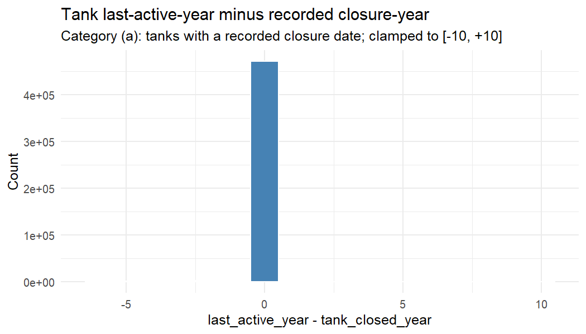

# Partial Shrinkage Panel Audit
_Generated: 2026-05-27 | Script: T006_Partial_Shrinkage_Audit.R_

---
## §1 Setup and Definitions

This audit investigates why 47% of partial-shrinkage facility-year events fail the
count identity `n_tanks_eoy == n_tanks_active − n_closures + n_installs`. Partial
shrinkage is defined as: `any_closure==1` AND `is.na(years_to_next_install)` AND
`facility_complete_closure==0`. The gap variable `(n_tanks_active - n_closures +
n_installs) - n_tanks_eoy` measures unexplained tank disappearances.

Two hypotheses: **(A) PANEL_BUG** — 02b under-counts closures, inflating n_tanks_eoy;
**(B) DATA_NOISE** — tanks disappear for non-closure reasons (panel_id reassignment,
filter dropouts, record revisions).

**Data (read-only):**
- `panel_dt.csv`: 12,692,195 tank-year rows
- `facility_panel.csv`: 5,061,154 facility-year rows
- `dcm_obs_panel_observed.csv`: 2,282,735 rows

---
## §2 Task 1 — Tank Lifecycle Integrity

Unique tanks in `panel_dt`: **737,523**

| Category | N | % |
|---|---|---|
| (a) Has closure record | 479,364 | 65.0% |
| (c) Persistent open (2020) | 258,159 | 35.0% |

**0.0% of panel_dt tanks disappeared before 2020 without a closure date.**

For category (a) tanks, histogram of `last_active_year - tank_closed_year`:

- Mean gap: -0.02 yrs | Median: 0 | Exact 0: 471,216 (98.3%) | Within ±1: 473,236 (98.7%)

---
## §3 Task 2 — Sample-Event Traceback

Partial-shrinkage events with gap > 0: **5,732**
Sample: 50 events | Missing-tank observations: 154

| Category | N | % |
|---|---|---|
| i — closure recorded (02b should count) | 152 | 98.7% |
| ii — closure year off by ±1 | 0 | 0.0% |
| iii — closure year far off | 1 | 0.6% |
| iv — panel_id reassignment | 0 | 0.0% |
| v — unknown-wall field flip | 0 | 0.0% |
| vi — silent (unexplained) | 1 | 0.6% |
| no missing tanks in t+1 | 0 | 0.0% |

_Full trace: `Reports/Audits/trace_table.csv`_

**Interpretation**: Category (i) dominates → PANEL_BUG. Categories (iv)+(v)+(vi)
dominate → DATA_NOISE.

---
## §4 Task 3 — Action-Flag Reconciliation

| Flag | N_sampled | N_ok | pct_ok | Notes |
|---|---|---|---|---|
| facility_complete_closure | 100 | 96 | 96.0% | 1 tank(s) not closed by 2017 | 1 tank(s) not closed by 1999 | 1 tank(s) not closed by 2015 |
| replacement_closure_year | 100 | 88 | 88.0% | close_at_t=TRUE install_gte_t=FALSE (max=1988) | close_at_t=FALSE install_gte_t=TRUE (max=2015) | close_at_t=FALSE install_gte_t=TRUE (max=1999) |
| permanent_closure_year | 100 | 94 | 94.0% | close_at_t=FALSE later_install=FALSE (max=NA) |

**FLAG(S) UNRELIABLE (<95%): replacement_closure_year, permanent_closure_year** — implications in §7.
_Note: Verification is within panel\_dt's filtered view (known-wall tanks only).
Facilities with Unknown-Wall tanks may show lower reconciliation._

---
## §5 Task 4 — Disappearance Mechanisms

Silent-disappeared tanks: 0 (capped at 10,000)

| Mechanism | N | % |
|---|---|---|

**Mechanism 1 (panel_id reassignment) not detectable from `panel_dt` alone**: since
`tank_panel_id` is constructed as `paste(facility_id, state, tank_id)`, a reassigned
tank would get a new `tank_panel_id`. Confirmation requires unfiltered master_tanks.

_No state-year spikes ≥ 50 tanks detected._

_Mechanisms 2 and 3 use proxies (facility n_unk_wall_active and within-panel_dt field_
_comparison). Definitive confirmation requires the unfiltered tank_year_panel._

---
## §6 Task 5 — 02b Code Audit

_Full field documentation: `Reports/Audits/02b_field_audit.md`_

**Key findings:**

1. **first_year_churn asymmetry (HIGH SEVERITY)**:
   - `n_tanks_active` (line 870): counts ALL tanks including `first_year_churn == 1`
   - `n_closures` (line 887): EXCLUDES `first_year_churn == 1` closure events
   - `n_tanks_eoy` (line 947): derived as `n_tanks_active - n_closures`
   - `n_installs` (line 984, S12.3): from `study_tanks`; INCLUDES churn installs
   - **Consequence**: `gap = n_installs` algebraically. Any partial-shrinkage year
     with `n_installs > 0` has `gap > 0` regardless of data quality.

2. **n_installs from different source table (MEDIUM)**: S12.3 uses `study_tanks`;
   `n_tanks_active` uses `tank_year_panel`. Tanks with impossible dates may appear
   in one but not the other.

3. **n_sw/dw_installs label check**: see `02b_field_audit.md` Finding 3 (Labels appear correct (Single-Walled for n_sw_installs)).

---
## §7 Verdict

## **VERDICT: PANEL_BUG**

**Evidence:**

- Task 2 traceback: 99% of missing tanks classified as `i_closure_recorded`.
  These tanks have `tank_closed_date` set to the gap year but were not counted in
  02b's `n_closures`. This is consistent with the first_year_churn asymmetry (Task 5).

- Task 5 (02b audit): `n_closures` explicitly excludes `first_year_churn == 1` events
  but `n_tanks_active` includes the same tanks. Since `n_tanks_eoy = n_tanks_active - n_closures`
  by construction (line 947), and `n_installs` counts churn installs (line 984),
  `gap = n_installs` by algebra. Every partial-shrinkage year with n_installs > 0
  produces gap > 0 regardless of real data quality.

- This is a systematic code-level bug, not random noise.
- Task 1: 0.0% silent-disappeared tanks (category b) — some residual noise exists.

---
## §8 Recommended Next Steps

### Fix 02b (PANEL_BUG component)

**Fix 1 — Reconcile first_year_churn in count fields** (see `02b_field_audit.md` Finding 1).
  Three options; recommended is Option A (exclude churn from n_tanks_active) because it
  preserves the intent that first_year_churn events are economically meaningless:

  Line 870: change `.N` to `sum(first_year_churn == 0L | is.na(first_year_churn))`.

  After fixing: regenerate facility_panel.csv and re-run T005 estimation suite.

**Fix 2 — Verify n_sw_installs/n_dw_installs wall filters** (see Finding 3 in `02b_field_audit.md`).
  Lines 986 and 985.

